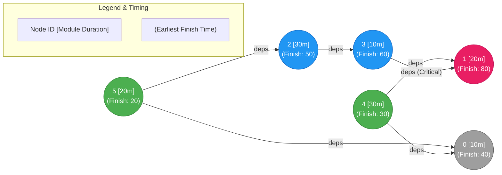
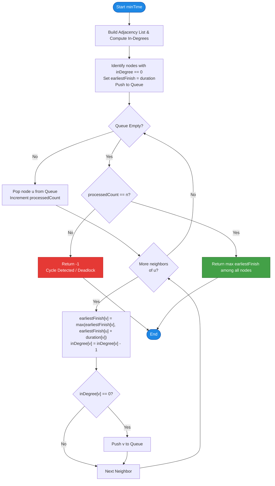

# GeeksforGeeks Problem of the Day: Minimum Time to Finish Project (Project Manager)

- **Problem Link:** [GeeksforGeeks - Project Manager](https://www.geeksforgeeks.org/problems/project-manager--141631/1)
- **Difficulty:** Medium
- **Topic Tags:** Graph, Topological Sort, Dynamic Programming, BFS / DFS, Directed Acyclic Graph (DAG)
- **Target Audience:** POTD Solvers, Computer Science Students, Technical Interview Candidates

---

## 1. Problem Statement

An IT company is planning a large software engineering project consisting of $n$ modules numbered from $0$ to $n - 1$.

You are provided with:
1. An array `duration[]` of size $n$, where `duration[i]` represents the duration (in months) required to complete the $i$-th module.
2. A 2D array `dependencies[][]`, where each entry `dependencies[i] = [u, v]` specifies that module $v$ can only start **after** module $u$ has been completely finished ($u \to v$).

Modules can be worked on **concurrently and in parallel**, provided all of their prerequisite modules have finished.

### Goal
Calculate the **minimum time required to complete the entire project**. If the project cannot be completed due to a cyclic dependency (deadlock), return `-1`.

---

## 2. Examples & Explanations

### Example 1
- **Input:**
  - `duration = [10, 20, 30, 10, 30, 20]` ($n = 6$)
  - `dependencies = [[5, 2], [5, 0], [4, 0], [4, 1], [2, 3], [3, 1]]`
- **Output:** `80`
- **Visual Path Breakdown:**
  - Independent root modules (in-degree = 0): Module $4$ (`duration = 30`) and Module $5$ (`duration = 20`).
  - Path 1: $5 \to 2 \to 3 \to 1 \implies 20 + 30 + 10 + 20 = 80$ months.
  - Path 2: $4 \to 1 \implies 30 + 20 = 50$ months.
  - Path 3: $4 \to 0 \implies 30 + 10 = 40$ months.
  - Path 4: $5 \to 0 \implies 20 + 10 = 30$ months.
  - Because Module $1$ requires **both** Module $4$ and Module $3$ to finish, it can only start after $\max(\text{finish}(4), \text{finish}(3)) = \max(30, 60) = 60$. Thus, Module $1$ finishes at $60 + 20 = 80$.
  - All modules finish in $\max(80, 50, 40, 30) = 80$ months.

### Example 2
- **Input:**
  - `duration = [5, 5, 5]` ($n = 3$)
  - `dependencies = [[0, 1], [1, 2], [2, 0]]`
- **Output:** `-1`
- **Explanation:**
  - There is a directed dependency cycle: $0 \to 1 \to 2 \to 0$.
  - None of the modules can ever start because each waits indefinitely on another. Hence, project completion is impossible $\implies -1$.

---

## 3. Constraints

- $1 \le n \le 10^5$ (where $n = \text{duration.length}$)
- $0 \le \text{duration}[i] \le 10^5$
- $0 \le m \le 2 \times 10^5$ (where $m = \text{dependencies.length}$)
- $0 \le u, v < n$
- A module never depends directly on itself ($u \neq v$).

---

## 4. Graph & Critical Path Architecture

This problem is a classic application of the **Critical Path Method (CPM)** in project management and operations research. The minimum time needed to finish all tasks when executed with maximum parallelism equals the **longest path (critical path)** in the Directed Acyclic Graph (DAG).



> **Critical Path (Red Node):** $5 \to 2 \to 3 \to 1$ takes $20 + 30 + 10 + 20 = 80$ months, dominating all other concurrent paths.

---

## 5. Step-by-Step Simulation & Dry Run

Let us trace **Example 1** using Kahn's BFS Algorithm combined with Dynamic Programming:
- Modules: $0, 1, 2, 3, 4, 5$
- `duration = [10, 20, 30, 10, 30, 20]`
- Directed edges: $(5 \to 2), (5 \to 0), (4 \to 0), (4 \to 1), (2 \to 3), (3 \to 1)$

### Step 0: In-Degrees & Initial Earliest Finish
| Module $i$ | Duration | In-Degree | Initial `earliestFinish[i]` |
| :---: | :---: | :---: | :---: |
| **0** | 10 | 2 (from 5, 4) | 0 |
| **1** | 20 | 2 (from 4, 3) | 0 |
| **2** | 30 | 1 (from 5) | 0 |
| **3** | 10 | 1 (from 2) | 0 |
| **4** | 30 | 0 | **30** (Enters Queue) |
| **5** | 20 | 0 | **20** (Enters Queue) |

- **Queue at start:** `[4, 5]`
- `processed_count = 0`

---

### Step 1: Dequeue Module 4
- `u = 4`, `earliestFinish[4] = 30`, `processed_count = 1`.
- For neighbor $0$:
  - `earliestFinish[0] = max(0, 30 + 10) = 40`
  - `inDegree[0]` becomes $2 - 1 = 1$.
- For neighbor $1$:
  - `earliestFinish[1] = max(0, 30 + 20) = 50`
  - `inDegree[1]` becomes $2 - 1 = 1$.
- **Queue:** `[5]`

---

### Step 2: Dequeue Module 5
- `u = 5`, `earliestFinish[5] = 20`, `processed_count = 2`.
- For neighbor $2$:
  - `earliestFinish[2] = max(0, 20 + 30) = 50`
  - `inDegree[2]` becomes $1 - 1 = 0 \implies$ **Enqueue 2**.
- For neighbor $0$:
  - `earliestFinish[0] = max(40, 20 + 10) = 40`
  - `inDegree[0]` becomes $1 - 1 = 0 \implies$ **Enqueue 0**.
- **Queue:** `[2, 0]`

---

### Step 3: Dequeue Module 2
- `u = 2`, `earliestFinish[2] = 50`, `processed_count = 3`.
- For neighbor $3$:
  - `earliestFinish[3] = max(0, 50 + 10) = 60`
  - `inDegree[3]` becomes $1 - 1 = 0 \implies$ **Enqueue 3**.
- **Queue:** `[0, 3]`

---

### Step 4: Dequeue Module 0
- `u = 0`, `earliestFinish[0] = 40`, `processed_count = 4`.
- Node $0$ has no outgoing edges.
- **Queue:** `[3]`

---

### Step 5: Dequeue Module 3
- `u = 3`, `earliestFinish[3] = 60`, `processed_count = 5`.
- For neighbor $1$:
  - `earliestFinish[1] = max(50, 60 + 20) = 80`
  - `inDegree[1]` becomes $1 - 1 = 0 \implies$ **Enqueue 1**.
- **Queue:** `[1]`

---

### Step 6: Dequeue Module 1
- `u = 1`, `earliestFinish[1] = 80`, `processed_count = 6`.
- Node $1$ has no outgoing edges.
- **Queue:** `[]` (Empty)

---

### Final Check:
- `processed_count = 6 == n` $\implies$ **No cycle detected!**
- Project minimum duration: $\max_{0 \le i < 6} \text{earliestFinish}[i] = \max(40, 80, 50, 60, 30, 20) = \mathbf{80}$.

---

## 6. Algorithm Flowchart



---

## 7. From Naive to Pro: Algorithmic Progression

### Method 1: Naive DFS (Brute Force All-Paths)
- **Concept:** For every sink node (module with no outgoing dependencies), search all possible backward dependency paths recursively to find the longest path.
- **Why it fails:**
  1. Exponential overlapping subproblems without caching: $\mathcal{O}(2^n)$ or $\mathcal{O}(n!)$.
  2. If the graph contains a cycle, naive DFS enters infinite recursion leading to a stack overflow error unless cycle tracking is explicitly managed.
- **Pseudocode:**
```text
function findMaxPath(node, visitedSet):
    if node is in visitedSet:
        return CYCLE_DETECTED
    visitedSet.add(node)
    
    maxPrereqTime = 0
    for each prerequisite p of node:
        time = findMaxPath(p, visitedSet)
        if time == CYCLE_DETECTED:
            return CYCLE_DETECTED
        maxPrereqTime = max(maxPrereqTime, time)
        
    visitedSet.remove(node)
    return duration[node] + maxPrereqTime
```

---

### Method 2: DFS with Memoization & 3-Color Cycle Detection
- **Concept:** Use three states for each node:
  - `0 (WHITE / UNVISITED)`: Not yet explored.
  - `1 (GRAY / VISITING)`: Currently in the recursion stack (if seen again, a cycle exists).
  - `2 (BLACK / VISITED)`: Fully explored and memoized in `memo[u]`.
- **Complexity:** $\mathcal{O}(n + m)$ time, $\mathcal{O}(n)$ auxiliary recursion stack.
- **Drawback:** In languages like Python, C++, or Java, an input with $n = 10^5$ can cause a Call Stack Overflow if the DAG is shaped like a long linear chain ($0 \to 1 \to 2 \to \dots \to 100000$).
- **Pseudocode:**
```text
function dfs(u, state, memo, adjRev, duration):
    if state[u] == 1:
        return -1 // Cycle detected
    if state[u] == 2:
        return memo[u] // Already computed
        
    state[u] = 1 // Mark as VISITING
    maxPrereq = 0
    for each prerequisite p in adjRev[u]:
        res = dfs(p, state, memo, adjRev, duration)
        if res == -1:
            return -1
        maxPrereq = max(maxPrereq, res)
        
    state[u] = 2 // Mark as VISITED
    memo[u] = duration[u] + maxPrereq
    return memo[u]
```

---

### Method 3: Pro Approach — Kahn's Algorithm (BFS Topological Sort) + DP
- **Why it is optimal:**
  1. **Iterative & Safe:** Completely avoids recursion stack overflow issues on deep graphs ($n \le 10^5$).
  2. **Automatic Cycle Detection:** In a DAG, all $n$ vertices are processed. If any directed cycle exists, vertices in that cycle will never have their in-degree hit $0$, causing `processedCount < n`.
  3. **Natural DP Relaxation:** When a node $v$ is enqueued, all of its predecessor tasks have already finished, so its earliest start time $\max_{u \to v}(\text{earliestFinish}[u])$ is completely finalized!
- **Dynamic Programming Recurrence:**
  $$\text{earliestFinish}[v] = \max(\text{earliestFinish}[v], \text{earliestFinish}[u] + \text{duration}[v])$$
  $$\text{Result} = \max_{0 \le i < n} \text{earliestFinish}[i]$$
- **Optimized Pseudocode:**
```text
function minTime(duration, dependencies):
    n = length of duration
    adj = array of size n, each an empty list
    inDegree = array of size n initialized to 0
    
    for each [u, v] in dependencies:
        adj[u].append(v)
        inDegree[v] = inDegree[v] + 1
        
    earliestFinish = array of size n initialized to 0
    queue = FIFO queue
    
    for i from 0 to n - 1:
        if inDegree[i] == 0:
            queue.push(i)
            earliestFinish[i] = duration[i]
            
    processedCount = 0
    while queue is not empty:
        u = queue.pop()
        processedCount = processedCount + 1
        
        for each v in adj[u]:
            if earliestFinish[u] + duration[v] > earliestFinish[v]:
                earliestFinish[v] = earliestFinish[u] + duration[v]
                
            inDegree[v] = inDegree[v] - 1
            if inDegree[v] == 0:
                queue.push(v)
                
    if processedCount != n:
        return -1
        
    return max(earliestFinish)
```

---

## 8. Complexity Comparison Table

| Metric | Method 1: Naive DFS | Method 2: Memoized 3-Color DFS | Method 3: Kahn's BFS + DP (Pro) |
| :--- | :--- | :--- | :--- |
| **Time Complexity** | $\mathcal{O}(2^n)$ or $\mathcal{O}(n!)$ | $\mathcal{O}(n + m)$ | $\mathbf{\mathcal{O}(n + m)}$ |
| **Auxiliary Space** | $\mathcal{O}(n)$ | $\mathcal{O}(n + m)$ | $\mathbf{\mathcal{O}(n + m)}$ |
| **Call Stack Depth** | $\mathcal{O}(n)$ (Risk of Stack Overflow) | $\mathcal{O}(n)$ (Risk of Stack Overflow) | $\mathbf{\mathcal{O}(1)}$ (Iterative, Safe) |
| **Cycle Detection** | Complex backtracking | Handled via Gray State | **Automatic (`processed != n`)** |
| **Interview Verdict** | TLE on non-trivial graphs | Acceptable with depth tuning | **Industry Standard & Optimal** |

---

## 9. Comprehensive Corner Cases Handled

1. **Cycle in Component:** A cycle anywhere in the dependency graph blocks progress $\implies$ caught automatically when `processedCount < n`.
2. **Disconnected Components:** Multiple disjoint project workflows can run simultaneously $\implies$ handled correctly because all initial roots are seeded into the queue and the answer takes the global maximum.
3. **Single Module ($n = 1$):** With no dependencies, the queue processes module $0$, and returns `duration[0]`.
4. **Zero Duration Modules:** Modules taking $0$ months update their neighbors without inflating completion time.
5. **Diamond Dependencies:** When paths split and rejoin ($A \to B \to D$ and $A \to C \to D$), $D$ waits for the slower branch via $\max$.

---

## 10. Complete Optimized Multi-Language Implementations

### Java (21)

```java
import java.util.ArrayList;
import java.util.List;

class Solution {
    public int minTime(int[] duration, int[][] dependencies) {
        int n = duration.length;

        // Step 1: Build adjacency list and compute in-degrees
        @SuppressWarnings("unchecked")
        List<Integer>[] adj = new ArrayList[n];
        for (int i = 0; i < n; i++) {
            adj[i] = new ArrayList<>();
        }

        int[] inDegree = new int[n];
        for (int[] edge : dependencies) {
            int u = edge[0];
            int v = edge[1];
            adj[u].add(v);
            inDegree[v]++;
        }

        // Step 2: Initialize earliest finish times and array-based queue
        int[] earliestFinish = new int[n];
        int[] queue = new int[n];
        int head = 0;
        int tail = 0;

        for (int i = 0; i < n; i++) {
            if (inDegree[i] == 0) {
                queue[tail++] = i;
                earliestFinish[i] = duration[i];
            }
        }

        // Step 3: Kahn's Algorithm BFS + Dynamic Programming
        int processedCount = 0;
        while (head < tail) {
            int u = queue[head++];
            processedCount++;

            int uFinish = earliestFinish[u];
            for (int v : adj[u]) {
                int candidate = uFinish + duration[v];
                if (candidate > earliestFinish[v]) {
                    earliestFinish[v] = candidate;
                }

                inDegree[v]--;
                if (inDegree[v] == 0) {
                    queue[tail++] = v;
                }
            }
        }

        // Step 4: Cycle detection
        if (processedCount != n) {
            return -1;
        }

        // Step 5: The total minimum time is the maximum of all finish times
        int maxTime = 0;
        for (int t : earliestFinish) {
            if (t > maxTime) {
                maxTime = t;
            }
        }

        return maxTime;
    }
}
```

---

### C++ (17)

```cpp
#include <vector>
#include <algorithm>

using namespace std;

class Solution {
  public:
    int minTime(vector<int> &duration, vector<vector<int>> &dependencies) {
        int n = duration.size();

        // Step 1: Construct graph adjacency list and in-degrees
        vector<vector<int>> adj(n);
        vector<int> inDegree(n, 0);

        for (const auto &edge : dependencies) {
            int u = edge[0];
            int v = edge[1];
            adj[u].push_back(v);
            inDegree[v]++;
        }

        // Step 2: Initialize DP array and fast queue using vector
        vector<int> earliestFinish(n, 0);
        vector<int> q;
        q.reserve(n);

        for (int i = 0; i < n; ++i) {
            if (inDegree[i] == 0) {
                q.push_back(i);
                earliestFinish[i] = duration[i];
            }
        }

        // Step 3: Topological sorting and DP edge relaxation
        int head = 0;
        while (head < static_cast<int>(q.size())) {
            int u = q[head++];
            int uFinish = earliestFinish[u];

            for (int v : adj[u]) {
                int candidate = uFinish + duration[v];
                if (candidate > earliestFinish[v]) {
                    earliestFinish[v] = candidate;
                }

                if (--inDegree[v] == 0) {
                    q.push_back(v);
                }
            }
        }

        // Step 4: Cycle detection
        if (static_cast<int>(q.size()) != n) {
            return -1;
        }

        // Step 5: Maximum completion time across all modules
        int maxTime = 0;
        for (int t : earliestFinish) {
            maxTime = max(maxTime, t);
        }

        return maxTime;
    }
};
```

---

### Python3

```python
from collections import deque

class Solution:
    def minTime(self, duration: list[int], dependencies: list[list[int]]) -> int:
        n = len(duration)

        # Step 1: Construct adjacency list and in-degrees
        adj = [[] for _ in range(n)]
        in_degree = [0] * n

        for u, v in dependencies:
            adj[u].append(v)
            in_degree[v] += 1

        # Step 2: Initialize queue and earliest finish tracking
        earliest_finish = [0] * n
        queue = deque()

        for i in range(n):
            if in_degree[i] == 0:
                queue.append(i)
                earliest_finish[i] = duration[i]

        # Step 3: BFS level-by-level relaxation (Kahn's Algorithm)
        processed_count = 0
        while queue:
            u = queue.popleft()
            processed_count += 1
            u_finish = earliest_finish[u]

            for v in adj[u]:
                candidate = u_finish + duration[v]
                if candidate > earliest_finish[v]:
                    earliest_finish[v] = candidate

                in_degree[v] -= 1
                if in_degree[v] == 0:
                    queue.append(v)

        # Step 4: Cycle check (deadlock detection)
        if processed_count != n:
            return -1

        # Step 5: Minimum project completion time
        return max(earliest_finish) if earliest_finish else 0
```

---

### C#

```csharp
using System;
using System.Collections.Generic;

public class Solution {
    public int minTime(int[] duration, int[][] dependencies) {
        int n = duration.Length;

        // Step 1: Build adjacency list and compute in-degrees
        List<int>[] adj = new List<int>[n];
        for (int i = 0; i < n; i++) {
            adj[i] = new List<int>();
        }

        int[] inDegree = new int[n];
        foreach (var edge in dependencies) {
            int u = edge[0];
            int v = edge[1];
            adj[u].Add(v);
            inDegree[v]++;
        }

        // Step 2: Initialize queue and completion tracking
        int[] earliestFinish = new int[n];
        int[] queue = new int[n];
        int head = 0;
        int tail = 0;

        for (int i = 0; i < n; i++) {
            if (inDegree[i] == 0) {
                queue[tail++] = i;
                earliestFinish[i] = duration[i];
            }
        }

        // Step 3: Kahn's Algorithm + DP
        int processedCount = 0;
        while (head < tail) {
            int u = queue[head++];
            processedCount++;

            int uFinish = earliestFinish[u];
            foreach (int v in adj[u]) {
                int candidate = uFinish + duration[v];
                if (candidate > earliestFinish[v]) {
                    earliestFinish[v] = candidate;
                }

                inDegree[v]--;
                if (inDegree[v] == 0) {
                    queue[tail++] = v;
                }
            }
        }

        // Step 4: Cycle check
        if (processedCount != n) {
            return -1;
        }

        // Step 5: Find overall maximum finish time
        int maxTime = 0;
        for (int i = 0; i < n; i++) {
            if (earliestFinish[i] > maxTime) {
                maxTime = earliestFinish[i];
            }
        }

        return maxTime;
    }
}
```

---

### Javascript (Node v22)

```javascript
/**
 * @param {number[]} duration
 * @param {number[][]} dependencies
 * @returns {number}
 */
class Solution {
    minTime(duration, dependencies) {
        const n = duration.length;

        // Step 1: Build adjacency list and in-degree array
        const adj = Array.from({ length: n }, () => []);
        const inDegree = new Int32Array(n);

        for (let i = 0; i < dependencies.length; i++) {
            const [u, v] = dependencies[i];
            adj[u].push(v);
            inDegree[v]++;
        }

        // Step 2: Initialize earliest finish array and zero-allocation queue
        const earliestFinish = new Int32Array(n);
        const queue = new Int32Array(n);
        let head = 0;
        let tail = 0;

        for (let i = 0; i < n; i++) {
            if (inDegree[i] === 0) {
                queue[tail++] = i;
                earliestFinish[i] = duration[i];
            }
        }

        // Step 3: Process nodes via Kahn's Topological Sort with DP
        let processedCount = 0;
        while (head < tail) {
            const u = queue[head++];
            processedCount++;

            const neighbors = adj[u];
            const uFinish = earliestFinish[u];

            for (let i = 0; i < neighbors.length; i++) {
                const v = neighbors[i];
                const candidate = uFinish + duration[v];
                if (candidate > earliestFinish[v]) {
                    earliestFinish[v] = candidate;
                }

                inDegree[v]--;
                if (inDegree[v] === 0) {
                    queue[tail++] = v;
                }
            }
        }

        // Step 4: Cycle detection check
        if (processedCount !== n) {
            return -1;
        }

        // Step 5: Compute maximum project finish time
        let maxTime = 0;
        for (let i = 0; i < n; i++) {
            if (earliestFinish[i] > maxTime) {
                maxTime = earliestFinish[i];
            }
        }

        return maxTime;
    }
}
```