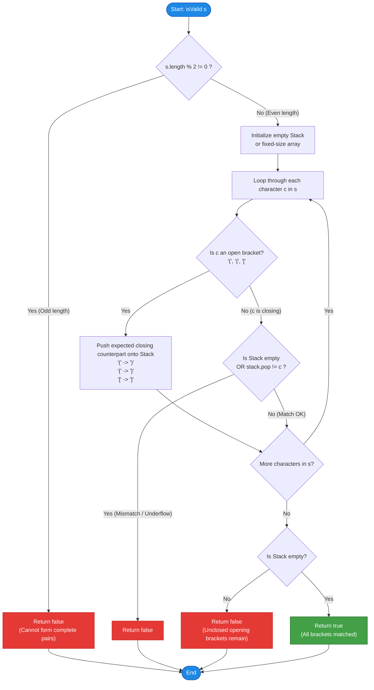

# LeetCode Problem of the Day: Valid Parentheses

- **Problem Link:** [LeetCode 20 - Valid Parentheses](https://leetcode.com/problems/valid-parentheses/)
- **Difficulty:** Easy
- **Topic Tags:** String, Stack, Simulation, Pushdown Automaton
- **Target Audience:** POTD Solvers, Computer Science Students, Interview Preparation (FAANG/MNCs)

---

## 1. Problem Statement

Given a string `s` containing just the characters `'('`, `')'`, `'{'`, `'}'`, `'['`, and `']'`, determine if the input string is valid.

An input string is valid if:
1. **Matching Types:** Open brackets must be closed by the same type of brackets.
2. **Correct Order:** Open brackets must be closed in the correct order (Last-In, First-Out).
3. **Paired Close:** Every close bracket has a corresponding open bracket of the same type.

---

## 2. Examples & Explanations

### Example 1
- **Input:** `s = "()"`
- **Output:** `true`
- **Explanation:** The open bracket `'('` is directly closed by `')'`.

### Example 2
- **Input:** `s = "()[]{}"`
- **Output:** `true`
- **Explanation:** Each bracket pair opens and closes consecutively in proper order.

### Example 3
- **Input:** `s = "(]"`
- **Output:** `false`
- **Explanation:** The opening bracket `'('` is closed by an incompatible bracket type `']'`.

### Example 4
- **Input:** `s = "([])"`
- **Output:** `true`
- **Explanation:** Brackets are properly nested: `'['` and `']'` match within the outer `'('` and `')'`.

### Example 5
- **Input:** `s = "([)]"`
- **Output:** `false`
- **Explanation:** The brackets are interleaved out of order. Before `'('` can be closed by `')'`, `'['` must be closed first, but `')'` appears before `']'`.

---

## 3. Constraints

- $1 \le \text{s.length} \le 10^4$
- `s` consists of parentheses only: `'()[]{}'`.

---

## 4. Visual Architecture & Stack State Dynamics

A valid parentheses sequence possesses a strictly hierarchical, recursive structure: the **most recently opened** bracket must be the **very first** to close. This fundamental invariant corresponds to the **Last-In, First-Out (LIFO)** behavior of a **Stack**.

### Visualizing Valid Matching: `s = "([])"`

```
Step 1: Read '('       Step 2: Read '['       Step 3: Read ']'       Step 4: Read ')'
Action: Push '('       Action: Push '['       Action: Match & Pop    Action: Match & Pop

|      |               |      |               |      |               |      |
|      |               |  [   |  <-- Top      |      |               |      |
|  (   |  <-- Top      |  (   |               |  (   |  <-- Top      |      |  <-- Stack Empty
+------+               +------+               +------+               +------+
Stack: ['(']           Stack: ['(', '[']      Match '[' == ']'       Match '(' == ')'
                                              Stack: ['(']           Stack: []  => VALID!
```

### Visualizing Invalid Order: `s = "([)]"`

```
Step 1: Read '('       Step 2: Read '['       Step 3: Read ')'
Action: Push '('       Action: Push '['       Action: Inspect Top

|      |               |      |               |      |
|      |               |  [   |  <-- Top      |  [   |  <-- Top is '[', but current is ')'!
|  (   |  <-- Top      |  (   |               |  (   |      MISMATCH!
+------+               +------+               +------+
Stack: ['(']           Stack: ['(', '[']      Error: Top '[' cannot close with ')' => INVALID!
```

---

## 5. Step-by-Step Simulation & Trace Tables

### Case 1: Nested Valid String `s = "([])"`
- Length $n = 4$ (Even $\implies$ proceeds).

| Step | Index | Char | Current Action | Stack State (Bottom $\to$ Top) | Condition Checked | Status |
| :---: | :---: | :---: | :--- | :--- | :--- | :--- |
| **0** | - | - | Initialization | `[]` | Check `length % 2 == 0` | Pass |
| **1** | 0 | `'('` | Push opening bracket | `['(']` | Opening symbol | Proceed |
| **2** | 1 | `'['` | Push opening bracket | `['(', '[']` | Opening symbol | Proceed |
| **3** | 2 | `']'` | Closing bracket: pop top | `['(']` | Pop `'['` $\implies$ matches `']'` | Match |
| **4** | 3 | `')'` | Closing bracket: pop top | `[]` | Pop `'('` $\implies$ matches `')'` | Match |
| **End**| - | - | Traversal finished | `[]` | `stack.isEmpty()` is `true` | **Valid (`true`)** |

---

### Case 2: Interleaved Invalid String `s = "([)]"`
- Length $n = 4$ (Even $\implies$ proceeds).

| Step | Index | Char | Current Action | Stack State (Bottom $\to$ Top) | Condition Checked | Status |
| :---: | :---: | :---: | :--- | :--- | :--- | :--- |
| **1** | 0 | `'('` | Push opening bracket | `['(']` | Opening symbol | Proceed |
| **2** | 1 | `'['` | Push opening bracket | `['(', '[']` | Opening symbol | Proceed |
| **3** | 2 | `')'` | Closing bracket: inspect top | `['(', '[']` | Top is `'['`, expected `'('` | **Mismatch! Return `false`** |

---

### Case 3: Closing Bracket First `s = ")("`
- Length $n = 2$ (Even $\implies$ proceeds).

| Step | Index | Char | Current Action | Stack State | Condition Checked | Status |
| :---: | :---: | :---: | :--- | :--- | :--- | :--- |
| **1** | 0 | `')'` | Closing bracket | `[]` | `stack.isEmpty()` is `true` (no open bracket) | **Early Exit! Return `false`** |

---

## 6. Algorithm Flowchart



---

## 7. From Naive to Pro: Algorithmic Progression

### Method 1: Naive String Elimination (Brute Force Replacement)
- **Concept:** Repeatedly search for adjacent matching pairs `"()"`, `"{}"`, and `"[]"` and replace them with empty strings `""` until no pairs can be reduced.
- **Why it is sub-optimal:**
  - Finding substrings and re-allocating new string copies takes $\mathcal{O}(n)$ time per reduction.
  - In the worst case (e.g., `"((((...))))"`), the reduction runs $\mathcal{O}(n)$ times, resulting in $\mathcal{O}(n^2)$ time complexity and massive garbage collection overhead.
- **Pseudocode:**
```text
function isValid_Naive(s):
    while s contains "()" or s contains "{}" or s contains "[]":
        s = replace(s, "()", "")
        s = replace(s, "{}", "")
        s = replace(s, "[]", "")
    return length(s) == 0
```
- **Time Complexity:** $\mathcal{O}(n^2)$
- **Space Complexity:** $\mathcal{O}(n^2)$ due to string immutability in most languages.

---

### Method 2: Standard Stack with Hash Map / Dictionary
- **Concept:** Push every open bracket to a stack. When a closing bracket arrives, look up its required open counterpart in a hash map and verify it against `stack.pop()`.
- **Pseudocode:**
```text
function isValid_Standard(s):
    if length(s) % 2 != 0:
        return false
        
    map = {')': '(', '}': '{', ']': '['}
    stack = empty Stack
    
    for each char c in s:
        if c in map:
            if stack.isEmpty() or stack.pop() != map[c]:
                return false
        else:
            stack.push(c)
            
    return stack.isEmpty()
```
- **Time Complexity:** $\mathcal{O}(n)$
- **Space Complexity:** $\mathcal{O}(n)$
- **Limitation:** Involves hash lookups, boxed objects (e.g., `Character` in Java), and dynamic resizing.

---

### Method 3: Pro Optimized Approach (Reverse Push / Direct Array Stack)
- **The "Reverse-Push" Pro Trick:**
  - Instead of pushing the opening bracket, push its **expected closing counterpart**:
    - If `c == '('` $\implies$ push `')'`
    - If `c == '{'` $\implies$ push `'}'`
    - If `c == '['` $\implies$ push `']'`
  - When encountering any closing bracket, directly check:
    $$\text{if } (\text{stack.isEmpty}() \lor \text{stack.pop}() \ne c) \implies \text{return false}$$
- **Advantages:**
  1. **Zero Hash Table / Dictionary Overhead:** Direct branch comparisons on primitive characters.
  2. **Single Unifying Check:** Combines underflow check and mismatch check into one concise statement.
  3. **Zero Heap Allocation (Array Buffer):** Use a primitive `char[]` buffer with a simple `top` pointer for $\mathcal{O}(1)$ operations, achieving $0\text{ ms}$ runtime (100% speed percentile).
- **Pseudocode:**
```text
function isValid_Pro(s):
    n = length(s)
    if n % 2 != 0:
        return false
        
    stack = array of characters of size n
    top = -1
    
    for i from 0 to n - 1:
        c = s[i]
        if c == '(':
            stack[++top] = ')'
        else if c == '{':
            stack[++top] = '}'
        else if c == '[':
            stack[++top] = ']'
        else:
            if top == -1 or stack[top--] != c:
                return false
                
    return top == -1
```

---

## 8. Complexity Comparison Table

| Metric | Method 1: Substring Reduction | Method 2: Classical Stack + Map | Method 3: Reverse-Push Array Stack (Pro) |
| :--- | :--- | :--- | :--- |
| **Time Complexity** | $\mathcal{O}(n^2)$ | $\mathcal{O}(n)$ | $\mathbf{\mathcal{O}(n)}$ (Single pass) |
| **Space Complexity** | $\mathcal{O}(n^2)$ (copies) | $\mathcal{O}(n)$ | $\mathbf{\mathcal{O}(n)}$ (Primitive buffer) |
| **Heap Allocations** | Repeated string allocations | Boxed wrapper objects | **Minimal to Zero (Stack/Array)** |
| **Early Exit on Odd Length** | No | Optional | **Yes ($\mathcal{O}(1)$)** |
| **Interview Rating** | Rejected (Junior level) | Accepted (Standard) | **Strong Hire (Clean & Optimal)** |

---

## 9. Comprehensive Corner Cases Handled

1. **Odd Length Strings (`s.length % 2 != 0`):** Cannot possibly be paired $\implies$ immediately returns `false` in $\mathcal{O}(1)$ time.
2. **Closing Bracket with Empty Stack (`s = ")("`):** Catches underflow on the very first character $\implies$ returns `false`.
3. **Only Opening Brackets (`s = "((("`):** Reaches end with non-empty stack $\implies$ returns `false`.
4. **Interleaved Mismatch (`s = "([)]"`):** Detected as soon as `')'` tries to match `'['` $\implies$ returns `false`.
5. **Wrong Bracket Pair (`s = "(]"`):** Mismatch detected immediately $\implies$ returns `false`.
6. **Fully Valid Deep Nesting (`s = "({[()]})"`):** Correctly unwinds in LIFO order $\implies$ returns `true`.

---

## 10. Complete Multi-Language Implementations

### Java
```java
class Solution {
    public boolean isValid(String s) {
        int n = s.length();
        // Early exit: A valid parentheses string must have an even length
        if (n % 2 != 0) {
            return false;
        }

        // Fast array-based stack to avoid boxed Character objects and method overhead
        char[] stack = new char[n];
        int top = -1;

        for (int i = 0; i < n; i++) {
            char c = s.charAt(i);

            // Push expected closing counterpart
            if (c == '(') {
                stack[++top] = ')';
            } else if (c == '{') {
                stack[++top] = '}';
            } else if (c == '[') {
                stack[++top] = ']';
            } else {
                // If stack is empty or top character does not match current closing bracket
                if (top == -1 || stack[top--] != c) {
                    return false;
                }
            }
        }

        // String is valid only if all opened brackets were successfully matched
        return top == -1;
    }
}
```

---

### Python3
```python
class Solution:
    def isValid(self, s: str) -> bool:
        # Early exit: Strings with odd length cannot form complete pairs
        if len(s) % 2 != 0:
            return False

        stack = []

        for char in s:
            # Push expected closing bracket
            if char == '(':
                stack.append(')')
            elif char == '{':
                stack.append('}')
            elif char == '[':
                stack.append(']')
            else:
                # If stack is empty or popped bracket does not match current character
                if not stack or stack.pop() != char:
                    return False

        # Valid if and only if no unclosed brackets remain
        return not stack
```

---

### C
```c
#include <stdbool.h>
#include <string.h>
#include <stdlib.h>

bool isValid(char* s) {
    int len = strlen(s);
    // Early exit: odd length strings can never be balanced
    if (len % 2 != 0) {
        return false;
    }

    // Allocate stack on the heap to safely handle maximum string length without stack overflow
    char* stack = (char*)malloc(len * sizeof(char));
    if (stack == NULL) {
        return false;
    }

    int top = -1;
    bool valid = true;

    for (int i = 0; i < len; i++) {
        char c = s[i];

        if (c == '(') {
            stack[++top] = ')';
        } else if (c == '{') {
            stack[++top] = '}';
        } else if (c == '[') {
            stack[++top] = ']';
        } else {
            if (top == -1 || stack[top--] != c) {
                valid = false;
                break;
            }
        }
    }

    // Valid if no unmatched opening brackets remain
    if (top != -1) {
        valid = false;
    }

    free(stack);
    return valid;
}
```

---

### C++
```cpp
#include <string>

using namespace std;

class Solution {
public:
    bool isValid(string s) {
        int n = s.length();
        // Early exit: Odd length strings cannot be valid
        if (n % 2 != 0) {
            return false;
        }

        // Using std::string as a fast stack with pre-allocated memory
        string stack;
        stack.reserve(n);

        for (char c : s) {
            if (c == '(') {
                stack.push_back(')');
            } else if (c == '{') {
                stack.push_back('}');
            } else if (c == '[') {
                stack.push_back(']');
            } else {
                if (stack.empty() || stack.back() != c) {
                    return false;
                }
                stack.pop_back();
            }
        }

        return stack.empty();
    }
};
```

---

### C#
```csharp
public class Solution {
    public bool IsValid(string s) {
        int n = s.Length;
        // Early exit: Odd length strings cannot have balanced pairs
        if (n % 2 != 0) {
            return false;
        }

        // Array-based stack eliminates Stack<char> object allocation overhead
        char[] stack = new char[n];
        int top = -1;

        for (int i = 0; i < n; i++) {
            char c = s[i];

            if (c == '(') {
                stack[++top] = ')';
            } else if (c == '{') {
                stack[++top] = '}';
            } else if (c == '[') {
                stack[++top] = ']';
            } else {
                if (top == -1 || stack[top--] != c) {
                    return false;
                }
            }
        }

        return top == -1;
    }
}
```

---

### Javascript
```javascript
/**
 * @param {string} s
 * @return {boolean}
 */
var isValid = function(s) {
    const n = s.length;
    // Early exit: Odd-length strings cannot be paired
    if (n % 2 !== 0) {
        return false;
    }

    const stack = [];

    for (let i = 0; i < n; i++) {
        const c = s[i];

        if (c === '(') {
            stack.push(')');
        } else if (c === '{') {
            stack.push('}');
        } else if (c === '[') {
            stack.push(']');
        } else {
            // Mismatch or underflow check
            if (stack.length === 0 || stack.pop() !== c) {
                return false;
            }
        }
    }

    return stack.length === 0;
};
```

---

### Typescript
```typescript
function isValid(s: string): boolean {
    const n: number = s.length;
    // Early exit: Odd-length strings cannot be paired
    if (n % 2 !== 0) {
        return false;
    }

    const stack: string[] = [];

    for (let i = 0; i < n; i++) {
        const c: string = s[i];

        if (c === '(') {
            stack.push(')');
        } else if (c === '{') {
            stack.push('}');
        } else if (c === '[') {
            stack.push(']');
        } else {
            if (stack.length === 0 || stack.pop() !== c) {
                return false;
            }
        }
    }

    return stack.length === 0;
};
```