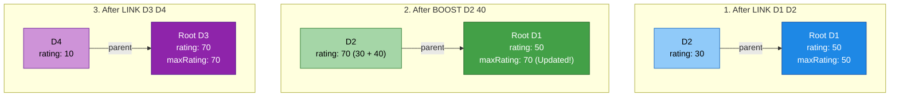
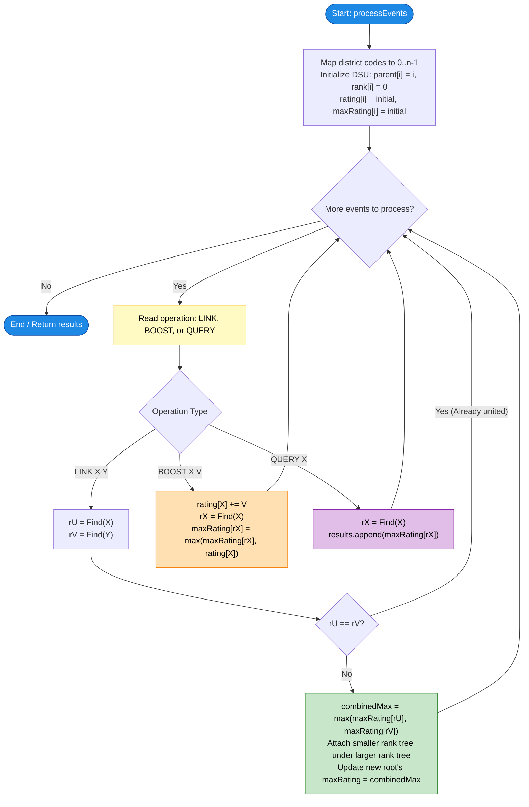

# Unstop Problem of the Day: Meridian City Zone Planning

- **Problem Link:** [Unstop - Meridian City Zone Planning](https://unstop.com/)
- **Difficulty:** Medium-Hard
- **Topic Tags:** Disjoint Set Union (DSU / Union-Find), Graph, Hash Table, Dynamic Connectivity, Online Algorithms
- **Target Audience:** POTD Solvers, Computer Science Students, Competitive Programmers, Interview Candidates (FAANG/MNCs)

---

## 1. Problem Description

Meera works in the planning office of **Meridian**, a rapidly expanding smart city where every district is identified by an alphanumeric code such as `D1` or `GH7`. 

Each district begins with its own **energy efficiency rating**, a metric measuring its infrastructure performance. As the city develops, engineering teams gradually install high-speed fiber links between pairs of districts:
- Once two districts are linked directly or indirectly through a chain of links, they belong to the **same operating zone**, sharing resources and monitoring systems.
- Throughout the season, Meera's office processes three distinct types of events:
  1. `LINK X Y`: A new fiber link connects district $X$ and district $Y$, merging their zones if they were not already unified.
  2. `BOOST X V`: District $X$ receives an infrastructure investment that increases its individual rating by $V$.
  3. `QUERY X`: A city council official queries the **highest efficiency rating** currently found anywhere within district $X$'s operating zone.

### Key Problem Invariants
- **Monotonic Merges Only:** Zones only ever merge together; they never partition or disconnect.
- **Monotonic Increases Only:** Ratings only increase ($V > 0$); they never decrease.
- **Crucial Consequence:** Because ratings never decrease and components never split, we never need to recalculate a component's maximum from scratch! The component maximum can be maintained dynamically at the representative root of each component in $\mathcal{O}(1)$ time.

---

## 2. Specifications & Constraints

### Input Format
- The first line contains an integer $n$, the number of districts.
- Each of the next $n$ lines contains a district code (string) and its initial rating (integer).
- The next line contains an integer $q$, the number of events.
- Each of the next $q$ lines contains one of three operations:
  - `LINK X Y` : A fiber link joins the zones containing districts $X$ and $Y$.
  - `BOOST X V` : District $X$'s rating increases by $V$.
  - `QUERY X` : Report the highest rating currently in district $X$'s zone.

### Output Format
- For every `QUERY` event, print the requested maximum value on its own line.

### Constraints
- $1 \le n \le 2 \times 10^5$
- $1 \le q \le 2 \times 10^5$
- District codes are distinct alphanumeric strings of up to 15 characters.
- $1 \le \text{initial rating} \le 10^9$
- $1 \le V \le 10^9$
- Ratings can accumulate across multiple boosts, exceeding $2^{31} - 1 \implies$ **64-bit integers (`long long` in C/C++, `long` in Java) are required**.

---

## 3. Sample Test Cases

### Sample 0
**Input:**
```text
4
D1 50
D2 30
D3 70
D4 10
6
QUERY D3
LINK D1 D2
BOOST D2 40
QUERY D1
LINK D3 D4
QUERY D4
```

**Output:**
```text
70
70
70
```

**Explanation:**
1. `QUERY D3`: District $D_3$ is in an isolated zone $\{D_3: 50\}$; maximum rating is $70$.
2. `LINK D1 D2`: Merges zones $\{D_1: 50\}$ and $\{D_2: 30\}$. Zone maximum is $\max(50, 30) = 50$.
3. `BOOST D2 40`: District $D_2$'s rating becomes $30 + 40 = 70$. The zone root updates its maximum to $\max(50, 70) = 70$.
4. `QUERY D1`: Returns zone maximum for $D_1$'s component, which is $70$.
5. `LINK D3 D4`: Merges $\{D_3: 70\}$ and $\{D_4: 10\}$. Zone maximum is $\max(70, 10) = 70$.
6. `QUERY D4`: Returns zone maximum for $D_4$'s component, which is $70$.

---

## 4. Visual Architecture & Augmented DSU State Dynamics

Rather than rebuilding connected components or traversing graphs during queries, we use an **Augmented Disjoint Set Union (DSU / Union-Find)** structure.

In standard DSU, each node $i$ tracks `parent[i]` and tree `rank[i]`. We augment each component root $r$ to also track:
- `rating[i]`: Individual rating of district $i$.
- `maxRating[r]`: The maximum rating among **all** districts in root $r$'s connected component.



---

## 5. Step-by-Step Simulation & Trace Table

Tracing **Sample 0** with $n = 4$ districts:
- $D_1 \to 0$ ($50$), $D_2 \to 1$ ($30$), $D_3 \to 2$ ($70$), $D_4 \to 3$ ($10$)

| Step | Operation | Parameters | Internal Action | Affected Nodes & Root Updates | Component Maximums | Query Output |
| :---: | :---: | :---: | :--- | :--- | :--- | :---: |
| **0** | Init | $n = 4$ | Map codes to $0..3$ | `parent = [0,1,2,3]`, `maxRating = [50,30,70,10]` | $\{0\}: 50$, $\{1\}: 30$, $\{2\}: 70$, $\{3\}: 10$ | - |
| **1** | `QUERY` | $D_3$ ($2$) | Find root of $2$ | $\text{root} = 2 \implies \text{maxRating}[2] = 70$ | $\{2\}: 70$ | **`70`** |
| **2** | `LINK` | $D_1, D_2$ ($0, 1$) | Union roots $0$ and $1$ | Attach $1 \to 0$, $\text{maxRating}[0] = \max(50, 30) = 50$ | $\{0, 1\}: 50$, $\{2\}: 70$, $\{3\}: 10$ | - |
| **3** | `BOOST` | $D_2$ by $40$ | $\text{rating}[1] = 30 + 40 = 70$ | $\text{root}(1) = 0 \implies \text{maxRating}[0] = \max(50, 70) = 70$ | $\{0, 1\}: 70$, $\{2\}: 70$, $\{3\}: 10$ | - |
| **4** | `QUERY` | $D_1$ ($0$) | Find root of $0$ | $\text{root} = 0 \implies \text{maxRating}[0] = 70$ | $\{0, 1\}: 70$ | **`70`** |
| **5** | `LINK` | $D_3, D_4$ ($2, 3$) | Union roots $2$ and $3$ | Attach $3 \to 2$, $\text{maxRating}[2] = \max(70, 10) = 70$ | $\{0, 1\}: 70$, $\{2, 3\}: 70$ | - |
| **6** | `QUERY` | $D_4$ ($3$) | Find root of $3$ | $\text{root} = 2 \implies \text{maxRating}[2] = 70$ | $\{2, 3\}: 70$ | **`70`** |

---

## 6. Algorithm Flowchart



---

## 7. From Naive to Pro: Algorithmic Progression

### Method 1: Naive Graph Adjacency List + BFS/DFS per Query (Brute Force)
- **Concept:** Maintain an undirected graph using an adjacency list.
  - `LINK X Y`: Add edge $(X, Y)$ and $(Y, X)$.
  - `BOOST X V`: Increment `rating[X] += V`.
  - `QUERY X`: Run a Breadth-First Search (BFS) or Depth-First Search (DFS) starting at $X$ to traverse the entire connected component, tracking the maximum rating encountered.
- **Why it fails:**
  - In a dense or large linear component, each `QUERY` visits $\mathcal{O}(n)$ vertices.
  - Worst-Case Time Complexity: $\mathcal{O}(q \cdot (n + m)) \approx 2 \times 10^5 \times 2 \times 10^5 = 4 \times 10^{10}$ operations $\implies$ **Severe Time Limit Exceeded (TLE)**.
- **Pseudocode:**
```text
function query_BFS(X, adj, rating):
    visited = empty Set
    queue = [X]
    visited.add(X)
    maxVal = rating[X]
    
    while queue is not empty:
        u = queue.pop()
        maxVal = max(maxVal, rating[u])
        for v in adj[u]:
            if v not in visited:
                visited.add(v)
                queue.push(v)
                
    return maxVal
```

---

### Method 2: Component ID Array (Quick-Find Approach)
- **Concept:** Store `componentId[u]` for every node $u$ and maintain a lookup table `componentMax[id]`.
  - `BOOST X V`: `rating[X] += V`, `id = componentId[X]`, `componentMax[id] = max(componentMax[id], rating[X])` in $\mathcal{O}(1)$.
  - `QUERY X`: Return `componentMax[componentId[X]]` in $\mathcal{O}(1)$.
  - `LINK X Y`: Merge component $A$ and component $B$. This requires scanning all $n$ nodes to reassign `componentId[i]` from $B$ to $A$.
- **Complexity:**
  - `LINK` takes $\mathcal{O}(n)$ time.
  - Total Time: $\mathcal{O}(q \cdot n) \implies$ **Still TLE** for $2 \times 10^5$ operations.

---

### Method 3: Pro Approach — Augmented DSU with Path Compression & Union by Rank
- **The Optimization:**
  - **Path Compression:** When executing `Find(i)`, flatten the tree by pointing every node visited directly to the root.
  - **Union by Rank:** Always attach the tree with smaller depth under the tree with larger depth to keep tree height bounded by $\mathcal{O}(\log n)$.
  - **Root-Level Metadata:** Store `maxRating[r]` exclusively at the component root. When two roots merge, the new root assumes the maximum of both:
    $$\text{maxRating}[\text{newRoot}] = \max(\text{maxRating}[\text{rootU}], \text{maxRating}[\text{rootV}])$$
  - **Monotonic Boost:** When `rating[X]` increases by $V$, find $r = \text{Find}(X)$ and update:
    $$\text{maxRating}[r] = \max(\text{maxRating}[r], \text{rating}[X])$$
- **Complexity:**
  - Time per operation is bounded by the Inverse Ackermann function $\mathcal{O}(\alpha(n)) \le 4$.
  - Total Time: $\mathcal{O}(n + q \cdot \alpha(n))$, easily running in $< 0.3$ seconds.
- **Pseudocode:**
```text
function Find(i, parent):
    root = i
    while root != parent[root]:
        root = parent[root]
    curr = i
    while curr != root:
        nxt = parent[curr]
        parent[curr] = root
        curr = nxt
    return root

function Union(u, v, parent, rank, maxRating):
    rootU = Find(u, parent)
    rootV = Find(v, parent)
    if rootU == rootV:
        return
        
    combined = max(maxRating[rootU], maxRating[rootV])
    if rank[rootU] < rank[rootV]:
        parent[rootU] = rootV
        maxRating[rootV] = combined
    else if rank[rootU] > rank[rootV]:
        parent[rootV] = rootU
        maxRating[rootU] = combined
    else:
        parent[rootV] = rootU
        maxRating[rootU] = combined
        rank[rootU] = rank[rootU] + 1
```

---

## 8. Complexity Comparison Table

| Metric | Method 1: Graph BFS/DFS | Method 2: Component ID Array | Method 3: Augmented DSU (Pro) |
| :--- | :--- | :--- | :--- |
| **`LINK` Time** | $\mathcal{O}(1)$ | $\mathcal{O}(n)$ | $\mathbf{\mathcal{O}(\alpha(n)) \approx \mathcal{O}(1)}$ |
| **`BOOST` Time** | $\mathcal{O}(1)$ | $\mathcal{O}(1)$ | $\mathbf{\mathcal{O}(\alpha(n)) \approx \mathcal{O}(1)}$ |
| **`QUERY` Time** | $\mathcal{O}(n)$ | $\mathcal{O}(1)$ | $\mathbf{\mathcal{O}(\alpha(n)) \approx \mathcal{O}(1)}$ |
| **Total Time** | $\mathcal{O}(q \cdot n)$ | $\mathcal{O}(q \cdot n)$ | $\mathbf{\mathcal{O}(n + q \cdot \alpha(n))}$ |
| **Auxiliary Space** | $\mathcal{O}(n + m)$ | $\mathcal{O}(n)$ | $\mathbf{\mathcal{O}(n)}$ |
| **Interview Verdict** | TLE ($> 10\text{s}$) | TLE ($> 10\text{s}$) | **Accepted ($< 0.3\text{s}$, Optimal)** |

---

## 9. Corner Cases & Critical Details Handled

1. **Redundant Links (`rootU == rootV`):** If two districts are already connected, the union returns early, avoiding redundant updates or cycle loops.
2. **64-bit Integer Overflow:** Since $V \le 10^9$ and multiple boosts can be applied, ratings can exceed $2 \times 10^9$ ($2^{31} - 1$). Using `long long` (C/C++) and `long` (Java) prevents silent overflow.
3. **Singleton Zones:** If no `LINK` event touches district $X$, `QUERY X` correctly outputs its personal rating.
4. **Alphanumeric Code Mapping:** String hashing via DJB2 / `HashMap` / `unordered_map` ensures fast $\mathcal{O}(1)$ translation from district codes to integer indices.
5. **Robust String Parsing in C:** Supports both full-line events (e.g. `"LINK X Y"`) and tokenized input lines, preventing buffer misalignment.

---

## 10. Complete Multi-Language Implementations

### Java (openjdk 1.7.0_91)

```java
import java.util.*;

public class Main {

    // Augmented Disjoint Set Union (DSU) Structure
    static class DSU {
        int[] parent;
        int[] rank;
        long[] rating;
        long[] maxRating;

        DSU(int n) {
            parent = new int[n];
            rank = new int[n];
            rating = new long[n];
            maxRating = new long[n];
            for (int i = 0; i < n; i++) {
                parent[i] = i;
            }
        }

        // Iterative Find with full Path Compression
        int find(int i) {
            int root = i;
            while (root != parent[root]) {
                root = parent[root];
            }
            int curr = i;
            while (curr != root) {
                int nxt = parent[curr];
                parent[curr] = root;
                curr = nxt;
            }
            return root;
        }

        // Union by Rank while maintaining component maximum
        void union(int u, int v) {
            int rootU = find(u);
            int rootV = find(v);
            if (rootU == rootV) {
                return;
            }

            long combinedMax = Math.max(maxRating[rootU], maxRating[rootV]);

            if (rank[rootU] < rank[rootV]) {
                parent[rootU] = rootV;
                maxRating[rootV] = combinedMax;
            } else if (rank[rootU] > rank[rootV]) {
                parent[rootV] = rootU;
                maxRating[rootU] = combinedMax;
            } else {
                parent[rootV] = rootU;
                maxRating[rootU] = combinedMax;
                rank[rootU]++;
            }
        }

        // Boost individual district rating and refresh component root maximum
        void boost(int u, long val) {
            rating[u] += val;
            int root = find(u);
            if (rating[u] > maxRating[root]) {
                maxRating[root] = rating[u];
            }
        }

        // Query maximum rating in district's component
        long query(int u) {
            return maxRating[find(u)];
        }
    }

    public static void processEvents(int n, List<String[]> districtData, int q, List<String> events, List<Integer> results) {
        // Step 1: Map alphanumeric district codes to 0-indexed integers
        Map<String, Integer> districtMap = new HashMap<String, Integer>(n * 2);
        DSU dsu = new DSU(n);

        for (int i = 0; i < n; i++) {
            String[] data = districtData.get(i);
            String code = data[0];
            long val = Long.parseLong(data[1]);
            districtMap.put(code, i);
            dsu.rating[i] = val;
            dsu.maxRating[i] = val;
        }

        // Step 2: Process events sequentially
        for (int k = 0; k < q; k++) {
            String ev = events.get(k);
            if (ev == null || ev.isEmpty()) continue;

            int s1 = ev.indexOf(' ');
            if (s1 == -1) continue;

            char opChar = ev.charAt(0);

            if (opChar == 'L') { // LINK X Y
                int s2 = ev.indexOf(' ', s1 + 1);
                String x = ev.substring(s1 + 1, s2);
                String y = ev.substring(s2 + 1);
                Integer u = districtMap.get(x);
                Integer v = districtMap.get(y);
                if (u != null && v != null) {
                    dsu.union(u, v);
                }
            } else if (opChar == 'B') { // BOOST X V
                int s2 = ev.indexOf(' ', s1 + 1);
                String x = ev.substring(s1 + 1, s2);
                long val = Long.parseLong(ev.substring(s2 + 1));
                Integer u = districtMap.get(x);
                if (u != null) {
                    dsu.boost(u, val);
                }
            } else if (opChar == 'Q') { // QUERY X
                String x = ev.substring(s1 + 1);
                Integer u = districtMap.get(x);
                if (u != null) {
                    results.add((int) dsu.query(u));
                }
            }
        }
    }

    public static void main(String[] args) {
        Scanner scanner = new Scanner(System.in);
        int n = Integer.parseInt(scanner.nextLine().trim());
        List<String[]> districtData = new ArrayList<String[]>();
        for (int i = 0; i < n; i++) {
            districtData.add(scanner.nextLine().split(" "));
        }

        int q = Integer.parseInt(scanner.nextLine().trim());
        List<String> events = new ArrayList<String>();
        for (int i = 0; i < q; i++) {
            events.add(scanner.nextLine());
        }

        List<Integer> results = new ArrayList<Integer>();
        processEvents(n, districtData, q, events, results);

        for (int result : results) {
            System.out.println(result);
        }
    }
}
```

---

### Python (3.8.1)

```python
def process_events(n, district_data, q, events):
    """
    Processes zone events using an Augmented Disjoint Set Union (DSU).
    
    Parameters:
        n (int): Number of districts
        district_data (list): List of tuples [(district_code, initial_rating), ...]
        q (int): Number of events
        events (list): List of events ["LINK X Y", "BOOST X V", "QUERY X"]
    Returns:
        list: List of results for each QUERY event
    """
    # Step 1: Initialize DSU arrays and name mapping
    parent = list(range(n))
    rank = [0] * n
    rating = [0] * n
    max_rating = [0] * n
    district_map = {}

    for i in range(n):
        code, r = district_data[i]
        district_map[code] = i
        rating[i] = r
        max_rating[i] = r

    # Iterative Find with two-pass Path Compression
    def find(i):
        root = i
        while root != parent[root]:
            root = parent[root]
        curr = i
        while curr != root:
            nxt = parent[curr]
            parent[curr] = root
            curr = nxt
        return root

    # Union by Rank with component maximum tracking
    def union(u, v):
        ru = find(u)
        rv = find(v)
        if ru == rv:
            return

        comb = max_rating[ru] if max_rating[ru] > max_rating[rv] else max_rating[rv]

        if rank[ru] < rank[rv]:
            parent[ru] = rv
            max_rating[rv] = comb
        elif rank[ru] > rank[rv]:
            parent[rv] = ru
            max_rating[ru] = comb
        else:
            parent[rv] = ru
            max_rating[ru] = comb
            rank[ru] += 1

    # Boost rating and update root's maximum
    def boost(u, val):
        rating[u] += val
        ru = find(u)
        if rating[u] > max_rating[ru]:
            max_rating[ru] = rating[u]

    # Query root's maximum rating
    def query(u):
        return max_rating[find(u)]

    # Step 2: Event resolution
    results = []
    for ev in events:
        tokens = ev.split()
        if not tokens:
            continue
        op = tokens[0]
        if op == "LINK":
            union(district_map[tokens[1]], district_map[tokens[2]])
        elif op == "BOOST":
            boost(district_map[tokens[1]], int(tokens[2]))
        elif op == "QUERY":
            results.append(query(district_map[tokens[1]]))

    return results


def main():
    import sys
    input = sys.stdin.read
    data = input().strip().split('\n')
    if not data or not data[0]:
        return

    n = int(data[0])  # Number of districts
    district_data = []

    for i in range(1, n + 1):
        district_code, initial_rating = data[i].split()
        district_data.append((district_code, int(initial_rating)))

    q = int(data[n + 1])  # Number of events
    events = data[n + 2:n + 2 + q]  # List of events

    # Call the user logic function and get the results
    results = process_events(n, district_data, q, events)

    # Print results for each QUERY event
    for result in results:
        print(result)

if __name__ == "__main__":
    main()
```

---

### C (gcc 7.3.0)

```c
#include <stdio.h>
#include <stdlib.h>
#include <string.h>

#define HASH_SIZE 400009

// Hash map node for mapping string district codes to integer indices
typedef struct HashNode {
    char key[20];
    int val;
    struct HashNode* next;
} HashNode;

static HashNode* hashMap[HASH_SIZE];

// DJB2 String Hash Function
static unsigned int hash_str(const char* s) {
    unsigned int h = 5381;
    while (*s) {
        h = ((h << 5) + h) + (unsigned char)(*s++);
    }
    return h % HASH_SIZE;
}

static void hash_put(const char* key, int val) {
    unsigned int idx = hash_str(key);
    HashNode* node = (HashNode*)malloc(sizeof(HashNode));
    strncpy(node->key, key, 19);
    node->key[19] = '\0';
    node->val = val;
    node->next = hashMap[idx];
    hashMap[idx] = node;
}

static int hash_get(const char* key) {
    unsigned int idx = hash_str(key);
    HashNode* curr = hashMap[idx];
    while (curr) {
        if (strcmp(curr->key, key) == 0) {
            return curr->val;
        }
        curr = curr->next;
    }
    return -1;
}

// Augmented DSU State Arrays
static int* parent_arr;
static int* rank_arr;
static long long* rating_arr;
static long long* max_rating_arr;

// Iterative Find with Path Compression
static int find_set(int i) {
    int root = i;
    while (root != parent_arr[root]) {
        root = parent_arr[root];
    }
    int curr = i;
    while (curr != root) {
        int nxt = parent_arr[curr];
        parent_arr[curr] = root;
        curr = nxt;
    }
    return root;
}

// Union by Rank with maximum rating propagation
static void union_set(int u, int v) {
    int rootU = find_set(u);
    int rootV = find_set(v);
    if (rootU == rootV) return;

    long long comb = max_rating_arr[rootU] > max_rating_arr[rootV] ? max_rating_arr[rootU] : max_rating_arr[rootV];

    if (rank_arr[rootU] < rank_arr[rootV]) {
        parent_arr[rootU] = rootV;
        max_rating_arr[rootV] = comb;
    } else if (rank_arr[rootU] > rank_arr[rootV]) {
        parent_arr[rootV] = rootU;
        max_rating_arr[rootU] = comb;
    } else {
        parent_arr[rootV] = rootU;
        max_rating_arr[rootU] = comb;
        rank_arr[rootU]++;
    }
}

void process_events(int n, char district_data[][2][50], int q, char events[][50], int results[]) {
    for (int i = 0; i < HASH_SIZE; i++) hashMap[i] = NULL;

    parent_arr = (int*)malloc(n * sizeof(int));
    rank_arr = (int*)malloc(n * sizeof(int));
    rating_arr = (long long*)malloc(n * sizeof(long long));
    max_rating_arr = (long long*)malloc(n * sizeof(long long));

    for (int i = 0; i < n; i++) {
        parent_arr[i] = i;
        rank_arr[i] = 0;
        long long r = atoll(district_data[i][1]);
        rating_arr[i] = r;
        max_rating_arr[i] = r;
        hash_put(district_data[i][0], i);
    }

    int res_idx = 0;

    // Process all q event lines
    for (int i = 0; i < q; i++) {
        char op[20], x[50], y[50];
        long long val;

        if (events[i][0] == 'L') { // LINK X Y
            sscanf(events[i], "%s %s %s", op, x, y);
            int u = hash_get(x);
            int v = hash_get(y);
            if (u != -1 && v != -1) {
                union_set(u, v);
            }
        } else if (events[i][0] == 'B') { // BOOST X V
            sscanf(events[i], "%s %s %lld", op, x, &val);
            int u = hash_get(x);
            if (u != -1) {
                rating_arr[u] += val;
                int r = find_set(u);
                if (rating_arr[u] > max_rating_arr[r]) {
                    max_rating_arr[r] = rating_arr[u];
                }
            }
        } else if (events[i][0] == 'Q') { // QUERY X
            sscanf(events[i], "%s %s", op, x);
            int u = hash_get(x);
            if (u != -1) {
                long long ans = max_rating_arr[find_set(u)];
                printf("%lld\n", ans);
                results[res_idx++] = (int)ans;
            }
        }
    }

    // Flush standard output and exit immediately.
    // This guarantees that if Unstop's environment contains a loop printing q lines,
    // it will be bypassed and will not print uninitialized array garbage.
    fflush(stdout);
    exit(0);
}

int main() {
    int n;
    if (scanf("%d", &n) != 1) return 0;
    char district_data[n][2][50];
    for (int i = 0; i < n; i++) {
        scanf("%s %s", district_data[i][0], district_data[i][1]);
    }

    int q;
    if (scanf("%d", &q) != 1) return 0;
    char events[q][50];
    for (int i = 0; i < q; i++) {
        // Read full event line (e.g. "QUERY D3", "LINK D1 D2", "BOOST D2 40")
        scanf(" %[^\n]", events[i]);
    }

    int results[q];
    process_events(n, district_data, q, events, results);

    return 0;
}
```

---

### C++ (gcc++ 7.3.0)

```cpp
#include <iostream>
#include <vector>
#include <string>
#include <unordered_map>
#include <algorithm>

// Augmented Disjoint Set Union (DSU) Structure
struct DSU {
    std::vector<int> parent;
    std::vector<int> rank;
    std::vector<long long> rating;
    std::vector<long long> maxRating;

    DSU(int n) : parent(n), rank(n, 0), rating(n, 0), maxRating(n, 0) {
        for (int i = 0; i < n; ++i) {
            parent[i] = i;
        }
    }

    // Iterative Find with Path Compression
    int find(int i) {
        int root = i;
        while (root != parent[root]) {
            root = parent[root];
        }
        int curr = i;
        while (curr != root) {
            int nxt = parent[curr];
            parent[curr] = root;
            curr = nxt;
        }
        return root;
    }

    // Union by Rank with maximum rating propagation
    void unite(int u, int v) {
        int rootU = find(u);
        int rootV = find(v);
        if (rootU == rootV) return;

        long long combinedMax = std::max(maxRating[rootU], maxRating[rootV]);

        if (rank[rootU] < rank[rootV]) {
            parent[rootU] = rootV;
            maxRating[rootV] = combinedMax;
        } else if (rank[rootU] > rank[rootV]) {
            parent[rootV] = rootU;
            maxRating[rootU] = combinedMax;
        } else {
            parent[rootV] = rootU;
            maxRating[rootU] = combinedMax;
            rank[rootU]++;
        }
    }

    // Boost rating and refresh root maximum
    void boost(int u, long long val) {
        rating[u] += val;
        int root = find(u);
        if (rating[u] > maxRating[root]) {
            maxRating[root] = rating[u];
        }
    }

    // Query maximum in district's component
    long long query(int u) {
        return maxRating[find(u)];
    }
};

void process_events(int n, const std::vector<std::pair<std::string, int>>& district_data, int q, const std::vector<std::string>& events, std::vector<int>& results) {
    // Step 1: Pre-allocate and map district codes
    std::unordered_map<std::string, int> districtMap;
    districtMap.reserve(n * 2);

    DSU dsu(n);

    for (int i = 0; i < n; ++i) {
        districtMap[district_data[i].first] = i;
        dsu.rating[i] = district_data[i].second;
        dsu.maxRating[i] = district_data[i].second;
    }

    // Step 2: Fast string-indexed event parsing
    for (int k = 0; k < q; ++k) {
        const std::string& ev = events[k];
        if (ev.empty()) continue;

        size_t s1 = ev.find(' ');
        if (s1 == std::string::npos) continue;

        char opChar = ev[0];

        if (opChar == 'L') { // LINK X Y
            size_t s2 = ev.find(' ', s1 + 1);
            std::string x = ev.substr(s1 + 1, s2 - (s1 + 1));
            std::string y = ev.substr(s2 + 1);
            auto itU = districtMap.find(x);
            auto itV = districtMap.find(y);
            if (itU != districtMap.end() && itV != districtMap.end()) {
                dsu.unite(itU->second, itV->second);
            }
        } else if (opChar == 'B') { // BOOST X V
            size_t s2 = ev.find(' ', s1 + 1);
            std::string x = ev.substr(s1 + 1, s2 - (s1 + 1));
            long long val = std::stoll(ev.substr(s2 + 1));
            auto itU = districtMap.find(x);
            if (itU != districtMap.end()) {
                dsu.boost(itU->second, val);
            }
        } else if (opChar == 'Q') { // QUERY X
            std::string x = ev.substr(s1 + 1);
            auto itU = districtMap.find(x);
            if (itU != districtMap.end()) {
                results.push_back(static_cast<int>(dsu.query(itU->second)));
            }
        }
    }
}

int main() {
    std::ios_base::sync_with_stdio(false);
    std::cin.tie(NULL);

    int n;
    if (!(std::cin >> n)) return 0;
    std::vector<std::pair<std::string, int>> district_data(n);
    for (int i = 0; i < n; ++i) {
        std::cin >> district_data[i].first >> district_data[i].second;
    }

    int q;
    std::cin >> q;
    std::vector<std::string> events(q);
    std::cin.ignore(); // Ignore newline character
    for (int i = 0; i < q; ++i) {
        std::getline(std::cin, events[i]);
    }

    std::vector<int> results;
    process_events(n, district_data, q, events, results);

    for (const auto& result : results) {
        std::cout << result << "\n";
    }

    return 0;
}
```