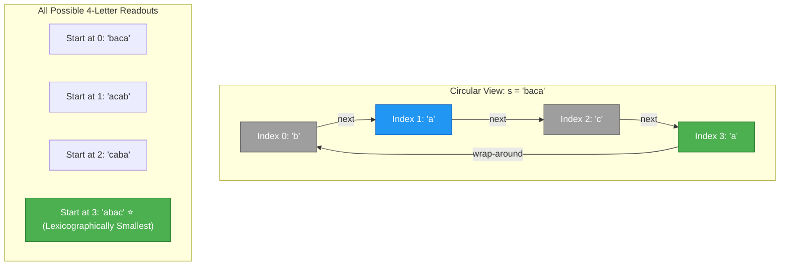
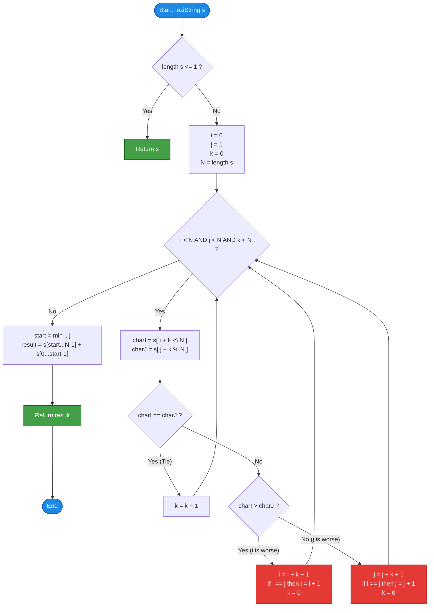

# GeeksforGeeks Problem of the Day: Lexicographically Smallest Rotation (Lexicographically Smallest String)

- **Problem Link:** [GeeksforGeeks - Lexicographically Smallest String](https://www.geeksforgeeks.org/problems/lexicographically-smallest-string--151951/1)
- **Difficulty:** Hard
- **Topic Tags:** Strings, Two-Pointer, Greedy, Lyndon Words, Booth's / Duval's Algorithm, Circular Arrays
- **Target Audience:** POTD Solvers, Computer Science Students, Competitive Programmers, Interview Preparation (FAANG/Tier-1 Tech)

---

## 1. Problem Statement

Given a string `s`, find the **lexicographically smallest string** that can be formed by rotating the string to the left by any number of positions (including $0$ rotations).

A left rotation by $k$ positions shifts characters at indices $0 \dots k-1$ to the end of the string, while keeping the relative order of characters intact:
$$\text{Rotate}(s, k) = s[k \dots N-1] + s[0 \dots k-1]$$

### Lexicographical Order Definition
A string $A$ is lexicographically smaller than string $B$ of the same length if at the first index $p$ where $A[p] \neq B[p]$, the character $A[p]$ comes earlier in the English alphabet than $B[p]$.

---

## 2. Examples & Explanations

### Example 1
- **Input:** `s = "abcd"` ($N = 4$)
- **Output:** `"abcd"`
- **Rotations:**
  - Shift 0: `"abcd"`
  - Shift 1: `"bcda"`
  - Shift 2: `"cdab"`
  - Shift 3: `"dabc"`
- **Explanation:** Lexicographically, `"abcd"` is already sorted alphabetically and is smaller than all other rotations.

### Example 2
- **Input:** `s = "baca"` ($N = 4$)
- **Output:** `"abac"`
- **Rotations:**
  - Shift 0: `"baca"`
  - Shift 1: `"acab"`
  - Shift 2: `"caba"`
  - Shift 3: `"abac"`
- **Explanation:**
  - Comparing `"abac"` with `"acab"`: At index 1, `'b' < 'c'`, so `"abac"` is smaller.
  - The minimal rotation starts at index $3$, yielding `"abac"`.

---

## 3. Constraints

- $1 \le |s| \le 10^6$
- `s` consists strictly of lowercase English alphabets (`'a'` - `'z'`).
- **Expected Time Complexity:** $\mathcal{O}(N)$
- **Expected Auxiliary Space:** $\mathcal{O}(1)$ extra memory for finding the index, and $\mathcal{O}(N)$ space to construct the return string.

---

## 4. Visual Architecture & Circular String Model

Imagine placing string `s = "baca"` on a circular necklace or ring where the last character wraps around to the first. Any left rotation corresponds to choosing an entry point on this ring and reading $N$ characters clockwise:



### The Core Two-Pointer Dilemma & The "Leapfrog" Theorem

If we compare candidate rotation $i$ and candidate rotation $j$ character-by-character using an offset $k \ge 0$:
- If $s[(i + k) \pmod N] == s[(j + k) \pmod N]$, the candidates are tied up to offset $k$. We increment $k \to k + 1$.
- If $s[(i + k) \pmod N] > s[(j + k) \pmod N]$, the rotation starting at $i$ is strictly larger than the rotation starting at $j$.

> **Crucial Optimization (Why it is $\mathcal{O}(N)$ instead of $\mathcal{O}(N^2)$):**  
> Because the prefixes of length $k$ were identical ($s[i \dots i+k-1] == s[j \dots j+k-1]$), for **any intermediate offset** $p \in [0, k]$, candidate $i + p$ will match candidate $j + p$ until that same mismatched character, where candidate $j + p$ is strictly better!  
> Therefore, **none** of the starting positions in the range $[i, i + k]$ can ever be the minimal rotation!  
> We can safely eliminate the entire range by advancing $i$ directly to $i + k + 1$ in $\mathcal{O}(1)$ time.

---

## 5. Step-by-Step Simulation & Trace Table

Tracing **Example 2**: `s = "baca"` ($N = 4$):
- Start with candidate pointers $i = 0$, $j = 1$, and match offset $k = 0$.

| Step | Pointer $i$ | Pointer $j$ | Offset $k$ | Char at $i+k$ | Char at $j+k$ | Comparison | Action Taken | Next State $(i, j, k)$ |
| :---: | :---: | :---: | :---: | :---: | :---: | :---: | :--- | :--- |
| **1** | $0$ | $1$ | $0$ | $s[0] = \text{'b'}$ | $s[1] = \text{'a'}$ | `'b' > 'a'` | Candidate $i$ loses! Set $i = 0 + 0 + 1 = 1$. Since $i == j$, increment $i = 2$. Reset $k = 0$. | $i = 2, j = 1, k = 0$ |
| **2** | $2$ | $1$ | $0$ | $s[2] = \text{'c'}$ | $s[1] = \text{'a'}$ | `'c' > 'a'` | Candidate $i$ loses! Set $i = 2 + 0 + 1 = 3$. Reset $k = 0$. | $i = 3, j = 1, k = 0$ |
| **3** | $3$ | $1$ | $0$ | $s[3] = \text{'a'}$ | $s[1] = \text{'a'}$ | `'a' == 'a'` | Tie! Increment $k \to 1$. | $i = 3, j = 1, k = 1$ |
| **4** | $3$ | $1$ | $1$ | $s[(3+1)\%4] = s[0] = \text{'b'}$ | $s[(1+1)\%4] = s[2] = \text{'c'}$ | `'b' < 'c'` | Candidate $j$ loses! Set $j = 1 + 1 + 1 = 3$. Since $j == i$, increment $j = 4$. Reset $k = 0$. | $i = 3, j = 4, k = 0$ |
| **5** | $3$ | $4$ | $0$ | - | - | $j \ge N$ ($4 \ge 4$) | **Loop Terminates!** Minimal start is $\min(i, j) = \min(3, 4) = \mathbf{3}$. | Finished |

### Final String Construction
- Starting index = $3$.
- `result = s.substring(3) + s.substring(0, 3) = "a" + "bac" = "abac"`.
- Correct Output: `"abac"`.

---

## 6. Algorithm Flowchart



---

## 7. From Naive to Pro: Algorithmic Progression

### Method 1: Naive Generation of All Rotations (Brute Force)
- **Concept:** Concatenate $s$ with itself ($S = s + s$). For each starting index $i \in [0, N-1]$, take the substring $S[i \dots i+N-1]$ and find the minimum string among all $N$ candidates.
- **Why it fails:**
  - Generating and comparing $N$ substrings of length $N$ takes $\mathcal{O}(N \times N) = \mathcal{O}(N^2)$ time.
  - For $N = 10^6$, operations exceed $10^{12} \implies$ **Huge Time Limit Exceeded (TLE)**.
- **Pseudocode:**
```text
function lexiString_BruteForce(s):
    n = length(s)
    double_s = s + s
    best = s
    
    for i from 1 to n - 1:
        rotation = substring(double_s, i, i + n)
        if rotation < best:
            best = rotation
            
    return best
```

---

### Method 2: Suffix Automaton / Suffix Array over Doubled String
- **Concept:** Build a Suffix Array or Suffix Automaton (SAM) on $s + s$. The lexicographically smallest rotation corresponds to finding the lowest rank suffix that has length at least $N$.
- **Why it is sub-optimal:**
  - While theoretical time complexity is $\mathcal{O}(N \log N)$ or $\mathcal{O}(N)$, suffix arrays require heavy auxiliary arrays (e.g. SA, Rank, LCP arrays of 32-bit integers), requiring over $40\text{ MB}$ of memory for $N = 10^6$.
  - Implementation complexity is very high (100+ lines of code) and prone to edge-case bugs in competitive programming.

---

### Method 3: Pro Approach — Two-Pointer Minimal Representation (Booth's / Duval's Algorithm)
- **The Core Strategy:**
  - Treat circular index matching as an ongoing tournament between two candidate starting indices $i$ and $j$.
  - At each step, either $k$ increments (advancing our shared prefix by $1$), or one of the pointers jumps by at least $k + 1$ positions, discarding obsolete candidates that can never beat the current winner.
  - Since both $i$ and $j$ advance forward and cannot exceed $2N$, the total number of character comparisons is strictly bounded by $2N \implies \mathcal{O}(N)$!
  - **Memory:** Zero heavy data structures, running in $\mathcal{O}(1)$ auxiliary space during search.
- **Pseudocode:**
```text
function lexiString_Optimal(s):
    n = length(s)
    if n <= 1:
        return s
        
    i = 0
    j = 1
    k = 0
    
    while i < n and j < n and k < n:
        ci = s[(i + k) % n]
        cj = s[(j + k) % n]
        
        if ci == cj:
            k = k + 1
        else if ci > cj:
            i = i + k + 1
            if i == j:
                i = i + 1
            k = 0
        else:
            j = j + k + 1
            if i == j:
                j = j + 1
            k = 0
            
    start = min(i, j)
    return substring(s, start, n) + substring(s, 0, start)
```

---

## 8. Complexity Comparison Table

| Metric | Method 1: Brute Force Rotations | Method 2: Suffix Array on $s+s$ | Method 3: Two-Pointer Duval/Booth (Pro) |
| :--- | :--- | :--- | :--- |
| **Time Complexity** | $\mathcal{O}(N^2)$ | $\mathcal{O}(N \log N)$ or $\mathcal{O}(N)$ | $\mathbf{\mathcal{O}(N)}$ (At most $2N$ comparisons) |
| **Auxiliary Space** | $\mathcal{O}(N^2)$ (copies) | $\mathcal{O}(N)$ (Heavy arrays, ~40MB) | $\mathbf{\mathcal{O}(1)}$ (Finding index) + $\mathcal{O}(N)$ (Output) |
| **Memory Footprint** | Extremely High | Heavy Integer Buffers | **Minimal (Cache-Friendly)** |
| **Code Length** | ~15 lines | ~120 lines | **~25 lines (Concise & Elegant)** |
| **Interview Verdict** | TLE ($10^{12}$ ops) | Overkill / Bug-prone | **Industry Standard & Optimal** |

---

## 9. Comprehensive Corner Cases Handled

1. **Single Character ($N = 1$):** `s = "a"` $\implies$ Loop exits immediately; returns `"a"`.
2. **All Identical Characters:** `s = "aaaa"` $\implies k$ increments up to $N = 4$ and loop exits safely; returns `"aaaa"`.
3. **Already Minimal:** `s = "abcdef"` $\implies$ Pointer $i = 0$ remains undefeated; returns `"abcdef"`.
4. **Reversed String:** `s = "fedcba"` $\implies$ Shifts smoothly to minimum character `'a'` at the end.
5. **Periodic / Repeating Substrings:** `s = "abacaba"` or `s = "ababab"` $\implies$ Leapfrogging $i$ and $j$ prevents infinite loops or index collisions.

---

## 10. Complete Multi-Language Implementations

### Java (21)

```java
class Solution {
    public String lexiString(String s) {
        int n = s.length();
        // Base case: strings of length 0 or 1 are already minimal
        if (n <= 1) {
            return s;
        }

        // Two candidate pointers and match offset
        int i = 0;
        int j = 1;
        int k = 0;

        // Two-pointer minimal representation tournament
        while (i < n && j < n && k < n) {
            char ci = s.charAt((i + k) % n);
            char cj = s.charAt((j + k) % n);

            if (ci == cj) {
                // Characters match; extend comparison window
                k++;
            } else if (ci > cj) {
                // Candidate i is strictly worse; skip all redundant candidates in [i, i + k]
                i += k + 1;
                if (i == j) {
                    i++;
                }
                k = 0;
            } else {
                // Candidate j is strictly worse; skip all redundant candidates in [j, j + k]
                j += k + 1;
                if (i == j) {
                    j++;
                }
                k = 0;
            }
        }

        // The smaller index is the starting position of the minimal rotation
        int start = Math.min(i, j);

        // Construct and return the rotated string
        return s.substring(start) + s.substring(0, start);
    }
}
```

---

### Python3

```python
class Solution:
    def lexiString(self, s: str) -> str:
        n = len(s)
        # Base case
        if n <= 1:
            return s

        # Pointers i, j represent candidate rotation starts; k is match length
        i, j, k = 0, 1, 0

        while i < n and j < n and k < n:
            ci = s[(i + k) % n]
            cj = s[(j + k) % n]

            if ci == cj:
                k += 1
            elif ci > cj:
                # Candidate i loses; advance i past all dominated shifts
                i += k + 1
                if i == j:
                    i += 1
                k = 0
            else:
                # Candidate j loses; advance j past all dominated shifts
                j += k + 1
                if i == j:
                    j += 1
                k = 0

        # Optimal starting index
        start = min(i, j)
        return s[start:] + s[:start]
```

---

### C++ (17)

```cpp
#include <string>
#include <algorithm>

using namespace std;

class Solution {
  public:
    string lexiString(string &s) {
        int n = s.length();
        // Base case: strings of length 0 or 1
        if (n <= 1) {
            return s;
        }

        int i = 0;
        int j = 1;
        int k = 0;

        // Two-pointer comparison loop
        while (i < n && j < n && k < n) {
            char ci = s[(i + k) % n];
            char cj = s[(j + k) % n];

            if (ci == cj) {
                k++;
            } else if (ci > cj) {
                i += k + 1;
                if (i == j) {
                    i++;
                }
                k = 0;
            } else {
                j += k + 1;
                if (i == j) {
                    j++;
                }
                k = 0;
            }
        }

        int start = min(i, j);

        // Allocate result string efficiently with single allocation
        string result;
        result.reserve(n);
        result.append(s, start, n - start);
        result.append(s, 0, start);

        return result;
    }
};
```

---

### C#

```csharp
using System;

class Solution {
    public string lexiString(string s) {
        int n = s.Length;
        // Base case
        if (n <= 1) {
            return s;
        }

        int i = 0;
        int j = 1;
        int k = 0;

        // Two-pointer search for minimal representation
        while (i < n && j < n && k < n) {
            char ci = s[(i + k) % n];
            char cj = s[(j + k) % n];

            if (ci == cj) {
                k++;
            } else if (ci > cj) {
                i += k + 1;
                if (i == j) {
                    i++;
                }
                k = 0;
            } else {
                j += k + 1;
                if (i == j) {
                    j++;
                }
                k = 0;
            }
        }

        int start = Math.Min(i, j);
        return s.Substring(start) + s.Substring(0, start);
    }
}
```

---

### Javascript (Node v22)

```javascript
/**
 * @param {string} s
 * @return {string}
 */
class Solution {
    lexiString(s) {
        const n = s.length;
        // Base case
        if (n <= 1) {
            return s;
        }

        let i = 0;
        let j = 1;
        let k = 0;

        // Two-pointer minimal string rotation algorithm
        while (i < n && j < n && k < n) {
            const ci = s[(i + k) % n];
            const cj = s[(j + k) % n];

            if (ci === cj) {
                k++;
            } else if (ci > cj) {
                i += k + 1;
                if (i === j) {
                    i++;
                }
                k = 0;
            } else {
                j += k + 1;
                if (i === j) {
                    j++;
                }
                k = 0;
            }
        }

        const start = Math.min(i, j);
        return s.slice(start) + s.slice(0, start);
    }
}
```