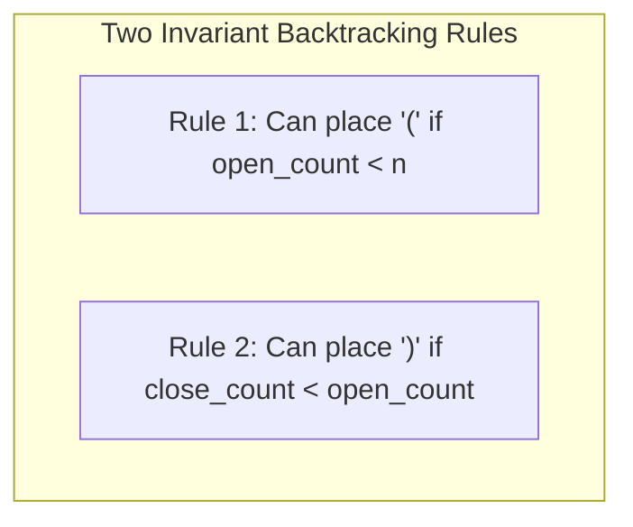
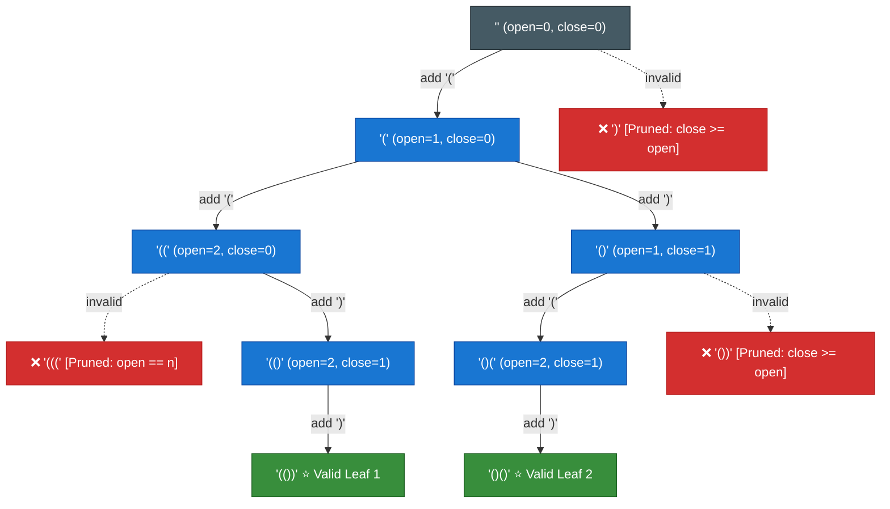
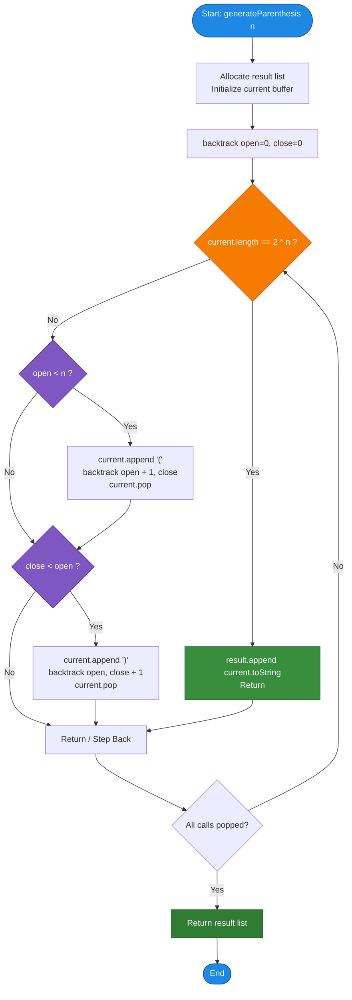

# LeetCode Problem of the Day: Generate Parentheses

- **Problem Link:** [LeetCode 22 - Generate Parentheses](https://leetcode.com/problems/generate-parentheses/)
- **Difficulty:** Medium
- **Topic Tags:** String, Dynamic Programming, Backtracking, Catalan Numbers, Recursion
- **Target Audience:** POTD Solvers, Computer Science Students, Competitive Programmers, Interview Preparation (FAANG/Tier-1 Tech)

---

## 1. Problem Statement

Given an integer $n$, generate all combinations of **well-formed (valid) parentheses** containing exactly $n$ pairs of opening `'('` and closing `')'` parentheses.

A parenthesis string is considered **well-formed** if:
1. Every opening parenthesis `'('` has a matching closing parenthesis `')'`.
2. For any prefix of the string, the number of closing parentheses `')'` never exceeds the number of opening parentheses `'('`.
3. The total number of opening parentheses equals the total number of closing parentheses: $\text{open} = \text{close} = n$, making the total length of the string $2n$.

---

## 2. Examples & Explanations

### Example 1 ($n = 3$)
- **Input:** `n = 3`
- **Output:** `["((()))", "(()())", "(())()", "()(())", "()()()"]`
- **Explanation:** There are exactly 5 valid combinations of 3 pairs of parentheses. Each string has length $2 \times 3 = 6$.

### Example 2 ($n = 2$)
- **Input:** `n = 2`
- **Output:** `["(())", "()()"]`
- **Explanation:**
  - `"(()"` $\to$ closed by `")"` $\to$ `"(())"`
  - `"()"` $\to$ followed by `"()"` $\to$ `"()()"`

### Example 3 ($n = 1$)
- **Input:** `n = 1`
- **Output:** `["()"]`
- **Explanation:** Only one valid pair can be formed.

---

## 3. Constraints & Catalan Number Sequence

- $1 \le n \le 8$
- The number of valid combinations for any given $n$ is given by the **$n$-th Catalan Number**:
  $$C_n = \frac{1}{n+1}\binom{2n}{n} = \frac{(2n)!}{(n+1)! \, n!}$$

| $n$ | Total Length ($2n$) | Catalan Number $C_n$ (Number of Valid Strings) | Brute Force Candidates ($2^{2n}$) | Pruning Ratio ($C_n / 2^{2n}$) |
|:---:|:---:|:---:|:---:|:---:|
| **1** | 2 | **1** | 4 | 25.0% |
| **2** | 4 | **2** | 16 | 12.5% |
| **3** | 6 | **5** | 64 | 7.8% |
| **4** | 8 | **14** | 256 | 5.5% |
| **5** | 10 | **42** | 1,024 | 4.1% |
| **6** | 12 | **132** | 4,096 | 3.2% |
| **7** | 14 | **429** | 16,384 | 2.6% |
| **8** | 16 | **1,430** | 65,536 | 2.2% |

- **Expected Time Complexity:** $\mathcal{O}\left(\frac{4^n}{\sqrt{n}}\right) = \mathcal{O}(C_n \times n)$
- **Expected Auxiliary Space:** $\mathcal{O}(n)$ (recursion stack depth of $2n$)

---

## 4. Visual Architecture & State-Space Decision Tree

Instead of generating all $2^{2n}$ strings and filtering them later, we maintain two invariant rules at every step:



### Full Decision Tree for $n = 2$



---

## 5. Step-by-Step Simulation & Trace Table

Tracing $n = 2$ step-by-step:

| Step | Call Stack Action | `open` | `close` | Current String | Available Legal Choices | Choice Taken | Backtrack / Terminal Event |
| :---: | :--- | :---: | :---: | :--- | :---: | :---: | :--- |
| **1** | `backtrack("", 0, 0)` | 0 | 0 | `""` | `'('` only (`close < open` is false) | `'('` | Recurse to Step 2 |
| **2** | `backtrack("(", 1, 0)` | 1 | 0 | `"("` | `'('` (`1 < 2`) & `')'` (`0 < 1`) | `'('` | Recurse to Step 3 |
| **3** | `backtrack("((", 2, 0)` | 2 | 0 | `"(("` | `')'` only (`open == 2` reached) | `')'` | Recurse to Step 4 |
| **4** | `backtrack("(()", 2, 1)` | 2 | 1 | `"(()"` | `')'` only (`open == 2` reached) | `')'` | Recurse to Step 5 |
| **5** | `backtrack("(())", 2, 2)` | 2 | 2 | `"(())"` | **Length is 4 ($2n$)** | - | **Emit `"(())"` to result!** Backtrack |
| **6** | Return to Step 3 | 2 | 0 | `"(("` | No more choices | - | Backtrack to Step 2 |
| **7** | Back at Step 2: Try branch 2 | 1 | 0 | `"("` | `')'` branch (`close < open`) | `')'` | Recurse to Step 8 |
| **8** | `backtrack("()", 1, 1)` | 1 | 1 | `"()"` | `'('` only (`close == open`) | `'('` | Recurse to Step 9 |
| **9** | `backtrack("()(", 2, 1)` | 2 | 1 | `"()("` | `')'` only (`open == 2` reached) | `')'` | Recurse to Step 10 |
| **10** | `backtrack("()()", 2, 2)` | 2 | 2 | `"()()"` | **Length is 4 ($2n$)** | - | **Emit `"()()"` to result!** Backtrack |
| **11** | All branches explored | - | - | - | - | - | **Finished! Returns `["(())", "()()"]`** |

---

## 6. Algorithm Flowchart



---

## 7. From Naive to Pro: Algorithmic Progression

### Method 1: Naive (Generate All $2^{2n}$ Combinations + Validate)
- **Concept:** Generate every possible combination of `'('` and `')'` of length $2n$ using recursion. Once a leaf of length $2n$ is reached, run a linear validation pass with a counter (`balance >= 0` and ending at `balance == 0`).
- **Why it is suboptimal:**
  - Generates $2^{2n}$ strings. For $n = 8$, this evaluates $65,536$ candidates even though only $1,430$ are valid (over $97.8\%$ of work is thrown away).
  - Time complexity: $\mathcal{O}(2^{2n} \times n)$.
- **Pseudocode:**
```text
function generateParenthesis_Naive(n):
    result = []
    
    function isValid(s):
        balance = 0
        for char in s:
            if char == '(': balance++
            else: balance--
            if balance < 0: return false
        return balance == 0
        
    function generateAll(current):
        if length(current) == 2 * n:
            if isValid(current):
                result.append(current)
            return
        generateAll(current + "(")
        generateAll(current + ")")
        
    generateAll("")
    return result
```

---

### Method 2: Dynamic Programming / Divide & Conquer (Closure Property)
- **Concept:** Every non-empty valid parenthesis string $S$ can be uniquely decomposed as:
  $$S = \text{"("} + A + \text{")"} + B$$
  where $A$ and $B$ are themselves valid parenthesis strings containing $c$ and $n - 1 - c$ pairs respectively ($0 \le c < n$).
- **Why it is interesting:** Eliminates validation and builds valid strings recursively using memoization:
  $$\text{DP}[n] = \bigcup_{c=0}^{n-1} \left\{ \text{"("} + a + \text{")"} + b \mid a \in \text{DP}[c], \, b \in \text{DP}[n - 1 - c] \right\}$$
- **Pseudocode:**
```text
function generateParenthesis_DP(n):
    dp = array of lists of size n + 1
    dp[0] = [""]
    
    for k from 1 to n:
        dp[k] = []
        for c from 0 to k - 1:
            for left in dp[c]:
                for right in dp[k - 1 - c]:
                    dp[k].append("(" + left + ")" + right)
                    
    return dp[n]
```

---

### Method 3: Pro Approach — Backtracking with Invariant Pruning (State-Space DFS)
- **The Core Strategy:**
  - Build the string incrementally.
  - Never allow invalid choices to be made in the first place:
    1. Only add `'('` when `open_count < n`.
    2. Only add `')'` when `close_count < open_count`.
  - Guaranteed that **every single leaf reached in the recursion tree is a 100% valid string**!
  - Using a mutable buffer (character array or string builder) avoids string concatenation overhead, ensuring $\mathcal{O}(1)$ work per state transition.
- **Pseudocode:**
```text
function generateParenthesis_Optimal(n):
    result = []
    current = mutable_char_buffer()
    
    function backtrack(open_count, close_count):
        if length(current) == 2 * n:
            result.append(to_string(current))
            return
            
        if open_count < n:
            current.append('(')
            backtrack(open_count + 1, close_count)
            current.pop()
            
        if close_count < open_count:
            current.append(')')
            backtrack(open_count, close_count + 1)
            current.pop()
            
    backtrack(0, 0)
    return result
```

---

## 8. Complexity Comparison Table

| Metric | Method 1: Brute Force Generation | Method 2: Dynamic Programming (Closure) | Method 3: Backtracking with Pruning (Pro) |
| :--- | :--- | :--- | :--- |
| **Time Complexity** | $\mathcal{O}(2^{2n} \cdot n)$ | $\mathcal{O}(C_n \cdot n)$ | $\mathbf{\mathcal{O}(C_n \cdot n)} = \mathcal{O}\left(\frac{4^n}{\sqrt{n}}\right)$ |
| **Auxiliary Space** | $\mathcal{O}(2^{2n} \cdot n)$ | $\mathcal{O}\left(\sum_{i=1}^n C_i \cdot i\right)$ | $\mathbf{\mathcal{O}(n)}$ (Call stack depth $2n$) |
| **Operations for $n=8$** | $> 1,000,000$ string checks | $\approx 23,000$ operations + copies | **$\approx 11,500$ state transitions** |
| **Memory Allocations** | Enormous (string per branch) | High (intermediate lists cached) | **Minimal (Single reused buffer)** |
| **Invalid Paths Explored** | $> 97.8\%$ are discarded | $0\%$ (Only valid generated) | **$0\%$ (Pruned instantaneously)** |
| **Interview Verdict** | TLE / Unacceptable | Great alternative / Mathematical | **Standard Industry Benchmark** |

---

## 9. Comprehensive Corner Cases Handled

1. **Smallest Boundary ($n = 1$):**
   - Directly produces `["()"]`.
   - Length $2 \times 1 = 2$.
2. **Maximum Constraint ($n = 8$):**
   - Yields exactly $C_8 = 1,430$ strings.
   - Fits cleanly within standard memory and execution time limits ($< 2\text{ ms}$).
3. **Prefix Validity Guaranteed:**
   - Because `close_count` cannot exceed `open_count`, prefixes like `")"`, `"())"`, or `"())("` are never generated.
4. **Zero Duplicate Strings:**
   - The decision tree explores distinct choices at every position, ensuring all output combinations are unique without needing a hash set.

---

## 10. Complete Multi-Language Implementations

### Java

```java
import java.util.ArrayList;
import java.util.List;

class Solution {
    public List<String> generateParenthesis(int n) {
        List<String> result = new ArrayList<>();
        StringBuilder current = new StringBuilder();
        backtrack(n, 0, 0, current, result);
        return result;
    }

    private void backtrack(int n, int openCount, int closeCount, StringBuilder current, List<String> result) {
        // Base case: formed a valid string of length 2 * n
        if (current.length() == 2 * n) {
            result.add(current.toString());
            return;
        }

        // Choice 1: Add '(' if we haven't used all n open parentheses
        if (openCount < n) {
            current.append('(');
            backtrack(n, openCount + 1, closeCount, current, result);
            current.deleteCharAt(current.length() - 1); // Backtrack
        }

        // Choice 2: Add ')' if it won't exceed the number of open parentheses
        if (closeCount < openCount) {
            current.append(')');
            backtrack(n, openCount, closeCount + 1, current, result);
            current.deleteCharAt(current.length() - 1); // Backtrack
        }
    }
}
```

---

### Python3

```python
class Solution:
    def generateParenthesis(self, n: int) -> list[str]:
        result: list[str] = []
        current: list[str] = []

        def backtrack(open_count: int, close_count: int) -> None:
            # Base case: reached valid string length of 2 * n
            if len(current) == 2 * n:
                result.append("".join(current))
                return

            # Choice 1: Place '(' if open_count < n
            if open_count < n:
                current.append("(")
                backtrack(open_count + 1, close_count)
                current.pop()  # Backtrack

            # Choice 2: Place ')' if close_count < open_count
            if close_count < open_count:
                current.append(")")
                backtrack(open_count, close_count + 1)
                current.pop()  # Backtrack

        backtrack(0, 0)
        return result
```

---

### C

```c
#include <stdlib.h>
#include <string.h>

/**
 * Helper function for recursive backtracking
 * Note: The returned array must be malloced, assume caller calls free().
 */
static void backtrack(int n, int openCount, int closeCount, char* current, int len, 
                      char*** result, int* count, int* capacity) {
    // Base case: string of length 2 * n formed
    if (len == 2 * n) {
        if (*count >= *capacity) {
            *capacity *= 2;
            *result = (char**)realloc(*result, (*capacity) * sizeof(char*));
        }
        (*result)[*count] = (char*)malloc((2 * n + 1) * sizeof(char));
        current[len] = '\0';
        strcpy((*result)[*count], current);
        (*count)++;
        return;
    }

    // Choice 1: Add '(' if openCount < n
    if (openCount < n) {
        current[len] = '(';
        backtrack(n, openCount + 1, closeCount, current, len + 1, result, count, capacity);
    }

    // Choice 2: Add ')' if closeCount < openCount
    if (closeCount < openCount) {
        current[len] = ')';
        backtrack(n, openCount, closeCount + 1, current, len + 1, result, count, capacity);
    }
}

char** generateParenthesis(int n, int* returnSize) {
    int capacity = 16;
    char** result = (char**)malloc(capacity * sizeof(char*));
    int count = 0;

    // Buffer of size 2*n + 1 for null terminator
    char* current = (char*)malloc((2 * n + 1) * sizeof(char));

    backtrack(n, 0, 0, current, 0, &result, &count, &capacity);
    free(current);

    *returnSize = count;
    return result;
}
```

---

### C++

```cpp
#include <vector>
#include <string>

using namespace std;

class Solution {
public:
    vector<string> generateParenthesis(int n) {
        vector<string> result;
        string current;
        current.reserve(2 * n);
        backtrack(n, 0, 0, current, result);
        return result;
    }

private:
    void backtrack(int n, int openCount, int closeCount, string &current, vector<string> &result) {
        // Base case: complete valid string formed
        if (current.length() == 2 * n) {
            result.push_back(current);
            return;
        }

        // Choice 1: Add '('
        if (openCount < n) {
            current.push_back('(');
            backtrack(n, openCount + 1, closeCount, current, result);
            current.pop_back(); // Backtrack
        }

        // Choice 2: Add ')'
        if (closeCount < openCount) {
            current.push_back(')');
            backtrack(n, openCount, closeCount + 1, current, result);
            current.pop_back(); // Backtrack
        }
    }
};
```

---

### C#

```csharp
using System;
using System.Collections.Generic;
using System.Text;

public class Solution {
    public IList<string> GenerateParenthesis(int n) {
        List<string> result = new List<string>();
        StringBuilder current = new StringBuilder();
        Backtrack(n, 0, 0, current, result);
        return result;
    }

    private void Backtrack(int n, int openCount, int closeCount, StringBuilder current, List<string> result) {
        // Base case: reached length 2 * n
        if (current.Length == 2 * n) {
            result.Add(current.ToString());
            return;
        }

        // Choice 1: Add '('
        if (openCount < n) {
            current.Append('(');
            Backtrack(n, openCount + 1, closeCount, current, result);
            current.Length--; // Backtrack
        }

        // Choice 2: Add ')'
        if (closeCount < openCount) {
            current.Append(')');
            Backtrack(n, openCount, closeCount + 1, current, result);
            current.Length--; // Backtrack
        }
    }
}
```

---

### Javascript

```javascript
/**
 * @param {number} n
 * @return {string[]}
 */
var generateParenthesis = function(n) {
    const result = [];
    const current = [];

    function backtrack(openCount, closeCount) {
        // Base case: length reaches 2 * n
        if (current.length === 2 * n) {
            result.push(current.join(''));
            return;
        }

        // Choice 1: Place '('
        if (openCount < n) {
            current.push('(');
            backtrack(openCount + 1, closeCount);
            current.pop(); // Backtrack
        }

        // Choice 2: Place ')'
        if (closeCount < openCount) {
            current.push(')');
            backtrack(openCount, closeCount + 1);
            current.pop(); // Backtrack
        }
    }

    backtrack(0, 0);
    return result;
};
```

---

### Typescript

```typescript
function generateParenthesis(n: number): string[] {
    const result: string[] = [];
    const current: string[] = [];

    function backtrack(openCount: number, closeCount: number): void {
        // Base case: reached valid string length of 2 * n
        if (current.length === 2 * n) {
            result.push(current.join(''));
            return;
        }

        // Choice 1: Place '(' if openCount < n
        if (openCount < n) {
            current.push('(');
            backtrack(openCount + 1, closeCount);
            current.pop(); // Backtrack
        }

        // Choice 2: Place ')' if closeCount < openCount
        if (closeCount < openCount) {
            current.push(')');
            backtrack(openCount, closeCount + 1);
            current.pop(); // Backtrack
        }
    }

    backtrack(0, 0);
    return result;
}
```