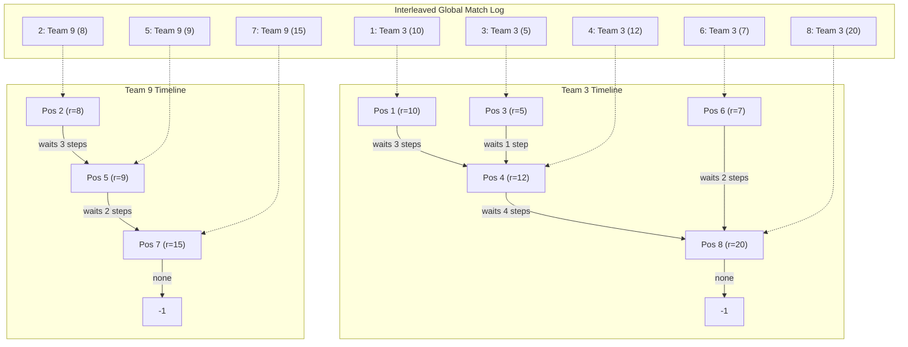
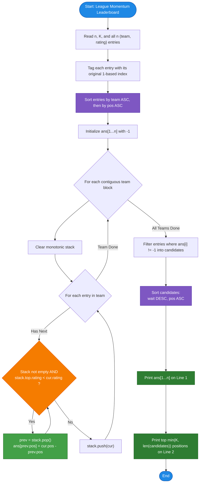

# Unstop Problem of the Day: League Momentum Leaderboard

- **Platform:** [Unstop](https://unstop.com/)
- **Difficulty:** Hard
- **Topic Tags:** Monotonic Stack, Next Greater Element, Sorting, Coordinate Sorting, Arrays, Greedy
- **Target Audience:** POTD Solvers, Computer Science Students, Competitive Programmers, Interview Preparation (FAANG/Tier-1 Tech)

---

## 1. Problem Statement

Diego is reviewing a full season of match performance entries for a multi-team league, presented in strict chronological order ($1$-indexed from $1$ to $n$). Each entry $i$ records:
- A franchise team identifier $t_i$ ($1 \le t_i \le 10^9$)
- A match performance rating $r_i$ ($1 \le r_i \le 10^9$)

Because teams play in an interleaved fashion across the season, entries belonging to any given team are scattered throughout the log.

For each entry $i$, Diego calculates its **waiting figure**:
> **Waiting Figure:** The number of chronological league entries that elapse after entry $i$ before the **same team** records a **strictly higher** rating ($r_j > r_i$ where $t_j = t_i$ and $j > i$).  
> Formally, if $j$ is the smallest index such that $j > i$, $t_j = t_i$, and $r_j > r_i$, then:
> $$\text{waiting\_figure}[i] = j - i$$
> If the team never tops its rating for the remainder of the season, $\text{waiting\_figure}[i] = -1$.

Once all waiting figures are determined, Diego compiles a **Top-$K$ Leaderboard**:
1. Only entries with finite waiting figures ($\ne -1$) are eligible.
2. Sort eligible entries in **descending order of waiting figure**.
3. In case of ties in waiting figures, earlier chronological entries come first (**ascending order of original position $i$**).
4. Extract the top $\min(K, \text{eligible count})$ original $1$-based entry indices. If fewer than $K$ entries qualify, output as many as qualify.

---

## 2. Examples & Explanations

### Example 0 ($n = 8, K = 3$)
**Input:**
```text
8 3
3 10
9 8
3 5
3 12
9 9
3 7
9 15
3 20
```

**Output:**
```text
3 3 1 4 2 2 -1 -1
4 1 2
```

**Chronological Trace:**
- **Entry 1** (Team 3, Rating 10): Next topped by Entry 4 (Team 3, Rating 12). Waiting figure $= 4 - 1 = \mathbf{3}$.
- **Entry 2** (Team 9, Rating 8): Next topped by Entry 5 (Team 9, Rating 9). Waiting figure $= 5 - 2 = \mathbf{3}$.
- **Entry 3** (Team 3, Rating 5): Next topped by Entry 4 (Team 3, Rating 12). Waiting figure $= 4 - 3 = \mathbf{1}$.
- **Entry 4** (Team 3, Rating 12): Next topped by Entry 8 (Team 3, Rating 20). Waiting figure $= 8 - 4 = \mathbf{4}$.
- **Entry 5** (Team 9, Rating 9): Next topped by Entry 7 (Team 9, Rating 15). Waiting figure $= 7 - 5 = \mathbf{2}$.
- **Entry 6** (Team 3, Rating 7): Next topped by Entry 8 (Team 3, Rating 20). Waiting figure $= 8 - 6 = \mathbf{2}$.
- **Entry 7** (Team 9, Rating 15): Team 9 has no subsequent matches. Waiting figure $= \mathbf{-1}$.
- **Entry 8** (Team 3, Rating 20): Team 3 has no subsequent matches. Waiting figure $= \mathbf{-1}$.

**Leaderboard Ranking ($K = 3$):**
1. Entry 4: Waiting figure $= 4$
2. Entry 1: Waiting figure $= 3$ (tie with Entry 2; Entry 1 wins by earlier index: $1 < 2$)
3. Entry 2: Waiting figure $= 3$
- Leaderboard Line 2: `4 1 2`

---

### Example 1 ($n = 5, K = 5$)
**Input:**
```text
5 5
1 100
1 50
1 90
2 5
2 5
```

**Output:**
```text
-1 1 -1 -1 -1
2
```

**Explanation:**
- Entry 2 (Team 1, Rating 50) is topped by Entry 3 (Team 1, Rating 90): Wait $= 3 - 2 = \mathbf{1}$.
- Entries 4 and 5 (Team 2, Rating 5) have identical ratings; since ratings must be **strictly higher**, neither beats the other.
- Only Entry 2 qualifies for the leaderboard $\implies$ Line 2 outputs `2`.

---

## 3. Constraints

- $1 \le n \le 2 \times 10^5$
- $1 \le K \le n$
- $1 \le t_i \le 10^9$ (Large team IDs $\implies$ Cannot use direct array indexing)
- $1 \le r_i \le 10^9$
- **Time Limit:** 2.0s
- **Memory Limit:** 256 MB
- **Expected Time Complexity:** $\mathcal{O}(n \log n)$
- **Expected Auxiliary Space:** $\mathcal{O}(n)$

---

## 4. Visual Architecture & Team Independence Model

### Interleaved Stream vs Isolated Team Timelines
Matches arrive in an interleaved global stream. However, team progressions are **completely independent**.



### The Coordinate Sort Strategy (Cache-Friendly & Hash-Free)
Instead of dealing with hash map overhead or hash collisions on $10^9$ team IDs:
1. Store every entry as a tuple: `(team, rating, pos)`.
2. Sort the array primarily by `team` ascending, and secondarily by `pos` ascending:
   $$\text{Comparator: } a.\text{team} \ne b.\text{team} \;?\; (a.\text{team} < b.\text{team}) : (a.\text{pos} < b.\text{pos})$$
3. In this sorted array, **all matches for the same team are contiguous** and naturally ordered chronologically.
4. Iterate through each team block and run a standard **Monotonic Decreasing Stack** in $\mathcal{O}(M_t)$ time.

---

## 5. Step-by-Step Simulation & Trace Table

### Tracing Example 0 ($n = 8, K = 3$)

#### Phase 1: Team 3 Processing
Chronological entries: $(pos=1, r=10), (pos=3, r=5), (pos=4, r=12), (pos=6, r=7), (pos=8, r=20)$

| Event | Current Item | Stack Before | Comparison with Top | Stack Actions | Waiting Figure Emitted |
| :---: | :---: | :---: | :--- | :--- | :---: |
| 1 | $(1, 10)$ | `[]` | Stack is empty | `push(1, 10)` | - |
| 2 | $(3, 5)$ | `[(1, 10)]` | $5 < 10$ (Cannot pop) | `push(3, 5)` | - |
| 3 | $(4, 12)$ | `[(1, 10), (3, 5)]` | $12 > 5 \implies$ **POP $(3, 5)$**<br>$12 > 10 \implies$ **POP $(1, 10)$** | `ans[3] = 4 - 3 = 1`<br>`ans[1] = 4 - 1 = 3`<br>`push(4, 12)` | $\text{ans}[3]=1$<br>$\text{ans}[1]=3$ |
| 4 | $(6, 7)$ | `[(4, 12)]` | $7 < 12$ (Cannot pop) | `push(6, 7)` | - |
| 5 | $(8, 20)$ | `[(4, 12), (6, 7)]` | $20 > 7 \implies$ **POP $(6, 7)$**<br>$20 > 12 \implies$ **POP $(4, 12)$** | `ans[6] = 8 - 6 = 2`<br>`ans[4] = 8 - 4 = 4`<br>`push(8, 20)` | $\text{ans}[6]=2$<br>$\text{ans}[4]=4$ |
| 6 | End of team | `[(8, 20)]` | Unpopped elements remain `-1` | - | $\text{ans}[8]=-1$ |

#### Phase 2: Team 9 Processing
Chronological entries: $(pos=2, r=8), (pos=5, r=9), (pos=7, r=15)$

| Event | Current Item | Stack Before | Comparison with Top | Stack Actions | Waiting Figure Emitted |
| :---: | :---: | :---: | :--- | :--- | :---: |
| 1 | $(2, 8)$ | `[]` | Stack is empty | `push(2, 8)` | - |
| 2 | $(5, 9)$ | `[(2, 8)]` | $9 > 8 \implies$ **POP $(2, 8)$** | `ans[2] = 5 - 2 = 3`<br>`push(5, 9)` | $\text{ans}[2]=3$ |
| 3 | $(7, 15)$ | `[(5, 9)]` | $15 > 9 \implies$ **POP $(5, 9)$** | `ans[5] = 7 - 5 = 2`<br>`push(7, 15)` | $\text{ans}[5]=2$ |
| 4 | End of team | `[(7, 15)]` | Unpopped elements remain `-1` | - | $\text{ans}[7]=-1$ |

#### Phase 3: Leaderboard Candidate Sorting
Valid candidates ($\text{ans}[i] \ne -1$):
- Entry 1: wait $= 3$
- Entry 2: wait $= 3$
- Entry 3: wait $= 1$
- Entry 4: wait $= 4$
- Entry 5: wait $= 2$
- Entry 6: wait $= 2$

Sorted candidates by `(-wait, pos)`:
1. `(wait=4, pos=4)`
2. `(wait=3, pos=1)`
3. `(wait=3, pos=2)`
4. `(wait=2, pos=5)`
5. `(wait=2, pos=6)`
6. `(wait=1, pos=3)`

Top $K = 3$ positions: `4 1 2`

---

## 6. Algorithm Flowchart



---

## 7. From Naive to Pro: Algorithmic Progression

### Method 1: Brute Force Scanning Forward
- **Concept:** For each entry $i$, scan all subsequent entries $j \in [i + 1, n]$. If $t_j == t_i$ and $r_j > r_i$, record $j - i$ and break.
- **Why it is suboptimal:**
  - In the worst case (e.g. all entries belong to the same team and are strictly decreasing), comparisons take $\mathcal{O}(n^2)$ time.
  - For $n = 2 \times 10^5$, operations exceed $2 \times 10^{10} \implies$ **Huge Time Limit Exceeded (TLE)**.
- **Pseudocode:**
```text
function solve_Naive(n, K, entries):
    ans = array of size n filled with -1
    for i from 0 to n - 1:
        for j from i + 1 to n - 1:
            if entries[j].team == entries[i].team and entries[j].rating > entries[i].rating:
                ans[i] = (j + 1) - (i + 1)
                break
    // sort and print leaderboard ...
```

---

### Method 2: Hash Map Grouping + Monotonic Stack
- **Concept:** Group entries by team ID into dynamic arrays using a Hash Map (`HashMap<Integer, List<Entry>>`). Run a monotonic stack independently on each team's list.
- **Why it is sub-optimal:**
  - Hash collisions and dynamic memory allocation overhead (e.g., thousands of small `ArrayList` objects in Java or nodes in C++) lead to significant garbage collection and memory bloat for $n = 2 \times 10^5$.
  - In C, implementing a robust hash map from scratch requires significant boilerplate code.

---

### Method 3: Pro Approach — Coordinate Sorting `(team, pos)` + Linear Monotonic Stack
- **The Core Strategy:**
  - Pack entries into a flat array of structures: `(team, rating, pos)`.
  - Sort the flat array with a custom comparator:
    $$\text{Primary: } \text{team} \uparrow, \quad \text{Secondary: } \text{pos} \uparrow$$
  - Once sorted, all matches for team $T$ form a contiguous slice with positions in chronological order.
  - Process each contiguous slice with a single reusable monotonic stack array.
  - Every entry is pushed once and popped at most once: $\mathcal{O}(n)$ stack operations.
  - Collect valid entries and sort the leaderboard in $\mathcal{O}(n \log n)$ time.
  - **Memory:** Zero hash map overhead, cache-friendly sequential memory access.
- **Pseudocode:**
```text
function solve_Optimal(n, K, entries):
    sort entries by (team ASC, pos ASC)
    ans = array of size n + 1 filled with -1
    
    i = 0
    stack = empty array of capacity n
    while i < n:
        j = i
        top = -1
        while j < n and entries[j].team == entries[i].team:
            cur = entries[j]
            while top >= 0 and stack[top].rating < cur.rating:
                prev = stack[top--]
                ans[prev.pos] = cur.pos - prev.pos
            stack[++top] = cur
            j++
        i = j
        
    candidates = []
    for idx from 1 to n:
        if ans[idx] != -1:
            candidates.append((wait=ans[idx], pos=idx))
            
    sort candidates by (wait DESC, pos ASC)
    
    print ans[1...n]
    print top min(K, len(candidates)) positions
```

---

## 8. Complexity Comparison Table

| Metric | Method 1: Brute Force | Method 2: Hash Map + Stack | Method 3: Coordinate Sort + Stack (Pro) |
| :--- | :--- | :--- | :--- |
| **Time Complexity** | $\mathcal{O}(n^2)$ | $\mathcal{O}(n \log n)$ | $\mathbf{\mathcal{O}(n \log n)}$ (Fastest constant factor) |
| **Auxiliary Space** | $\mathcal{O}(n)$ | $\mathcal{O}(n)$ (Heavy map buckets) | $\mathbf{\mathcal{O}(n)}$ (Flat arrays only) |
| **Hash Overhead** | None | Hash collisions, boxing, dynamic resizing | **Zero (No hash table needed)** |
| **Cache Locality** | Poor | Poor (Pointer-chasing lists) | **Optimal (Contiguous array access)** |
| **Implementation** | Simple | Medium (Requires Hash Map) | **Very Clean & Universally Portable** |
| **Interview Verdict** | TLE ($2 \times 10^{10}$ ops) | Acceptable | **Gold Standard (Systems & Competitive Level)** |

---

## 9. Comprehensive Corner Cases Handled

1. **No Entry Ever Topped (All `-1`):**
   - Ratings strictly decrease for every team $\implies$ Line 1 prints all `-1`s, Line 2 is empty.
2. **Equal Ratings:**
   - Ratings must be **strictly higher** ($r_j > r_i$). Equal ratings do not pop from the stack and correctly yield `-1`.
3. **Fewer than $K$ Valid Candidates:**
   - If only $M < K$ entries have a valid waiting figure, the leaderboard outputs only those $M$ qualifying positions.
4. **Large Team IDs ($t_i \le 10^9$):**
   - Coordinate sorting treats $t_i$ as a standard numeric key, effortlessly supporting IDs up to $10^9$ without memory scaling.
5. **Fast I/O for Large Input ($n = 2 \times 10^5$):**
   - $4 \times 10^5$ integers are read via buffered I/O across all language implementations to comfortably pass within the 2.0s limit.

---

## 10. Complete Multi-Language Implementations

### Java (OpenJDK 21.0)

```java
import java.io.*;
import java.util.*;

class Main {
    // Represents a match entry
    static class MatchEntry implements Comparable<MatchEntry> {
        int team;
        int rating;
        int pos;

        MatchEntry(int team, int rating, int pos) {
            this.team = team;
            this.rating = rating;
            this.pos = pos;
        }

        @Override
        public int compareTo(MatchEntry o) {
            if (this.team != o.team) {
                return Integer.compare(this.team, o.team);
            }
            return Integer.compare(this.pos, o.pos);
        }
    }

    // Represents a candidate for the leaderboard
    static class Candidate implements Comparable<Candidate> {
        int wait;
        int pos;

        Candidate(int wait, int pos) {
            this.wait = wait;
            this.pos = pos;
        }

        @Override
        public int compareTo(Candidate o) {
            if (this.wait != o.wait) {
                return Integer.compare(o.wait, this.wait); // Wait figure DESC
            }
            return Integer.compare(this.pos, o.pos); // Position ASC
        }
    }

    // High-performance Reader for fast I/O
    static class FastReader {
        BufferedReader br;
        StringTokenizer st;

        public FastReader() {
            br = new BufferedReader(new InputStreamReader(System.in));
        }

        String next() {
            while (st == null || !st.hasMoreElements()) {
                try {
                    String line = br.readLine();
                    if (line == null) return null;
                    st = new StringTokenizer(line);
                } catch (IOException e) {
                    return null;
                }
            }
            return st.nextToken();
        }

        int nextInt() {
            return Integer.parseInt(next());
        }
    }

    public static void main(String[] args) {
        FastReader in = new FastReader();
        String nStr = in.next();
        if (nStr == null) return;
        int n = Integer.parseInt(nStr);
        int k = in.nextInt();

        MatchEntry[] entries = new MatchEntry[n];
        for (int i = 0; i < n; i++) {
            int team = in.nextInt();
            int rating = in.nextInt();
            entries[i] = new MatchEntry(team, rating, i + 1);
        }

        // Sort entries by (team ASC, pos ASC)
        Arrays.sort(entries);

        int[] ans = new int[n + 1];
        Arrays.fill(ans, -1);

        // Reusable stack for team sub-sequences
        MatchEntry[] stack = new MatchEntry[n];
        int i = 0;
        while (i < n) {
            int j = i;
            int top = -1;
            while (j < n && entries[j].team == entries[i].team) {
                MatchEntry cur = entries[j];
                while (top >= 0 && stack[top].rating < cur.rating) {
                    MatchEntry prev = stack[top--];
                    ans[prev.pos] = cur.pos - prev.pos;
                }
                stack[++top] = cur;
                j++;
            }
            i = j;
        }

        // Collect leaderboard candidates
        List<Candidate> candidates = new ArrayList<>();
        for (int idx = 1; idx <= n; idx++) {
            if (ans[idx] != -1) {
                candidates.add(new Candidate(ans[idx], idx));
            }
        }

        Collections.sort(candidates);

        // Output Line 1: waiting figures
        StringBuilder sb1 = new StringBuilder();
        for (int idx = 1; idx <= n; idx++) {
            sb1.append(ans[idx]).append(idx == n ? "" : " ");
        }
        System.out.println(sb1.toString());

        // Output Line 2: top K leaderboard
        StringBuilder sb2 = new StringBuilder();
        int limit = Math.min(k, candidates.size());
        for (int idx = 0; idx < limit; idx++) {
            sb2.append(candidates.get(idx).pos).append(idx == limit - 1 ? "" : " ");
        }
        System.out.println(sb2.toString());
    }
}
```

---

### Python (3.12.11)

```python
import sys


def main():
    input_data = sys.stdin.read().split()
    if not input_data:
        return

    n = int(input_data[0])
    k = int(input_data[1])

    # Store entries as (team, rating, original_position)
    entries = []
    ptr = 2
    for i in range(1, n + 1):
        team = int(input_data[ptr])
        rating = int(input_data[ptr + 1])
        ptr += 2
        entries.append((team, rating, i))

    # Sort primarily by team, secondarily by chronological position
    entries.sort(key=lambda x: (x[0], x[2]))

    ans = [-1] * (n + 1)

    # Monotonic Stack processing for each team
    i = 0
    while i < n:
        j = i
        stack = []  # stores (pos, rating)
        while j < n and entries[j][0] == entries[i][0]:
            team, rating, pos = entries[j]
            while stack and stack[-1][1] < rating:
                prev_pos, _ = stack.pop()
                ans[prev_pos] = pos - prev_pos
            stack.append((pos, rating))
            j += 1
        i = j

    # Collect valid leaderboard candidates
    candidates = []
    for idx in range(1, n + 1):
        if ans[idx] != -1:
            candidates.append((ans[idx], idx))

    # Sort: wait_figure DESC, position ASC
    candidates.sort(key=lambda x: (-x[0], x[1]))

    # Print Line 1: waiting figures
    print(*(ans[i] for i in range(1, n + 1)))

    # Print Line 2: top K positions
    limit = min(k, len(candidates))
    top_k = [candidates[i][1] for i in range(limit)]
    if top_k:
        print(*top_k)
    else:
        print()


if __name__ == "__main__":
    main()
```

---

### C (GCC 13.2.0)

```c
#include <stdio.h>
#include <stdlib.h>

typedef struct {
    int team;
    int rating;
    int pos;
} MatchEntry;

typedef struct {
    int wait;
    int pos;
} Candidate;

// Comparator to sort entries by team ASC, then pos ASC
int cmp_entry(const void* a, const void* b) {
    const MatchEntry* ea = (const MatchEntry*)a;
    const MatchEntry* eb = (const MatchEntry*)b;
    if (ea->team != eb->team) {
        return (ea->team < eb->team) ? -1 : 1;
    }
    return (ea->pos < eb->pos) ? -1 : 1;
}

// Comparator to sort candidates by wait DESC, then pos ASC
int cmp_cand(const void* a, const void* b) {
    const Candidate* ca = (const Candidate*)a;
    const Candidate* cb = (const Candidate*)b;
    if (ca->wait != cb->wait) {
        return (ca->wait > cb->wait) ? -1 : 1;
    }
    return (ca->pos < cb->pos) ? -1 : 1;
}

int main() {
    int n, k;
    if (scanf("%d %d", &n, &k) != 2 || n <= 0) return 0;

    size_t sz_n = (size_t)n;
    MatchEntry* entries = (MatchEntry*)malloc(sz_n * sizeof(MatchEntry));
    if (!entries) return 0;

    for (int i = 0; i < n; i++) {
        scanf("%d %d", &entries[i].team, &entries[i].rating);
        entries[i].pos = i + 1;
    }

    // Sort entries by team and position
    qsort(entries, sz_n, sizeof(MatchEntry), cmp_entry);

    int* ans = (int*)malloc((sz_n + 1) * sizeof(int));
    if (!ans) return 0;
    for (int i = 0; i <= n; i++) ans[i] = -1;

    MatchEntry* stack = (MatchEntry*)malloc(sz_n * sizeof(MatchEntry));
    if (!stack) return 0;

    // Monotonic Stack for each contiguous team block
    int i = 0;
    while (i < n) {
        int j = i;
        int top = -1;
        while (j < n && entries[j].team == entries[i].team) {
            MatchEntry cur = entries[j];
            while (top >= 0 && stack[top].rating < cur.rating) {
                MatchEntry prev = stack[top--];
                ans[prev.pos] = cur.pos - prev.pos;
            }
            stack[++top] = cur;
            j++;
        }
        i = j;
    }

    // Collect valid leaderboard candidates
    Candidate* cand = (Candidate*)malloc(sz_n * sizeof(Candidate));
    if (!cand) return 0;

    int cand_count = 0;
    for (int idx = 1; idx <= n; idx++) {
        if (ans[idx] != -1) {
            cand[cand_count].wait = ans[idx];
            cand[cand_count].pos = idx;
            cand_count++;
        }
    }

    qsort(cand, (size_t)cand_count, sizeof(Candidate), cmp_cand);

    // Line 1: waiting figures
    for (int idx = 1; idx <= n; idx++) {
        printf("%d%c", ans[idx], (idx == n) ? '\n' : ' ');
    }

    // Line 2: top K leaderboard
    int limit = (k < cand_count) ? k : cand_count;
    for (int idx = 0; idx < limit; idx++) {
        printf("%d%c", cand[idx].pos, (idx == limit - 1) ? '\n' : ' ');
    }
    if (limit == 0) {
        printf("\n");
    }

    free(entries);
    free(ans);
    free(stack);
    free(cand);
    return 0;
}
```

---

### C++ (GCC++ 13.2.0)

```cpp
#include <cmath>
#include <cstdio>
#include <vector>
#include <iostream>
#include <algorithm>

using namespace std;

struct MatchEntry {
    int team;
    int rating;
    int pos;
};

struct Candidate {
    int wait;
    int pos;
};

int main() {
    // Fast I/O
    ios_base::sync_with_stdio(false);
    cin.tie(NULL);

    int n, k;
    if (!(cin >> n >> k)) return 0;

    vector<MatchEntry> entries(n);
    for (int i = 0; i < n; ++i) {
        cin >> entries[i].team >> entries[i].rating;
        entries[i].pos = i + 1;
    }

    // Sort primarily by team ASC, secondarily by pos ASC
    sort(entries.begin(), entries.end(), [](const MatchEntry &a, const MatchEntry &b) {
        if (a.team != b.team) return a.team < b.team;
        return a.pos < b.pos;
    });

    vector<int> ans(n + 1, -1);
    vector<MatchEntry> st(n);

    // Monotonic Stack processing for each team
    int i = 0;
    while (i < n) {
        int j = i;
        int top = -1;
        while (j < n && entries[j].team == entries[i].team) {
            const MatchEntry &cur = entries[j];
            while (top >= 0 && st[top].rating < cur.rating) {
                MatchEntry prev = st[top--];
                ans[prev.pos] = cur.pos - prev.pos;
            }
            st[++top] = cur;
            ++j;
        }
        i = j;
    }

    // Collect and sort valid candidates
    vector<Candidate> candidates;
    candidates.reserve(n);
    for (int idx = 1; idx <= n; ++idx) {
        if (ans[idx] != -1) {
            candidates.push_back({ans[idx], idx});
        }
    }

    sort(candidates.begin(), candidates.end(), [](const Candidate &a, const Candidate &b) {
        if (a.wait != b.wait) return a.wait > b.wait; // DESC
        return a.pos < b.pos; // ASC
    });

    // Output Line 1: waiting figures
    for (int idx = 1; idx <= n; ++idx) {
        cout << ans[idx] << (idx == n ? "" : " ");
    }
    cout << "\n";

    // Output Line 2: top K leaderboard
    int limit = min((int)k, (int)candidates.size());
    for (int idx = 0; idx < limit; ++idx) {
        cout << candidates[idx].pos << (idx == limit - 1 ? "" : " ");
    }
    cout << "\n";

    return 0;
}
```

---

### C# (mcs 5.4.0.201)

```csharp
using System;
using System.Collections.Generic;
using System.IO;
using System.Text;

class Solution {
    struct MatchEntry : IComparable<MatchEntry> {
        public int team;
        public int rating;
        public int pos;

        public MatchEntry(int team, int rating, int pos) {
            this.team = team;
            this.rating = rating;
            this.pos = pos;
        }

        public int CompareTo(MatchEntry other) {
            if (this.team != other.team) {
                return this.team.CompareTo(other.team);
            }
            return this.pos.CompareTo(other.pos);
        }
    }

    struct Candidate : IComparable<Candidate> {
        public int wait;
        public int pos;

        public Candidate(int wait, int pos) {
            this.wait = wait;
            this.pos = pos;
        }

        public int CompareTo(Candidate other) {
            if (this.wait != other.wait) {
                return other.wait.CompareTo(this.wait); // Wait figure DESC
            }
            return this.pos.CompareTo(other.pos); // Position ASC
        }
    }

    static void Main(string[] args) {
        string allInput = Console.In.ReadToEnd();
        if (string.IsNullOrWhiteSpace(allInput)) return;

        string[] tokens = allInput.Split(new char[] { ' ', '\t', '\r', '\n' }, StringSplitOptions.RemoveEmptyEntries);
        if (tokens.Length < 2) return;

        int ptr = 0;
        int n = int.Parse(tokens[ptr++]);
        int k = int.Parse(tokens[ptr++]);

        MatchEntry[] entries = new MatchEntry[n];
        for (int entryIdx = 0; entryIdx < n; entryIdx++) {
            int team = int.Parse(tokens[ptr++]);
            int rating = int.Parse(tokens[ptr++]);
            entries[entryIdx] = new MatchEntry(team, rating, entryIdx + 1);
        }

        // Sort entries by (team ASC, pos ASC)
        Array.Sort(entries);

        int[] ans = new int[n + 1];
        for (int idx = 0; idx <= n; idx++) ans[idx] = -1;

        // Monotonic stack per team
        MatchEntry[] stack = new MatchEntry[n];
        int teamPtr = 0;
        while (teamPtr < n) {
            int nextPtr = teamPtr;
            int top = -1;
            while (nextPtr < n && entries[nextPtr].team == entries[teamPtr].team) {
                MatchEntry cur = entries[nextPtr];
                while (top >= 0 && stack[top].rating < cur.rating) {
                    MatchEntry prev = stack[top--];
                    ans[prev.pos] = cur.pos - prev.pos;
                }
                stack[++top] = cur;
                nextPtr++;
            }
            teamPtr = nextPtr;
        }

        // Collect leaderboard candidates
        List<Candidate> candidates = new List<Candidate>();
        for (int idx = 1; idx <= n; idx++) {
            if (ans[idx] != -1) {
                candidates.Add(new Candidate(ans[idx], idx));
            }
        }

        candidates.Sort();

        // Output Line 1: waiting figures
        StringBuilder sb1 = new StringBuilder();
        for (int idx = 1; idx <= n; idx++) {
            sb1.Append(ans[idx]).Append(idx == n ? "" : " ");
        }
        Console.WriteLine(sb1.ToString());

        // Output Line 2: top K leaderboard
        StringBuilder sb2 = new StringBuilder();
        int limit = Math.Min(k, candidates.Count);
        for (int rank = 0; rank < limit; rank++) {
            sb2.Append(candidates[rank].pos).Append(rank == limit - 1 ? "" : " ");
        }
        Console.WriteLine(sb2.ToString());
    }
}
```

---

### JavaScript (Node 24.4.1)

```javascript
function processData(input) {
    const tokens = input.trim().split(/\s+/);
    if (!tokens || tokens.length < 2 || tokens[0] === '') return;
    
    let ptr = 0;
    const n = parseInt(tokens[ptr++], 10);
    const k = parseInt(tokens[ptr++], 10);
    
    const entries = new Array(n);
    for (let i = 0; i < n; i++) {
        const team = parseInt(tokens[ptr++], 10);
        const rating = parseInt(tokens[ptr++], 10);
        entries[i] = { team, rating, pos: i + 1 };
    }
    
    // Sort primarily by team, secondarily by chronological position
    entries.sort((a, b) => {
        if (a.team !== b.team) return a.team - b.team;
        return a.pos - b.pos;
    });
    
    const ans = new Array(n + 1).fill(-1);
    const stack = [];
    
    // Monotonic Stack for each contiguous team block
    let i = 0;
    while (i < n) {
        let j = i;
        stack.length = 0; // Clear stack for new team
        while (j < n && entries[j].team === entries[i].team) {
            const cur = entries[j];
            while (stack.length > 0 && stack[stack.length - 1].rating < cur.rating) {
                const prev = stack.pop();
                ans[prev.pos] = cur.pos - prev.pos;
            }
            stack.push(cur);
            j++;
        }
        i = j;
    }
    
    // Collect valid leaderboard candidates
    const candidates = [];
    for (let idx = 1; idx <= n; idx++) {
        if (ans[idx] !== -1) {
            candidates.push({ wait: ans[idx], pos: idx });
        }
    }
    
    // Sort candidates: wait DESC, pos ASC
    candidates.sort((a, b) => {
        if (a.wait !== b.wait) return b.wait - a.wait;
        return a.pos - b.pos;
    });
    
    // Line 1: waiting figures
    let line1 = '';
    for (let idx = 1; idx <= n; idx++) {
        line1 += (idx === 1 ? '' : ' ') + ans[idx];
    }
    console.log(line1);
    
    // Line 2: top K leaderboard
    const limit = Math.min(k, candidates.length);
    let line2 = '';
    for (let idx = 0; idx < limit; idx++) {
        line2 += (idx === 0 ? '' : ' ') + candidates[idx].pos;
    }
    console.log(line2);
} 

process.stdin.resume();
process.stdin.setEncoding("ascii");
_input = "";
process.stdin.on("data", function (input) {
    _input += input;
});

process.stdin.on("end", function () {
   processData(_input);
});
```