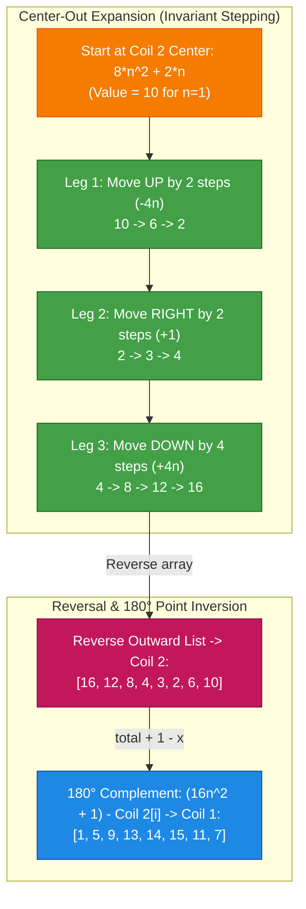
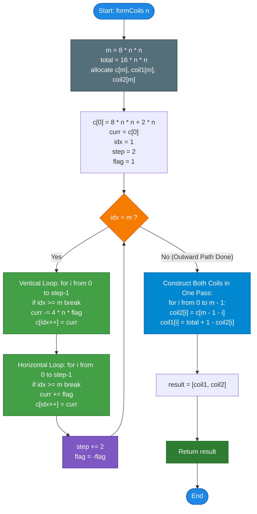

# GeeksforGeeks Problem of the Day: Form Coils in a Matrix

- **Problem Link:** [GeeksforGeeks - Form Coils in a Matrix](https://www.geeksforgeeks.org/problems/form-coils-in-a-matrix4724/1)
- **Difficulty:** Medium
- **Topic Tags:** Matrix, Simulation, Arrays, Mathematical Geometry, Symmetries, Spiral Traversal
- **Target Audience:** POTD Solvers, Computer Science Students, Competitive Programmers, Interview Preparation (FAANG/Tier-1 Tech)

---

## 1. Problem Statement

Given a positive integer $n$ representing the dimensions of a $(4n \times 4n)$ matrix containing integers from $1$ to $16n^2$ filled sequentially in row-major order:
$$\text{Matrix}[r][c] = r \times 4n + c + 1 \quad \text{for } 0 \le r, c < 4n$$

The matrix must be unrolled into **two interlocking spiral coils**:
1. **Coil 1:** Starts at the top-left corner $(0, 0)$ with value $\mathbf{1}$ and spirals inwards in a clockwise direction, terminating at the center cell $(2n - 1, 2n)$ (with value $8n^2 - 2n + 1$).
2. **Coil 2:** Starts at the bottom-right corner $(4n - 1, 4n - 1)$ with value $\mathbf{16n^2}$ and spirals inwards in a clockwise direction, terminating at the center cell $(2n, 2n - 1)$ (with value $8n^2 + 2n$).

Both coils must contain exactly $8n^2$ elements each, such that every integer from $1$ to $16n^2$ is partitioned into exactly one coil without any omissions or overlaps.

Return a 2D list/array containing both coils in order: `[coil1, coil2]`.

---

## 2. Examples & Explanations

### Example 1 ($n = 1$)
- **Input:** `n = 1`
- **Matrix Dimensions:** $4(1) \times 4(1) = 4 \times 4$
- **Total Elements:** $16(1)^2 = 16$
- **Elements per Coil:** $8(1)^2 = 8$

#### Matrix Layout ($4 \times 4$):
```text
       c = 0    c = 1    c = 2    c = 3
r = 0 +--------+--------+--------+--------+
      |    1   |    2   |    3   |    4   |
r = 1 +--------+--------+--------+--------+
      |    5   |    6   |    7   |    8   |
r = 2 +--------+--------+--------+--------+
      |    9   |   10   |   11   |   12   |
r = 3 +--------+--------+--------+--------+
      |   13   |   14   |   15   |   16   |
      +--------+--------+--------+--------+
```

#### Coils Formed:
- **`coil1`:** `[1, 5, 9, 13, 14, 15, 11, 7]`
- **`coil2`:** `[16, 12, 8, 4, 3, 2, 6, 10]`

#### Traversal Path Explanation:
- **Coil 1 (Starts at 1, coils inward):**
  - Moves DOWN: $1 \to 5 \to 9 \to 13$
  - Moves RIGHT: $13 \to 14 \to 15$
  - Moves UP: $15 \to 11$
  - Moves LEFT: $11 \to 7$ (Terminates at center 7)
  - Elements: `[1, 5, 9, 13, 14, 15, 11, 7]`
- **Coil 2 (Starts at 16, coils inward):**
  - Moves UP: $16 \to 12 \to 8 \to 4$
  - Moves LEFT: $4 \to 3 \to 2$
  - Moves DOWN: $2 \to 6$
  - Moves RIGHT: $6 \to 10$ (Terminates at center 10)
  - Elements: `[16, 12, 8, 4, 3, 2, 6, 10]`

---

### Example 2 ($n = 2$)
- **Input:** `n = 2`
- **Matrix Dimensions:** $8 \times 8$
- **Total Elements:** $16(2)^2 = 64$
- **Elements per Coil:** $8(2)^2 = 32$
- **Expected Output:**
  - **`coil1`:** `[1, 9, 17, 25, 33, 41, 49, 57, 58, 59, 60, 61, 62, 63, 55, 47, 39, 31, 23, 15, 14, 13, 12, 11, 19, 27, 35, 43, 44, 45, 37, 29]`
  - **`coil2`:** `[64, 56, 48, 40, 32, 24, 16, 8, 7, 6, 5, 4, 3, 2, 10, 18, 26, 34, 42, 50, 51, 52, 53, 54, 46, 38, 30, 22, 21, 20, 28, 36]`

---

## 3. Constraints

- $1 \le n \le 20$
- Total elements range from $16$ ($n=1$) up to $6,400$ ($n=20$).
- Value in matrix: $1 \le \text{Matrix}[r][c] \le 16n^2$.
- **Expected Time Complexity:** $\mathcal{O}(n^2)$
- **Expected Auxiliary Space:** $\mathcal{O}(n^2)$ (to store and return the two output coils of size $8n^2$ each).

---

## 4. Visual Architecture & Matrix Model

### The Reverse Invariant: Center-Out Traversal

Simulating inward-coiling spirals directly requires maintaining shrinking rectangular boundaries that contract at irregular intervals.

However, if we reverse the perspective and **spiral outward from the center**, the movement pattern becomes perfectly regular:
$$\text{Center-Out Sequence: } \text{UP } (2) \to \text{RIGHT } (2) \to \text{DOWN } (4) \to \text{LEFT } (4) \to \text{UP } (6) \to \text{RIGHT } (6) \dots$$



### The 180° Rotational Complement Theorem (The Pro Insight)

> **Theorem (Central Inversion):**  
> In a $4n \times 4n$ matrix with cells $0 \le r, c < 4n$, each cell $(r, c)$ has value:
> $$V(r, c) = r \times 4n + c + 1$$
> Its $180^\circ$ centrally symmetric counterpart cell is $(4n - 1 - r, \; 4n - 1 - c)$.  
> The value at this counterpart cell is:
> $$\begin{aligned}
> V(4n - 1 - r, 4n - 1 - c) &= (4n - 1 - r) \times 4n + (4n - 1 - c) + 1 \\
> &= 16n^2 - 4n - 4nr + 4n - 1 - c + 1 \\
> &= 16n^2 - (4nr + c) \\
> &= 16n^2 + 1 - (4nr + c + 1) \\
> &= \mathbf{(16n^2 + 1) - V(r, c)}
> \end{aligned}$$
>
> Because Coil 1 (starting at $1$) and Coil 2 (starting at $16n^2$) are exact $180^\circ$ rotational inverses of each other:
> $$\mathbf{\text{coil1}[i] = 16n^2 + 1 - \text{coil2}[i]}$$

---

## 5. Step-by-Step Simulation & Trace Table

Tracing $n = 1$ ($M = 8n^2 = 8$ elements per coil, Total values $= 16n^2 = 16$, Width $= 4n = 4$):
1. **Outward stepping array $c$** starts at $8(1)^2 + 2(1) = \mathbf{10}$:
   - $c[0] = 10$
   - Move UP $2$: $c[1] = 6, c[2] = 2$
   - Move RIGHT $2$: $c[3] = 3, c[4] = 4$
   - Move DOWN $3$: $c[5] = 8, c[6] = 12, c[7] = 16$
   - Outward array: $c = [10, 6, 2, 3, 4, 8, 12, 16]$.

2. **Reverse to get `coil2` and compute complement for `coil1`:**

| Final Index $i$ | Outward Element $c[M - 1 - i]$ | `coil2[i]` (Reversed $c$) | Complement Calculation: $17 - \text{coil2}[i]$ | `coil1[i]` |
| :---: | :---: | :---: | :---: | :---: |
| **0** | $c[7] = 16$ | **16** | $17 - 16$ | **1** |
| **1** | $c[6] = 12$ | **12** | $17 - 12$ | **5** |
| **2** | $c[5] = 8$ | **8** | $17 - 8$ | **9** |
| **3** | $c[4] = 4$ | **4** | $17 - 4$ | **13** |
| **4** | $c[3] = 3$ | **3** | $17 - 3$ | **14** |
| **5** | $c[2] = 2$ | **2** | $17 - 2$ | **15** |
| **6** | $c[1] = 6$ | **6** | $17 - 6$ | **11** |
| **7** | $c[0] = 10$ | **10** | $17 - 10$ | **7** |

### Output:
- **`coil1`:** `[1, 5, 9, 13, 14, 15, 11, 7]`
- **`coil2`:** `[16, 12, 8, 4, 3, 2, 6, 10]`

---

## 6. Algorithm Flowchart



---

## 7. From Naive to Pro: Algorithmic Progression

### Method 1: Naive (Full 2D Grid Allocation + Inward Coordinate Tracking)
- **Concept:** Construct a full $(4n \times 4n)$ matrix, fill it sequentially with $1 \dots 16n^2$, and trace the inward spiral paths from $(0, 0)$ and $(4n-1, 4n-1)$ by contracting boundaries.
- **Why it is suboptimal:**
  - Allocates a bulky $(4n \times 4n)$ 2D matrix on the heap.
  - Inward boundary contraction requires tracking top, bottom, left, and right limits separately for both spirals.
  - Highly error-prone coordinate arithmetic.
- **Pseudocode:**
```text
function formCoils_Naive(n):
    size = 4 * n
    matrix = 2D array of dimensions [size][size]
    val = 1
    for r from 0 to size - 1:
        for c from 0 to size - 1:
            matrix[r][c] = val++

    coil1 = [], coil2 = []
    // Simulate inward traversal with shrinking boundaries for coil 1
    // Simulate inward traversal with shrinking boundaries for coil 2
    return [coil1, coil2]
```

---

### Method 2: Better (Direct Inward Coordinate Stepping without 2D Matrix)
- **Concept:** Don't allocate the 2D grid. Calculate values directly using $r \times 4n + c + 1$.
- **Why it is still suboptimal:** Still requires shrinking boundary variables for both coils independently.

---

### Method 3: Pro Approach (Center-Outward Expanding Stepping + Reverse & 180° Complement)
- **The Core Strategy:**
  - Outward stepping from the center follows an exact, invariant arithmetic progression ($2, 2, 4, 4, 6, 6 \dots$).
  - One clean loop generates the outward sequence $c$ of length $8n^2$.
  - Reversing $c$ directly yields **Coil 2** (`coil2[i] = c[m - 1 - i]`).
  - Applying point inversion yields **Coil 1** (`coil1[i] = (16n^2 + 1) - coil2[i]`).
  - Zero matrix allocations, single outward traversal, $\mathcal{O}(n^2)$ time, and cache-friendly execution.
- **Pseudocode:**
```text
function formCoils_Optimal(n):
    m = 8 * n * n
    total = 16 * n * n
    c = array of size m
    
    c[0] = 8 * n * n + 2 * n
    curr = c[0]
    idx = 1
    step = 2
    flag = 1
    
    while idx < m:
        // Move vertically
        for i from 0 to step - 1:
            if idx >= m: break
            curr -= 4 * n * flag
            c[idx++] = curr
            
        // Move horizontally
        for i from 0 to step - 1:
            if idx >= m: break
            curr += flag
            c[idx++] = curr
            
        step += 2
        flag = -flag
        
    coil1 = array of size m
    coil2 = array of size m
    for i from 0 to m - 1:
        coil2[i] = c[m - 1 - i]
        coil1[i] = total + 1 - coil2[i]
        
    return [coil1, coil2]
```

---

## 8. Complexity Comparison Table

| Metric | Method 1: Naive (2D Grid) | Method 2: Inward Stepping | Method 3: Pro (Center-Out + Complement) |
| :--- | :--- | :--- | :--- |
| **Time Complexity** | $\mathcal{O}(n^2)$ | $\mathcal{O}(n^2)$ | $\mathbf{\mathcal{O}(n^2)}$ (Fastest constant factor) |
| **Auxiliary Grid Space** | $\mathcal{O}(n^2)$ ($4n \times 4n$ matrix) | $\mathcal{O}(1)$ (No matrix created) | $\mathbf{\mathcal{O}(1)}$ (No matrix created) |
| **Output Space** | $\mathcal{O}(n^2)$ ($2 \times 8n^2$ items) | $\mathcal{O}(n^2)$ | $\mathbf{\mathcal{O}(n^2)}$ |
| **Directional Passes** | 2 Full Passes | 2 Full Passes | **1 Pass (Center-out expansion only)** |
| **Memory Footprint** | Heavy (2D array allocations) | Moderate | **Minimal & Cache-Friendly** |
| **Interview Verdict** | Brute force; memory waste | Complex boundary checks | **Gold Standard (Clean & Elegant)** |

---

## 9. Comprehensive Corner Cases Handled

1. **Smallest Valid Grid ($n = 1$):**
   - Matrix size is $4 \times 4 = 16$.
   - Outward expansion collects $8$ elements and safely breaks out on `idx >= m`.
   - Output perfectly matches `[[1, 5, 9, 13, 14, 15, 11, 7], [16, 12, 8, 4, 3, 2, 6, 10]]`.
2. **Maximum Constraints ($n = 20$):**
   - Total elements $16(20)^2 = 6,400$.
   - Fits easily inside standard 32-bit integer limits without overflow.
3. **Partition Completeness & Zero Collision:**
   - Because $180^\circ$ point reflection is a bijection on the matrix elements, each element in $[1, 16n^2]$ appears in exactly one coil.
4. **Step Overshoot Protection:**
   - Inner loops verify `idx < m` at every single addition, ensuring exact collection of $8n^2$ elements without buffer overrun.

---

## 10. Complete Multi-Language Implementations

### Java (21)

```java
import java.util.ArrayList;

class Solution {
    public ArrayList<ArrayList<Integer>> formCoils(int n) {
        int m = 8 * n * n;
        int total = 16 * n * n;
        
        ArrayList<Integer> coil1 = new ArrayList<>(m);
        ArrayList<Integer> coil2 = new ArrayList<>(m);
        
        // c collects elements spiraling outward from the center (8*n*n + 2*n)
        int[] c = new int[m];
        c[0] = 8 * n * n + 2 * n;
        
        int curr = c[0];
        int idx = 1;
        int step = 2;
        int flag = 1;
        
        // Perform outward spiral expansion
        while (idx < m) {
            // Move vertically (UP when flag=1, DOWN when flag=-1)
            for (int i = 0; i < step && idx < m; i++) {
                curr -= 4 * n * flag;
                c[idx++] = curr;
            }
            // Move horizontally (RIGHT when flag=1, LEFT when flag=-1)
            for (int i = 0; i < step && idx < m; i++) {
                curr += flag;
                c[idx++] = curr;
            }
            step += 2;
            flag = -flag;
        }
        
        // Reversing c gives Coil 2 (starting at 16n^2 down to center)
        // Complement (total + 1 - coil2[i]) gives Coil 1 (starting at 1 up to center)
        for (int i = 0; i < m; i++) {
            int val2 = c[m - 1 - i];
            int val1 = total + 1 - val2;
            coil1.add(val1);
            coil2.add(val2);
        }
        
        ArrayList<ArrayList<Integer>> result = new ArrayList<>();
        result.add(coil1);
        result.add(coil2);
        return result;
    }
}
```

---

### Python3

```python
class Solution:
    def formCoils(self, n: int) -> list[list[int]]:
        m = 8 * n * n
        total = 16 * n * n
        c = [0] * m
        
        # Start at center of Coil 2 and spiral outward
        c[0] = 8 * n * n + 2 * n
        curr = c[0]
        idx = 1
        step = 2
        flag = 1
        
        # Outward expansion
        while idx < m:
            # Move vertically: UP if flag == 1, DOWN if flag == -1
            for _ in range(step):
                if idx >= m:
                    break
                curr -= 4 * n * flag
                c[idx] = curr
                idx += 1
                
            # Move horizontally: RIGHT if flag == 1, LEFT if flag == -1
            for _ in range(step):
                if idx >= m:
                    break
                curr += flag
                c[idx] = curr
                idx += 1
                
            step += 2
            flag = -flag
            
        coil1 = [0] * m
        coil2 = [0] * m
        
        # Coil 2 is the reversed outward traversal
        # Coil 1 is the 180-degree rotational complement
        for i in range(m):
            coil2[i] = c[m - 1 - i]
            coil1[i] = total + 1 - coil2[i]
            
        return [coil1, coil2]
```

---

### C++ (17)

```cpp
#include <vector>

using namespace std;

class Solution {
  public:
    vector<vector<int>> formCoils(int n) {
        int m = 8 * n * n;
        int total = 16 * n * n;
        
        vector<int> c(m);
        c[0] = 8 * n * n + 2 * n;
        
        int curr = c[0];
        int idx = 1;
        int step = 2;
        int flag = 1;
        
        // Outward spiral expansion from the center
        while (idx < m) {
            // Move vertically (UP / DOWN)
            for (int i = 0; i < step && idx < m; ++i) {
                curr -= 4 * n * flag;
                c[idx++] = curr;
            }
            // Move horizontally (RIGHT / LEFT)
            for (int i = 0; i < step && idx < m; ++i) {
                curr += flag;
                c[idx++] = curr;
            }
            step += 2;
            flag = -flag;
        }
        
        vector<int> coil1(m);
        vector<int> coil2(m);
        
        // Coil 2 is reversed c; Coil 1 is the 180-degree complement
        for (int i = 0; i < m; ++i) {
            coil2[i] = c[m - 1 - i];
            coil1[i] = total + 1 - coil2[i];
        }
        
        return {coil1, coil2};
    }
};
```

---

### C#

```csharp
using System;
using System.Collections.Generic;

class Solution {
    public List<List<int>> formCoils(int n) {
        int m = 8 * n * n;
        int total = 16 * n * n;
        
        int[] c = new int[m];
        c[0] = 8 * n * n + 2 * n;
        
        int curr = c[0];
        int idx = 1;
        int step = 2;
        int flag = 1;
        
        // Outward spiral expansion from center
        while (idx < m) {
            // Move vertically
            for (int i = 0; i < step && idx < m; i++) {
                curr -= 4 * n * flag;
                c[idx++] = curr;
            }
            // Move horizontally
            for (int i = 0; i < step && idx < m; i++) {
                curr += flag;
                c[idx++] = curr;
            }
            step += 2;
            flag = -flag;
        }
        
        List<int> coil1 = new List<int>(m);
        List<int> coil2 = new List<int>(m);
        
        // Construct Coil 2 (reversed) and Coil 1 (complement)
        for (int i = 0; i < m; i++) {
            int val2 = c[m - 1 - i];
            int val1 = total + 1 - val2;
            coil1.Add(val1);
            coil2.Add(val2);
        }
        
        return new List<List<int>> { coil1, coil2 };
    }
}
```

---

### Javascript (Node v22)

```javascript
/**
 * @param {number} n
 * @returns {number[][]}
 */
class Solution {
    formCoils(n) {
        const m = 8 * n * n;
        const total = 16 * n * n;
        
        const c = new Array(m);
        c[0] = 8 * n * n + 2 * n;
        
        let curr = c[0];
        let idx = 1;
        let step = 2;
        let flag = 1;
        
        // Outward spiral expansion from center
        while (idx < m) {
            // Move vertically
            for (let i = 0; i < step && idx < m; i++) {
                curr -= 4 * n * flag;
                c[idx++] = curr;
            }
            // Move horizontally
            for (let i = 0; i < step && idx < m; i++) {
                curr += flag;
                c[idx++] = curr;
            }
            step += 2;
            flag = -flag;
        }
        
        const coil1 = new Array(m);
        const coil2 = new Array(m);
        
        // Coil 2 is the reversed outward traversal (starts at 16n^2 down to center)
        // Coil 1 is the 180-degree rotational complement (starts at 1 up to center)
        for (let i = 0; i < m; i++) {
            coil2[i] = c[m - 1 - i];
            coil1[i] = total + 1 - coil2[i];
        }
        
        return [coil1, coil2];
    }
}
```