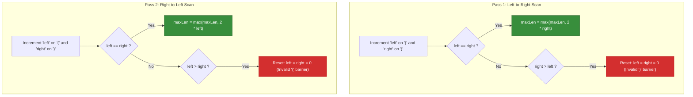
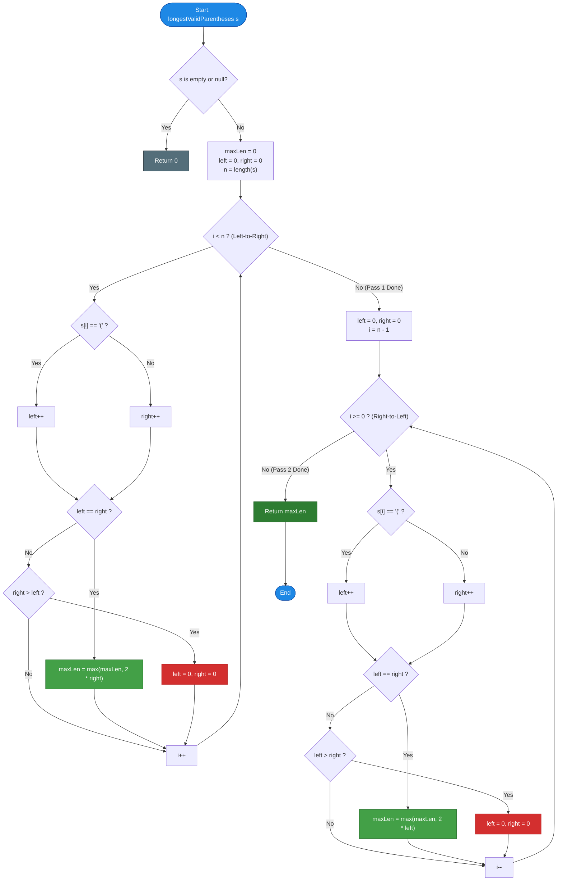

# LeetCode Problem of the Day: Longest Valid Parentheses

- **Problem Link:** [LeetCode 32 - Longest Valid Parentheses](https://leetcode.com/problems/longest-valid-parentheses/)
- **Difficulty:** Hard
- **Topic Tags:** String, Dynamic Programming, Stack, Two Pointers, Greedy
- **Target Audience:** POTD Solvers, Computer Science Students, Competitive Programmers, Interview Preparation (FAANG/Tier-1 Tech)

---

## 1. Problem Statement

Given a string `s` containing just the characters `'('` and `')'`, return the length of the **longest valid (well-formed) parentheses contiguous substring**.

A substring is valid if:
1. Every opening bracket `'('` has a corresponding closing bracket `')'`.
2. Brackets are closed in the correct order.
3. The characters form a **contiguous** sequence within the original string.

---

## 2. Examples & Explanations

### Example 1
- **Input:** `s = "(()"`
- **Output:** `2`
- **Explanation:** The longest valid parentheses substring is `"()"` spanning indices $[1, 2]$. The initial `'('` at index $0$ remains unmatched.

### Example 2
- **Input:** `s = ")()())"`
- **Output:** `4`
- **Explanation:** The longest valid parentheses substring is `"()()"` spanning indices $[1, 4]$. The prefix `')'` at index $0$ and suffix `')'` at index $5$ break continuity.

### Example 3
- **Input:** `s = ""`
- **Output:** `0`
- **Explanation:** An empty string contains no parentheses, so the maximum length is `0`.

### Example 4
- **Input:** `s = "()(()"`
- **Output:** `2`
- **Explanation:** The valid substrings are `"()"` at indices $[0, 1]$ and `"()"` at indices $[3, 4]$. The maximum length is `2`.

---

## 3. Constraints

- $0 \le |s| \le 3 \times 10^4$
- `s[i]` is either `'('` or `')'`.
- **Expected Time Complexity:** $\mathcal{O}(N)$
- **Expected Auxiliary Space:** $\mathcal{O}(1)$ optimal (or $\mathcal{O}(N)$ via Stack/DP)

---

## 4. Visual Architecture & The Two-Pass Symmetry Model

### Why a Single Direction Fails
Consider `s = "(()"`:
- Scanning **Left-to-Right**:
  - Index 0 `'('`: `left = 1, right = 0`
  - Index 1 `'('`: `left = 2, right = 0`
  - Index 2 `')'`: `left = 2, right = 1`
  - Because `left > right`, the condition `left == right` is never triggered! The valid substring `"()"` of length 2 is never detected.

### The Two-Pass Solution
To achieve $\mathcal{O}(1)$ auxiliary space without a stack:
1. **Pass 1 (Left-to-Right):** Detects valid balanced substrings where closing brackets balance opening brackets. If at any point `right > left`, we have an excess `')'`, which can **never** be part of a valid substring starting before or at that point $\implies$ Reset `left = right = 0`.
2. **Pass 2 (Right-to-Left):** Catches cases where opening brackets exceed closing brackets (like `"(()"`). Scanning in reverse, `'('` becomes the terminating excess character when `left > right` $\implies$ Reset `left = right = 0`.



---

## 5. Step-by-Step Simulation & Trace Table

### Trace of Example 2: `s = ")()())"` (Length $N = 6$)

#### Pass 1: Left-to-Right Scan
| Index $i$ | Char `s[i]` | `left` | `right` | Condition Met | Action / Update | `maxLen` |
| :---: | :---: | :---: | :---: | :---: | :--- | :---: |
| **0** | `')'` | 0 | 1 | `right > left` | Unmatched `')'` barrier! Reset `left = right = 0` | 0 |
| **1** | `'('` | 1 | 0 | `left > right` | Continue | 0 |
| **2** | `')'` | 1 | 1 | `left == right` | Balanced! `maxLen = max(0, 2*1) = 2` | **2** |
| **3** | `'('` | 2 | 1 | `left > right` | Continue | 2 |
| **4** | `')'` | 2 | 2 | `left == right` | Balanced! `maxLen = max(2, 2*2) = 4` | **4** |
| **5** | `')'` | 2 | 3 | `right > left` | Unmatched `')'` barrier! Reset `left = right = 0` | 4 |

#### Pass 2: Right-to-Left Scan
| Index $i$ | Char `s[i]` | `left` | `right` | Condition Met | Action / Update | `maxLen` |
| :---: | :---: | :---: | :---: | :---: | :--- | :---: |
| **5** | `')'` | 0 | 1 | `right > left` | Continue | 4 |
| **4** | `')'` | 0 | 2 | `right > left` | Continue | 4 |
| **3** | `'('` | 1 | 2 | `right > left` | Continue | 4 |
| **2** | `')'` | 1 | 3 | `right > left` | Continue | 4 |
| **1** | `'('` | 2 | 3 | `right > left` | Continue | 4 |
| **0** | `')'` | 2 | 4 | `right > left` | Continue | 4 |

**Final Result:** `maxLen = 4`.

---

## 6. Algorithm Flowchart



---

## 7. From Naive to Pro: Algorithmic Progression

### Method 1: Brute Force Checking All Substrings
- **Concept:** Check every possible even-length substring $s[i \dots j]$. Verify whether the substring is valid using a stack or counter.
- **Why it is suboptimal:**
  - $\mathcal{O}(N^2)$ substrings, and each check takes $\mathcal{O}(N)$ time.
  - Overall time: $\mathcal{O}(N^3)$ (or $\mathcal{O}(N^2)$ if validated incrementally). For $N = 30,000$, $N^2 \approx 9 \times 10^8$ operations $\implies$ **Time Limit Exceeded (TLE)**.
- **Pseudocode:**
```text
function longestValidParentheses_Brute(s):
    max_len = 0
    for i from 0 to len(s) - 1:
        for j from i + 2 to len(s) step 2:
            if isValid(s[i...j-1]):
                max_len = max(max_len, j - i)
    return max_len
```

---

### Method 2: Dynamic Programming Array
- **Concept:** Let `dp[i]` be the length of the longest valid substring ending at index `i`.
  - If `s[i] == '('`: `dp[i] = 0` (no valid substring can end with `'('`).
  - If `s[i] == ')'`:
    - Sub-case A: `s[i-1] == '('` $\implies dp[i] = dp[i-2] + 2$
    - Sub-case B: `s[i-1] == ')'` and `s[i - dp[i-1] - 1] == '('`:
      $$dp[i] = dp[i-1] + 2 + dp[i - dp[i-1] - 2]$$
- **Time Complexity:** $\mathcal{O}(N)$
- **Space Complexity:** $\mathcal{O}(N)$ for DP table.
- **Pseudocode:**
```text
function longestValidParentheses_DP(s):
    n = len(s)
    dp = array of size n filled with 0
    max_len = 0
    for i from 1 to n - 1:
        if s[i] == ')':
            if s[i - 1] == '(':
                dp[i] = (dp[i - 2] if i >= 2 else 0) + 2
            else if i - dp[i - 1] > 0 and s[i - dp[i - 1] - 1] == '(':
                prev = dp[i - dp[i - 1] - 2] if i - dp[i - 1] >= 2 else 0
                dp[i] = dp[i - 1] + 2 + prev
            max_len = max(max_len, dp[i])
    return max_len
```

---

### Method 3: Stack of Indices
- **Concept:** Store **indices** in the stack instead of characters. Initialize stack with `-1` as the base boundary.
  - When encountering `'('`: push index $i$.
  - When encountering `')'`: pop the top.
    - If stack is empty: push $i$ as the new boundary base.
    - If stack is not empty: `current_len = i - stack.top()`, update `max_len`.
- **Time Complexity:** $\mathcal{O}(N)$
- **Space Complexity:** $\mathcal{O}(N)$ for stack.
- **Pseudocode:**
```text
function longestValidParentheses_Stack(s):
    stack = [-1]
    max_len = 0
    for i from 0 to len(s) - 1:
        if s[i] == '(':
            stack.push(i)
        else:
            stack.pop()
            if stack.is_empty():
                stack.push(i)
            else:
                max_len = max(max_len, i - stack.top())
    return max_len
```

---

### Method 4: Pro Approach — Two-Pass Constant Space Scan ($\mathcal{O}(1)$ Space)
- **The Core Strategy:**
  - Track `left` and `right` bracket counts in two symmetric passes:
    1. **Left-to-Right:** Resets when `right > left` (excess `')'`).
    2. **Right-to-Left:** Resets when `left > right` (excess `'('`).
  - No stack, no DP array, zero heap allocations, pure $\mathcal{O}(1)$ memory.
  - Runs in $\mathcal{O}(N)$ time with minimal cache overhead.
- **Pseudocode:**
```text
function longestValidParentheses_Optimal(s):
    max_len = 0
    left = 0, right = 0
    
    // Pass 1: Left-to-Right
    for i from 0 to len(s) - 1:
        if s[i] == '(': left++
        else: right++
        if left == right:
            max_len = max(max_len, 2 * right)
        else if right > left:
            left = right = 0
            
    // Pass 2: Right-to-Left
    left = 0, right = 0
    for i from len(s) - 1 down to 0:
        if s[i] == '(': left++
        else: right++
        if left == right:
            max_len = max(max_len, 2 * left)
        else if left > right:
            left = right = 0
            
    return max_len
```

---

## 8. Complexity Comparison Table

| Metric | Method 1: Brute Force | Method 2: Dynamic Programming | Method 3: Index Stack | Method 4: Two-Pass Scan (Pro) |
| :--- | :--- | :--- | :--- | :--- |
| **Time Complexity** | $\mathcal{O}(N^3)$ | $\mathcal{O}(N)$ | $\mathcal{O}(N)$ | $\mathbf{\mathcal{O}(N)}$ (2 passes) |
| **Auxiliary Space** | $\mathcal{O}(1)$ | $\mathcal{O}(N)$ | $\mathcal{O}(N)$ | $\mathbf{\mathcal{O}(1)}$ (No heap/stack allocations) |
| **Memory Overhead** | Minimal | $30\text{k} \times 4\text{B} \approx 120\text{ KB}$ | $30\text{k} \times 4\text{B} \approx 120\text{ KB}$ | **$\approx 8$ bytes (2 integer counters)** |
| **Implementation** | Trivial | Complex index boundary math | Clean | **Very Clean & Symmetric** |
| **Interview Verdict** | TLE ($9 \times 10^8$ ops) | Good | Standard accepted | **Optimal / Gold Standard** |

---

## 9. Comprehensive Corner Cases Handled

1. **Empty String (`""`):** Handled immediately; returns `0`.
2. **Single Character (`"("` or `")"`):** Neither pass triggers `left == right`; returns `0`.
3. **All Opening Parentheses (`"(((((("`):** Left-to-right triggers `left > right`; right-to-left resets immediately on `left > right`; returns `0`.
4. **All Closing Parentheses (`"))))))"`):** Left-to-right resets on `right > left`; right-to-left never triggers `left == right`; returns `0`.
5. **Disconnected Valid Blocks (`"()(())"`):** Correctly tracks the continuous block of length $6$.
6. **Trailing / Leading Unmatched Brackets (`")()()("`):** Prefix `')'` resets at index 0; suffix `'('` is caught and discarded by Pass 2; returns `4`.

---

## 10. Complete Multi-Language Implementations

### Java

```java
class Solution {
    public int longestValidParentheses(String s) {
        int maxLen = 0;
        int left = 0, right = 0;
        int n = s.length();

        // Pass 1: Scan Left-to-Right
        for (int i = 0; i < n; i++) {
            if (s.charAt(i) == '(') {
                left++;
            } else {
                right++;
            }

            if (left == right) {
                maxLen = Math.max(maxLen, 2 * right);
            } else if (right > left) {
                left = right = 0; // Reset upon unmatched ')'
            }
        }

        // Pass 2: Scan Right-to-Left
        left = right = 0;
        for (int i = n - 1; i >= 0; i--) {
            if (s.charAt(i) == '(') {
                left++;
            } else {
                right++;
            }

            if (left == right) {
                maxLen = Math.max(maxLen, 2 * left);
            } else if (left > right) {
                left = right = 0; // Reset upon unmatched '('
            }
        }

        return maxLen;
    }
}
```

---

### Python3

```python
class Solution:
    def longestValidParentheses(self, s: str) -> int:
        max_len = 0
        left = right = 0

        # Pass 1: Scan Left-to-Right
        for ch in s:
            if ch == "(":
                left += 1
            else:
                right += 1

            if left == right:
                max_len = max(max_len, 2 * right)
            elif right > left:
                left = right = 0  # Reset upon unmatched ')'

        # Pass 2: Scan Right-to-Left
        left = right = 0
        for ch in reversed(s):
            if ch == "(":
                left += 1
            else:
                right += 1

            if left == right:
                max_len = max(max_len, 2 * left)
            elif left > right:
                left = right = 0  # Reset upon unmatched '('

        return max_len
```

---

### C

```c
#include <string.h>

int longestValidParentheses(char* s) {
    if (!s || !*s) return 0;

    int maxLen = 0;
    int left = 0, right = 0;
    int n = strlen(s);

    // Pass 1: Scan Left-to-Right
    for (int i = 0; i < n; i++) {
        if (s[i] == '(') {
            left++;
        } else {
            right++;
        }

        if (left == right) {
            int len = 2 * right;
            if (len > maxLen) maxLen = len;
        } else if (right > left) {
            left = right = 0; // Reset upon unmatched ')'
        }
    }

    // Pass 2: Scan Right-to-Left
    left = right = 0;
    for (int i = n - 1; i >= 0; i--) {
        if (s[i] == '(') {
            left++;
        } else {
            right++;
        }

        if (left == right) {
            int len = 2 * left;
            if (len > maxLen) maxLen = len;
        } else if (left > right) {
            left = right = 0; // Reset upon unmatched '('
        }
    }

    return maxLen;
}
```

---

### C++

```cpp
#include <string>
#include <algorithm>

using namespace std;

class Solution {
public:
    int longestValidParentheses(string s) {
        int maxLen = 0;
        int left = 0, right = 0;
        int n = s.length();

        // Pass 1: Scan Left-to-Right
        for (int i = 0; i < n; ++i) {
            if (s[i] == '(') {
                left++;
            } else {
                right++;
            }

            if (left == right) {
                maxLen = max(maxLen, 2 * right);
            } else if (right > left) {
                left = right = 0; // Reset upon unmatched ')'
            }
        }

        // Pass 2: Scan Right-to-Left
        left = right = 0;
        for (int i = n - 1; i >= 0; --i) {
            if (s[i] == '(') {
                left++;
            } else {
                right++;
            }

            if (left == right) {
                maxLen = max(maxLen, 2 * left);
            } else if (left > right) {
                left = right = 0; // Reset upon unmatched '('
            }
        }

        return maxLen;
    }
};
```

---

### C#

```csharp
using System;

public class Solution {
    public int LongestValidParentheses(string s) {
        int maxLen = 0;
        int left = 0, right = 0;
        int n = s.Length;

        // Pass 1: Scan Left-to-Right
        for (int i = 0; i < n; i++) {
            if (s[i] == '(') {
                left++;
            } else {
                right++;
            }

            if (left == right) {
                maxLen = Math.Max(maxLen, 2 * right);
            } else if (right > left) {
                left = right = 0; // Reset upon unmatched ')'
            }
        }

        // Pass 2: Scan Right-to-Left
        left = right = 0;
        for (int i = n - 1; i >= 0; i--) {
            if (s[i] == '(') {
                left++;
            } else {
                right++;
            }

            if (left == right) {
                maxLen = Math.Max(maxLen, 2 * left);
            } else if (left > right) {
                left = right = 0; // Reset upon unmatched '('
            }
        }

        return maxLen;
    }
}
```

---

### Javascript

```javascript
/**
 * @param {string} s
 * @return {number}
 */
var longestValidParentheses = function(s) {
    let maxLen = 0;
    let left = 0, right = 0;
    const n = s.length;

    // Pass 1: Scan Left-to-Right
    for (let i = 0; i < n; i++) {
        if (s[i] === '(') {
            left++;
        } else {
            right++;
        }

        if (left === right) {
            maxLen = Math.max(maxLen, 2 * right);
        } else if (right > left) {
            left = right = 0; // Reset upon unmatched ')'
        }
    }

    // Pass 2: Scan Right-to-Left
    left = right = 0;
    for (let i = n - 1; i >= 0; i--) {
        if (s[i] === '(') {
            left++;
        } else {
            right++;
        }

        if (left === right) {
            maxLen = Math.max(maxLen, 2 * left);
        } else if (left > right) {
            left = right = 0; // Reset upon unmatched '('
        }
    }

    return maxLen;
};
```

---

### Typescript

```typescript
function longestValidParentheses(s: string): number {
    let maxLen = 0;
    let left = 0;
    let right = 0;
    const n = s.length;

    // Pass 1: Scan Left-to-Right
    for (let i = 0; i < n; i++) {
        if (s[i] === '(') {
            left++;
        } else {
            right++;
        }

        if (left === right) {
            maxLen = Math.max(maxLen, 2 * right);
        } else if (right > left) {
            left = right = 0; // Reset upon unmatched ')'
        }
    }

    // Pass 2: Scan Right-to-Left
    left = right = 0;
    for (let i = n - 1; i >= 0; i--) {
        if (s[i] === '(') {
            left++;
        } else {
            right++;
        }

        if (left === right) {
            maxLen = Math.max(maxLen, 2 * left);
        } else if (left > right) {
            left = right = 0; // Reset upon unmatched '('
        }
    }

    return maxLen;
}
```