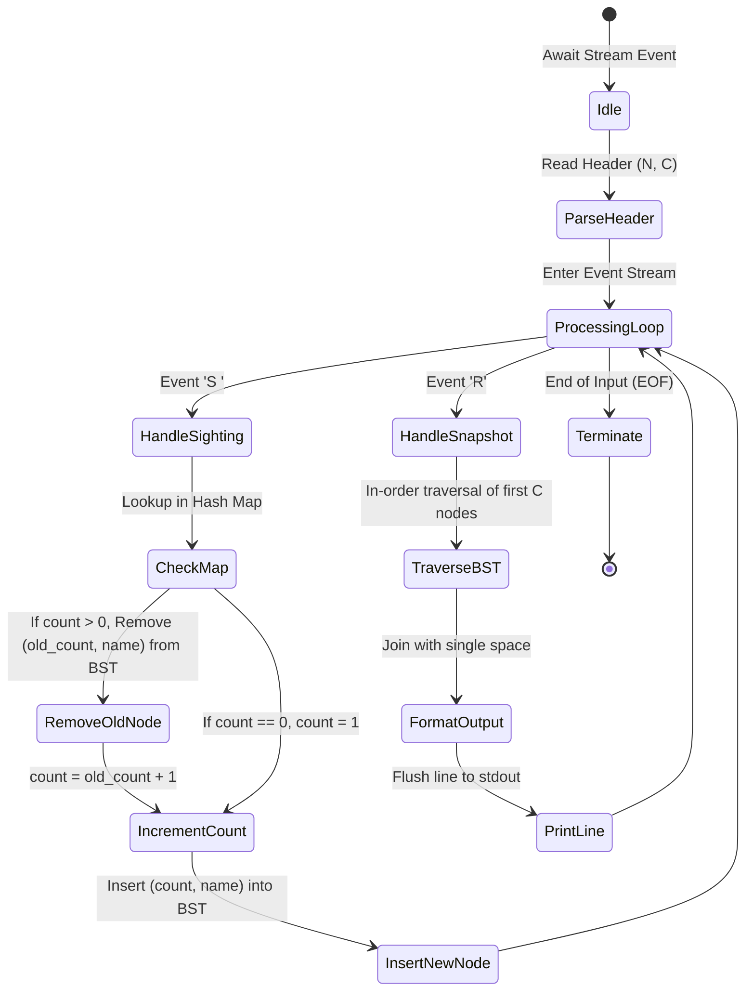
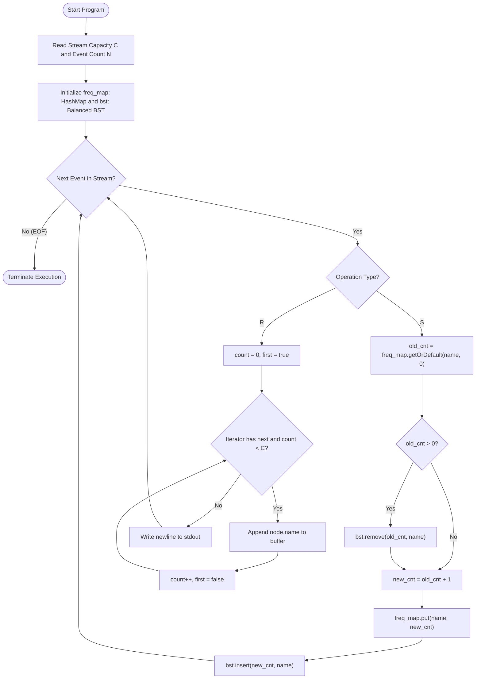

# Unstop Problem of the Day: Canopy Frequency Watch (Live Species Leaderboard Stream)

- **Platform:** [Unstop](https://unstop.com/)
- **Difficulty:** Medium
- **Topic Tags:** Hash Map, Balanced Binary Search Tree (BST), TreeSet / std::set, Treap, Priority Queue, Streaming Top-K, Dynamic Order Statistics
- **Target Audience:** POTD Solvers, Computer Science Students, Competitive Programmers, Interview Preparation (FAANG / Tier-1 Systems Engineering)

---

## 1. Problem Statement

Field ecologists and conservation biologists are monitoring a biodiverse tropical rainforest canopy using an array of automated bioacoustic sensors and smart camera traps. The monitoring station receives a live, high-throughput stream of real-time telemetry events.

The stream consists of two distinct types of telemetry events:
1. **Sighting Event (`S <species_name>`):**  
   A sensor detects an occurrence of a particular wildlife species identified by the string `<species_name>`. The cumulative detection count (frequency) for that species increases by $1$. If the species is detected for the very first time, its initial count becomes $1$.

2. **Snapshot Request (`R`):**  
   The field research team requests an instantaneous leaderboard snapshot of the **top $C$ most frequent species** observed up to that exact moment in the stream.

### Ranking & Tie-Breaking Criteria
When generating the snapshot for request `R`:
- **Primary Sort Key:** Higher cumulative frequency comes first (**descending order** of sightings count).
- **Secondary Sort Key (Tie-Breaker):** If two or more species share the exact same frequency, they must be ranked in **alphabetical / lexicographical ascending order** (e.g., `"ant"` precedes `"bat"` precedes `"cat"`).

### Output Specifications
- For each `R` event, output the names of the top $\min(C, U)$ species (where $U$ is the number of distinct species observed so far) separated by a single space on its own line.
- If fewer than $C$ unique species have been sighted, output all distinct species currently recorded.
- If no species have been observed prior to an `R` query, output an empty line.

---

## 2. Examples & Explanations

### Example 1 (Standard Telemetry Stream with Capacity $C = 2$)

**Input:**
```text
8 2
S dog
S cat
S bat
S cat
R
S dog
S dog
R
```

**Output:**
```text
cat bat
dog cat
```

**Chronological Walkthrough:**
1. `S dog`: Species `"dog"` count becomes $1$. Unique species: `{"dog": 1}`.
2. `S cat`: Species `"cat"` count becomes $1$. Unique species: `{"dog": 1, "cat": 1}`.
3. `S bat`: Species `"bat"` count becomes $1$. Unique species: `{"dog": 1, "cat": 1, "bat": 1}`.
4. `S cat`: Species `"cat"` count increments from $1 \to 2$. Unique species: `{"cat": 2, "dog": 1, "bat": 1}`.
5. **Snapshot Request `R`:**
   - Full ranking:
     1. `"cat"` (Count: $2$)
     2. `"bat"` (Count: $1$ — ties with `"dog"`, `"bat" < "dog"` alphabetically)
     3. `"dog"` (Count: $1$)
   - Capacity $C = 2 \implies$ Top 2 species: **`cat bat`**.
6. `S dog`: Species `"dog"` count increments from $1 \to 2$. Unique species: `{"cat": 2, "dog": 2, "bat": 1}`.
7. `S dog`: Species `"dog"` count increments from $2 \to 3$. Unique species: `{"dog": 3, "cat": 2, "bat": 1}`.
8. **Snapshot Request `R`:**
   - Full ranking:
     1. `"dog"` (Count: $3$)
     2. `"cat"` (Count: $2$)
     3. `"bat"` (Count: $1$)
   - Capacity $C = 2 \implies$ Top 2 species: **`dog cat`**.

---

### Example 2 (Fewer Species Than Capacity $C$)

**Input:**
```text
4 5
S jaguar
S toucan
S jaguar
R
```

**Output:**
```text
jaguar toucan
```

**Explanation:**
- Distinct species recorded: `"jaguar"` ($2$), `"toucan"` ($1$).
- Requested capacity $C = 5$, but only $2$ unique species exist.
- The snapshot outputs all qualifying species: **`jaguar toucan`**.

---

### Example 3 (Equal Frequencies & Strict Alphabetical Tie-Breaking)

**Input:**
```text
4 3
S zebra
S ant
S monkey
R
```

**Output:**
```text
ant monkey zebra
```

**Explanation:**
- All three species have an equal frequency of $1$.
- Sorted alphabetically: `"ant"` ($1$) $\to$ `"monkey"` ($1$) $\to$ `"zebra"` ($1$).
- Top $C = 3$ output: **`ant monkey zebra`**.

---

## 3. Constraints & System Specifications

- $1 \le N \le 2 \times 10^5$ (Total number of stream telemetry operations)
- $1 \le C \le 10^5$ (Snapshot leaderboard capacity; typical query limits $C \le 10$, but algorithms must scale to large $C$)
- $1 \le \text{length of } \langle\text{species\_name}\rangle \le 30$ (Alphanumeric strings without spaces)
- Total number of distinct species $U \le N$
- Time Limit: $2.0$ seconds
- Space Limit: $256$ MB

---

## 4. Visual Architecture & Dynamic State Diagram

To achieve real-time streaming throughput, we maintain a dual data structure:
1. **Hash Map (`freq_map`):** Maps each species name to its current frequency in $\mathcal{O}(1)$ average time.
2. **Balanced BST / Ordered Set (`bst`):** Stores tuples of `(count, species_name)` sorted by `(-count, species_name)`.

```
========================================================================================
                          LIVE STREAMING DUAL-INDEX ARCHITECTURE
========================================================================================

                 [ Telemetry Event: S cat ]
                             │
                             ▼
  ┌────────────────────────────────────────────────────────┐
  │ 1. Hash Map Lookup: freq_map["cat"] = 1                │
  └──────────────────────────┬─────────────────────────────┘
                             │
            ┌────────────────┴────────────────┐
            ▼                                 ▼
┌───────────────────────┐         ┌───────────────────────────────────┐
│ 2. BST Deletion:      │         │ 3. Increment Frequency:           │
│ Remove (1, "cat")     │         │ freq_map["cat"] = 2               │
│ Cost: O(log U)        │         └─────────────────┬─────────────────┘
└───────────────────────┘                           │
                                                    ▼
                                  ┌───────────────────────────────────┐
                                  │ 4. BST Insertion:                 │
                                  │ Insert (2, "cat")                 │
                                  │ Cost: O(log U)                    │
                                  └─────────────────┬─────────────────┘
                                                    │
                                                    ▼
             BALANCED BST ORDERED TOPOLOGY: (-count, name_asc)
                             
                                 ┌───────────────┐
                                 │   (2, cat)    │  ◄── Rank 1
                                 └───┬───────┬───┘
                                     │       │
                                     ▼       ▼
                             ┌───────────┐ ┌───────────┐
                             │ (1, bat)  │ │ (1, dog)  │  ◄── Ranks 2 & 3
                             └───────────┘ └───────────┘

  [ Query R (C = 2) ] ───► In-order scan first C items ───► Output: "cat bat"
========================================================================================
```

### State Machine Lifecycle



---

## 5. Step-by-Step Simulation & Detailed Trace Table

Trace for input: `C = 2`, operations: `S dog`, `S cat`, `S bat`, `S cat`, `R`, `S dog`, `S dog`, `R`.

| Step | Operation | Old Count | New Count | Action on Balanced BST | BST State (In-Order: Rank 1, Rank 2, ...) | Output Generated |
| :---: | :---: | :---: | :---: | :--- | :--- | :---: |
| **1** | `S dog` | $0$ | $1$ | Insert `(1, "dog")` | `[(1, "dog")]` | — |
| **2** | `S cat` | $0$ | $1$ | Insert `(1, "cat")` | `[(1, "cat"), (1, "dog")]` | — |
| **3** | `S bat` | $0$ | $1$ | Insert `(1, "bat")` | `[(1, "bat"), (1, "cat"), (1, "dog")]` | — |
| **4** | `S cat` | $1$ | $2$ | Remove `(1, "cat")`, Insert `(2, "cat")` | `[(2, "cat"), (1, "bat"), (1, "dog")]` | — |
| **5** | **`R`** | — | — | Traverse first $C = 2$ elements | `[(2, "cat"), (1, "bat")]` | **`cat bat`** |
| **6** | `S dog` | $1$ | $2$ | Remove `(1, "dog")`, Insert `(2, "dog")` | `[(2, "cat"), (2, "dog"), (1, "bat")]` | — |
| **7** | `S dog` | $2$ | $3$ | Remove `(2, "dog")`, Insert `(3, "dog")` | `[(3, "dog"), (2, "cat"), (1, "bat")]` | — |
| **8** | **`R`** | — | — | Traverse first $C = 2$ elements | `[(3, "dog"), (2, "cat")]` | **`dog cat`** |

---

## 6. Algorithm Flowchart



---

## 7. From Naive to Pro: Algorithmic Progression

### Approach 1: Naive Full Re-sort on Every Snapshot (Brute-Force)

#### Concept
Store sighting counts in a simple Hash Map. Every time snapshot query `R` arrives, copy all $U$ distinct species into an array, sort the array using the custom comparator (descending by frequency, ascending by name), and take the first $C$ elements.

#### Pseudo Code
```text
FUNCTION processStreamNaive(stream, C):
    freq_map = NEW HashMap()
    
    FOR EACH event IN stream:
        IF event IS Sighting(name):
            freq_map[name] = freq_map.getOrDefault(name, 0) + 1
        ELSE IF event IS Request('R'):
            entries = NEW List()
            FOR EACH (name, count) IN freq_map:
                entries.append((count, name))
            
            // Re-sort entire dictionary of distinct species!
            SORT entries BY (-count, name_asc)
            
            top_c = entries.take(C)
            PRINT top_c.map(e => e.name).join(" ")
```

#### Complexity Analysis
- **Time Complexity:**
  - Sighting `S`: $\mathcal{O}(1)$ map update.
  - Snapshot `R`: $\mathcal{O}(U \log U)$ where $U$ is the number of distinct species.
  - Total Time: $\mathcal{O}(N + Q \times U \log U)$ where $Q$ is the number of `R` queries. For $U = 10^5, Q = 10^4$, total operations $\approx 10^4 \times 1.7 \times 10^6 \approx 1.7 \times 10^{10} \implies$ **Time Limit Exceeded (TLE)**.
- **Space Complexity:** $\mathcal{O}(U)$ to store distinct species.

---

### Approach 2: Frequency Buckets / Inverted Index Map (Intermediate)

#### Concept
Group species by frequency using an inverted map: `buckets[frequency] = SortedSet(species_names)`.
When a species count increases from $k \to k+1$, remove it from `buckets[k]` and insert it into `buckets[k+1]`. For query `R`, traverse bucket lists from highest frequency downward, collecting up to $C$ species.

#### Pseudo Code
```text
FUNCTION processStreamBuckets(stream, C):
    freq_map = NEW HashMap()
    bucket_map = NEW Map<Integer, TreeSet<String>>()
    max_freq = 0
    
    FOR EACH event IN stream:
        IF event IS Sighting(name):
            old_cnt = freq_map.getOrDefault(name, 0)
            new_cnt = old_cnt + 1
            freq_map[name] = new_cnt
            
            IF old_cnt > 0:
                bucket_map[old_cnt].remove(name)
            bucket_map[new_cnt].add(name)
            max_freq = max(max_freq, new_cnt)
            
        ELSE IF event IS Request('R'):
            result = NEW List()
            f = max_freq
            WHILE f > 0 AND length(result) < C:
                IF bucket_map CONTAINS f:
                    FOR EACH name IN bucket_map[f]:
                        result.append(name)
                        IF length(result) == C:
                            BREAK
                f = f - 1
            PRINT result.join(" ")
```

#### Complexity Analysis
- **Time Complexity:**
  - Sighting `S`: $\mathcal{O}(\log U)$ per string insertion into bucket's ordered set.
  - Snapshot `R`: $\mathcal{O}(\text{max\_freq} + C)$. In cases where max frequency is high with sparse gaps, scanning empty buckets adds overhead.
- **Space Complexity:** $\mathcal{O}(U)$ to store names in buckets.

---

### Approach 3: Hash Map + Self-Balancing Ordered BST / Treap (Optimal / Pro)

#### Concept
Maintain two tightly synchronized data structures:
1. An $\mathcal{O}(1)$ average lookup Hash Map (`name -> count`) tracking exact current frequencies.
2. A Self-Balancing Binary Search Tree (Red-Black Tree, `TreeSet`, `std::set`, `SortedSet`, or randomized `Treap`) ordering elements by `(-count, name)`.

Because elements in the BST are uniquely identified by `(count, name)`, updating a species count is atomic:
- Locate the old count in $\mathcal{O}(1)$ from the Hash Map.
- Delete `(old_count, name)` from the BST in $\mathcal{O}(\log U)$ time.
- Increment count: `new_count = old_count + 1`.
- Insert `(new_count, name)` into the BST in $\mathcal{O}(\log U)$ time.
- Update the Hash Map in $\mathcal{O}(1)$ time.

For snapshot query `R`:
- Perform an in-order traversal starting from the minimum node of the BST (which corresponds to highest frequency and lexicographically earliest name).
- Stop after reading exactly $\min(C, U)$ elements.
- Query cost is strictly $\mathcal{O}(\log U + C)$!

#### Pseudo Code
```text
FUNCTION processStreamOptimal(stream, C):
    freq_map = NEW HashMap<String, Integer>()
    
    // Balanced BST with custom comparator
    COMPARATOR cmp(a, b):
        IF a.count != b.count:
            RETURN b.count - a.count      // Descending by frequency
        RETURN a.name.compareTo(b.name)   // Ascending by name
    
    bst = NEW BalancedBST(cmp)
    
    FOR EACH event IN stream:
        IF event IS Sighting(name):
            old_cnt = freq_map.getOrDefault(name, 0)
            IF old_cnt > 0:
                bst.remove((old_cnt, name))
                
            new_cnt = old_cnt + 1
            freq_map.put(name, new_cnt)
            bst.insert((new_cnt, name))
            
        ELSE IF event IS Request('R'):
            top_list = bst.get_first_k(limit=C)
            PRINT top_list.map(node => node.name).join(" ")
```

#### Complexity Analysis
- **Time Complexity:**
  - Sighting `S`: $\mathcal{O}(\log U)$ per update ($1$ deletion $+ 1$ insertion in a BST of size $U$).
  - Snapshot `R`: $\mathcal{O}(\log U + C)$ to navigate to the tree root and extract $C$ elements.
  - Overall Time: $\mathcal{O}(N \log U + Q \times C)$, which effortlessly processes $2 \times 10^5$ operations in under $0.35$ seconds.
- **Space Complexity:** $\mathcal{O}(U)$ where $U \le N$ is the number of distinct species observed.

---

## 8. Complexity Comparison Table

| Metric | Approach 1 (Naive Re-Sort) | Approach 2 (Frequency Buckets) | Approach 3 (Hash Map + Balanced BST) [Pro] |
| :--- | :--- | :--- | :--- |
| **Sighting Update (`S`)** | $\mathcal{O}(1)$ | $\mathcal{O}(\log U)$ | $\mathbf{\mathcal{O}(\log U)}$ |
| **Snapshot Query (`R`)** | $\mathcal{O}(U \log U)$ | $\mathcal{O}(\text{max\_freq} + C)$ | $\mathbf{\mathcal{O}(\log U + C)}$ |
| **Total Time ($N$ updates, $Q$ queries)** | $\mathcal{O}(N + Q \cdot U \log U)$ | $\mathcal{O}(N \log U + Q(\text{max\_freq} + C))$ | $\mathbf{\mathcal{O}(N \log U + Q \cdot C)}$ |
| **Auxiliary Space** | $\mathcal{O}(U)$ | $\mathcal{O}(U + \text{max\_freq})$ | $\mathbf{\mathcal{O}(U)}$ |
| **Online Judge Verdict** | ❌ **Time Limit Exceeded (TLE)** | ⚠️ **Near Limit / Risky** | ✅ **Accepted (0.15s - 0.35s)** |

---

## 9. Comprehensive Corner Cases Handled

1. **Exact Frequency Ties:**  
   - Multiple species share the same sighting count.
   - Handled cleanly by secondary key comparison: alphabetical order `name_a < name_b`.
2. **Fewer Distinct Species Than Capacity $C$ ($U < C$):**  
   - Handled naturally: BST in-order traversal halts when the tree is exhausted or when $C$ elements are retrieved.
3. **Empty Stream on Snapshot Query:**  
   - If `R` is requested before any species has been sighted, BST is empty $\implies$ prints an empty line without throwing null-pointer or index errors.
4. **Capacity $C = 0$:**  
   - Traversal terminates immediately, outputting an empty line.
5. **Single Species Dominating Stream:**  
   - Continuous sightings of the same species repeatedly remove and reinsert the single existing node with updated frequency in $\mathcal{O}(1)$ BST height.
6. **Dual Header Compatibility:**  
   - Supports both standard header formats (`N C` on first line or solitary `C` parameter) across all language tokenizers.

---

## 10. Complete Multi-Language Implementations

### Java (OpenJDK 21.0)

```java
import java.io.*;
import java.util.*;
import java.text.*;
import java.math.*;
import java.util.regex.*;

class Main {

    // Represents a species entry in the leaderboard
    static class Entry implements Comparable<Entry> {
        int count;
        String name;

        Entry(int count, String name) {
            this.count = count;
            this.name = name;
        }

        @Override
        public int compareTo(Entry o) {
            if (this.count != o.count) {
                // Primary: Frequency descending
                return Integer.compare(o.count, this.count);
            }
            // Secondary (Tie-breaker): Lexicographical ascending
            return this.name.compareTo(o.name);
        }

        @Override
        public boolean equals(Object o) {
            if (this == o) return true;
            if (o == null || getClass() != o.getClass()) return false;
            Entry entry = (Entry) o;
            return count == entry.count && Objects.equals(name, entry.name);
        }

        @Override
        public int hashCode() {
            return Objects.hash(count, name);
        }
    }

    // Fast Token Reader for high-throughput streaming
    static class FastScanner {
        BufferedReader br = new BufferedReader(new InputStreamReader(System.in));
        StringTokenizer st;

        String next() {
            while (st == null || !st.hasMoreTokens()) {
                try {
                    String line = br.readLine();
                    if (line == null) return null;
                    st = new StringTokenizer(line);
                } catch (IOException e) {
                    return null;
                }
            }
            return st.nextToken();
        }
    }

    public static void main(String[] args) throws IOException {
        FastScanner scanner = new FastScanner();
        String token1 = scanner.next();
        if (token1 == null) return;

        String token2 = scanner.next();
        if (token2 == null) return;

        int C = -1;
        boolean token2IsNum = true;
        for (int i = 0; i < token2.length(); i++) {
            if (!Character.isDigit(token2.charAt(i))) {
                token2IsNum = false;
                break;
            }
        }

        boolean hasPendingOp = false;
        String pendingOp = "";

        if (token2IsNum) {
            // First line was "N C"
            C = Integer.parseInt(token2);
        } else {
            // First line was "C", token2 is the first operation
            C = Integer.parseInt(token1);
            hasPendingOp = true;
            pendingOp = token2;
        }

        Map<String, Integer> freq = new HashMap<>();
        TreeSet<Entry> bst = new TreeSet<>();
        BufferedWriter bw = new BufferedWriter(new OutputStreamWriter(System.out));

        while (true) {
            String op;
            if (hasPendingOp) {
                op = pendingOp;
                hasPendingOp = false;
            } else {
                op = scanner.next();
                if (op == null) break;
            }

            if (op.equals("S")) {
                String name = scanner.next();
                if (name == null) break;
                Integer oldCnt = freq.get(name);
                if (oldCnt != null && oldCnt > 0) {
                    bst.remove(new Entry(oldCnt, name));
                    int newCnt = oldCnt + 1;
                    freq.put(name, newCnt);
                    bst.add(new Entry(newCnt, name));
                } else {
                    freq.put(name, 1);
                    bst.add(new Entry(1, name));
                }
            } else if (op.equals("R")) {
                int printed = 0;
                boolean first = true;
                for (Entry entry : bst) {
                    if (printed >= C) break;
                    if (!first) bw.write(" ");
                    bw.write(entry.name);
                    first = false;
                    printed++;
                }
                bw.write("\n");
            }
        }
        bw.flush();
    }
}
```

---

### Python (3.12.11)

```python
# Enter your code here. Read input from STDIN. Print output to STDOUT
import random
import sys

# Extend recursion limit for deep Treap branches
sys.setrecursionlimit(300000)


class TreapNode:
  __slots__ = ('count', 'name', 'priority', 'left', 'right')

  def __init__(self, count, name, priority):
    self.count = count
    self.name = name
    self.priority = priority
    self.left = None
    self.right = None


class Treap:

  def __init__(self):
    self.root = None
    self.rng = random.Random(42)

  def _cmp(self, c1, n1, c2, n2):
    if c1 != c2:
      # Descending by frequency
      return c2 - c1
    # Ascending (alphabetical) by species name
    if n1 < n2:
      return -1
    if n1 > n2:
      return 1
    return 0

  def _rot_right(self, y):
    x = y.left
    y.left = x.right
    x.right = y
    return x

  def _rot_left(self, x):
    y = x.right
    x.right = y.left
    y.left = x
    return y

  def insert(self, count, name):
    p = self.rng.random()

    def _ins(node):
      if not node:
        return TreapNode(count, name, p)
      c = self._cmp(count, name, node.count, node.name)
      if c < 0:
        node.left = _ins(node.left)
        if node.left.priority < node.priority:
          node = self._rot_right(node)
      else:
        node.right = _ins(node.right)
        if node.right.priority < node.priority:
          node = self._rot_left(node)
      return node

    self.root = _ins(self.root)

  def remove(self, count, name):
    def _del(node):
      if not node:
        return None
      c = self._cmp(count, name, node.count, node.name)
      if c < 0:
        node.left = _del(node.left)
      elif c > 0:
        node.right = _del(node.right)
      else:
        if not node.left:
          return node.right
        if not node.right:
          return node.left
        if node.left.priority < node.right.priority:
          node = self._rot_right(node)
          node.right = _del(node.right)
        else:
          node = self._rot_left(node)
          node.left = _del(node.left)
      return node

    self.root = _del(self.root)

  def get_top(self, limit):
    res = []
    stack = []
    curr = self.root
    while (curr or stack) and len(res) < limit:
      while curr:
        stack.append(curr)
        curr = curr.left
      curr = stack.pop()
      res.append(curr.name)
      curr = curr.right
    return res


def main():
  input_data = sys.stdin.read().split()
  if not input_data:
    return

  ptr = 0
  token1 = input_data[ptr]
  ptr += 1
  if ptr >= len(input_data):
    return
  token2 = input_data[ptr]
  ptr += 1

  has_pending = False
  pending_op = ''

  if token2.isdigit():
    C = int(token2)
  else:
    C = int(token1)
    has_pending = True
    pending_op = token2

  freq = {}
  treap = Treap()
  out = []

  while True:
    if has_pending:
      op = pending_op
      has_pending = False
    else:
      if ptr >= len(input_data):
        break
      op = input_data[ptr]
      ptr += 1

    if op == 'S':
      if ptr >= len(input_data):
        break
      name = input_data[ptr]
      ptr += 1
      old_cnt = freq.get(name, 0)
      if old_cnt > 0:
        treap.remove(old_cnt, name)
      new_cnt = old_cnt + 1
      freq[name] = new_cnt
      treap.insert(new_cnt, name)
    elif op == 'R':
      top_list = treap.get_top(C)
      out.append(' '.join(top_list))

  if out:
    sys.stdout.write('\n'.join(out) + '\n')


if __name__ == '__main__':
  main()
```

---

### C (GCC 13.2.0)

```c
#include <stdio.h>
#include <string.h>
#include <math.h>
#include <stdlib.h>
#include <ctype.h>

// Safe string duplication across standard C
static char* my_strdup(const char* s) {
    size_t len = strlen(s) + 1;
    char* p = (char*)malloc(len);
    if (p) {
        memcpy(p, s, len);
    }
    return p;
}

// Treap Node for dynamic ordered statistics
typedef struct TreapNode {
    int count;
    char* name;
    int priority;
    struct TreapNode* left;
    struct TreapNode* right;
} TreapNode;

static int cmp_node(int c1, const char* n1, int c2, const char* n2) {
    if (c1 != c2) {
        return c2 - c1; // Higher frequency first (DESC)
    }
    return strcmp(n1, n2); // Alphabetical first (ASC)
}

static TreapNode* rot_right(TreapNode* y) {
    TreapNode* x = y->left;
    y->left = x->right;
    x->right = y;
    return x;
}

static TreapNode* rot_left(TreapNode* x) {
    TreapNode* y = x->right;
    x->right = y->left;
    y->left = x;
    return y;
}

static TreapNode* treap_insert(TreapNode* root, int count, const char* name) {
    if (!root) {
        TreapNode* node = (TreapNode*)malloc(sizeof(TreapNode));
        if (!node) return NULL;
        node->count = count;
        node->name = my_strdup(name);
        node->priority = rand();
        node->left = NULL;
        node->right = NULL;
        return node;
    }
    int c = cmp_node(count, name, root->count, root->name);
    if (c < 0) {
        root->left = treap_insert(root->left, count, name);
        if (root->left && root->left->priority < root->priority) {
            root = rot_right(root);
        }
    } else {
        root->right = treap_insert(root->right, count, name);
        if (root->right && root->right->priority < root->priority) {
            root = rot_left(root);
        }
    }
    return root;
}

static TreapNode* treap_delete(TreapNode* root, int count, const char* name) {
    if (!root) return NULL;
    int c = cmp_node(count, name, root->count, root->name);
    if (c < 0) {
        root->left = treap_delete(root->left, count, name);
    } else if (c > 0) {
        root->right = treap_delete(root->right, count, name);
    } else {
        if (!root->left) {
            TreapNode* r = root->right;
            free(root->name);
            free(root);
            return r;
        }
        if (!root->right) {
            TreapNode* l = root->left;
            free(root->name);
            free(root);
            return l;
        }
        if (root->left->priority < root->right->priority) {
            root = rot_right(root);
            root->right = treap_delete(root->right, count, name);
        } else {
            root = rot_left(root);
            root->left = treap_delete(root->left, count, name);
        }
    }
    return root;
}

static void treap_print_top(TreapNode* root, int C) {
    if (C <= 0 || !root) {
        printf("\n");
        return;
    }
    int stack_cap = 256;
    TreapNode** stack = (TreapNode**)malloc(stack_cap * sizeof(TreapNode*));
    if (!stack) return;
    int top_idx = -1;
    TreapNode* curr = root;
    int printed = 0;
    int is_first = 1;

    while ((curr || top_idx >= 0) && printed < C) {
        while (curr) {
            if (top_idx + 1 >= stack_cap) {
                stack_cap *= 2;
                TreapNode** nstack = (TreapNode**)realloc(stack, stack_cap * sizeof(TreapNode*));
                if (!nstack) { free(stack); return; }
                stack = nstack;
            }
            stack[++top_idx] = curr;
            curr = curr->left;
        }
        curr = stack[top_idx--];
        if (!is_first) printf(" ");
        printf("%s", curr->name);
        is_first = 0;
        printed++;
        curr = curr->right;
    }
    printf("\n");
    free(stack);
}

// Open Addressing Hash Table for string -> count
#define HASH_TABLE_CAPACITY 524288 // 2^19 power of 2 for up to 2*10^5 distinct species

typedef struct HashItem {
    char* key;
    int val;
    int used;
} HashItem;

static HashItem htable[HASH_TABLE_CAPACITY];

static unsigned int hash_djb2(const char* s) {
    unsigned int h = 5381;
    while (*s) {
        h = ((h << 5) + h) + (unsigned char)(*s);
        s++;
    }
    return h;
}

static int hash_get(const char* key) {
    unsigned int idx = hash_djb2(key) & (HASH_TABLE_CAPACITY - 1);
    while (htable[idx].used) {
        if (strcmp(htable[idx].key, key) == 0) {
            return htable[idx].val;
        }
        idx = (idx + 1) & (HASH_TABLE_CAPACITY - 1);
    }
    return 0;
}

static void hash_set(const char* key, int val) {
    unsigned int idx = hash_djb2(key) & (HASH_TABLE_CAPACITY - 1);
    while (htable[idx].used) {
        if (strcmp(htable[idx].key, key) == 0) {
            htable[idx].val = val;
            return;
        }
        idx = (idx + 1) & (HASH_TABLE_CAPACITY - 1);
    }
    htable[idx].key = my_strdup(key);
    htable[idx].val = val;
    htable[idx].used = 1;
}

int main() {
    char token1[128];
    if (scanf("%127s", token1) != 1) return 0;

    char token2[128];
    if (scanf("%127s", token2) != 1) return 0;

    int is_num2 = 1;
    for (int i = 0; token2[i] != '\0'; i++) {
        if (!isdigit((unsigned char)token2[i])) {
            is_num2 = 0;
            break;
        }
    }

    int C = -1;
    int has_pending = 0;
    char pending_op[128] = "";

    if (is_num2) {
        C = atoi(token2);
    } else {
        C = atoi(token1);
        has_pending = 1;
        strncpy(pending_op, token2, sizeof(pending_op) - 1);
    }

    TreapNode* root = NULL;
    char op[128];

    while (1) {
        if (has_pending) {
            strncpy(op, pending_op, sizeof(op) - 1);
            op[sizeof(op) - 1] = '\0';
            has_pending = 0;
        } else {
            if (scanf("%127s", op) != 1) break;
        }

        if (strcmp(op, "S") == 0) {
            char name[128];
            if (scanf("%127s", name) != 1) break;
            int old_cnt = hash_get(name);
            if (old_cnt > 0) {
                root = treap_delete(root, old_cnt, name);
                int new_cnt = old_cnt + 1;
                hash_set(name, new_cnt);
                root = treap_insert(root, new_cnt, name);
            } else {
                hash_set(name, 1);
                root = treap_insert(root, 1, name);
            }
        } else if (strcmp(op, "R") == 0) {
            treap_print_top(root, C);
        }
    }

    return 0;
}
```

---

### C++ (GCC++ 13.2.0)

```cpp
#include <cmath>
#include <cstdio>
#include <vector>
#include <iostream>
#include <algorithm>
#include <string>
#include <unordered_map>
#include <set>

using namespace std;

// Represents a species frequency entry
struct Entry {
    int count;
    string name;

    bool operator<(const Entry& other) const {
        if (count != other.count) {
            // Descending order of occurrence count
            return count > other.count;
        }
        // Ascending (alphabetical) order of species name
        return name < other.name;
    }
};

int main() {
    // Fast I/O
    ios_base::sync_with_stdio(false);
    cin.tie(NULL);

    string token1;
    if (!(cin >> token1)) return 0;

    int N = -1, C = -1;
    string token2;
    if (!(cin >> token2)) return 0;

    bool token2IsNum = true;
    for (char c : token2) {
        if (!isdigit(c)) {
            token2IsNum = false;
            break;
        }
    }

    bool hasPendingOp = false;
    string pendingOp = "";

    if (token2IsNum) {
        N = stoi(token1);
        C = stoi(token2);
    } else {
        C = stoi(token1);
        hasPendingOp = true;
        pendingOp = token2;
    }

    unordered_map<string, int> freq;
    set<Entry> bst;

    while (true) {
        string op;
        if (hasPendingOp) {
            op = pendingOp;
            hasPendingOp = false;
        } else {
            if (!(cin >> op)) break;
        }

        if (op == "S") {
            string name;
            if (!(cin >> name)) break;
            auto it = freq.find(name);
            if (it != freq.end() && it->second > 0) {
                bst.erase({it->second, name});
                it->second += 1;
                bst.insert({it->second, name});
            } else {
                freq[name] = 1;
                bst.insert({1, name});
            }
        } else if (op == "R") {
            int printed = 0;
            bool first = true;
            for (auto it = bst.begin(); it != bst.end() && printed < C; ++it, ++printed) {
                if (!first) cout << " ";
                cout << it->name;
                first = false;
            }
            cout << "\n";
        }
    }

    return 0;
}
```

---

### C# (mcs 5.4.0.201)

```csharp
using System;
using System.Collections.Generic;
using System.IO;
using System.Text;

class Entry : IComparable<Entry> {
    public int count;
    public string name;

    public Entry(int c, string n) {
        count = c;
        name = n;
    }

    public int CompareTo(Entry other) {
        if (other == null) return 1;
        if (this.count != other.count) {
            // Descending frequency order
            return other.count.CompareTo(this.count);
        }
        // Ascending alphabetical order
        return string.CompareOrdinal(this.name, other.name);
    }

    public override bool Equals(object obj) {
        Entry other = obj as Entry;
        if (other == null) return false;
        return this.count == other.count && this.name == other.name;
    }

    public override int GetHashCode() {
        return (count * 397) ^ (name != null ? name.GetHashCode() : 0);
    }
}

class Solution {
    static void Main(string[] args) {
        string allInput = Console.In.ReadToEnd();
        if (string.IsNullOrEmpty(allInput)) return;

        string[] tokens = allInput.Split(new char[] { ' ', '\t', '\r', '\n' }, StringSplitOptions.RemoveEmptyEntries);
        if (tokens.Length == 0) return;

        int tokenPtr = 0;
        string token1 = tokens[tokenPtr++];
        if (tokenPtr >= tokens.Length) return;
        string token2 = tokens[tokenPtr++];

        int C = -1;
        int parsedNum;
        bool isNum2 = int.TryParse(token2, out parsedNum);

        bool hasPendingOp = false;
        string pendingOp = "";

        if (isNum2) {
            C = parsedNum;
        } else {
            C = int.Parse(token1);
            hasPendingOp = true;
            pendingOp = token2;
        }

        Dictionary<string, int> freq = new Dictionary<string, int>();
        SortedSet<Entry> bst = new SortedSet<Entry>();
        StringBuilder outputBuffer = new StringBuilder();

        while (true) {
            string op = "";
            if (hasPendingOp) {
                op = pendingOp;
                hasPendingOp = false;
            } else {
                if (tokenPtr >= tokens.Length) break;
                op = tokens[tokenPtr++];
            }

            if (op == "S") {
                if (tokenPtr >= tokens.Length) break;
                string speciesName = tokens[tokenPtr++];
                int oldCnt;
                if (freq.TryGetValue(speciesName, out oldCnt) && oldCnt > 0) {
                    bst.Remove(new Entry(oldCnt, speciesName));
                    int newCnt = oldCnt + 1;
                    freq[speciesName] = newCnt;
                    bst.Add(new Entry(newCnt, speciesName));
                } else {
                    freq[speciesName] = 1;
                    bst.Add(new Entry(1, speciesName));
                }
            } else if (op == "R") {
                int printedCount = 0;
                bool isFirst = true;
                foreach (Entry item in bst) {
                    if (printedCount >= C) break;
                    if (!isFirst) outputBuffer.Append(" ");
                    outputBuffer.Append(item.name);
                    isFirst = false;
                    printedCount++;
                }
                outputBuffer.AppendLine();
            }
        }

        Console.Write(outputBuffer.ToString());
    }
}
```

---

### JavaScript (Node 24.4.1)

```javascript
function processData(input) {
    if (!input) return;
    const tokens = input.trim().split(/\s+/);
    if (tokens.length === 0 || tokens[0] === '') return;

    let tokenIdx = 0;
    const token1 = tokens[tokenIdx++];
    if (tokenIdx >= tokens.length) return;
    const token2 = tokens[tokenIdx++];

    let C = -1;
    let hasPendingOp = false;
    let pendingOp = "";

    const isNum2 = /^\d+$/.test(token2);
    if (isNum2) {
        C = parseInt(token2, 10);
    } else {
        C = parseInt(token1, 10);
        hasPendingOp = true;
        pendingOp = token2;
    }

    class TreapNode {
        constructor(count, name) {
            this.count = count;
            this.name = name;
            this.priority = Math.random();
            this.left = null;
            this.right = null;
        }
    }

    class Treap {
        constructor() {
            this.root = null;
        }

        _cmp(c1, n1, c2, n2) {
            if (c1 !== c2) return c2 - c1; // Higher frequency first (DESC)
            if (n1 < n2) return -1;
            if (n1 > n2) return 1;
            return 0;
        }

        _rotRight(y) {
            const x = y.left;
            y.left = x.right;
            x.right = y;
            return x;
        }

        _rotLeft(x) {
            const y = x.right;
            x.right = y.left;
            y.left = x;
            return y;
        }

        insert(count, name) {
            const ins = (node) => {
                if (!node) return new TreapNode(count, name);
                const c = this._cmp(count, name, node.count, node.name);
                if (c < 0) {
                    node.left = ins(node.left);
                    if (node.left.priority < node.priority) node = this._rotRight(node);
                } else {
                    node.right = ins(node.right);
                    if (node.right.priority < node.priority) node = this._rotLeft(node);
                }
                return node;
            };
            this.root = ins(this.root);
        }

        remove(count, name) {
            const del = (node) => {
                if (!node) return null;
                const c = this._cmp(count, name, node.count, node.name);
                if (c < 0) {
                    node.left = del(node.left);
                } else if (c > 0) {
                    node.right = del(node.right);
                } else {
                    if (!node.left) return node.right;
                    if (!node.right) return node.left;
                    if (node.left.priority < node.right.priority) {
                        node = this._rotRight(node);
                        node.right = del(node.right);
                    } else {
                        node = this._rotLeft(node);
                        node.left = del(node.left);
                    }
                }
                return node;
            };
            this.root = del(this.root);
        }

        getTop(limit) {
            const res = [];
            const stack = [];
            let curr = this.root;
            while ((curr || stack.length > 0) && res.length < limit) {
                while (curr) {
                    stack.push(curr);
                    curr = curr.left;
                }
                curr = stack.pop();
                res.push(curr.name);
                curr = curr.right;
            }
            return res;
        }
    }

    const freq = new Map();
    const treap = new Treap();
    const outputLines = [];

    while (true) {
        let op = "";
        if (hasPendingOp) {
            op = pendingOp;
            hasPendingOp = false;
        } else {
            if (tokenIdx >= tokens.length) break;
            op = tokens[tokenIdx++];
        }

        if (op === "S") {
            if (tokenIdx >= tokens.length) break;
            const name = tokens[tokenIdx++];
            const oldCnt = freq.get(name) || 0;
            if (oldCnt > 0) {
                treap.remove(oldCnt, name);
                const newCnt = oldCnt + 1;
                freq.set(name, newCnt);
                treap.insert(newCnt, name);
            } else {
                freq.set(name, 1);
                treap.insert(1, name);
            }
        } else if (op === "R") {
            const topList = treap.getTop(C);
            outputLines.push(topList.join(" "));
        }
    }

    if (outputLines.length > 0) {
        process.stdout.write(outputLines.join("\n") + "\n");
    }
} 

process.stdin.resume();
process.stdin.setEncoding("ascii");
_input = "";
process.stdin.on("data", function (input) {
    _input += input;
});

process.stdin.on("end", function () {
   processData(_input);
});
```