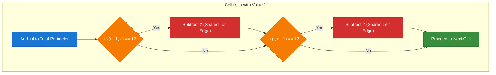
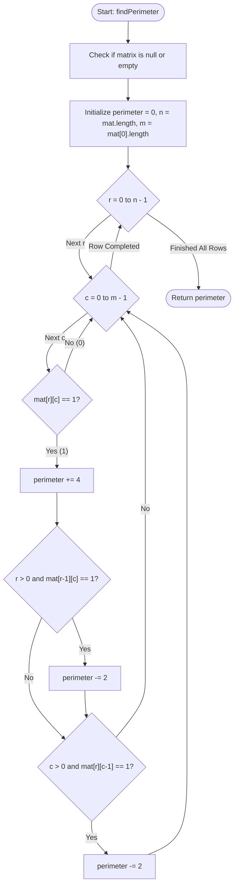

# GeeksforGeeks Problem of the Day: Find Perimeter of Shapes (Perimeter of Shapes in Binary Matrix)

- **Problem Link:** [GeeksforGeeks - Find Perimeter of Shapes](https://www.geeksforgeeks.org/problems/find-perimeter-of-shapes/1)
- **Difficulty:** Easy
- **Topic Tags:** Matrix, Geometric, Arrays, Simulation, In-Place Traversal
- **Target Audience:** POTD Solvers, Computer Science Students, Competitive Programmers, Interview Preparation (FAANG / Tier-1 Tech)

---

## 1. Problem Statement

Given a binary matrix `mat[][]` of size $n \times m$, where each cell contains either $0$ (empty space / water) or $1$ (solid land / shape), calculate the **total perimeter** of all figures (shapes) formed by the cells containing $1$s.

Two cells are considered **adjacent** if they share a common orthogonal side (Up, Down, Left, or Right). Diagonal neighbors do not share an edge and therefore do not reduce perimeter.

### Fundamental Perimeter Rules:
1. **Isolated Cell:** A single cell containing $1$ has $4$ exposed edges, giving it an initial perimeter of **$4$**.
2. **Shared Border Reduction:** When two cells containing $1$ are adjacent, they share a common unit-length border. This shared side is internal to the figure and does not form part of the outer or inner boundary. Thus, each shared boundary reduces the combined perimeter by **$2$** (one edge from each cell).
   $$\text{Perimeter of } (11) = 4 + 4 - 2(1) = \mathbf{6}$$
3. **Multiple Figures & Lakes:** The total perimeter is the sum of the perimeters of all shapes, including the boundaries of any internal voids (holes or lakes of $0$s completely enclosed by $1$s).

Return the total integer perimeter of all shapes in the matrix.

---

## 2. Examples & Explanations

### Example 1

**Input:**
```text
mat = [
  [0, 1, 0, 0, 0],
  [1, 1, 1, 0, 0],
  [1, 0, 0, 0, 0]
]
```

**Output:**
```text
12
```

#### Visual Matrix Representation ($3 \times 5$):
```text
       c = 0   c = 1   c = 2   c = 3   c = 4
r = 0 [  0   |   1   |   0   |   0   |   0  ]
r = 1 [  1   |   1   |   1   |   0   |   0  ]
r = 2 [  1   |   0   |   0   |   0   |   0  ]
```

#### Perimeter Edge Analysis:
- Total cells containing $1$: $5$ cells $\implies 5 \times 4 = 20$ potential outer edges.
- Adjacent pairs sharing a common side:
  - Vertical pair: $(0, 1)$ and $(1, 1)$ $\implies 1$ shared edge.
  - Horizontal pair: $(1, 0)$ and $(1, 1)$ $\implies 1$ shared edge.
  - Horizontal pair: $(1, 1)$ and $(1, 2)$ $\implies 1$ shared edge.
  - Vertical pair: $(1, 0)$ and $(2, 0)$ $\implies 1$ shared edge.
- Total shared edges $= 4$.
- Each shared edge cancels $2$ perimeter units:
  $$\text{Perimeter} = (5 \times 4) - (2 \times 4) = 20 - 8 = \mathbf{12}$$

---

### Example 2

**Input:**
```text
mat = [
  [1, 0],
  [1, 1]
]
```

**Output:**
```text
8
```

#### Visual Matrix Representation ($2 \times 2$):
```text
       c = 0   c = 1
r = 0 [  1   |   0  ]
r = 1 [  1   |   1  ]
```

#### Perimeter Edge Analysis:
- Total cells containing $1$: $3$ cells.
- Initial perimeter: $3 \times 4 = 12$.
- Shared borders:
  - Vertical pair: $(0, 0)$ and $(1, 0)$ $\implies 1$ shared side.
  - Horizontal pair: $(1, 0)$ and $(1, 1)$ $\implies 1$ shared side.
- Total shared sides $= 2$.
- Subtraction:
  $$\text{Perimeter} = 12 - (2 \times 2) = 12 - 4 = \mathbf{8}$$

---

### Example 3 (Shape with an Enclosed Interior Hole)

**Input:**
```text
mat = [
  [1, 1, 1],
  [1, 0, 1],
  [1, 1, 1]
]
```

**Output:**
```text
16
```

#### Visual Matrix Representation ($3 \times 3$):
```text
       c = 0   c = 1   c = 2
r = 0 [  1   |   1   |   1  ]
r = 1 [  1   |   0   |   1  ]
r = 2 [  1   |   1   |   1  ]
```

#### Perimeter Edge Analysis:
- External boundary of the $3 \times 3$ square: $3 + 3 + 3 + 3 = 12$ edges.
- Internal boundary enclosing the central hole at $(1, 1)$: $4$ edges.
- Total Perimeter $= 12 \text{ (outer)} + 4 \text{ (inner)} = \mathbf{16}$.
- Using Formula:
  - Total 1s $= 8 \implies 8 \times 4 = 32$.
  - Horizontal adjacent pairs $= (0,0)-(0,1), (0,1)-(0,2), (2,0)-(2,1), (2,1)-(2,2) = 4$.
  - Vertical adjacent pairs $= (0,0)-(1,0), (1,0)-(2,0), (0,2)-(1,2), (1,2)-(2,2) = 4$.
  - Total shared borders $= 8$.
  - $\text{Perimeter} = 32 - (2 \times 8) = 32 - 16 = \mathbf{16}$.

---

## 3. Constraints

- $1 \le n, m \le 1000$
- Total cells $n \times m \le 10^6$
- $\text{mat}[r][c] \in \{0, 1\}$
- **Expected Time Complexity:** $\mathcal{O}(n \times m)$
- **Expected Auxiliary Space:** $\mathcal{O}(1)$ (In-place traversal without auxiliary visited grids or queues)

---

## 4. Visual Architecture & Geometric Matrix Model

### Boundary Exposure vs. Shared Cancellation

Every cell with value $1$ acts as a $1 \times 1$ unit square. Its edges face either:
1. **The Grid Boundary (Out of Bounds):** Always adds $+1$ to perimeter.
2. **An Empty Cell ($0$):** Always adds $+1$ to perimeter.
3. **An Adjacent Land Cell ($1$):** Shared internal connection, cancels $2$ perimeter edges.

```
========================================================================================
                          UNIT CELL PERIMETER INVARIANTS
========================================================================================

    [ Isolated Cell ]                 [ Adjacent Cells ]               [ Internal Void / Hole ]
         +---+                             +---+---+                         +---+---+---+
         | 1 |  Perimeter = 4              | 1 : 1 |  Perimeter = 6          | 1 | 1 | 1 |
         +---+                             +---+---+                         +---+---+---+
    4 outer edges                   1 shared border cancels 2                | 1 | 0 | 1 |
                                    (4 + 4 - 2 = 6)                          +---+---+---+
                                                                             | 1 | 1 | 1 |
                                                                             +---+---+---+
                                                                        Outer = 12, Inner = 4
                                                                           Total = 16
========================================================================================
```

### The Look-Back Directional Invariant (50% Fewer Lookups)

Instead of checking all $4$ orthogonal directions for every cell $(r, c)$, we can iterate through the matrix from top-left to bottom-right and **only check the preceding directions**:
1. Check **UP** neighbor $(r - 1, c)$.
2. Check **LEFT** neighbor $(r, c - 1)$.

Because each adjacent pair will eventually be evaluated when visiting the second cell of the pair, checking only UP and LEFT guarantees:
- Every shared pair is detected **exactly once**.
- When detected, we subtract $2$ immediately.
- We perform only **2 neighbor lookups instead of 4**, cutting memory accesses and branch evaluations in half!



---

## 5. Step-by-Step Simulation & Detailed Trace Table

Trace for Example 2:
```text
mat = [
  [1, 0],
  [1, 1]
]
```

| Step | Coordinate $(r, c)$ | Value | Action Taken | Top Neighbor $(r-1, c)$ | Left Neighbor $(r, c-1)$ | Delta Perimeter | Cumulative Perimeter |
| :---: | :---: | :---: | :--- | :---: | :---: | :---: | :---: |
| **1** | $(0, 0)$ | $1$ | Initial $+4$ | Boundary | Boundary | $+4$ | **$4$** |
| **2** | $(0, 1)$ | $0$ | Skip empty cell | — | — | $0$ | **$4$** |
| **3** | $(1, 0)$ | $1$ | Initial $+4$ | $\text{mat}[0][0] == 1$ ($-2$) | Boundary | $+4 - 2 = +2$ | **$6$** |
| **4** | $(1, 1)$ | $1$ | Initial $+4$ | $\text{mat}[0][1] == 0$ | $\text{mat}[1][0] == 1$ ($-2$) | $+4 - 2 = +2$ | **$8$** |

**Final Result:** `8`

---

## 6. Algorithm Flowchart



---

## 7. From Naive to Pro: Algorithmic Progression

### Approach 1: Graph Traversal / Connected Components with BFS/DFS (Naive)

#### Concept
Treat each cell containing `1` as a graph vertex. Find each unvisited `1`, trigger a Breadth-First Search (BFS) or Depth-First Search (DFS) to traverse the shape, and for each visited cell check all $4$ orthogonal directions. If a neighbor is water (`0`) or out of bounds, increment the perimeter. Keep a `visited` matrix to avoid infinite cycles.

#### Pseudo Code
```text
FUNCTION findPerimeterNaive(mat):
    n = ROWS(mat)
    m = COLS(mat)
    visited = NEW 2D_ARRAY(n, m, FALSE)
    total_perimeter = 0
    directions = [(-1, 0), (1, 0), (0, -1), (0, 1)]

    FOR r FROM 0 TO n - 1:
        FOR c FROM 0 TO m - 1:
            IF mat[r][c] == 1 AND NOT visited[r][c]:
                queue = NEW QUEUE()
                queue.push((r, c))
                visited[r][c] = TRUE
                
                WHILE queue IS NOT EMPTY:
                    (curr_r, curr_c) = queue.pop()
                    FOR EACH (dr, dc) IN directions:
                        nr = curr_r + dr
                        nc = curr_c + dc
                        IF nr < 0 OR nr >= n OR nc < 0 OR nc >= m OR mat[nr][nc] == 0:
                            total_perimeter = total_perimeter + 1
                        ELSE IF NOT visited[nr][nc]:
                            visited[nr][nc] = TRUE
                            queue.push((nr, nc))

    RETURN total_perimeter
```

#### Complexity Analysis
- **Time Complexity:** $\mathcal{O}(n \times m)$ — Each cell is enqueued and visited at most once.
- **Auxiliary Space:** $\mathcal{O}(n \times m)$ — Requires a `visited` matrix of size $n \times m$ plus queue/recursion stack space up to $\mathcal{O}(n \times m)$.

---

### Approach 2: Direct 4-Directional Neighbor Inspection (Better)

#### Concept
Because perimeter only depends on local boundaries, there is no need to perform graph traversals or maintain visited states! Simply loop through every cell $(r, c)$ in the matrix. If $\text{mat}[r][c] == 1$, check all $4$ orthogonal neighbors. If a neighbor is out of bounds or equals $0$, that side is an exposed perimeter edge.

#### Pseudo Code
```text
FUNCTION findPerimeterBetter(mat):
    n = ROWS(mat)
    m = COLS(mat)
    perimeter = 0
    directions = [(-1, 0), (1, 0), (0, -1), (0, 1)]

    FOR r FROM 0 TO n - 1:
        FOR c FROM 0 TO m - 1:
            IF mat[r][c] == 1:
                FOR EACH (dr, dc) IN directions:
                    nr = r + dr
                    nc = c + dc
                    IF nr < 0 OR nr >= n OR nc < 0 OR nc >= m OR mat[nr][nc] == 0:
                        perimeter = perimeter + 1

    RETURN perimeter
```

#### Complexity Analysis
- **Time Complexity:** $\mathcal{O}(n \times m)$ — Visits each cell and checks $4$ directions. Total operations: $4 \times n \times m$.
- **Auxiliary Space:** $\mathcal{O}(1)$ — No extra arrays or auxiliary data structures required.

---

### Approach 3: Look-Back Inclusion-Exclusion (Optimal / Pro)

#### Concept
Optimize the constant factor of Approach 2 by 50%.
For every land cell $\text{mat}[r][c] == 1$:
1. Immediately assume all $4$ of its sides are exposed: `perimeter += 4`.
2. Check only the previously visited neighbors: **Top** $(r - 1, c)$ and **Left** $(r, c - 1)$.
3. If the top neighbor is $1$, a shared border exists: `perimeter -= 2` (one for current cell, one for top cell).
4. If the left neighbor is $1$, a shared border exists: `perimeter -= 2` (one for current cell, one for left cell).

This eliminates boundary checks for bottom and right directions, halves memory lookups, and avoids array allocations entirely.

#### Pseudo Code
```text
FUNCTION findPerimeterOptimal(mat):
    IF mat IS NULL OR ROWS(mat) == 0 OR COLS(mat) == 0:
        RETURN 0

    n = ROWS(mat)
    m = COLS(mat)
    perimeter = 0

    FOR r FROM 0 TO n - 1:
        FOR c FROM 0 TO m - 1:
            IF mat[r][c] == 1:
                perimeter = perimeter + 4
                
                // Check top neighbor
                IF r > 0 AND mat[r - 1][c] == 1:
                    perimeter = perimeter - 2
                    
                // Check left neighbor
                IF c > 0 AND mat[r][c - 1] == 1:
                    perimeter = perimeter - 2

    RETURN perimeter
```

#### Complexity Analysis
- **Time Complexity:** $\mathcal{O}(n \times m)$ — Single linear pass over the matrix with only $2$ branch checks per land cell.
- **Auxiliary Space:** $\mathcal{O}(1)$ — In-place computation using primitive variables.

---

## 8. Complexity Comparison Table

| Metric | Approach 1: BFS / DFS Traversal | Approach 2: 4-Way Neighbor Check | Approach 3: Look-Back Deduction [Pro] |
| :--- | :--- | :--- | :--- |
| **Time Complexity** | $\mathcal{O}(n \times m)$ | $\mathcal{O}(n \times m)$ | $\mathbf{\mathcal{O}(n \times m)}$ |
| **Auxiliary Space** | $\mathcal{O}(n \times m)$ (Visited + Queue) | $\mathcal{O}(1)$ | $\mathbf{\mathcal{O}(1)}$ |
| **Neighbor Lookups / Cell** | $4$ per land cell | $4$ per land cell | $\mathbf{2}$ **per land cell (50% faster)** |
| **Implementation Complexity**| High (Queue, boundary checks) | Low | **Minimal (clean & cache-friendly)** |
| **Cache Locality** | Random access during BFS | Row-major traversal | **Optimal contiguous sequential reads** |

---

## 9. Comprehensive Corner Cases Handled

1. **Entirely Empty Grid (All Zeros):**
   - No cell has value $1$.
   - Loops complete without entering land logic $\implies$ returns `0`.
2. **Single Cell Grid ($1 \times 1$):**
   - If `mat = [[1]]`: `perimeter += 4`. Neighbors $(r > 0)$ and $(c > 0)$ are false $\implies$ returns `4`.
   - If `mat = [[0]]`: returns `0`.
3. **Completely Filled Grid (All Ones of Size $n \times m$):**
   - Outer perimeter should be $2(n + m)$.
   - For $n = 2, m = 3$:
     - Initial: $6 \times 4 = 24$.
     - Top shared: $3$ pairs $\implies -6$.
     - Left shared: $4$ pairs $\implies -8$.
     - Total: $24 - 14 = 10$, which equals $2(2 + 3) = 10$.
4. **Internal Lakes / Enclosed Voids:**
   - Empty cells surrounded by $1$s naturally expose the inner boundary faces, correctly adding to the total perimeter without special case handling.
5. **Multiple Disconnected Islands:**
   - Because the algorithm evaluates every cell independently, shapes separated by water are summed without any missing boundaries or crosstalk.
6. **Narrow Matrices ($1 \times m$ or $n \times 1$):**
   - Correctly avoids out-of-bounds indexing via guarded `r > 0` and `c > 0` conditions.

---

## 10. Complete Multi-Language Implementations

### Java (21)

```java
class Solution {
    static int findPerimeter(int[][] mat) {
        if (mat == null || mat.length == 0 || mat[0].length == 0) {
            return 0;
        }

        int n = mat.length;
        int m = mat[0].length;
        int perimeter = 0;

        for (int r = 0; r < n; r++) {
            for (int c = 0; c < m; c++) {
                if (mat[r][c] == 1) {
                    perimeter += 4;

                    // Deduct shared top border
                    if (r > 0 && mat[r - 1][c] == 1) {
                        perimeter -= 2;
                    }

                    // Deduct shared left border
                    if (c > 0 && mat[r][c - 1] == 1) {
                        perimeter -= 2;
                    }
                }
            }
        }

        return perimeter;
    }
}
```

---

### Python3

```python
class Solution:

  def findPerimeter(self, mat: list[list[int]]) -> int:
    if not mat or not mat[0]:
      return 0

    n = len(mat)
    m = len(mat[0])
    perimeter = 0

    for r in range(n):
      for c in range(m):
        if mat[r][c] == 1:
          perimeter += 4

          # Deduct shared top border
          if r > 0 and mat[r - 1][c] == 1:
            perimeter -= 2

          # Deduct shared left border
          if c > 0 and mat[r][c - 1] == 1:
            perimeter -= 2

    return perimeter
```

---

### C++ (17)

```cpp
class Solution {
  public:
    int findPerimeter(vector<vector<int>> &mat) {
        if (mat.empty() || mat[0].empty()) {
            return 0;
        }

        int n = mat.size();
        int m = mat[0].size();
        int perimeter = 0;

        for (int r = 0; r < n; ++r) {
            for (int c = 0; c < m; ++c) {
                if (mat[r][c] == 1) {
                    perimeter += 4;

                    // Deduct shared top border
                    if (r > 0 && mat[r - 1][c] == 1) {
                        perimeter -= 2;
                    }

                    // Deduct shared left border
                    if (c > 0 && mat[r][c - 1] == 1) {
                        perimeter -= 2;
                    }
                }
            }
        }

        return perimeter;
    }
};
```

---

### C#

```csharp
class Solution {
    public static int findPerimeter(int[][] mat) {
        if (mat == null || mat.Length == 0 || mat[0].Length == 0) {
            return 0;
        }

        int n = mat.Length;
        int m = mat[0].Length;
        int perimeter = 0;

        for (int r = 0; r < n; r++) {
            for (int c = 0; c < m; c++) {
                if (mat[r][c] == 1) {
                    perimeter += 4;

                    // Deduct shared top border
                    if (r > 0 && mat[r - 1][c] == 1) {
                        perimeter -= 2;
                    }

                    // Deduct shared left border
                    if (c > 0 && mat[r][c - 1] == 1) {
                        perimeter -= 2;
                    }
                }
            }
        }

        return perimeter;
    }
}
```

---

### Javascript (Node v22)

```javascript
/**
 * @param {number[][]} mat
 * @returns {number}
 */

class Solution {
    findPerimeter(mat) {
        if (!mat || mat.length === 0 || mat[0].length === 0) {
            return 0;
        }

        const n = mat.length;
        const m = mat[0].length;
        let perimeter = 0;

        for (let r = 0; r < n; r++) {
            for (let c = 0; c < m; c++) {
                if (mat[r][c] === 1) {
                    perimeter += 4;

                    // Deduct shared top border
                    if (r > 0 && mat[r - 1][c] === 1) {
                        perimeter -= 2;
                    }

                    // Deduct shared left border
                    if (c > 0 && mat[r][c - 1] === 1) {
                        perimeter -= 2;
                    }
                }
            }
        }

        return perimeter;
    }
}
```

---

### Typescript

```typescript
class Solution {
    findPerimeter(mat: number[][]): number {
        if (!mat || mat.length === 0 || mat[0].length === 0) {
            return 0;
        }

        const n: number = mat.length;
        const m: number = mat[0].length;
        let perimeter: number = 0;

        for (let r: number = 0; r < n; r++) {
            for (let c: number = 0; c < m; c++) {
                if (mat[r][c] === 1) {
                    perimeter += 4;

                    // Deduct shared top border
                    if (r > 0 && mat[r - 1][c] === 1) {
                        perimeter -= 2;
                    }

                    // Deduct shared left border
                    if (c > 0 && mat[r][c - 1] === 1) {
                        perimeter -= 2;
                    }
                }
            }
        }

        return perimeter;
    }
}
```

