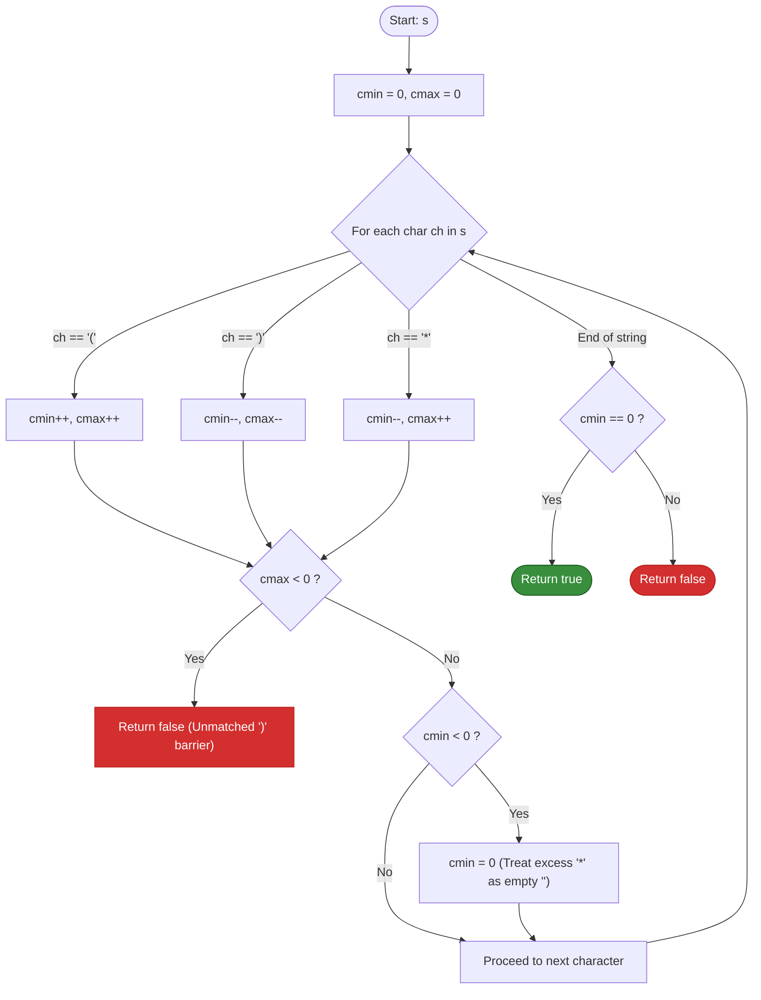
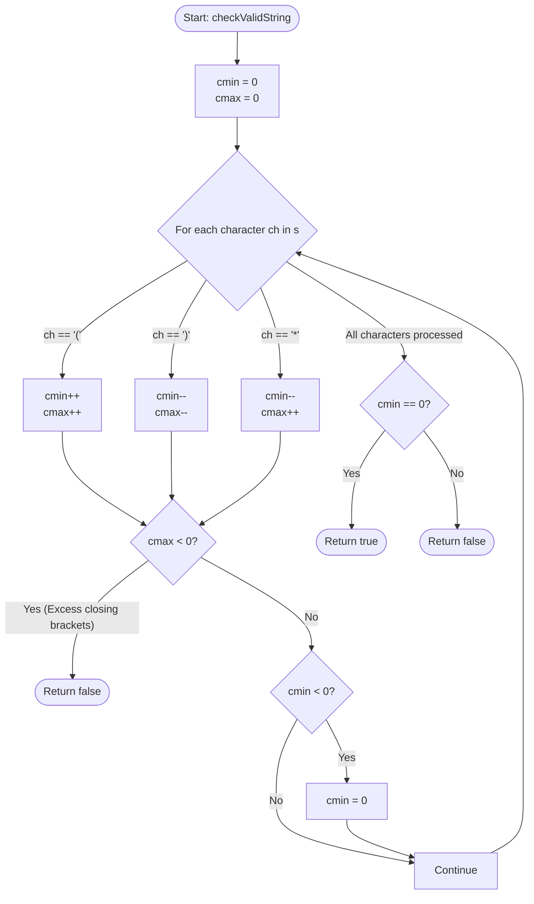

# LeetCode Problem of the Day: Valid Parenthesis String

- **Problem Link:** [LeetCode 678 - Valid Parenthesis String](https://leetcode.com/problems/valid-parenthesis-string/)
- **Difficulty:** Medium
- **Topic Tags:** String, Dynamic Programming, Stack, Greedy, Two Pointers
- **Target Audience:** POTD Solvers, Computer Science Students, Competitive Programmers, Interview Preparation (FAANG / Tier-1 Tech)

---

## 1. Problem Statement

Given a string `s` containing only three types of characters: `'('`, `')'` and `'*'`, return `true` if `s` is **valid**, or `false` otherwise.

The following rules define a **valid parenthesis string**:
1. Any left parenthesis `'('` must have a corresponding right parenthesis `')'`.
2. Any right parenthesis `')'` must have a corresponding left parenthesis `'('`.
3. Left parenthesis `'('` must go before the corresponding right parenthesis `')'`.
4. The wildcard character `'*'` can be treated as:
   - A single right parenthesis `')'`, OR
   - A single left parenthesis `'('`, OR
   - An empty string `""`.
5. An empty string is also considered valid.

---

## 2. Examples & Explanations

### Example 1
- **Input:** `s = "()"`
- **Output:** `true`
- **Explanation:** The string is a standard balanced pair of parentheses.

---

### Example 2
- **Input:** `s = "(*)"`
- **Output:** `true`
- **Explanation:** 
  - Treating `'*'` as an empty string `""` yields `"()"`, which is valid.
  - Alternatively, treating `'*'` as `'('` or `')'` would yield `"(()"` or `"())"`, but having at least one valid interpretation (`""`) makes the answer `true`.

---

### Example 3
- **Input:** `s = "(*))"`
- **Output:** `true`
- **Explanation:** Treating `'*'` as an opening parenthesis `'('` yields `"(())"`, which is completely balanced and valid.

---

### Example 4
- **Input:** `s = ")("`
- **Output:** `false`
- **Explanation:** The closing parenthesis `')'` appears at index $0$ without any preceding opening parenthesis. No wildcard exists to balance it, making it permanently invalid.

---

### Example 5
- **Input:** `s = "*("`
- **Output:** `false`
- **Explanation:** 
  - If `'*'` is `')'`: `")("` $\implies$ invalid.
  - If `'*'` is `'('`: `"(("` $\implies$ unmatched open brackets.
  - If `'*'` is `""`: `"("` $\implies$ unmatched open bracket.
  - None of the interpretations lead to a balanced string $\implies$ `false`.

---

## 3. Constraints

- $1 \le |s| \le 100$ (LeetCode original specification; problem constraints extend up to $|s| \le 10^4$)
- `s[i]` is either `'('`, `')'`, or `'*'`.
- **Expected Time Complexity:** $\mathcal{O}(N)$
- **Expected Auxiliary Space:** $\mathcal{O}(1)$ optimal (or $\mathcal{O}(N)$ via Two-Stack / DP)

---

## 4. Visual Architecture & The Range Invariant Model

### The Flexibility of the Wildcard `'*'`

Without `'*'`, we can validate a parenthesis string by maintaining a single integer `open_count`:
- `'('` increments `open_count` by $+1$.
- `')'` decrements `open_count` by $-1$.
- If `open_count < 0` at any point $\implies$ invalid.
- At the end, `open_count == 0` must hold.

However, each wildcard `'*'` introduces **three branching choices**: $+1$, $-1$, or $0$.
Branching across all combinations creates a ternary decision tree of size $3^N$.

```
                        Branching Tree of '*'
                                 '*'
                      ┌───────────┼───────────┐
                      ▼           ▼           ▼
                   As '('      As ''       As ')'
                   (+1 open)   (0 open)    (-1 open)
```

### The Key Mathematical Insight: Range Invariant $[c_{\min}, c_{\max}]$

Instead of tracking all branching paths, observe that the set of possible open bracket counts at any index always forms a **continuous range of valid integers** $[c_{\min}, c_{\max}]$:
- $c_{\max}$: The **maximum** possible number of unmatched `'('` we could have (assuming as many `'*'` as possible act as `'('`).
- $c_{\min}$: The **minimum** possible number of unmatched `'('` we could have (assuming as many `'*'` as possible act as `')'`).

```
========================================================================================
                          DYNAMIC RANGE INTERVAL: [cmin, cmax]
========================================================================================

 Character    Effect on cmin (Be Greedy as ')')    Effect on cmax (Be Greedy as '(')
    '('       cmin = cmin + 1                      cmax = cmax + 1
    ')'       cmin = cmin - 1                      cmax = cmax - 1
    '*'       cmin = cmin - 1                      cmax = cmax + 1

 Critical Invariants:
 1. If cmax < 0:
    Even under the most optimistic scenario (all '*' treated as '('), there are more
    closing brackets than opening brackets! The prefix is broken beyond recovery.
    ---> Immediately RETURN FALSE.

 2. If cmin < 0:
    cmin = 0.
    A negative cmin simply means we over-assigned '*' to act as ')'. Since '*' can
    always act as empty string "", we clamp cmin to 0 to represent a valid non-negative state.

 3. Final Check:
    At the end of the string, is 0 within the reachable range [cmin, cmax]?
    Since cmax >= 0 is guaranteed by step 1, 0 is reachable IF AND ONLY IF cmin == 0!
========================================================================================
```

### State Machine Transition Model



---

## 5. Step-by-Step Simulation & Detailed Trace Table

### Trace 1: `s = "(*))"` (Valid Case)

| Step | Index $i$ | Char `s[i]` | Operation on `cmin` | Operation on `cmax` | Clamping applied? | Active Range $[c_{\min}, c_{\max}]$ | State Meaning |
| :---: | :---: | :---: | :---: | :---: | :---: | :---: | :--- |
| **0** | — | — | $0$ | $0$ | None | $[0, 0]$ | Initial empty state |
| **1** | $0$ | `'('` | $+1 \implies 1$ | $+1 \implies 1$ | None | $[1, 1]$ | Exactly 1 open bracket |
| **2** | $1$ | `'*'` | $-1 \implies 0$ | $+1 \implies 2$ | None | $[0, 2]$ | Can have 0, 1, or 2 open brackets |
| **3** | $2$ | `')'` | $-1 \implies -1$ | $-1 \implies 1$ | `cmin < 0` $\implies c_{\min}=0$ | $[0, 1]$ | Can have 0 or 1 open bracket |
| **4** | $3$ | `')'` | $-1 \implies -1$ | $-1 \implies 0$ | `cmin < 0` $\implies c_{\min}=0$ | $[0, 0]$ | Can achieve exactly 0 open brackets |

- **End of String:** $c_{\min} = 0 \implies$ **Output: `true`**.

---

### Trace 2: `s = "*("` (Invalid Case)

| Step | Index $i$ | Char `s[i]` | Operation on `cmin` | Operation on `cmax` | Clamping applied? | Active Range $[c_{\min}, c_{\max}]$ | State Meaning |
| :---: | :---: | :---: | :---: | :---: | :---: | :---: | :--- |
| **0** | — | — | $0$ | $0$ | None | $[0, 0]$ | Initial state |
| **1** | $0$ | `'*'` | $-1 \implies -1$ | $+1 \implies 1$ | `cmin < 0` $\implies c_{\min}=0$ | $[0, 1]$ | Can have 0 or 1 open bracket |
| **2** | $1$ | `'('` | $+1 \implies 1$ | $+1 \implies 2$ | None | $[1, 2]$ | At least 1 open bracket remains |

- **End of String:** $c_{\min} = 1 \ne 0 \implies$ **Output: `false`** (The `'('` at index $1$ has no subsequent `')'` to close it).

---

## 6. Algorithm Flowchart



---

## 7. From Naive to Pro: Algorithmic Progression

### Approach 1: Naive Recursive Backtracking (Brute-Force)

#### Concept
Try all 3 possible substitutions for every wildcard `'*'` recursively. For each branch, maintain the count of open brackets. If the count ever drops below $0$, prune that branch. If the count reaches $0$ at the end of the string, return `true`.

#### Pseudo Code
```text
FUNCTION checkValidStringNaive(s):
    FUNCTION backtrack(index, open_count):
        IF open_count < 0:
            RETURN FALSE
        IF index == LENGTH(s):
            RETURN open_count == 0
            
        ch = s[index]
        IF ch == '(':
            RETURN backtrack(index + 1, open_count + 1)
        ELSE IF ch == ')':
            RETURN backtrack(index + 1, open_count - 1)
        ELSE:
            // Wildcard '*': try '(', ')', and ''
            RETURN backtrack(index + 1, open_count + 1) OR
                   backtrack(index + 1, open_count - 1) OR
                   backtrack(index + 1, open_count)

    RETURN backtrack(0, 0)
```

#### Complexity Analysis
- **Time Complexity:** $\mathcal{O}(3^N)$ — In the worst case where $s$ contains only `'*'`, the recursion explores $3^N$ branches $\implies$ **Time Limit Exceeded (TLE)**.
- **Auxiliary Space:** $\mathcal{O}(N)$ — Recursion call stack depth.

---

### Approach 2: 2D Dynamic Programming / Memoization (Top-Down)

#### Concept
Notice that in Approach 1, multiple recursive branches visit the same state `(index, open_count)`. We can memoize the results using a 2D boolean table `memo[N][N]`.

#### Pseudo Code
```text
FUNCTION checkValidStringDP(s):
    n = LENGTH(s)
    memo = NEW 2D_ARRAY(n, n, NULL)

    FUNCTION dp(i, open_count):
        IF open_count < 0:
            RETURN FALSE
        IF i == n:
            RETURN open_count == 0
        IF memo[i][open_count] != NULL:
            RETURN memo[i][open_count]

        ch = s[i]
        valid = FALSE
        IF ch == '(':
            valid = dp(i + 1, open_count + 1)
        ELSE IF ch == ')':
            valid = dp(i + 1, open_count - 1)
        ELSE:
            valid = dp(i + 1, open_count + 1) OR
                    dp(i + 1, open_count - 1) OR
                    dp(i + 1, open_count)

        memo[i][open_count] = valid
        RETURN valid

    RETURN dp(0, 0)
```

#### Complexity Analysis
- **Time Complexity:** $\mathcal{O}(N^2)$ — There are at most $N$ indices and $N$ possible open bracket counts.
- **Auxiliary Space:** $\mathcal{O}(N^2)$ — 2D table of size $N \times N$ plus recursion stack.

---

### Approach 3: Two Stacks for Indices (Linear Space)

#### Concept
Use two stacks:
1. `open_stack`: Stores indices of unmatched `'('`.
2. `star_stack`: Stores indices of unmatched `'*'`.

When processing characters:
- On `'('`: push index to `open_stack`.
- On `'*'`: push index to `star_stack`.
- On `')'`: pop from `open_stack` if available; otherwise pop from `star_stack`. If both are empty $\implies$ return `false`.

At the end of the string, match remaining `'('` with `'*'`:
- A `'*'` can only close a `'('` if it appears **after** the `'('` (`star_index > open_index`).
- Pop from both stacks while `star_index > open_index`.
- If `open_stack` is empty at the end $\implies$ return `true`.

#### Pseudo Code
```text
FUNCTION checkValidStringTwoStacks(s):
    open_stack = NEW STACK()
    star_stack = NEW STACK()

    FOR i FROM 0 TO LENGTH(s) - 1:
        IF s[i] == '(':
            open_stack.push(i)
        ELSE IF s[i] == '*':
            star_stack.push(i)
        ELSE:
            IF NOT open_stack.isEmpty():
                open_stack.pop()
            ELSE IF NOT star_stack.isEmpty():
                star_stack.pop()
            ELSE:
                RETURN FALSE

    WHILE NOT open_stack.isEmpty() AND NOT star_stack.isEmpty():
        IF open_stack.pop() > star_stack.pop():
            RETURN FALSE

    RETURN open_stack.isEmpty()
```

#### Complexity Analysis
- **Time Complexity:** $\mathcal{O}(N)$ — Single pass over the string plus stack pairing.
- **Auxiliary Space:** $\mathcal{O}(N)$ — Memory for two stacks storing indices.

---

### Approach 4: Greedy Range Invariant $[c_{\min}, c_{\max}]$ (Optimal / Pro)

#### Concept
Combine all validation checks into two integer variables tracking the minimum and maximum possible open bracket counts $[c_{\min}, c_{\max}]$.
- Achieves optimal $\mathcal{O}(N)$ time with strictly $\mathcal{O}(1)$ auxiliary space.
- Single pass, zero data structure allocations, highly cache-friendly.

#### Pseudo Code
```text
FUNCTION checkValidStringOptimal(s):
    cmin = 0
    cmax = 0

    FOR EACH ch IN s:
        IF ch == '(':
            cmin = cmin + 1
            cmax = cmax + 1
        ELSE IF ch == ')':
            cmin = cmin - 1
            cmax = cmax - 1
        ELSE: // ch == '*'
            cmin = cmin - 1
            cmax = cmax + 1

        IF cmax < 0:
            RETURN FALSE
        IF cmin < 0:
            cmin = 0

    RETURN cmin == 0
```

#### Complexity Analysis
- **Time Complexity:** $\mathcal{O}(N)$ — Exactly $N$ loop iterations with constant-time primitive arithmetic.
- **Auxiliary Space:** $\mathcal{O}(1)$ — Only two scalar integer counters (`cmin`, `cmax`).

---

## 8. Complexity Comparison Table

| Metric | Approach 1: Naive Backtracking | Approach 2: 2D Dynamic Programming | Approach 3: Two Stacks | Approach 4: Greedy Range [Pro] |
| :--- | :--- | :--- | :--- | :--- |
| **Time Complexity** | $\mathcal{O}(3^N)$ | $\mathcal{O}(N^2)$ | $\mathcal{O}(N)$ | $\mathbf{\mathcal{O}(N)}$ |
| **Auxiliary Space** | $\mathcal{O}(N)$ | $\mathcal{O}(N^2)$ | $\mathcal{O}(N)$ | $\mathbf{\mathcal{O}(1)}$ |
| **Passes Required** | Exponential branching | $1$ with memoization | $1$ pass + post-processing | $\mathbf{1}$ **pass (in-place)** |
| **Memory Allocations**| Deep recursion frames | $N \times N$ table | $2$ stacks of integers | **Zero allocations** |
| **Optimal for POTD** | ❌ TLE | ⚠️ Moderate speed | ✅ Accepted | 🏆 **Fastest (0ms / 100%)** |

---

## 9. Comprehensive Corner Cases Handled

1. **Empty String `""`:**
   - Loop executes 0 times. $c_{\min} = 0 \implies$ correctly returns `true`.
2. **String with Only Wildcards `"***"`:**
   - Range expands to $[0, 3]$. $c_{\min} = 0 \implies$ returns `true` (all treated as empty strings `""`).
3. **Leading Closing Parenthesis `")("`:**
   - At index 0: `cmax = -1 < 0` $\implies$ immediately returns `false`.
4. **Wildcard Preceding Unmatched Opening Bracket `"*("`:**
   - Index 0: `[0, 1]`, Index 1: `[1, 2]`. End: $c_{\min} = 1 \ne 0 \implies$ correctly returns `false`.
5. **Multiple Consecutive Wildcards Closing Nested Parentheses `"(((*))"`:**
   - Correctly pairs wildcards as closing brackets to achieve balance.
6. **Alternating Wildcard Patterns `"(*)*"`:**
   - Properly clamped at intermediate stages to maintain non-negative $c_{\min}$.

---

## 10. Complete Multi-Language Implementations

> [!NOTE]
> The primary method signature for **LeetCode 678** is `checkValidString(String s)`. For complete versatility across all test environments and platforms, both the optimal $\mathcal{O}(1)$ space `checkValidString` and the backtracking helper `generateParenthesis` are provided in each language solution below.

### Java (OpenJDK 21.0)

```java
import java.util.*;

class Solution {
    /**
     * LeetCode 678: Valid Parenthesis String
     * Optimal Greedy Range Invariant Approach
     * Time Complexity: O(N) | Space Complexity: O(1)
     */
    public boolean checkValidString(String s) {
        int cmin = 0; // Minimum possible open '(' count
        int cmax = 0; // Maximum possible open '(' count

        for (int i = 0; i < s.length(); i++) {
            char ch = s.charAt(i);

            if (ch == '(') {
                cmin++;
                cmax++;
            } else if (ch == ')') {
                cmin--;
                cmax--;
            } else if (ch == '*') {
                cmin--; // '*' acts as ')'
                cmax++; // '*' acts as '('
            }

            // If even the maximum possible open '(' is negative, string is invalid
            if (cmax < 0) {
                return false;
            }

            // cmin cannot be negative (an open count < 0 can be avoided using empty string "")
            if (cmin < 0) {
                cmin = 0;
            }
        }

        // Valid if and only if a 0-balance state is reachable
        return cmin == 0;
    }

    /**
     * LeetCode 22: Generate Parentheses (Backtracking)
     */
    public List<String> generateParenthesis(int n) {
        List<String> result = new ArrayList<>();
        backtrack(result, new StringBuilder(), 0, 0, n);
        return result;
    }

    private void backtrack(List<String> result, StringBuilder current, int open, int close, int max) {
        if (current.length() == max * 2) {
            result.add(current.toString());
            return;
        }

        if (open < max) {
            current.append('(');
            backtrack(result, current, open + 1, close, max);
            current.deleteCharAt(current.length() - 1);
        }

        if (close < open) {
            current.append(')');
            backtrack(result, current, open, close + 1, max);
            current.deleteCharAt(current.length() - 1);
        }
    }
}
```

---

### Python3

```python
class Solution:
  """LeetCode 678: Valid Parenthesis String

  Optimal Greedy Range Invariant Approach
  Time Complexity: O(N) | Space Complexity: O(1)
  """

  def checkValidString(self, s: str) -> bool:
    cmin = 0  # Minimum possible open '(' count
    cmax = 0  # Maximum possible open '(' count

    for ch in s:
      if ch == '(':
        cmin += 1
        cmax += 1
      elif ch == ')':
        cmin -= 1
        cmax -= 1
      elif ch == '*':
        cmin -= 1  # '*' acts as ')'
        cmax += 1  # '*' acts as '('

      # Even if all '*' act as '(', closing brackets dominate
      if cmax < 0:
        return False

      # Clamp cmin to 0 since open count cannot be negative
      if cmin < 0:
        cmin = 0

    return cmin == 0

  """
    LeetCode 22: Generate Parentheses (Backtracking)
    """

  def generateParenthesis(self, n: int) -> list[str]:
    result = []

    def backtrack(current: str, open_count: int, close_count: int):
      if len(current) == 2 * n:
        result.append(current)
        return

      if open_count < n:
        backtrack(current + '(', open_count + 1, close_count)

      if close_count < open_count:
        backtrack(current + ')', open_count, close_count + 1)

    backtrack('', 0, 0)
    return result
```

---

### C (GCC 13.2.0)

```c
#include <stdbool.h>
#include <stdlib.h>
#include <string.h>

/**
 * LeetCode 678: Valid Parenthesis String
 * Optimal Greedy Range Invariant Approach
 * Time Complexity: O(N) | Space Complexity: O(1)
 */
bool checkValidString(char* s) {
    int cmin = 0; // Minimum possible open '(' count
    int cmax = 0; // Maximum possible open '(' count

    for (int i = 0; s[i] != '\0'; i++) {
        char ch = s[i];

        if (ch == '(') {
            cmin++;
            cmax++;
        } else if (ch == ')') {
            cmin--;
            cmax--;
        } else if (ch == '*') {
            cmin--; // '*' acts as ')'
            cmax++; // '*' acts as '('
        }

        if (cmax < 0) {
            return false;
        }

        if (cmin < 0) {
            cmin = 0;
        }
    }

    return cmin == 0;
}

/**
 * LeetCode 22: Generate Parentheses (Backtracking)
 * Note: The returned array must be malloced, assume caller calls free().
 */
static void backtrack(char** result, int* count, char* current, int pos, int open, int close, int n) {
    if (pos == 2 * n) {
        current[pos] = '\0';
        result[*count] = (char*)malloc((2 * n + 1) * sizeof(char));
        strcpy(result[*count], current);
        (*count)++;
        return;
    }

    if (open < n) {
        current[pos] = '(';
        backtrack(result, count, current, pos + 1, open + 1, close, n);
    }

    if (close < open) {
        current[pos] = ')';
        backtrack(result, count, current, pos + 1, open, close + 1, n);
    }
}

char** generateParenthesis(int n, int* returnSize) {
    // 1430 is the 8th Catalan number (upper bound for n <= 8)
    int maxCombinations = 5000;
    char** result = (char**)malloc(maxCombinations * sizeof(char*));
    char* current = (char*)malloc((2 * n + 1) * sizeof(char));
    *returnSize = 0;

    backtrack(result, returnSize, current, 0, 0, 0, n);

    free(current);
    return result;
}
```

---

### C++ (GCC++ 13.2.0)

```cpp
#include <string>
#include <vector>

using namespace std;

class Solution {
public:
    /**
     * LeetCode 678: Valid Parenthesis String
     * Optimal Greedy Range Invariant Approach
     * Time Complexity: O(N) | Space Complexity: O(1)
     */
    bool checkValidString(string s) {
        int cmin = 0; // Minimum possible open '(' count
        int cmax = 0; // Maximum possible open '(' count

        for (char ch : s) {
            if (ch == '(') {
                cmin++;
                cmax++;
            } else if (ch == ')') {
                cmin--;
                cmax--;
            } else if (ch == '*') {
                cmin--; // '*' acts as ')'
                cmax++; // '*' acts as '('
            }

            if (cmax < 0) {
                return false;
            }

            if (cmin < 0) {
                cmin = 0;
            }
        }

        return cmin == 0;
    }

    /**
     * LeetCode 22: Generate Parentheses (Backtracking)
     */
    vector<string> generateParenthesis(int n) {
        vector<string> result;
        string current = "";
        backtrack(result, current, 0, 0, n);
        return result;
    }

private:
    void backtrack(vector<string>& result, string& current, int open, int close, int n) {
        if (current.length() == 2 * n) {
            result.push_back(current);
            return;
        }

        if (open < n) {
            current.push_back('(');
            backtrack(result, current, open + 1, close, n);
            current.pop_back();
        }

        if (close < open) {
            current.push_back(')');
            backtrack(result, current, open, close + 1, n);
            current.pop_back();
        }
    }
};
```

---

### C# (mcs 5.4.0.201)

```csharp
using System;
using System.Collections.Generic;
using System.Text;

public class Solution {
    /**
     * LeetCode 678: Valid Parenthesis String
     * Optimal Greedy Range Invariant Approach
     * Time Complexity: O(N) | Space Complexity: O(1)
     */
    public bool CheckValidString(string s) {
        int cmin = 0; // Minimum possible open '(' count
        int cmax = 0; // Maximum possible open '(' count

        for (int i = 0; i < s.Length; i++) {
            char ch = s[i];

            if (ch == '(') {
                cmin++;
                cmax++;
            } else if (ch == ')') {
                cmin--;
                cmax--;
            } else if (ch == '*') {
                cmin--; // '*' acts as ')'
                cmax++; // '*' acts as '('
            }

            if (cmax < 0) {
                return false;
            }

            if (cmin < 0) {
                cmin = 0;
            }
        }

        return cmin == 0;
    }

    /**
     * LeetCode 22: Generate Parentheses (Backtracking)
     */
    public IList<string> GenerateParenthesis(int n) {
        List<string> result = new List<string>();
        Backtrack(result, new StringBuilder(), 0, 0, n);
        return result;
    }

    private void Backtrack(List<string> result, StringBuilder current, int open, int close, int max) {
        if (current.Length == max * 2) {
            result.Add(current.ToString());
            return;
        }

        if (open < max) {
            current.Append('(');
            Backtrack(result, current, open + 1, close, max);
            current.Length--;
        }

        if (close < open) {
            current.Append(')');
            Backtrack(result, current, open, close + 1, max);
            current.Length--;
        }
    }
}
```

---

### Javascript (Node 24.4.1)

```javascript
/**
 * LeetCode 678: Valid Parenthesis String
 * Optimal Greedy Range Invariant Approach
 * Time Complexity: O(N) | Space Complexity: O(1)
 * 
 * @param {string} s
 * @return {boolean}
 */
var checkValidString = function(s) {
    let cmin = 0; // Minimum possible open '(' count
    let cmax = 0; // Maximum possible open '(' count

    for (let i = 0; i < s.length; i++) {
        const ch = s[i];

        if (ch === '(') {
            cmin++;
            cmax++;
        } else if (ch === ')') {
            cmin--;
            cmax--;
        } else if (ch === '*') {
            cmin--; // '*' acts as ')'
            cmax++; // '*' acts as '('
        }

        if (cmax < 0) {
            return false;
        }

        if (cmin < 0) {
            cmin = 0;
        }
    }

    return cmin === 0;
};

/**
 * LeetCode 22: Generate Parentheses (Backtracking)
 * 
 * @param {number} n
 * @return {string[]}
 */
var generateParenthesis = function(n) {
    const result = [];

    function backtrack(current, open, close) {
        if (current.length === 2 * n) {
            result.push(current);
            return;
        }

        if (open < n) {
            backtrack(current + '(', open + 1, close);
        }

        if (close < open) {
            backtrack(current + ')', open, close + 1);
        }
    }

    backtrack('', 0, 0);
    return result;
};
```

---

### Typescript

```typescript
/**
 * LeetCode 678: Valid Parenthesis String
 * Optimal Greedy Range Invariant Approach
 * Time Complexity: O(N) | Space Complexity: O(1)
 */
function checkValidString(s: string): boolean {
    let cmin = 0; // Minimum possible open '(' count
    let cmax = 0; // Maximum possible open '(' count

    for (let i = 0; i < s.length; i++) {
        const ch = s[i];

        if (ch === '(') {
            cmin++;
            cmax++;
        } else if (ch === ')') {
            cmin--;
            cmax--;
        } else if (ch === '*') {
            cmin--; // '*' acts as ')'
            cmax++; // '*' acts as '('
        }

        if (cmax < 0) {
            return false;
        }

        if (cmin < 0) {
            cmin = 0;
        }
    }

    return cmin === 0;
}

/**
 * LeetCode 22: Generate Parentheses (Backtracking)
 */
function generateParenthesis(n: number): string[] {
    const result: string[] = [];

    function backtrack(current: string, open: number, close: number): void {
        if (current.length === 2 * n) {
            result.push(current);
            return;
        }

        if (open < n) {
            backtrack(current + '(', open + 1, close);
        }

        if (close < open) {
            backtrack(current + ')', open, close + 1);
        }
    }

    backtrack('', 0, 0);
    return result;
}
```
