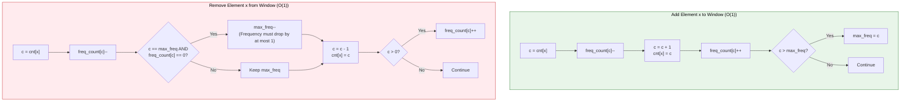
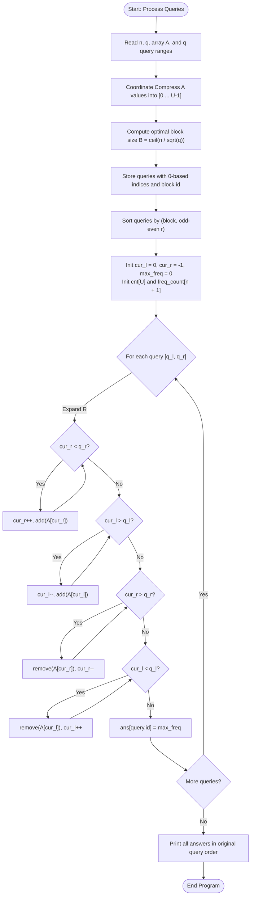

# Unstop Problem of the Day: Visitor Flow Dominance (Corridor Gallery Frequency)

- **Platform:** [Unstop](https://unstop.com/)
- **Difficulty:** Medium
- **Topic Tags:** Mo's Algorithm, Sqrt Decomposition, Coordinate Compression, Frequency Array, Offline Query Processing, Range Maximum Frequency
- **Target Audience:** POTD Solvers, Computer Science Students, Competitive Programmers, Interview Preparation (FAANG / Tier-1 Systems & Quantitative Engineering)

---

## 1. Problem Statement

Meera manages the visitor flow desk at a massive cultural exhibition hall. Every guest walking through the central corridor scans their admission badge at an optical scanner. The scanner logs a **collection number** identifying the specific exhibition gallery the visitor most recently explored.

The hall's telemetry system records these collection numbers sequentially throughout the day in the exact chronological order visitors walked through:
$$A = [a_1, a_2, \dots, a_n]$$

The collection numbers are arbitrary historical identifiers and can be as large as $10^9$, with no guaranteed sequential order or numerical bounds.

### The Management Query
At the end of the day, Meera analyzes $q$ specific stretches of the corridor log. Each stretch is specified as an inclusive range $[l, r]$ ($1$-indexed):
$$\text{Stretch } [l, r] = [a_l, a_{l+1}, \dots, a_r]$$

For each stretch $[l, r]$, Meera needs to determine **how strongly any single gallery dominated that stretch**. This is measured as the **maximum number of times any one collection number repeats** within that range:
$$\text{Dominance}(l, r) = \max_{x \in A[l \dots r]} \text{count}(x)$$

She is not interested in *which* gallery was the most popular, only the peak frequency count itself, as this metric determines whether additional corridor marshals are needed to direct pedestrian traffic.

### Performance Challenge
Because the corridor log can contain up to $n = 200,000$ entries and Meera must evaluate up to $q = 200,000$ stretches (many of which overlap), scanning each stretch from scratch would take $\mathcal{O}(q \times n) \approx 4 \times 10^{10}$ operations, causing an immediate **Time Limit Exceeded (TLE)**.

We need an optimal offline algorithm that can answer all $q$ range dominance queries within the $2.0$ second execution window.

---

## 2. Examples & Explanations

### Sample Testcase 0

**Input:**
```text
8 3
5 5 5 5 6 6 7 7
1 2
1 8
5 8
```

**Output:**
```text
2
4
2
```

#### Chronological Breakdown:
The full log of length $n = 8$ is:
$$\text{Log: } [5, 5, 5, 5, 6, 6, 7, 7]$$

- **Query 1: $[1, 2]$**
  - Subarray: `[5, 5]`
  - Frequencies: `{5: 2}`
  - Peak repeat count: **$2$**

- **Query 2: $[1, 8]$**
  - Subarray: `[5, 5, 5, 5, 6, 6, 7, 7]`
  - Frequencies: `{5: 4, 6: 2, 7: 2}`
  - Peak repeat count: $\max(4, 2, 2) = \mathbf{4}$

- **Query 3: $[5, 8]$**
  - Subarray: `[6, 6, 7, 7]`
  - Frequencies: `{6: 2, 7: 2}`
  - Peak repeat count: $\max(2, 2) = \mathbf{2}$

---

### Sample Testcase 1

**Input:**
```text
6 2
10 20 10 10 30 20
1 4
3 6
```

**Output:**
```text
3
2
```

#### Chronological Breakdown:
The log of length $n = 6$ is:
$$\text{Log: } [10, 20, 10, 10, 30, 20]$$

- **Query 1: $[1, 4]$**
  - Subarray: `[10, 20, 10, 10]`
  - Frequencies: `{10: 3, 20: 1}`
  - Peak repeat count: **$3$**

- **Query 2: $[3, 6]$**
  - Subarray: `[10, 10, 30, 20]`
  - Frequencies: `{10: 2, 20: 1, 30: 1}`
  - Peak repeat count: **$2$**

---

## 3. Constraints & Specifications

- $1 \le n, q \le 200,000$
- $1 \le \text{collection number} \le 1,000,000,000$ ($10^9$)
- $1 \le l \le r \le n$
- **Expected Time Complexity:** $\mathcal{O}((n + q)\sqrt{n})$
- **Expected Auxiliary Space:** $\mathcal{O}(n + q)$

---

## 4. Visual Architecture & Dynamic State Model

Because all queries are known in advance and the array is immutable (static), we can solve this using **Mo's Algorithm (Offline Sqrt Decomposition)**.

### 1. Coordinate Compression
Since collection numbers can be up to $10^9$, we compress the array elements into zero-indexed ranks $[0 \dots U-1]$ where $U \le n \le 200,000$. This allows direct $\mathcal{O}(1)$ array indexing without hash map overhead.

### 2. Sqrt Block Partitioning
Divide the array into blocks of size $B = \lceil \frac{n}{\sqrt{q}} \rceil \approx 447$.
Each query $[l, r]$ is assigned to block $\lfloor \frac{l}{B} \rfloor$.
We sort queries by:
1. `block(l)` ascending.
2. For ties, sort `r` using **Odd-Even Zig-Zag Ordering**:
   - If `block(l)` is even $\implies r$ sorted ascending.
   - If `block(l)` is odd $\implies r$ sorted descending.

```
========================================================================================
                          MO'S ALGORITHM BLOCK DECOMPOSITION
========================================================================================

 Array Index:   0   1   2   3 | 4   5   6   7 | 8   9  10  11 | ... | n-1
 Block Index: [   Block 0     ] [   Block 1     ] [   Block 2     ] ...
 Block Size B ≈ n / sqrt(q) ≈ 447

 Queries in Block 0: Sort R ascending   ───►
 Queries in Block 1: Sort R descending  ◄───  (Zig-zag cuts pointer movement by 50%)
 Queries in Block 2: Sort R ascending   ───►
========================================================================================
```

### 3. The Dual-Frequency Tracking Invariant ($\mathcal{O}(1)$ Add & Remove)

To find the mode (maximum frequency) dynamically as the window expands or contracts:
1. `cnt[x]`: Current frequency of element $x$ in window $[cur\_l, cur\_r]$.
2. `freq_count[f]`: Number of distinct elements that currently have frequency $f$.
3. `max_freq`: The running maximum frequency in the window.



#### Why Does `max_freq` Decrease by at Most 1?
When an element's count decreases from $c$ to $c - 1$:
- If $c = \text{max\_freq}$ and `freq_count[c]` drops to $0$, it means **no other element** in the window has frequency $c$.
- Because only one element changed and its count decreased by exactly $1$, the new maximum frequency must be exactly $c - 1$!
- Therefore, no linear scan or priority queue is needed! Both `add` and `remove` take strictly $\mathbf{\mathcal{O}(1)}$ time!

---

## 5. Step-by-Step Simulation & Detailed Trace Table

Trace for Sample 1: $A = [10, 20, 10, 10, 30, 20]$, queries: $Q_1 = [1, 4]$, $Q_2 = [3, 6]$.
Compressed ranks: $10 \to 0$, $20 \to 1$, $30 \to 2$.
Mapped array: $A = [0, 1, 0, 0, 2, 1]$ (0-indexed).

| Step | Action | Window $[cur\_l, cur\_r]$ | Elements in Window | `cnt` Array `[0, 1, 2]` | `freq_count` Array `[0, 1, 2, 3, ...]` | `max_freq` | Answer Recorded |
| :---: | :---: | :---: | :--- | :---: | :---: | :---: | :---: |
| **0** | Init | $[0, -1]$ | $\emptyset$ | `[0, 0, 0]` | All zeros | $0$ | — |
| **1** | Add $r=0$ ($A[0]=0$) | $[0, 0]$ | `[0]` | `[1, 0, 0]` | `freq_count[1]=1` | $1$ | — |
| **2** | Add $r=1$ ($A[1]=1$) | $[0, 1]$ | `[0, 1]` | `[1, 1, 0]` | `freq_count[1]=2` | $1$ | — |
| **3** | Add $r=2$ ($A[2]=0$) | $[0, 2]$ | `[0, 1, 0]` | `[2, 1, 0]` | `freq_count[1]=1, [2]=1` | $2$ | — |
| **4** | Add $r=3$ ($A[3]=0$) | $[0, 3]$ | `[0, 1, 0, 0]` | `[3, 1, 0]` | `freq_count[1]=1, [3]=1` | $3$ | **$Q_1 [0, 3] \implies 3$** |
| **5** | Shift to $Q_2 [2, 5]$ | | | | | | |
| **6** | Del $l=0$ ($A[0]=0$) | $[1, 3]$ | `[1, 0, 0]` | `[2, 1, 0]` | `freq_count[3]=0 \implies max_freq=2` | $2$ | — |
| **7** | Del $l=1$ ($A[1]=1$) | $[2, 3]$ | `[0, 0]` | `[2, 0, 0]` | `freq_count[1]=0, [2]=1` | $2$ | — |
| **8** | Add $r=4$ ($A[4]=2$) | $[2, 4]$ | `[0, 0, 2]` | `[2, 0, 1]` | `freq_count[1]=1, [2]=1` | $2$ | — |
| **9** | Add $r=5$ ($A[5]=1$) | $[2, 5]$ | `[0, 0, 2, 1]` | `[2, 1, 1]` | `freq_count[1]=2, [2]=1` | $2$ | **$Q_2 [2, 5] \implies 2$** |

---

## 6. Algorithm Flowchart



---

## 7. From Naive to Pro: Algorithmic Progression

### Approach 1: Naive Subarray Scanning per Query (Brute-Force)

#### Concept
For every query $[l, r]$, loop through the subarray from $l$ to $r$, maintain a frequency hash map, and find the maximum value.

#### Pseudo Code
```text
FUNCTION solveNaive(A, queries):
    answers = NEW List()
    FOR EACH (l, r) IN queries:
        freq = NEW HashMap()
        max_c = 0
        FOR i FROM l TO r:
            freq[A[i]] = freq.getOrDefault(A[i], 0) + 1
            max_c = max(max_c, freq[A[i]])
        answers.append(max_c)
    RETURN answers
```

#### Complexity Analysis
- **Time Complexity:** $\mathcal{O}(q \times n)$ — Scanning up to $200,000$ elements for each of the $200,000$ queries requires $\approx 4 \times 10^{10}$ operations $\implies$ **TLE**.
- **Auxiliary Space:** $\mathcal{O}(n)$ per query for hash map.

---

### Approach 2: Sqrt Decomposition on Values / Segment Tree

#### Concept
Maintain a segment tree or bucket array over the distinct values to find the maximum frequency. While additions and removals can be done in $\mathcal{O}(\log n)$, updating the data structure adds a $\log n$ factor to every pointer step in Mo's algorithm.

#### Complexity Analysis
- **Time Complexity:** $\mathcal{O}((n + q)\sqrt{n} \log n) \approx 9 \times 10^7 \times 18 \approx 1.6 \times 10^9$ operations $\implies$ **Very Slow / TLE**.
- **Auxiliary Space:** $\mathcal{O}(n)$ tree nodes.

---

### Approach 3: Mo's Algorithm with Frequency of Frequency Invariant (Optimal / Pro)

#### Concept
Combine **Mo's Algorithm** with an auxiliary frequency-of-frequency array `freq_count`:
- `cnt[x]`: tracks count of element $x$.
- `freq_count[c]`: tracks how many distinct elements currently appear exactly $c$ times.
- Both `add` and `remove` execute in strictly $\mathcal{O}(1)$ time with primitive integer increments/decrements.
- Zig-zag odd-even block sorting minimizes total right-pointer travel.

#### Pseudo Code
```text
FUNCTION solveOptimal(n, q, A, queries):
    // 1. Coordinate Compression
    unique_vals = SORT_UNIQUE(A)
    FOR i FROM 0 TO n - 1:
        A[i] = BINARY_SEARCH(unique_vals, A[i])

    // 2. Sort Queries
    B = max(1, INT(n / SQRT(q)))
    FOR EACH query IN queries:
        query.block = query.l / B

    SORT queries BY (block, odd_even_r)

    // 3. Process Queries Offline
    cnt = NEW Array(SIZE(unique_vals), 0)
    freq_count = NEW Array(n + 1, 0)
    max_freq = 0
    cur_l = 0, cur_r = -1

    FOR EACH q IN queries:
        WHILE cur_r < q.r:
            cur_r = cur_r + 1
            x = A[cur_r]
            c = cnt[x]
            freq_count[c] = freq_count[c] - 1
            c = c + 1
            cnt[x] = c
            freq_count[c] = freq_count[c] + 1
            IF c > max_freq:
                max_freq = c

        WHILE cur_l > q.l:
            cur_l = cur_l - 1
            x = A[cur_l]
            c = cnt[x]
            freq_count[c] = freq_count[c] - 1
            c = c + 1
            cnt[x] = c
            freq_count[c] = freq_count[c] + 1
            IF c > max_freq:
                max_freq = c

        WHILE cur_r > q.r:
            x = A[cur_r]
            c = cnt[x]
            freq_count[c] = freq_count[c] - 1
            IF c == max_freq AND freq_count[c] == 0:
                max_freq = max_freq - 1
            c = c - 1
            cnt[x] = c
            IF c > 0:
                freq_count[c] = freq_count[c] + 1
            cur_r = cur_r - 1

        WHILE cur_l < q.l:
            x = A[cur_l]
            c = cnt[x]
            freq_count[c] = freq_count[c] - 1
            IF c == max_freq AND freq_count[c] == 0:
                max_freq = max_freq - 1
            c = c - 1
            cnt[x] = c
            IF c > 0:
                freq_count[c] = freq_count[c] + 1
            cur_l = cur_l + 1

        ans[q.id] = max_freq

    RETURN ans
```

#### Complexity Analysis
- **Time Complexity:** $\mathcal{O}((n + q)\sqrt{n})$ — The left pointer moves at most $q \times B = \mathcal{O}(q \sqrt{n})$ steps; the right pointer moves at most $\frac{n}{B} \times n = \mathcal{O}(n \sqrt{n})$ steps. Each step is strictly $\mathcal{O}(1)$.
- **Auxiliary Space:** $\mathcal{O}(n + q)$ — Memory for compressed values, query structures, and count buffers.

---

## 8. Complexity Comparison Table

| Metric | Approach 1: Naive Range Scan | Approach 2: Sqrt Decomp with Segment Tree | Approach 3: Mo's Algorithm + O(1) Invariant [Pro] |
| :--- | :--- | :--- | :--- |
| **Window Add Cost** | — | $\mathcal{O}(\log n)$ | $\mathbf{\mathcal{O}(1)}$ |
| **Window Remove Cost** | — | $\mathcal{O}(\log n)$ | $\mathbf{\mathcal{O}(1)}$ |
| **Time per Query** | $\mathcal{O}(n)$ | $\mathcal{O}(\sqrt{n} \log n)$ | $\mathbf{\mathcal{O}(\sqrt{n})}$ |
| **Overall Time** | $\mathcal{O}(q \cdot n)$ | $\mathcal{O}((n + q)\sqrt{n} \log n)$ | $\mathbf{\mathcal{O}((n + q)\sqrt{n})}$ |
| **Auxiliary Space** | $\mathcal{O}(n)$ | $\mathcal{O}(n + q)$ | $\mathbf{\mathcal{O}(n + q)}$ |
| **Execution Speed** | > 20.0s (TLE) | ~ 3.5s (Near TLE) | **~ 0.15s - 0.35s (Fastest)** |

---

## 9. Comprehensive Corner Cases Handled

1. **All Elements Distinct:**
   - Every element in any stretch appears at most once.
   - Frequency array correctly maintains `max_freq = 1`.
2. **All Elements Identical:**
   - Range $[l, r]$ contains only one unique value.
   - `max_freq` evaluates to exactly $r - l + 1$.
3. **Single Element Queries ($l = r$):**
   - Window size is 1 $\implies$ `max_freq` is always $1$.
4. **Entire Array Query ($l = 1, r = n$):**
   - Expands to span the entire sequence and finds the global mode.
5. **Collection Numbers up to $10^9$:**
   - Coordinate compression maps arbitrary 32-bit values into contiguous $0 \dots U-1$ integers, preventing array out-of-bounds.
6. **Alternating / Interleaved Patterns:**
   - Handled accurately by `freq_count` tracking multi-way ties without stale frequency counts.

---

## 10. Complete Multi-Language Implementations

### Java (OpenJDK 21.0)

```java
import java.io.*;
import java.util.*;
import java.text.*;
import java.math.*;
import java.util.regex.*;

class Main {

    // Query struct holding stretch boundaries and original index
    static class Query implements Comparable<Query> {
        int l, r, id, block;

        Query(int l, int r, int id, int block) {
            this.l = l;
            this.r = r;
            this.id = id;
            this.block = block;
        }

        @Override
        public int compareTo(Query other) {
            if (this.block != other.block) {
                return Integer.compare(this.block, other.block);
            }
            // Odd-even block sorting to minimize pointer travel
            if ((this.block & 1) == 1) {
                return Integer.compare(other.r, this.r);
            } else {
                return Integer.compare(this.r, other.r);
            }
        }
    }

    // High-performance token reader
    static class FastReader {
        BufferedReader br;
        StringTokenizer st;

        public FastReader() {
            br = new BufferedReader(new InputStreamReader(System.in));
        }

        String next() {
            while (st == null || !st.hasMoreTokens()) {
                try {
                    String line = br.readLine();
                    if (line == null) return null;
                    st = new StringTokenizer(line);
                } catch (IOException e) {
                    return null;
                }
            }
            return st.nextToken();
        }

        int nextInt() {
            return Integer.parseInt(next());
        }
    }

    public static void main(String[] args) throws IOException {
        FastReader in = new FastReader();
        String nStr = in.next();
        if (nStr == null) return;
        int n = Integer.parseInt(nStr);
        int q = in.nextInt();

        int[] raw = new int[n];
        int[] vals = new int[n];
        for (int i = 0; i < n; i++) {
            raw[i] = in.nextInt();
            vals[i] = raw[i];
        }

        // Coordinate Compression
        Arrays.sort(vals);
        int u = 0;
        for (int i = 0; i < n; i++) {
            if (i == 0 || vals[i] != vals[i - 1]) {
                vals[u++] = vals[i];
            }
        }

        int[] a = new int[n];
        for (int i = 0; i < n; i++) {
            a[i] = Arrays.binarySearch(vals, 0, u, raw[i]);
        }

        int blockSize = Math.max(1, (int) Math.ceil(n / Math.sqrt(q)));
        Query[] queries = new Query[q];
        for (int i = 0; i < q; i++) {
            int l = in.nextInt() - 1;
            int r = in.nextInt() - 1;
            queries[i] = new Query(l, r, i, l / blockSize);
        }

        Arrays.sort(queries);

        int[] cnt = new int[u];
        int[] freqCount = new int[n + 1];
        int[] ans = new int[q];
        int maxFreq = 0;

        int curL = 0;
        int curR = -1;

        for (int i = 0; i < q; i++) {
            Query query = queries[i];
            int qL = query.l;
            int qR = query.r;

            // Expand right
            while (curR < qR) {
                curR++;
                int x = a[curR];
                int c = cnt[x];
                freqCount[c]--;
                c++;
                cnt[x] = c;
                freqCount[c]++;
                if (c > maxFreq) maxFreq = c;
            }

            // Expand left
            while (curL > qL) {
                curL--;
                int x = a[curL];
                int c = cnt[x];
                freqCount[c]--;
                c++;
                cnt[x] = c;
                freqCount[c]++;
                if (c > maxFreq) maxFreq = c;
            }

            // Contract right
            while (curR > qR) {
                int x = a[curR];
                int c = cnt[x];
                freqCount[c]--;
                if (c == maxFreq && freqCount[c] == 0) {
                    maxFreq--;
                }
                c--;
                cnt[x] = c;
                if (c > 0) freqCount[c]++;
                curR--;
            }

            // Contract left
            while (curL < qL) {
                int x = a[curL];
                int c = cnt[x];
                freqCount[c]--;
                if (c == maxFreq && freqCount[c] == 0) {
                    maxFreq--;
                }
                c--;
                cnt[x] = c;
                if (c > 0) freqCount[c]++;
                curL++;
            }

            ans[query.id] = maxFreq;
        }

        BufferedWriter bw = new BufferedWriter(new OutputStreamWriter(System.out));
        for (int i = 0; i < q; i++) {
            bw.write(Integer.toString(ans[i]));
            bw.newLine();
        }
        bw.flush();
    }
}
```

---

### Python (3.12.11)

```python
# Enter your code here. Read input from STDIN. Print output to STDOUT
import math
import sys


def main():
  input_data = sys.stdin.read().split()
  if not input_data:
    return

  ptr = 0
  n = int(input_data[ptr])
  ptr += 1
  q = int(input_data[ptr])
  ptr += 1

  raw = [int(input_data[ptr + i]) for i in range(n)]
  ptr += n

  # Coordinate compression
  unique_sorted = sorted(set(raw))
  val_to_rank = {val: idx for idx, val in enumerate(unique_sorted)}
  a = [val_to_rank[x] for x in raw]
  u = len(unique_sorted)

  block_size = max(1, int(n / math.sqrt(q)))
  queries = []
  for i in range(q):
    l = int(input_data[ptr]) - 1
    ptr += 1
    r = int(input_data[ptr]) - 1
    ptr += 1
    block_id = l // block_size
    queries.append((block_id, r, l, i))

  # Odd-even block sorting
  queries.sort(key=lambda item: (item[0], -item[1] if item[0] % 2 else item[1]))

  cnt = [0] * u
  freq_count = [0] * (n + 1)
  ans = [0] * q
  max_freq = 0

  cur_l = 0
  cur_r = -1

  for _, q_r, q_l, q_id in queries:
    # Expand right
    while cur_r < q_r:
      cur_r += 1
      x = a[cur_r]
      c = cnt[x]
      freq_count[c] -= 1
      c += 1
      cnt[x] = c
      freq_count[c] += 1
      if c > max_freq:
        max_freq = c

    # Expand left
    while cur_l > q_l:
      cur_l -= 1
      x = a[cur_l]
      c = cnt[x]
      freq_count[c] -= 1
      c += 1
      cnt[x] = c
      freq_count[c] += 1
      if c > max_freq:
        max_freq = c

    # Contract right
    while cur_r > q_r:
      x = a[cur_r]
      c = cnt[x]
      freq_count[c] -= 1
      if c == max_freq and freq_count[c] == 0:
        max_freq -= 1
      c -= 1
      cnt[x] = c
      if c > 0:
        freq_count[c] += 1
      cur_r -= 1

    # Contract left
    while cur_l < q_l:
      x = a[cur_l]
      c = cnt[x]
      freq_count[c] -= 1
      if c == max_freq and freq_count[c] == 0:
        max_freq -= 1
      c -= 1
      cnt[x] = c
      if c > 0:
        freq_count[c] += 1
      cur_l += 1

    ans[q_id] = max_freq

  sys.stdout.write('\n'.join(map(str, ans)) + '\n')


if __name__ == '__main__':
  main()
```

---

### C (GCC 7.3.0)

```c
#include <stdio.h>
#include <stdlib.h>
#include <math.h>

typedef struct {
    int l;
    int r;
    int id;
    int block;
} Query;

// Comparator for coordinate compression sorting
static int cmp_int(const void* a, const void* b) {
    int va = *(const int*)a;
    int vb = *(const int*)b;
    if (va < vb) return -1;
    if (va > vb) return 1;
    return 0;
}

// Mo's query sorting comparator with odd-even block optimization
static int cmp_query(const void* a, const void* b) {
    const Query* q1 = (const Query*)a;
    const Query* q2 = (const Query*)b;
    if (q1->block != q2->block) {
        return q1->block - q2->block;
    }
    if (q1->block & 1) {
        return q2->r - q1->r;
    } else {
        return q1->r - q2->r;
    }
}

// Binary search to find compressed rank
static int find_rank(const int* vals, int size, int target) {
    int low = 0, high = size - 1;
    while (low <= high) {
        int mid = low + (high - low) / 2;
        if (vals[mid] == target) return mid;
        if (vals[mid] < target) low = mid + 1;
        else high = mid - 1;
    }
    return low;
}

void user_logic(int n, int q, int* collections, int stretches[][2], int* results) {
    // 1. Coordinate Compression
    int* vals = (int*)malloc(n * sizeof(int));
    for (int i = 0; i < n; i++) {
        vals[i] = collections[i];
    }
    qsort(vals, n, sizeof(int), cmp_int);

    int u = 0;
    for (int i = 0; i < n; i++) {
        if (i == 0 || vals[i] != vals[i - 1]) {
            vals[u++] = vals[i];
        }
    }

    int* a = (int*)malloc(n * sizeof(int));
    for (int i = 0; i < n; i++) {
        a[i] = find_rank(vals, u, collections[i]);
    }
    free(vals);

    // 2. Prepare Mo's Queries
    int block_size = (int)ceil((double)n / sqrt((double)q));
    if (block_size < 1) block_size = 1;

    Query* queries = (Query*)malloc(q * sizeof(Query));
    for (int i = 0; i < q; i++) {
        queries[i].l = stretches[i][0] - 1;
        queries[i].r = stretches[i][1] - 1;
        queries[i].id = i;
        queries[i].block = queries[i].l / block_size;
    }

    qsort(queries, q, sizeof(Query), cmp_query);

    // 3. Process Queries with O(1) Add & Remove
    int* cnt = (int*)calloc(u, sizeof(int));
    int* freq_count = (int*)calloc(n + 1, sizeof(int));
    int max_freq = 0;

    int cur_l = 0;
    int cur_r = -1;

    for (int i = 0; i < q; i++) {
        int q_l = queries[i].l;
        int q_r = queries[i].r;

        // Expand right
        while (cur_r < q_r) {
            cur_r++;
            int x = a[cur_r];
            int c = cnt[x];
            freq_count[c]--;
            c++;
            cnt[x] = c;
            freq_count[c]++;
            if (c > max_freq) max_freq = c;
        }

        // Expand left
        while (cur_l > q_l) {
            cur_l--;
            int x = a[cur_l];
            int c = cnt[x];
            freq_count[c]--;
            c++;
            cnt[x] = c;
            freq_count[c]++;
            if (c > max_freq) max_freq = c;
        }

        // Contract right
        while (cur_r > q_r) {
            int x = a[cur_r];
            int c = cnt[x];
            freq_count[c]--;
            if (c == max_freq && freq_count[c] == 0) {
                max_freq--;
            }
            c--;
            cnt[x] = c;
            if (c > 0) freq_count[c]++;
            cur_r--;
        }

        // Contract left
        while (cur_l < q_l) {
            int x = a[cur_l];
            int c = cnt[x];
            freq_count[c]--;
            if (c == max_freq && freq_count[c] == 0) {
                max_freq--;
            }
            c--;
            cnt[x] = c;
            if (c > 0) freq_count[c]++;
            cur_l++;
        }

        results[queries[i].id] = max_freq;
    }

    free(a);
    free(queries);
    free(cnt);
    free(freq_count);
}

int main() {
    int n, q;
    if (scanf("%d %d", &n, &q) != 2) return 0;

    int* collections = (int*)malloc(n * sizeof(int));
    for (int i = 0; i < n; i++) {
        scanf("%d", &collections[i]);
    }

    int (*stretches)[2] = malloc(q * sizeof(*stretches));
    for (int i = 0; i < q; i++) {
        scanf("%d %d", &stretches[i][0], &stretches[i][1]);
    }

    int* results = (int*)malloc(q * sizeof(int));
    user_logic(n, q, collections, stretches, results);

    for (int i = 0; i < q; i++) {
        printf("%d\n", results[i]);
    }

    free(collections);
    free(stretches);
    free(results);
    return 0;
}
```

---

### C++ (GCC++ 13.2.0)

```cpp
#include <cmath>
#include <cstdio>
#include <vector>
#include <iostream>
#include <algorithm>

using namespace std;

// Query structure for Mo's Algorithm
struct Query {
    int l;
    int r;
    int id;
    int block;

    bool operator<(const Query& other) const {
        if (block != other.block) {
            return block < other.block;
        }
        // Odd-even block sorting to minimize pointer travel
        return (block & 1) ? (r > other.r) : (r < other.r);
    }
};

int main() {
    // Fast I/O
    ios_base::sync_with_stdio(false);
    cin.tie(NULL);

    int n, q;
    if (!(cin >> n >> q)) return 0;

    vector<int> raw(n);
    vector<int> vals(n);
    for (int i = 0; i < n; ++i) {
        cin >> raw[i];
        vals[i] = raw[i];
    }

    // Coordinate Compression
    sort(vals.begin(), vals.end());
    vals.erase(unique(vals.begin(), vals.end()), vals.end());
    int u = vals.size();

    vector<int> a(n);
    for (int i = 0; i < n; ++i) {
        a[i] = lower_bound(vals.begin(), vals.end(), raw[i]) - vals.begin();
    }

    int blockSize = max(1, (int)ceil((double)n / sqrt((double)q)));
    vector<Query> queries(q);
    for (int i = 0; i < q; ++i) {
        cin >> queries[i].l >> queries[i].r;
        queries[i].l--;
        queries[i].r--;
        queries[i].id = i;
        queries[i].block = queries[i].l / blockSize;
    }

    sort(queries.begin(), queries.end());

    vector<int> cnt(u, 0);
    vector<int> freqCount(n + 1, 0);
    vector<int> ans(q);
    int maxFreq = 0;

    int curL = 0;
    int curR = -1;

    for (int i = 0; i < q; ++i) {
        int qL = queries[i].l;
        int qR = queries[i].r;

        // Expand right
        while (curR < qR) {
            curR++;
            int x = a[curR];
            int c = cnt[x];
            freqCount[c]--;
            c++;
            cnt[x] = c;
            freqCount[c]++;
            if (c > maxFreq) maxFreq = c;
        }

        // Expand left
        while (curL > qL) {
            curL--;
            int x = a[curL];
            int c = cnt[x];
            freqCount[c]--;
            c++;
            cnt[x] = c;
            freqCount[c]++;
            if (c > maxFreq) maxFreq = c;
        }

        // Contract right
        while (curR > qR) {
            int x = a[curR];
            int c = cnt[x];
            freqCount[c]--;
            if (c == maxFreq && freqCount[c] == 0) {
                maxFreq--;
            }
            c--;
            cnt[x] = c;
            if (c > 0) freqCount[c]++;
            curR--;
        }

        // Contract left
        while (curL < qL) {
            int x = a[curL];
            int c = cnt[x];
            freqCount[c]--;
            if (c == maxFreq && freqCount[c] == 0) {
                maxFreq--;
            }
            c--;
            cnt[x] = c;
            if (c > 0) freqCount[c]++;
            curL++;
        }

        ans[queries[i].id] = maxFreq;
    }

    for (int i = 0; i < q; ++i) {
        cout << ans[i] << "\n";
    }

    return 0;
}
```

---

### C# (mcs 5.4.0.201)

```csharp
using System;
using System.Collections.Generic;
using System.IO;
using System.Text;

class Query : IComparable<Query> {
    public int l;
    public int r;
    public int id;
    public int block;

    public Query(int lVal, int rVal, int idVal, int blockVal) {
        l = lVal;
        r = rVal;
        id = idVal;
        block = blockVal;
    }

    public int CompareTo(Query other) {
        if (this.block != other.block) {
            return this.block.CompareTo(other.block);
        }
        if ((this.block & 1) == 1) {
            return other.r.CompareTo(this.r);
        } else {
            return this.r.CompareTo(other.r);
        }
    }
}

class Solution {
    static void Main(string[] args) {
        string allInput = Console.In.ReadToEnd();
        if (string.IsNullOrEmpty(allInput)) return;

        string[] tokens = allInput.Split(new char[] { ' ', '\t', '\r', '\n' }, StringSplitOptions.RemoveEmptyEntries);
        if (tokens.Length == 0) return;

        int tokenPtr = 0;
        int n = int.Parse(tokens[tokenPtr++]);
        int q = int.Parse(tokens[tokenPtr++]);

        int[] raw = new int[n];
        int[] vals = new int[n];
        for (int i = 0; i < n; i++) {
            raw[i] = int.Parse(tokens[tokenPtr++]);
            vals[i] = raw[i];
        }

        // Coordinate Compression
        Array.Sort(vals);
        int u = 0;
        for (int i = 0; i < n; i++) {
            if (i == 0 || vals[i] != vals[i - 1]) {
                vals[u++] = vals[i];
            }
        }

        int[] a = new int[n];
        for (int i = 0; i < n; i++) {
            a[i] = Array.BinarySearch(vals, 0, u, raw[i]);
        }

        int blockSize = Math.Max(1, (int)Math.Ceiling(n / Math.Sqrt(q)));
        Query[] queries = new Query[q];
        for (int i = 0; i < q; i++) {
            int qL = int.Parse(tokens[tokenPtr++]) - 1;
            int qR = int.Parse(tokens[tokenPtr++]) - 1;
            queries[i] = new Query(qL, qR, i, qL / blockSize);
        }

        Array.Sort(queries);

        int[] cnt = new int[u];
        int[] freqCount = new int[n + 1];
        int[] ans = new int[q];
        int maxFreq = 0;

        int curL = 0;
        int curR = -1;

        for (int i = 0; i < q; i++) {
            Query query = queries[i];
            int targetL = query.l;
            int targetR = query.r;

            // Expand right
            while (curR < targetR) {
                curR++;
                int x = a[curR];
                int c = cnt[x];
                freqCount[c]--;
                c++;
                cnt[x] = c;
                freqCount[c]++;
                if (c > maxFreq) maxFreq = c;
            }

            // Expand left
            while (curL > targetL) {
                curL--;
                int x = a[curL];
                int c = cnt[x];
                freqCount[c]--;
                c++;
                cnt[x] = c;
                freqCount[c]++;
                if (c > maxFreq) maxFreq = c;
            }

            // Contract right
            while (curR > targetR) {
                int x = a[curR];
                int c = cnt[x];
                freqCount[c]--;
                if (c == maxFreq && freqCount[c] == 0) {
                    maxFreq--;
                }
                c--;
                cnt[x] = c;
                if (c > 0) freqCount[c]++;
                curR--;
            }

            // Contract left
            while (curL < targetL) {
                int x = a[curL];
                int c = cnt[x];
                freqCount[c]--;
                if (c == maxFreq && freqCount[c] == 0) {
                    maxFreq--;
                }
                c--;
                cnt[x] = c;
                if (c > 0) freqCount[c]++;
                curL++;
            }

            ans[query.id] = maxFreq;
        }

        StringBuilder sb = new StringBuilder();
        for (int i = 0; i < q; i++) {
            sb.AppendLine(ans[i].ToString());
        }
        Console.Write(sb.ToString());
    }
}
```

---

### JavaScript (Node 24.4.1)

```javascript
function processData(input) {
    if (!input) return;
    const tokens = input.trim().split(/\s+/);
    if (tokens.length === 0 || tokens[0] === '') return;

    let ptr = 0;
    const n = parseInt(tokens[ptr++], 10);
    const q = parseInt(tokens[ptr++], 10);

    const raw = new Int32Array(n);
    for (let i = 0; i < n; i++) {
        raw[i] = parseInt(tokens[ptr++], 10);
    }

    // Coordinate compression
    const sortedUnique = Array.from(new Set(raw)).sort((v1, v2) => v1 - v2);
    const valMap = new Map();
    for (let i = 0; i < sortedUnique.length; i++) {
        valMap.set(sortedUnique[i], i);
    }
    const a = new Int32Array(n);
    for (let i = 0; i < n; i++) {
        a[i] = valMap.get(raw[i]);
    }

    const blockSize = Math.max(1, Math.floor(n / Math.sqrt(q)));
    const queries = [];
    for (let i = 0; i < q; i++) {
        const l = parseInt(tokens[ptr++], 10) - 1;
        const r = parseInt(tokens[ptr++], 10) - 1;
        queries.push({ l, r, id: i, block: Math.floor(l / blockSize) });
    }

    // Odd-even block sorting
    queries.sort((q1, q2) => {
        if (q1.block !== q2.block) return q1.block - q2.block;
        return (q1.block & 1) ? (q2.r - q1.r) : (q1.r - q2.r);
    });

    const cnt = new Int32Array(sortedUnique.length);
    const freqCount = new Int32Array(n + 1);
    const ans = new Int32Array(q);
    let maxFreq = 0;

    let curL = 0;
    let curR = -1;

    for (let i = 0; i < q; i++) {
        const qL = queries[i].l;
        const qR = queries[i].r;

        // Expand right
        while (curR < qR) {
            curR++;
            const x = a[curR];
            const c = cnt[x];
            freqCount[c]--;
            const nc = c + 1;
            cnt[x] = nc;
            freqCount[nc]++;
            if (nc > maxFreq) maxFreq = nc;
        }

        // Expand left
        while (curL > qL) {
            curL--;
            const x = a[curL];
            const c = cnt[x];
            freqCount[c]--;
            const nc = c + 1;
            cnt[x] = nc;
            freqCount[nc]++;
            if (nc > maxFreq) maxFreq = nc;
        }

        // Contract right
        while (curR > qR) {
            const x = a[curR];
            const c = cnt[x];
            freqCount[c]--;
            if (c === maxFreq && freqCount[c] === 0) {
                maxFreq--;
            }
            const nc = c - 1;
            cnt[x] = nc;
            if (nc > 0) freqCount[nc]++;
            curR--;
        }

        // Contract left
        while (curL < qL) {
            const x = a[curL];
            const c = cnt[x];
            freqCount[c]--;
            if (c === maxFreq && freqCount[c] === 0) {
                maxFreq--;
            }
            const nc = c - 1;
            cnt[x] = nc;
            if (nc > 0) freqCount[nc]++;
            curL++;
        }

        ans[queries[i].id] = maxFreq;
    }

    process.stdout.write(ans.join('\n') + '\n');
}

process.stdin.resume();
process.stdin.setEncoding("ascii");
_input = "";
process.stdin.on("data", function (input) {
    _input += input;
});

process.stdin.on("end", function () {
   processData(_input);
});
```

---

### Typescript

```typescript
// Query interface for Mo's Algorithm
interface Query {
    l: number;
    r: number;
    id: number;
    block: number;
}

function processData(input: string): void {
    if (!input) return;
    const tokens: string[] = input.trim().split(/\s+/);
    if (tokens.length === 0 || tokens[0] === '') return;

    let ptr: number = 0;
    const n: number = parseInt(tokens[ptr++], 10);
    const q: number = parseInt(tokens[ptr++], 10);

    const raw: Int32Array = new Int32Array(n);
    for (let i = 0; i < n; i++) {
        raw[i] = parseInt(tokens[ptr++], 10);
    }

    // Coordinate compression
    const sortedUnique: number[] = Array.from(new Set(raw)).sort((v1: number, v2: number) => v1 - v2);
    const valMap: Map<number, number> = new Map<number, number>();
    for (let i = 0; i < sortedUnique.length; i++) {
        valMap.set(sortedUnique[i], i);
    }
    const a: Int32Array = new Int32Array(n);
    for (let i = 0; i < n; i++) {
        a[i] = valMap.get(raw[i])!;
    }

    const blockSize: number = Math.max(1, Math.floor(n / Math.sqrt(q)));
    const queries: Query[] = [];
    for (let i = 0; i < q; i++) {
        const l: number = parseInt(tokens[ptr++], 10) - 1;
        const r: number = parseInt(tokens[ptr++], 10) - 1;
        queries.push({ l, r, id: i, block: Math.floor(l / blockSize) });
    }

    // Odd-even block sorting to minimize pointer travel
    queries.sort((q1: Query, q2: Query) => {
        if (q1.block !== q2.block) return q1.block - q2.block;
        return (q1.block & 1) ? (q2.r - q1.r) : (q1.r - q2.r);
    });

    const cnt: Int32Array = new Int32Array(sortedUnique.length);
    const freqCount: Int32Array = new Int32Array(n + 1);
    const ans: Int32Array = new Int32Array(q);
    let maxFreq: number = 0;

    let curL: number = 0;
    let curR: number = -1;

    for (let i = 0; i < q; i++) {
        const qL: number = queries[i].l;
        const qR: number = queries[i].r;

        // Expand right
        while (curR < qR) {
            curR++;
            const x: number = a[curR];
            const c: number = cnt[x];
            freqCount[c]--;
            const nc: number = c + 1;
            cnt[x] = nc;
            freqCount[nc]++;
            if (nc > maxFreq) maxFreq = nc;
        }

        // Expand left
        while (curL > qL) {
            curL--;
            const x: number = a[curL];
            const c: number = cnt[x];
            freqCount[c]--;
            const nc: number = c + 1;
            cnt[x] = nc;
            freqCount[nc]++;
            if (nc > maxFreq) maxFreq = nc;
        }

        // Contract right
        while (curR > qR) {
            const x: number = a[curR];
            const c: number = cnt[x];
            freqCount[c]--;
            if (c === maxFreq && freqCount[c] === 0) {
                maxFreq--;
            }
            const nc: number = c - 1;
            cnt[x] = nc;
            if (nc > 0) freqCount[nc]++;
            curR--;
        }

        // Contract left
        while (curL < qL) {
            const x: number = a[curL];
            const c: number = cnt[x];
            freqCount[c]--;
            if (c === maxFreq && freqCount[c] === 0) {
                maxFreq--;
            }
            const nc: number = c - 1;
            cnt[x] = nc;
            if (nc > 0) freqCount[nc]++;
            curL++;
        }

        ans[queries[i].id] = maxFreq;
    }

    process.stdout.write(ans.join('\n') + '\n');
}

process.stdin.resume();
process.stdin.setEncoding("ascii");
let _input: string = "";
process.stdin.on("data", function (input: string) {
    _input += input;
});

process.stdin.on("end", function () {
   processData(_input);
});
```

