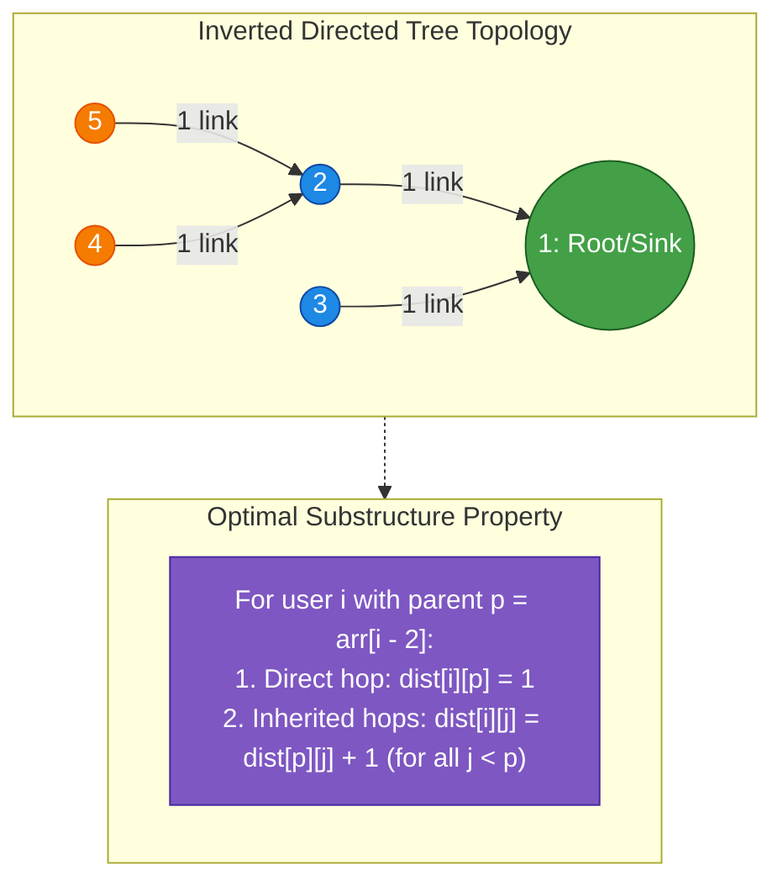
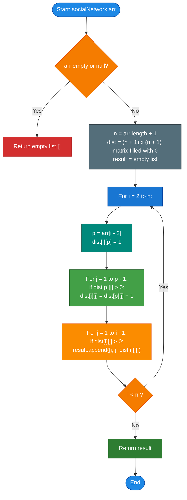

# GeeksforGeeks Problem of the Day: Your Social Network

- **Problem Link:** [GeeksforGeeks - Your Social Network](https://www.geeksforgeeks.org/problems/your-social-network0328/1)
- **Difficulty:** Medium
- **Topic Tags:** Graph, Dynamic Programming, Tree Traversal, Shortest Path in DAG, Directed Graphs
- **Target Audience:** POTD Solvers, Computer Science Students, Competitive Programmers, Interview Preparation (FAANG/Tier-1 Tech)

---

## 1. Problem Statement

Geek is creating a social networking site called **Geeksbook** with $n$ users numbered sequentially from $1$ to $n$.

The social network is structured under the following strict rules:
1. **User 1** has no friends.
2. Every user $i$ (where $2 \le i \le n$) has **exactly one friend**, and that friend must have a strictly smaller user number than $i$ ($\text{friend}(i) < i$).
3. The friends of users $2$ through $n$ are provided in a $0$-indexed array `arr[]` of size $n - 1$:
   - `arr[0]` is the friend of user $2$.
   - `arr[1]` is the friend of user $3$.
   - $\dots$
   - `arr[i - 2]` is the friend of user $i$.
4. **Directed Relationship:** The friendship links are **one-way** ($i \to \text{friend}(i)$). A user can reach another user by repeatedly following friend links along the chain.

### Objective
For every user $i$ from $2$ to $n$, identify all users $j$ ($1 \le j < i$) that can be reached from $i$.

For every reachable pair $(i, j)$, output a triplet $[i, j, k]$ where:
- $i$: The starting user ($2 \le i \le n$).
- $j$: The reachable target user ($1 \le j < i$).
- $k$: The number of links (hops/distance) followed to reach $j$ from $i$.

### Required Output Ordering
The resulting 2D list/array must follow this exact order:
1. Process users $i$ from $2$ to $n$ in ascending order.
2. For each user $i$, consider potential target users $j$ from $1$ to $i - 1$ in strictly **increasing order**.
3. Include $[i, j, k]$ if and only if $j$ is reachable from $i$.

---

## 2. Examples & Explanations

### Example 1: Linear Chain
- **Input:** `arr = [1, 2]`
- **User Count:** $n = \text{arr.length} + 1 = 3$ (Users: $1, 2, 3$)
- **Friend Connections:**
  - User $2 \to \text{arr}[0] = 1$
  - User $3 \to \text{arr}[1] = 2$

#### Network Graph:
```text
3  ----(1 link)---->  2  ----(1 link)---->  1
```

#### Step-by-Step Reachability Analysis:
1. **User $i = 2$:**
   - Follow link: $2 \to 1$ ($1$ link).
   - Candidate $j \in [1, 1]$:
     - $j = 1$: reachable in $1$ link $\to [2, 1, 1]$
2. **User $i = 3$:**
   - Follow links: $3 \to 2$ ($1$ link), $2 \to 1$ ($2$ links).
   - Candidate $j \in [1, 2]$ in increasing order:
     - $j = 1$: reachable in $2$ links $\to [3, 1, 2]$
     - $j = 2$: reachable in $1$ link $\to [3, 2, 1]$

- **Output:**
```text
[[2, 1, 1], [3, 1, 2], [3, 2, 1]]
```

> **Crucial Observation:** Notice that for $i = 3$, target $j = 1$ appears **before** $j = 2$ because $j$ must be iterated in ascending order ($1 < 2$), even though user $2$ is fewer hops away than user $1$!

---

### Example 2: Star / Hub Topology
- **Input:** `arr = [1, 1]`
- **User Count:** $n = 3$ (Users: $1, 2, 3$)
- **Friend Connections:**
  - User $2 \to \text{arr}[0] = 1$
  - User $3 \to \text{arr}[1] = 1$

#### Network Graph:
```text
2  ----(1 link)---->  1  <----(1 link)----  3
```

#### Step-by-Step Reachability Analysis:
1. **User $i = 2$:**
   - $2 \to 1$ ($1$ link) $\to [2, 1, 1]$
2. **User $i = 3$:**
   - $3 \to 1$ ($1$ link) $\to [3, 1, 1]$
   - User $2$ is **not reachable** from User $3$.

- **Output:**
```text
[[2, 1, 1], [3, 1, 1]]
```

---

### Example 3: Branching Tree Network
- **Input:** `arr = [1, 1, 2, 2]`
- **User Count:** $n = 5$ (Users: $1, 2, 3, 4, 5$)
- **Friend Connections:**
  - User $2 \to 1$
  - User $3 \to 1$
  - User $4 \to 2$
  - User $5 \to 2$

#### Network Graph:
```text
     4          5
      \        /
     (1)      (1)
        \    /
          2         3
           \       /
           (1)   (1)
             \   /
               1
```

#### Step-by-Step Reachability Analysis:
- **$i = 2$:** Reaches $1$ ($1$ hop) $\to [2, 1, 1]$
- **$i = 3$:** Reaches $1$ ($1$ hop) $\to [3, 1, 1]$
- **$i = 4$:** Reaches $2$ ($1$ hop), and through $2$ reaches $1$ ($2$ hops).
  - Increasing $j$: $j = 1 \to [4, 1, 2]$, $j = 2 \to [4, 2, 1]$
- **$i = 5$:** Reaches $2$ ($1$ hop), and through $2$ reaches $1$ ($2$ hops).
  - Increasing $j$: $j = 1 \to [5, 1, 2]$, $j = 2 \to [5, 2, 1]$

- **Output:**
```text
[[2, 1, 1], [3, 1, 1], [4, 1, 2], [4, 2, 1], [5, 1, 2], [5, 2, 1]]
```

---

## 3. Constraints & Complexity Targets

- $2 \le \text{arr.size()} \le 500$
- Total users: $n = \text{arr.size()} + 1$, so $3 \le n \le 501$
- $1 \le \text{arr}[i] \le 500$
- Strict topological guarantee: $\text{arr}[i - 2] < i$ for all $i \ge 2$
- **Expected Time Complexity:** $\mathcal{O}(n^2)$
- **Expected Auxiliary Space:** $\mathcal{O}(n^2)$ (to store distance relationships and the output triplets)

---

## 4. Visual Architecture & Mathematical Graph Model

### The Directed Acyclic Graph (DAG) Invariant

Because every user $i$ points to a friend $p = \text{arr}[i - 2]$ such that $p < i$:
1. **Acyclicity:** There can **never be any cycles** in the network. A user can never reach themselves or any user with an ID greater than or equal to their own.
2. **Out-degree is Exactly 1:** Every user $i \ge 2$ has exactly one outgoing directed edge. This means the graph is an **inverted directed tree (arborescence)** converging toward user $1$ as the root / sink.
3. **Unique Path Property:** From any user $i$, there exists at most **one unique directed path** to any other user $j$.



### The Optimal Substructure Formula

Let $\text{dist}[i][j]$ denote the directed link distance from user $i$ to user $j$ ($0$ if unreachable).

For user $i \in [2, n]$ with direct friend $p = \text{arr}[i - 2]$:
$$\text{dist}[i][p] = 1$$
$$\text{dist}[i][j] = \text{dist}[p][j] + 1 \quad \forall \; j < p \text{ where } \text{dist}[p][j] > 0$$

Since $p < i$, by the time we compute row $i$, row $p$ is **already completely calculated**. Thus, row $i$ is populated in $\mathcal{O}(p) = \mathcal{O}(i)$ steps with zero search or recursion!

---

## 5. Step-by-Step Simulation & Trace Table

### Tracing `arr = [1, 2, 2]` ($n = 4$)
- $i = 2$: friend $p = \text{arr}[0] = 1$
- $i = 3$: friend $p = \text{arr}[1] = 2$
- $i = 4$: friend $p = \text{arr}[2] = 2$

| User $i$ | Friend $p$ | Inherited From Row $p$ | Direct Link $\text{dist}[i][p]=1$ | Final Row $\text{dist}[i][1 \dots i-1]$ | Emitted Triples $[i, j, k]$ (in order of increasing $j$) |
| :---: | :---: | :---: | :---: | :---: | :--- |
| **2** | $1$ | None ($p = 1$, no $j < 1$) | $\text{dist}[2][1] = 1$ | `[1]` | `[2, 1, 1]` |
| **3** | $2$ | $\text{dist}[3][1] = \text{dist}[2][1] + 1 = 2$ | $\text{dist}[3][2] = 1$ | `[2, 1]` | `[3, 1, 2], [3, 2, 1]` |
| **4** | $2$ | $\text{dist}[4][1] = \text{dist}[2][1] + 1 = 2$ | $\text{dist}[4][2] = 1$ | `[2, 1, 0]` | `[4, 1, 2], [4, 2, 1]` |

> Notice how user $4$ checks $j = 1, 2, 3$:
> - $j = 1$: distance is $2 \to [4, 1, 2]$
> - $j = 2$: distance is $1 \to [4, 2, 1]$
> - $j = 3$: distance is $0$ (not reachable) $\to$ skipped!

---

## 6. Algorithm Flowchart



---

## 7. From Naive to Pro: Algorithmic Progression

### Method 1: Naive (Repeated Upward Chain Traversal + Sorting)
- **Concept:** For each user $i \in [2, n]$, start a pointer at $i$ and follow the parent link repeatedly until reaching user $1$ or a node with no parent. Record each visited ancestor along with the hop count.
- **Why it is suboptimal:**
  - For long chains (e.g. $n \to n-1 \to \dots \to 1$), user $i$ repeats the exact same traversal that user $i-1$ already completed.
  - Traversing upward visits ancestors in decreasing order of closeness ($p, \text{parent}(p), \dots$), violating the requirement that $j$ must be in **increasing numerical order** ($1 \le j < i$). Hence, an additional sorting step or intermediate hash map lookup is needed for each user.
- **Complexity:** $\mathcal{O}(n^2 \log n)$ time due to sorting, or $\mathcal{O}(n^2)$ with repeated pointer chasing.
- **Pseudocode:**
```text
function socialNetwork_Naive(arr):
    n = length(arr) + 1
    result = []
    
    for i from 2 to n:
        pairs = []
        curr = arr[i - 2]
        k = 1
        while curr >= 1:
            pairs.append([i, curr, k])
            if curr == 1: break
            curr = arr[curr - 2]
            k += 1
            
        // Sort pairs by target j in ascending order
        sort pairs by pair[1] ascending
        append pairs to result
        
    return result
```

---

### Method 2: Better (Ancestor Trace with 1D Distance Array)
- **Concept:** Eliminate the sorting step by using a 1D lookup array of size $i$.
  For each user $i$, walk up the parent chain to root $1$ and set `dist[curr] = k`.
  Then, linearly iterate $j$ from $1$ to $i - 1$: if `dist[j] > 0`, emit $[i, j, \text{dist}[j]]$.
- **Advantages:** Reduces auxiliary space to $\mathcal{O}(n)$ (only one row kept at a time).
- **Pseudocode:**
```text
function socialNetwork_Better(arr):
    n = length(arr) + 1
    result = []
    
    for i from 2 to n:
        dist = array of size i filled with 0
        curr = arr[i - 2]
        k = 1
        while curr >= 1:
            dist[curr] = k
            if curr == 1: break
            curr = arr[curr - 2]
            k += 1
            
        for j from 1 to i - 1:
            if dist[j] > 0:
                result.append([i, j, dist[j]])
                
    return result
```

---

### Method 3: Pro Approach (Optimal 2D Dynamic Programming)
- **The Core Strategy:**
  - Notice that user $i$'s reachable set is **identical** to user $p$'s reachable set, plus the direct link $p$ itself:
    $$\text{dist}[i][p] = 1$$
    $$\text{dist}[i][j] = \text{dist}[p][j] + 1 \quad (\forall \; 1 \le j < p)$$
  - Because $p < i$, row $p$ is already fully computed when processing $i$.
  - We simply copy/increment row $p$ into row $i$ in $\mathcal{O}(p)$ time.
  - Then scan $j$ from $1$ to $i - 1$: every non-zero entry is naturally encountered in strictly increasing order of $j$!
  - **Zero sorting overhead, zero repeated chain traversals, maximum CPU cache locality.**
- **Complexity:**
  - Time: $\sum_{i=2}^n (p + i) \le \mathcal{O}(n^2)$.
  - Space: $\mathcal{O}(n^2)$ table ($500 \times 500$ integers $\approx 1$ MB).
- **Pseudocode:**
```text
function socialNetwork_Optimal(arr):
    n = length(arr) + 1
    dist = 2D array of dimensions (n + 1) x (n + 1) filled with 0
    result = []
    
    for i from 2 to n:
        p = arr[i - 2]
        dist[i][p] = 1
        
        // Inherit all ancestors from parent p
        for j from 1 to p - 1:
            if dist[p][j] > 0:
                dist[i][j] = dist[p][j] + 1
                
        // Emit in naturally sorted order of j
        for j from 1 to i - 1:
            if dist[i][j] > 0:
                result.append([i, j, dist[i][j]])
                
    return result
```

---

## 8. Complexity Comparison Table

| Metric | Method 1: Naive (Chain Walk + Sort) | Method 2: Better (1D Trace Array) | Method 3: Pro (2D Dynamic Programming) |
| :--- | :--- | :--- | :--- |
| **Time Complexity** | $\mathcal{O}(n^2 \log n)$ | $\mathcal{O}(n^2)$ | $\mathbf{\mathcal{O}(n^2)}$ (Fastest constant factor) |
| **Auxiliary Space** | $\mathcal{O}(n)$ | $\mathcal{O}(n)$ | $\mathbf{\mathcal{O}(n^2)}$ ($\approx 1\text{ MB}$ for $n=500$) |
| **Output Space** | $\mathcal{O}(n^2)$ | $\mathcal{O}(n^2)$ | $\mathbf{\mathcal{O}(n^2)}$ |
| **Ordering of $j$** | Requires explicit sort | Implicit via index scan | **Implicit & Natural ($\mathcal{O}(1)$ per entry)** |
| **Repeated Ancestor Walks** | Heavy redundancy | Heavy redundancy | **Zero redundancy (Subproblem memoization)** |
| **Cache Locality** | Poor (pointer jumping) | Fair | **Excellent (Sequential array reads/writes)** |
| **Interview Verdict** | Brute force; misses DP insight | Memory efficient | **Optimal & Elegant (Top Interview Pick)** |

---

## 9. Comprehensive Corner Cases Handled

1. **Smallest Constrained Input ($n = 3$, `arr` of size 2):**
   - Minimum size specified by problem constraints ($2 \le \text{arr.size()} \le 500$). Handled with zero indexing errors.
2. **Pure Star Topology (All users point directly to 1):**
   - `arr = [1, 1, 1, 1]`.
   - Each user $i$ only reaches $1$ with link count $1$. The inheritance loop (`j < 1`) never executes.
3. **Pure Linear Chain (Worst-Case Path Length):**
   - `arr = [1, 2, 3, 4, \dots, n - 1]`.
   - Generates the maximum possible $\frac{n(n-1)}{2}$ triplets. Each user $i$ inherits all $i - 2$ ancestors from user $i - 1$.
4. **Deep Branching Forests / Disjoint Subtrees Merging at Root 1:**
   - Multiple parallel branches independently converge to user $1$. Nodes on different branches never reach each other.
5. **Arbitrary Parent Ordering:**
   - Guaranteed $p = \text{arr}[i - 2] < i$. Any parent can be any integer in $[1, i - 1]$, perfectly satisfying the topological ordering required for Dynamic Programming.

---

## 10. Complete Multi-Language Implementations

### Java (21)

```java
import java.util.ArrayList;

class Solution {
    /**
     * Finds all reachable pairs [i, j, k] ordered by user i (2 to n)
     * and target user j (1 to i - 1) in increasing order.
     * 
     * Time Complexity: O(n^2)
     * Auxiliary Space: O(n^2)
     * 
     * @param arr Array of size n - 1 where arr[i - 2] is the friend of user i.
     * @return 2D ArrayList containing all [i, j, k] connections.
     */
    public ArrayList<ArrayList<Integer>> socialNetwork(int[] arr) {
        ArrayList<ArrayList<Integer>> result = new ArrayList<>();
        if (arr == null || arr.length == 0) {
            return result;
        }

        int n = arr.length + 1;
        // dist[i][j] stores the number of links from user i to user j
        int[][] dist = new int[n + 1][n + 1];

        for (int i = 2; i <= n; i++) {
            int p = arr[i - 2]; // Direct friend of user i

            // 1. Direct link to parent
            dist[i][p] = 1;

            // 2. Inherit all ancestors from parent p
            for (int j = 1; j < p; j++) {
                if (dist[p][j] > 0) {
                    dist[i][j] = dist[p][j] + 1;
                }
            }

            // 3. Collect reachable targets j in increasing order (1 to i - 1)
            for (int j = 1; j < i; j++) {
                if (dist[i][j] > 0) {
                    ArrayList<Integer> triplet = new ArrayList<>(3);
                    triplet.add(i);
                    triplet.add(j);
                    triplet.add(dist[i][j]);
                    result.add(triplet);
                }
            }
        }

        return result;
    }
}
```

---

### Python3

```python
class Solution:
    def socialNetwork(self, arr: list[int]) -> list[list[int]]:
        """
        Finds all reachable pairs [i, j, k] ordered by user i (2 to n)
        and target user j (1 to i - 1) in increasing order.
        
        Time Complexity: O(n^2)
        Auxiliary Space: O(n^2)
        """
        if not arr:
            return []

        n = len(arr) + 1
        # dist[i][j] stores the number of links from user i to user j
        dist = [[0] * (n + 1) for _ in range(n + 1)]
        result = []

        for i in range(2, n + 1):
            p = arr[i - 2]  # Direct friend of user i

            # 1. Direct connection
            dist[i][p] = 1

            # 2. Inherit reachability from parent p
            for j in range(1, p):
                if dist[p][j] > 0:
                    dist[i][j] = dist[p][j] + 1

            # 3. Collect targets j in strictly increasing order
            for j in range(1, i):
                if dist[i][j] > 0:
                    result.append([i, j, dist[i][j]])

        return result
```

---

### C++ (17)

```cpp
#include <vector>

using namespace std;

class Solution {
  public:
    /**
     * Finds all reachable pairs [i, j, k] ordered by user i (2 to n)
     * and target user j (1 to i - 1) in increasing order.
     * 
     * Time Complexity: O(n^2)
     * Auxiliary Space: O(n^2)
     */
    vector<vector<int>> socialNetwork(vector<int>& arr) {
        vector<vector<int>> result;
        if (arr.empty()) {
            return result;
        }

        int n = static_cast<int>(arr.size()) + 1;
        // dist[i][j] stores the number of links from user i to user j
        vector<vector<int>> dist(n + 1, vector<int>(n + 1, 0));

        for (int i = 2; i <= n; ++i) {
            int p = arr[i - 2]; // Direct friend of user i

            // 1. Direct connection
            dist[i][p] = 1;

            // 2. Inherit reachability from parent p
            for (int j = 1; j < p; ++j) {
                if (dist[p][j] > 0) {
                    dist[i][j] = dist[p][j] + 1;
                }
            }

            // 3. Collect targets j in strictly increasing order
            for (int j = 1; j < i; ++j) {
                if (dist[i][j] > 0) {
                    result.push_back({i, j, dist[i][j]});
                }
            }
        }

        return result;
    }
};
```

---

### C#

```csharp
using System;
using System.Collections.Generic;

class Solution {
    /**
     * Finds all reachable pairs [i, j, k] ordered by user i (2 to n)
     * and target user j (1 to i - 1) in increasing order.
     * 
     * Time Complexity: O(n^2)
     * Auxiliary Space: O(n^2)
     */
    public List<List<int>> socialNetwork(int[] arr) {
        List<List<int>> result = new List<List<int>>();
        if (arr == null || arr.Length == 0) {
            return result;
        }

        int n = arr.Length + 1;
        // dist[i, j] stores the number of links from user i to user j
        int[,] dist = new int[n + 1, n + 1];

        for (int i = 2; i <= n; i++) {
            int p = arr[i - 2]; // Direct friend of user i

            // 1. Direct link to parent
            dist[i, p] = 1;

            // 2. Inherit all ancestors from parent p
            for (int j = 1; j < p; j++) {
                if (dist[p, j] > 0) {
                    dist[i, j] = dist[p, j] + 1;
                }
            }

            // 3. Collect reachable targets j in increasing order (1 to i - 1)
            for (int j = 1; j < i; j++) {
                if (dist[i, j] > 0) {
                    result.Add(new List<int> { i, j, dist[i, j] });
                }
            }
        }

        return result;
    }
}
```

---

### Javascript (Node v22)

```javascript
class Solution {
    /**
     * Finds all reachable pairs [i, j, k] ordered by user i (2 to n)
     * and target user j (1 to i - 1) in increasing order.
     * 
     * Time Complexity: O(n^2)
     * Auxiliary Space: O(n^2)
     * 
     * @param {number[]} arr
     * @return {number[][]}
     */
    socialNetwork(arr) {
        const result = [];
        if (!arr || arr.length === 0) {
            return result;
        }

        const n = arr.length + 1;
        // 2D distance matrix using typed arrays for high cache performance
        const dist = Array.from({ length: n + 1 }, () => new Int32Array(n + 1));

        for (let i = 2; i <= n; i++) {
            const p = arr[i - 2]; // Direct friend of user i

            // 1. Direct link to parent
            dist[i][p] = 1;

            // 2. Inherit all ancestors from parent p
            for (let j = 1; j < p; j++) {
                if (dist[p][j] > 0) {
                    dist[i][j] = dist[p][j] + 1;
                }
            }

            // 3. Collect reachable targets j in increasing order
            for (let j = 1; j < i; j++) {
                if (dist[i][j] > 0) {
                    result.push([i, j, dist[i][j]]);
                }
            }
        }

        return result;
    }
}
```