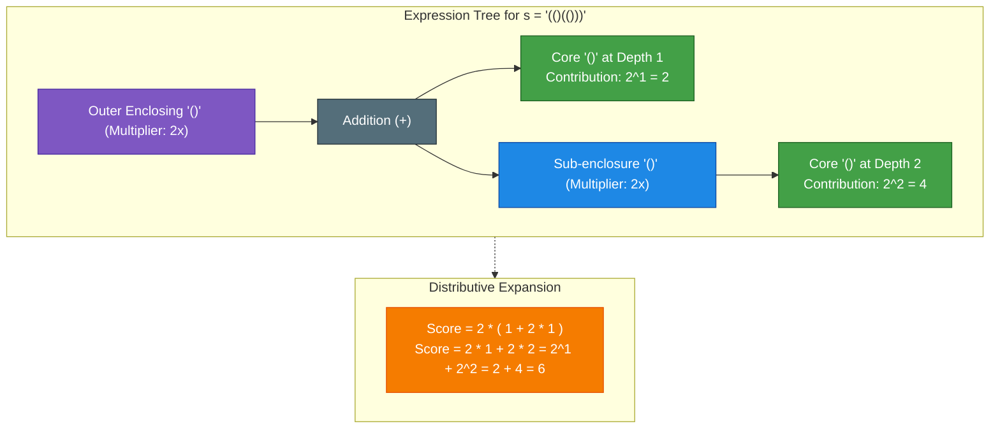
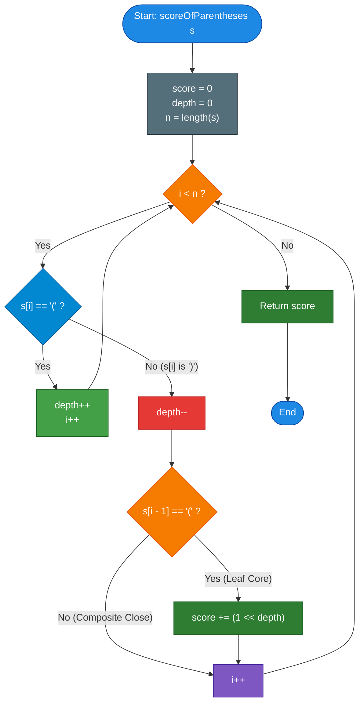

# LeetCode Problem of the Day: Score of Parentheses

- **Problem Link:** [LeetCode 856 - Score of Parentheses](https://leetcode.com/problems/score-of-parentheses/)
- **Difficulty:** Medium
- **Topic Tags:** String, Stack, Bit Manipulation, Tree Parsing, Divide and Conquer, Greedy
- **Target Audience:** POTD Solvers, Computer Science Students, Competitive Programmers, Interview Preparation (FAANG/Tier-1 Tech)

---

## 1. Problem Statement

Given a balanced parentheses string `s`, compute and return the **score** of the string based on the following recursive evaluation rules:

1. **Base Pair:**
   An adjacent pair `"()"` has a score of $\mathbf{1}$.
2. **Concatenation Rule:**
   $AB$ has a score of $\mathbf{A + B}$, where $A$ and $B$ are balanced parentheses strings.
3. **Nesting Rule:**
   $(A)$ has a score of $\mathbf{2 \times A}$, where $A$ is a balanced parentheses string.

---

## 2. Examples & Explanations

### Example 1: Fundamental Base Pair
- **Input:** `s = "()"`
- **Output:** `1`
- **Explanation:** This is the base case `"()"`, which evaluates directly to $1$.

---

### Example 2: Simple Nesting
- **Input:** `s = "(())"`
- **Output:** `2`
- **Explanation:** 
  - The inner substring is `"()"`, having score $1$.
  - The outer brackets double this score: $2 \times 1 = 2$.

---

### Example 3: Sequential Concatenation
- **Input:** `s = "()()"`
- **Output:** `2`
- **Explanation:** 
  - Two adjacent base pairs: `"()"` and `"()"`.
  - By the concatenation rule: $\text{score} = 1 + 1 = 2$.

---

### Example 4: Mixed Nesting and Concatenation
- **Input:** `s = "(()(()))"`
- **Output:** `6`
- **Explanation:**
  - Let us break down the interior of the outer enclosing pair `( ... )`:
    - First term: `()` $\implies 1$.
    - Second term: `(())` $\implies 2 \times 1 = 2$.
    - Inner sum: $1 + 2 = 3$.
  - Outer enclosing brackets double the entire inner sum:
    $$\text{Total Score} = 2 \times (1 + 2) = 2 \times 3 = 6$$

---

## 3. Constraints

- $2 \le |s| \le 50$
- `s` consists solely of the characters `'('` and `')'`.
- `s` is guaranteed to be a **valid, balanced parentheses string**.
- **Expected Time Complexity:** $\mathcal{O}(N)$
- **Expected Auxiliary Space:** $\mathcal{O}(1)$ optimal (or $\mathcal{O}(N)$ via Stack)

---

## 4. Visual Architecture & The Core-Counting Model

### The Distributive Property of Multiplication

In arithmetic, multiplication distributes over addition:
$$2 \times (A + B) = 2 \times A + 2 \times B$$

Notice that in parentheses strings:
- Every score is ultimately produced by the atomic unit `"()"`.
- Whenever a `"()"` is nested inside $d$ layers of outer parentheses, its score of $1$ is multiplied by $2$ exactly $d$ times:
$$\text{Contribution of a core } "()" \text{ at depth } d = 1 \times 2^d = 2^d = 1 \ll d$$



### The Invariant: Identify Immediate `"()"` Adjacent Pairs

- When we scan `s`, we track `depth` (the number of currently open, unclosed `'('` brackets).
- Whenever we see `'('`, we increment `depth`.
- Whenever we see `')'`:
  - We decrement `depth`.
  - **The Key Insight:** If the immediately preceding character was `'('` (`s[i - 1] == '('`), then index $i$ forms a leaf/core `"()"`! Its contribution to the total score is:
    $$2^{\text{depth}} = 1 \ll \text{depth}$$
  - If `s[i - 1] == ')'`, this closing bracket is just closing an outer composite structure $(A)$ whose inner leaves have already been accounted for. It contributes $0$ to the sum!

---

## 5. Step-by-Step Simulation & Trace Table

### Tracing `s = "(()(()))"` ($N = 8$)

| Index $i$ | Char `s[i]` | Previous `s[i-1]` | Depth Before | Depth After | Core `"()"`? | Term Added ($1 \ll \text{depth}$) | Running Score |
| :---: | :---: | :---: | :---: | :---: | :---: | :---: | :---: |
| **0** | `'('` | — | 0 | 1 | No | — | 0 |
| **1** | `'('` | `'('` | 1 | 2 | No | — | 0 |
| **2** | `')'` | `'('` | 2 | 1 | **YES (Core)** | $1 \ll 1 = \mathbf{2}$ | **2** |
| **3** | `'('` | `')'` | 1 | 2 | No | — | 2 |
| **4** | `'('` | `'('` | 2 | 3 | No | — | 2 |
| **5** | `')'` | `'('` | 3 | 2 | **YES (Core)** | $1 \ll 2 = \mathbf{4}$ | $2 + 4 = \mathbf{6}$ |
| **6** | `')'` | `')'` | 2 | 1 | No (Closing $(A)$) | — | 6 |
| **7** | `')'` | `')'` | 1 | 0 | No (Closing outer) | — | 6 |

**Final Output:** `6`

---

## 6. Algorithm Flowchart



---

## 7. From Naive to Pro: Algorithmic Progression

### Method 1: Naive (Recursive Subproblem Splitting / Divide & Conquer)
- **Concept:** Follow the formal grammar rules directly:
  1. Find balanced components $A$ and $B$. If the string can be split as $s = A + B$, then $\text{score}(s) = \text{score}(A) + \text{score}(B)$.
  2. If the string cannot be split (i.e. the entire string is wrapped in an outer pair $s = (A)$), then $\text{score}(s) = 2 \times \text{score}(A)$.
  3. Base case: If $s == \text{"()"}$, return $1$.
- **Why it is suboptimal:**
  - Finding matching brackets across multiple recursive invocations repeats string traversals.
  - Substring creation incurs string allocation overhead.
- **Complexity:** $\mathcal{O}(N^2)$ worst case (e.g. deeply nested string `"((((...))))"`), $\mathcal{O}(N)$ recursion space.
- **Pseudocode:**
```text
function scoreOfParentheses_Naive(s, left, right):
    ans = 0
    bal = 0
    for i from left to right:
        bal += (s[i] == '(' ? 1 : -1)
        if bal == 0:
            if i - left == 1:
                ans += 1
            else:
                ans += 2 * scoreOfParentheses_Naive(s, left + 1, i - 1)
            left = i + 1
    return ans
```

---

### Method 2: Better (Stack-Based Frame Evaluation)
- **Concept:** Maintain an explicit stack of scores.
  - Push $0$ initially onto the stack (representing score at the current scope).
  - When seeing `'('`, push a new scope initialized with $0$.
  - When seeing `')'`, pop the top scope score $v$:
    - The score for this closed block is $\max(2 \times v, 1)$ ($1$ if empty, $2v$ if non-empty).
    - Add this score to the new top of the stack (accumulate into the parent scope).
  - At the end, the stack top contains the total score.
- **Advantages:** Eliminates recursion; runs in a clean single linear pass.
- **Complexity:** $\mathcal{O}(N)$ Time, $\mathcal{O}(N)$ Space.
- **Pseudocode:**
```text
function scoreOfParentheses_Stack(s):
    stack = [0]
    for char in s:
        if char == '(':
            stack.push(0)
        else:
            v = stack.pop()
            top = stack.pop()
            stack.push(top + max(2 * v, 1))
    return stack.top()
```

---

### Method 3: Pro Approach (Core Counting with Invariant Bit Shift)
- **The Core Strategy:**
  - Leverage the distributive property: every score is the sum of $2^{\text{depth}}$ for every atomic `"()"` core.
  - Maintain a single integer `depth`.
  - When scanning $s[i]$:
    - If $s[i] == \text{'('}$, `depth++`.
    - If $s[i] == \text{')'}$, `depth--`.
      - If $s[i - 1] == \text{'('}$, `score += (1 << depth)`.
  - Because $|s| \le 50$, the maximum depth is $\le 25$.
  - $1 \ll 25 = 33,554,432$, which fits easily within a standard 32-bit signed integer without any overflow.
  - **Zero heap allocations, zero stack frames, single pass, $\mathcal{O}(1)$ space!**
- **Complexity:**
  - Time: $\mathcal{O}(N)$
  - Space: $\mathcal{O}(1)$
- **Pseudocode:**
```text
function scoreOfParentheses_Optimal(s):
    score = 0
    depth = 0
    for i from 0 to length(s) - 1:
        if s[i] == '(':
            depth += 1
        else:
            depth -= 1
            if s[i - 1] == '(':
                score += (1 << depth)
    return score
```

---

## 8. Complexity Comparison Table

| Metric | Method 1: Naive (Recursive Split) | Method 2: Better (Stack Frame) | Method 3: Pro (Bit-Shift Invariant) |
| :--- | :--- | :--- | :--- |
| **Time Complexity** | $\mathcal{O}(N^2)$ | $\mathcal{O}(N)$ | $\mathbf{\mathcal{O}(N)}$ (Fastest single pass) |
| **Auxiliary Space** | $\mathcal{O}(N)$ (Call stack) | $\mathcal{O}(N)$ (Explicit stack) | $\mathbf{\mathcal{O}(1)}$ (Only 2 integer variables) |
| **Memory Allocations** | Multiple string slices | Dynamic stack resizing | **Zero dynamic allocation** |
| **Bitwise Operations** | None | None | **`1 << depth` ($\mathcal{O}(1)$ hardware ALU)** |
| **Code Verbosity** | High ($\approx 30$ lines) | Moderate ($\approx 20$ lines) | **Minimal ($\approx 10$ lines)** |
| **Interview Verdict** | Brute force parsing | Standard textbook solution | **Mastery level (Gold Standard)** |

---

## 9. Comprehensive Corner Cases Handled

1. **Smallest Valid String ($s = \text{"()"}$):**
   - $i=0 \implies \text{depth}=1$.
   - $i=1 \implies \text{depth}=0, s[0]=='(', \text{score} += (1 \ll 0) = 1$. Returns $1$.
2. **Deeply Nested String ($s = \text{"(((())))"}$):**
   - Single core at center depth $3 \implies 1 \ll 3 = 8$. All outer closing brackets properly decrement depth without re-adding.
3. **Flat Concatenation ($s = \text{"()()()()"} $):**
   - 4 consecutive cores, each at depth $0 \implies 1 + 1 + 1 + 1 = 4$.
4. **Multiple Branches at Different Depths ($s = \text{"(()(()))"}$):**
   - Core 1 at depth 1: $1 \ll 1 = 2$.
   - Core 2 at depth 2: $1 \ll 2 = 4$.
   - Total: $2 + 4 = 6$.
5. **No Integer Overflow:**
   - Maximum length $|s| \le 50 \implies \text{max depth} \le 25 \implies 1 \ll 25 = 33,554,432 < 2^{31} - 1$. Fits perfectly in signed 32-bit integers.

---

## 10. Complete Multi-Language Implementations

### Java

```java
class Solution {
    /**
     * LeetCode 856: Score of Parentheses
     * Optimal Bit-Shift Invariant Approach
     * 
     * Time Complexity: O(N) | Space Complexity: O(1)
     */
    public int scoreOfParentheses(String s) {
        int score = 0;
        int depth = 0;
        int n = s.length();

        for (int i = 0; i < n; i++) {
            if (s.charAt(i) == '(') {
                depth++;
            } else {
                depth--;
                // Detect atomic core "()"
                if (s.charAt(i - 1) == '(') {
                    score += 1 << depth;
                }
            }
        }

        return score;
    }
}
```

---

### Python3

```python
class Solution:
    def scoreOfParentheses(self, s: str) -> int:
        """
        LeetCode 856: Score of Parentheses
        Optimal Bit-Shift Invariant Approach
        
        Time Complexity: O(N) | Space Complexity: O(1)
        """
        score = 0
        depth = 0

        for i, ch in enumerate(s):
            if ch == '(':
                depth += 1
            else:
                depth -= 1
                # Detect atomic core "()"
                if s[i - 1] == '(':
                    score += 1 << depth

        return score
```

---

### C

```c
/**
 * LeetCode 856: Score of Parentheses
 * Optimal Bit-Shift Invariant Approach
 * 
 * Time Complexity: O(N) | Space Complexity: O(1)
 */
int scoreOfParentheses(char* s) {
    int score = 0;
    int depth = 0;

    for (int i = 0; s[i] != '\0'; i++) {
        if (s[i] == '(') {
            depth++;
        } else {
            depth--;
            // Detect atomic core "()"
            if (s[i - 1] == '(') {
                score += 1 << depth;
            }
        }
    }

    return score;
}
```

---

### C++

```cpp
#include <string>

using namespace std;

class Solution {
public:
    /**
     * LeetCode 856: Score of Parentheses
     * Optimal Bit-Shift Invariant Approach
     * 
     * Time Complexity: O(N) | Space Complexity: O(1)
     */
    int scoreOfParentheses(string s) {
        int score = 0;
        int depth = 0;
        int n = s.length();

        for (int i = 0; i < n; ++i) {
            if (s[i] == '(') {
                depth++;
            } else {
                depth--;
                // Detect atomic core "()"
                if (s[i - 1] == '(') {
                    score += 1 << depth;
                }
            }
        }

        return score;
    }
};
```

---

### C#

```csharp
public class Solution {
    /**
     * LeetCode 856: Score of Parentheses
     * Optimal Bit-Shift Invariant Approach
     * 
     * Time Complexity: O(N) | Space Complexity: O(1)
     */
    public int ScoreOfParentheses(string s) {
        int score = 0;
        int depth = 0;
        int n = s.Length;

        for (int i = 0; i < n; i++) {
            if (s[i] == '(') {
                depth++;
            } else {
                depth--;
                // Detect atomic core "()"
                if (s[i - 1] == '(') {
                    score += 1 << depth;
                }
            }
        }

        return score;
    }
}
```

---

### Javascript

```javascript
/**
 * LeetCode 856: Score of Parentheses
 * Optimal Bit-Shift Invariant Approach
 * 
 * Time Complexity: O(N) | Space Complexity: O(1)
 * 
 * @param {string} s
 * @return {number}
 */
var scoreOfParentheses = function(s) {
    let score = 0;
    let depth = 0;
    const n = s.length;

    for (let i = 0; i < n; i++) {
        if (s[i] === '(') {
            depth++;
        } else {
            depth--;
            // Detect atomic core "()"
            if (s[i - 1] === '(') {
                score += 1 << depth;
            }
        }
    }

    return score;
};
```

---

### TypeScript

```typescript
/**
 * LeetCode 856: Score of Parentheses
 * Optimal Bit-Shift Invariant Approach
 * 
 * Time Complexity: O(N) | Space Complexity: O(1)
 * 
 * @param s - A balanced parentheses string
 * @returns The total computed score
 */
function scoreOfParentheses(s: string): number {
    let score: number = 0;
    let depth: number = 0;
    const n: number = s.length;

    for (let i: number = 0; i < n; i++) {
        if (s[i] === '(') {
            depth++;
        } else {
            depth--;
            // Detect atomic core "()"
            if (s[i - 1] === '(') {
                score += 1 << depth;
            }
        }
    }

    return score;
}
```
