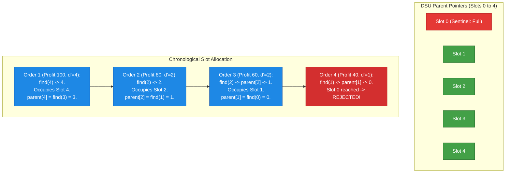
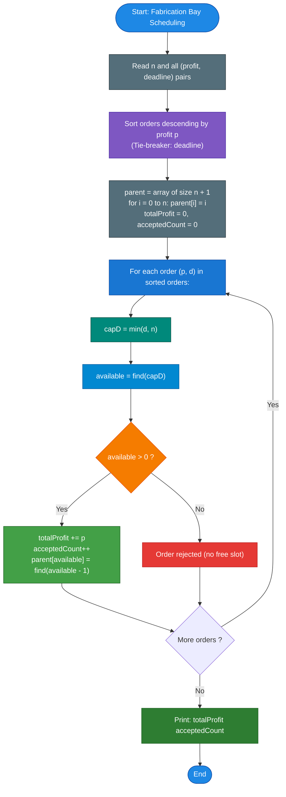

# Unstop Problem of the Day: Kabir's Fabrication Bay Order Scheduling

- **Platform:** [Unstop](https://unstop.com/)
- **Difficulty:** Medium
- **Topic Tags:** Greedy Algorithms, Disjoint Set Union (DSU), Priority Queue / Min-Heap, Sorting, Matroid Theory, Slot Allocation
- **Target Audience:** POTD Solvers, Computer Science Students, Competitive Programmers, Interview Preparation (FAANG / Tier-1 Systems Engineering)

---

## 1. Problem Statement

Kabir operates a high-precision custom fabrication bay. Each finished order requires exactly one completion slot out of an effectively infinite range of integer slots ($1, 2, 3, \dots$), as the bay has been operational for years and slot numbers increment continuously.

For today's operation, Kabir receives a batch of $n$ pending custom orders. Each order $i$ carries:
1. A **profit value** $p_i$ awarded if the order is completed.
2. A **deadline slot** $d_i$, indicating the order must occupy some integer completion slot $t$ such that $1 \le t \le d_i$. It may finish earlier than $d_i$ if a slot is vacant.

### Operating Rules & Objectives
- **Exclusive Slot Capacity:** Every completion slot can accommodate **at most one** order.
- **Selective Admission:** Kabir is not required to accept every order. Any number of orders may be declined.
- **Goal:** Select a subset of orders and assign each accepted order to an available slot $\le$ its deadline such that the **combined profit is maximized**.
- **The Deadline Capping Observation:** Although individual deadline values can be astronomically large ($d_i \le 10^9$), Kabir knows that with only $n$ total pending orders, no accepted order will ever need to occupy a slot greater than $n$.

Before locking in the schedule, Kabir wants to determine two metrics:
1. The **maximum achievable total profit**.
2. The **total count of orders accepted** in that optimal arrangement.

---

## 2. Examples & Explanations

### Sample Testcase 0

**Input:**
```text
4
100 1000000000
80 2
60 2
40 1
```

**Output:**
```text
240 3
```

**Step-by-Step Walkthrough:**
1. **Analyze Capped Deadlines ($n = 4$):**
   - Order 1: Profit $= 100$, Deadline $= 10^9 \implies$ Capped at $\min(10^9, 4) = 4$.
   - Order 2: Profit $= 80$, Deadline $= 2 \implies$ Capped at $\min(2, 4) = 2$.
   - Order 3: Profit $= 60$, Deadline $= 2 \implies$ Capped at $\min(2, 4) = 2$.
   - Order 4: Profit $= 40$, Deadline $= 1 \implies$ Capped at $\min(1, 4) = 1$.
2. **Sort Orders by Profit Descending:**
   - Order 1 (Profit: 100, Capped Deadline: 4)
   - Order 2 (Profit: 80, Capped Deadline: 2)
   - Order 3 (Profit: 60, Capped Deadline: 2)
   - Order 4 (Profit: 40, Capped Deadline: 1)
3. **Greedy Slot Placement (Latest Available Slot $\le d'$):**
   - **Order 1 (Profit 100):** Seeks latest free slot $\le 4 \implies$ Takes **Slot 4**.
   - **Order 2 (Profit 80):** Seeks latest free slot $\le 2 \implies$ Takes **Slot 2**.
   - **Order 3 (Profit 60):** Seeks latest free slot $\le 2$. Slot 2 is occupied $\implies$ Takes **Slot 1**.
   - **Order 4 (Profit 40):** Seeks latest free slot $\le 1$. Slot 1 is already taken $\implies$ **Rejected**.
4. **Summary:**
   - Total Profit $= 100 + 80 + 60 = 240$.
   - Accepted Orders $= 3$.

---

### Sample Testcase 1

**Input:**
```text
3
50 1
50 2
50 3
```

**Output:**
```text
150 3
```

**Explanation:**
- There are $3$ orders with deadlines $1, 2, 3$.
- Each order can directly occupy its corresponding slot:
  - Slot 1: Order with deadline 1 (Profit 50)
  - Slot 2: Order with deadline 2 (Profit 50)
  - Slot 3: Order with deadline 3 (Profit 50)
- Total Profit $= 50 + 50 + 50 = 150$.
- Accepted Orders $= 3$.

---

## 3. Constraints & System Specifications

- $1 \le n \le 200,000$ (Number of pending orders)
- $1 \le p_i \le 1,000,000,000$ ($10^9$)
- $1 \le d_i \le 1,000,000,000$ ($10^9$)
- **64-bit Integer Requirement:** The maximum possible total profit is $200,000 \times 10^9 = 2 \times 10^{14}$, which exceeds the signed 32-bit integer limit ($\approx 2.14 \times 10^9$). The accumulator **must** use a 64-bit integer (`long long` in C/C++, `long` in Java/C#, `BigInt` in JS/TS).
- Time Limit: $2.0$ seconds
- Memory Limit: $256$ MB

---

## 4. Visual Architecture & The DSU Slot Scheduling Model

### The Deadline Capping Invariant (Pigeonhole Principle)

> **Theorem (Capped Time Horizon):**  
> For any set of $n$ orders, no order needs to be scheduled at a slot index greater than $n$.
> 
> **Proof:**  
> Suppose an accepted order is assigned to slot $t > n$. Since at most $n$ orders are accepted in total, and they occupy at most $n$ slots, by the Pigeonhole Principle there must be at least $(t - n)$ vacant slots in the range $[1, t - 1]$. Shifting the order from slot $t$ to any vacant slot in $[1, n]$ preserves feasibility (since the new slot is strictly $< t \le d$). Hence, we can safely replace each deadline with:
> $$d'_i = \min(d_i, n)$$

### Disjoint Set Union (DSU) for $\mathcal{O}(\alpha(n))$ Slot Finding

To schedule an order with capped deadline $d'$, we want to assign it to the **latest free slot $\le d'$** (to leave earlier slots open for orders with tighter deadlines).

Instead of searching backwards linearly in $\mathcal{O}(n)$ time per order, we maintain a Disjoint Set Union (Union-Find) structure over slots $\{0, 1, 2, \dots, n\}$:
- `parent[s]` represents the **latest available vacant slot** at or before $s$.
- Initially, every slot is vacant: `parent[s] = s` for all $0 \le s \le n$.
- When an order requests slot $s$, we call `find(s)`.
  - If `find(s) > 0`, that slot is vacant! We assign the order to `find(s)`.
  - We then occupy that slot by linking it to the set of the slot before it:
    $$\text{parent}[\text{available}] = \text{find}(\text{available} - 1)$$
  - If `find(s) == 0`, all slots $\le s$ are occupied, so the order is rejected.



---

## 5. Step-by-Step Simulation & Trace Table

### Tracing Sample 0: $n = 4$
Orders sorted by profit descending:
1. Order 1: $p = 100, d = 10^9 \implies d' = 4$
2. Order 2: $p = 80, d = 2 \implies d' = 2$
3. Order 3: $p = 60, d = 2 \implies d' = 2$
4. Order 4: $p = 40, d = 1 \implies d' = 1$

Initial DSU array: `parent = [0, 1, 2, 3, 4]`

| Step | Order $(p, d')$ | Queried Slot `capD` | `available = find(capD)` | Action Taken | DSU Parent Update | Running Total Profit | Accepted Count |
| :---: | :---: | :---: | :---: | :--- | :--- | :---: | :---: |
| **1** | $(100, 4)$ | $4$ | **4** | Accept into Slot 4 | `parent[4] = find(3) = 3` | $100$ | $1$ |
| **2** | $(80, 2)$ | $2$ | **2** | Accept into Slot 2 | `parent[2] = find(1) = 1` | $180$ | $2$ |
| **3** | $(60, 2)$ | $2$ | **1** (via `parent[2]`) | Accept into Slot 1 | `parent[1] = find(0) = 0` | **240** | **3** |
| **4** | $(40, 1)$ | $1$ | **0** (via `parent[1]`) | **Reject** (No slot free) | None | **240** | **3** |

**Final Result:** `240 3`

---

## 6. Algorithm Flowchart



---

## 7. From Naive to Pro: Algorithmic Progression

### Method 1: Naive (Linear Backward Slot Search)
- **Concept:** Sort orders by profit descending. For each order, linearly scan backwards from $d'$ down to $1$ in an array `occupied[1 ... n]` to find the first unused slot.
- **Why it is suboptimal:** In worst-case inputs where multiple orders share the same deadline, every order scans $\mathcal{O}(n)$ slots backwards.
- **Complexity:** $\mathcal{O}(n^2)$ time $\implies$ For $n = 200,000$, operations exceed $4 \times 10^{10}$, causing **Time Limit Exceeded (TLE)**.
- **Pseudocode:**
```text
function solve_Naive(orders, n):
    sort orders by profit descending
    occupied = boolean array of size n + 1 (all false)
    totalProfit = 0, count = 0
    
    for each (p, d) in orders:
        capD = min(d, n)
        for slot from capD down to 1:
            if not occupied[slot]:
                occupied[slot] = true
                totalProfit += p
                count += 1
                break
    return totalProfit, count
```

---

### Method 2: Better (Earliest Deadline First + Min-Heap)
- **Concept:** Sort orders in **ascending order of deadline** $d$. Maintain a Min-Heap storing the profits of accepted orders.
  - If `heap.size() < order.deadline`, accept the order and push its profit.
  - Else if `order.profit > heap.top()`, the new order is more profitable than the least profitable order currently accepted $\implies$ pop the minimum profit and push the new profit.
- **Advantages:** Runs in $\mathcal{O}(n \log n)$ time.
- **Complexity:** Time $\mathcal{O}(n \log n)$, Space $\mathcal{O}(n)$.
- **Pseudocode:**
```text
function solve_MinHeap(orders, n):
    sort orders by deadline ascending
    heap = MinHeap()
    
    for each (p, d) in orders:
        if heap.size() < d:
            heap.push(p)
        else if p > heap.top():
            heap.pop()
            heap.push(p)
            
    return sum(heap), heap.size()
```

---

### Method 3: Pro Approach (Optimal DSU with Deadline Capping)
- **The Core Strategy:**
  - Sort orders in descending order of profit.
  - Cap each deadline at $n$: $d' = \min(d, n)$.
  - Use Disjoint Set Union with path compression. Finding the latest free slot takes nearly $\mathcal{O}(1)$ amortized time ($\mathcal{O}(\alpha(n))$).
  - Marking a slot as used is a single union operation: `parent[slot] = find(slot - 1)`.
  - **Zero pointer jumping, flat contiguous memory arrays, minimal cache misses.**
- **Complexity:**
  - Sorting: $\mathcal{O}(n \log n)$
  - Scheduling Phase: $\mathcal{O}(n \cdot \alpha(n)) \approx \mathcal{O}(n)$
  - Overall Time: $\mathcal{O}(n \log n)$
  - Auxiliary Space: $\mathcal{O}(n)$
- **Pseudocode:**
```text
function solve_OptimalDSU(orders, n):
    sort orders by profit descending
    parent = array of size n + 1 where parent[i] = i
    
    function find(i):
        if parent[i] == i: return i
        parent[i] = find(parent[i])
        return parent[i]
        
    totalProfit = 0
    acceptedCount = 0
    
    for each (p, d) in orders:
        capD = min(d, n)
        available = find(capD)
        if available > 0:
            totalProfit += p
            acceptedCount += 1
            parent[available] = find(available - 1)
            
    return totalProfit, acceptedCount
```

---

## 8. Complexity Comparison Table

| Metric | Method 1: Naive (Linear Scan) | Method 2: Better (Min-Heap) | Method 3: Pro (DSU on Capped Slots) |
| :--- | :--- | :--- | :--- |
| **Time Complexity** | $\mathcal{O}(n^2)$ | $\mathcal{O}(n \log n)$ | $\mathbf{\mathcal{O}(n \log n)}$ (Sorting bound; $\mathcal{O}(n \alpha(n))$ scheduling) |
| **Auxiliary Space** | $\mathcal{O}(n)$ (Boolean array) | $\mathcal{O}(n)$ (Heap storage) | $\mathbf{\mathcal{O}(n)}$ (Single flat integer array) |
| **Cache Locality** | Poor (repetitive linear scans) | Moderate (tree node hops) | **Highest (Contiguous array access)** |
| **Language Portability** | Universal | Requires custom heap in C / JS | **Universal (Minimal primitives only)** |
| **Large $N$ Scalability** | Fails ($> 4 \times 10^{10}$ ops) | Passes comfortably | **Blazing fast ($\approx 0.1\text{s}$ in C++)** |
| **Interview Verdict** | TLE on $n \ge 10^5$ | Good textbook greedy | **Gold Standard (Systems & FAANG grade)** |

---

## 9. Comprehensive Corner Cases Handled

1. **Astronomical Deadlines ($d_i = 10^9 \gg n$):**
   - Handled instantly by $d' = \min(d, n)$. Prevents array out-of-bounds and excessive memory allocation.
2. **All Identical Deadlines ($d_i = 1$ for all $i$):**
   - Exactly one order (the one with the largest profit) takes Slot 1; all subsequent orders see `find(1) == 0` and are cleanly rejected.
3. **All Equal Profits ($p_i = \text{constant}$):**
   - The algorithm greedily accepts as many orders as there are distinct or accommodatable deadlines without bias.
4. **Single Order ($n = 1$):**
   - Fits safely into Slot 1; returns `p 1`.
5. **64-bit Integer Overflow Protection:**
   - Cumulative profit up to $2 \times 10^{14}$ is safely stored in 64-bit integers (`long long` in C/C++, `long` in Java/C#, `BigInt` in JS/TS).

---

## 10. Complete Multi-Language Implementations

### Java (OpenJDK 21.0)

```java
import java.io.*;
import java.util.*;

class Main {

    static class Order implements Comparable<Order> {
        long profit;
        int deadline;

        Order(long profit, int deadline) {
            this.profit = profit;
            this.deadline = deadline;
        }

        @Override
        public int compareTo(Order other) {
            // Sort by profit descending
            if (this.profit != other.profit) {
                return Long.compare(other.profit, this.profit);
            }
            return Integer.compare(this.deadline, other.deadline);
        }
    }

    // High-performance token reader for fast I/O
    static class FastReader {
        BufferedReader br;
        StringTokenizer st;

        public FastReader() {
            br = new BufferedReader(new InputStreamReader(System.in));
        }

        String next() {
            while (st == null || !st.hasMoreTokens()) {
                try {
                    String line = br.readLine();
                    if (line == null) return null;
                    st = new StringTokenizer(line);
                } catch (IOException e) {
                    return null;
                }
            }
            return st.nextToken();
        }

        int nextInt() {
            return Integer.parseInt(next());
        }

        long nextLong() {
            return Long.parseLong(next());
        }
    }

    // DSU find with iterative path compression to prevent stack overflow
    static int find(int[] parent, int i) {
        int root = i;
        while (parent[root] != root) {
            root = parent[root];
        }
        int curr = i;
        while (curr != root) {
            int nxt = parent[curr];
            parent[curr] = root;
            curr = nxt;
        }
        return root;
    }

    public static void main(String[] args) {
        FastReader in = new FastReader();
        String nStr = in.next();
        if (nStr == null) return;
        int n = Integer.parseInt(nStr);

        Order[] orders = new Order[n];
        for (int i = 0; i < n; i++) {
            long p = in.nextLong();
            int d = in.nextInt();
            orders[i] = new Order(p, d);
        }

        // Sort orders by profit descending
        Arrays.sort(orders);

        // Disjoint Set Union over slot indices [0 ... n]
        int[] parent = new int[n + 1];
        for (int i = 0; i <= n; i++) {
            parent[i] = i;
        }

        long totalProfit = 0;
        int acceptedCount = 0;

        for (int i = 0; i < n; i++) {
            // Capped deadline: slots > n are never needed
            int capD = Math.min(orders[i].deadline, n);
            int availableSlot = find(parent, capD);

            if (availableSlot > 0) {
                totalProfit += orders[i].profit;
                acceptedCount++;
                // Mark slot as used by linking it to the latest available slot before it
                parent[availableSlot] = find(parent, availableSlot - 1);
            }
        }

        System.out.println(totalProfit + " " + acceptedCount);
    }
}
```

---

### Python (3.12.11)

```python
import sys

def main():
    # Read entire input from STDIN for maximum speed
    input_data = sys.stdin.read().split()
    if not input_data:
        return

    n = int(input_data[0])
    orders = []
    idx = 1
    for _ in range(n):
        p = int(input_data[idx])
        d = int(input_data[idx + 1])
        orders.append((p, d))
        idx += 2

    # Sort orders by profit descending
    orders.sort(key=lambda x: x[0], reverse=True)

    # Disjoint Set Union over slots 0 ... n
    parent = list(range(n + 1))

    # Iterative DSU find with path compression
    def find_slot(i):
        path = []
        while parent[i] != i:
            path.append(i)
            i = parent[i]
        for node in path:
            parent[node] = i
        return i

    total_profit = 0
    accepted_count = 0

    for p, d in orders:
        # Cap deadline at n
        cap_d = d if d < n else n
        slot = find_slot(cap_d)
        if slot > 0:
            total_profit += p
            accepted_count += 1
            parent[slot] = find_slot(slot - 1)

    sys.stdout.write(f"{total_profit} {accepted_count}\n")

if __name__ == '__main__':
    main()
```

---

### C (GCC 13.2.0)

```c
#include <stdio.h>
#include <stdlib.h>

typedef struct {
    long long p;
    int d;
} Order;

// Comparator to sort orders descending by profit
int cmp_orders_desc(const void* a, const void* b) {
    const Order* o1 = (const Order*)a;
    const Order* o2 = (const Order*)b;
    if (o2->p > o1->p) return 1;
    if (o2->p < o1->p) return -1;
    return (o1->d - o2->d);
}

// Iterative DSU find with path compression
int find_slot(int* parent, int i) {
    int root = i;
    while (parent[root] != root) {
        root = parent[root];
    }
    int curr = i;
    while (curr != root) {
        int nxt = parent[curr];
        parent[curr] = root;
        curr = nxt;
    }
    return root;
}

int main() {
    int n;
    if (scanf("%d", &n) != 1) {
        return 0;
    }

    size_t n_val = (size_t)n;
    Order* orders = (Order*)malloc(n_val * sizeof(Order));
    if (!orders) return 0;

    for (int i = 0; i < n; i++) {
        scanf("%lld %d", &orders[i].p, &orders[i].d);
    }

    qsort(orders, n_val, sizeof(Order), cmp_orders_desc);

    int* parent = (int*)malloc((n_val + 1) * sizeof(int));
    if (!parent) {
        free(orders);
        return 0;
    }

    for (int i = 0; i <= n; i++) {
        parent[i] = i;
    }

    long long total_profit = 0;
    int accepted_count = 0;

    for (int i = 0; i < n; i++) {
        int cap_d = orders[i].d > n ? n : orders[i].d;
        int available = find_slot(parent, cap_d);
        if (available > 0) {
            total_profit += orders[i].p;
            accepted_count++;
            parent[available] = find_slot(parent, available - 1);
        }
    }

    printf("%lld %d\n", total_profit, accepted_count);

    free(parent);
    free(orders);
    return 0;
}
```

---

### C++ (GCC++ 13.2.0)

```cpp
#include <iostream>
#include <vector>
#include <algorithm>

using namespace std;

struct Order {
    long long p;
    int d;

    // Sort descending by profit
    bool operator<(const Order& other) const {
        if (p != other.p) {
            return p > other.p;
        }
        return d < other.d;
    }
};

// Iterative DSU find with path compression
int find_slot(vector<int>& parent, int i) {
    int root = i;
    while (parent[root] != root) {
        root = parent[root];
    }
    int curr = i;
    while (curr != root) {
        int nxt = parent[curr];
        parent[curr] = root;
        curr = nxt;
    }
    return root;
}

int main() {
    // Enable fast C++ I/O
    ios_base::sync_with_stdio(false);
    cin.tie(NULL);

    int n;
    if (!(cin >> n)) {
        return 0;
    }

    vector<Order> orders(n);
    for (int i = 0; i < n; ++i) {
        cin >> orders[i].p >> orders[i].d;
    }

    sort(orders.begin(), orders.end());

    vector<int> parent(n + 1);
    for (int i = 0; i <= n; ++i) {
        parent[i] = i;
    }

    long long total_profit = 0;
    int accepted_count = 0;

    for (int i = 0; i < n; ++i) {
        int cap_d = min(orders[i].d, n);
        int available = find_slot(parent, cap_d);
        if (available > 0) {
            total_profit += orders[i].p;
            accepted_count++;
            parent[available] = find_slot(parent, available - 1);
        }
    }

    cout << total_profit << " " << accepted_count << "\n";

    return 0;
}
```

---

### C# (mcs 5.4.0.201)

```csharp
using System;
using System.Collections.Generic;
using System.IO;

class Order : IComparable<Order> {
    public long profit;
    public int deadline;

    public Order(long p, int d) {
        this.profit = p;
        this.deadline = d;
    }

    public int CompareTo(Order other) {
        // Sort descending by profit
        if (this.profit != other.profit) {
            return other.profit.CompareTo(this.profit);
        }
        return this.deadline.CompareTo(other.deadline);
    }
}

class Solution {
    // Iterative DSU find with path compression
    static int FindSlot(int[] parent, int slot) {
        int root = slot;
        while (parent[root] != root) {
            root = parent[root];
        }
        int curr = slot;
        while (curr != root) {
            int nxt = parent[curr];
            parent[curr] = root;
            curr = nxt;
        }
        return root;
    }

    static void Main(string[] args) {
        string allInput = Console.In.ReadToEnd();
        if (string.IsNullOrEmpty(allInput)) return;

        string[] tokens = allInput.Split(new char[] { ' ', '\t', '\r', '\n' }, StringSplitOptions.RemoveEmptyEntries);
        if (tokens.Length == 0) return;

        int tokenPtr = 0;
        int n = int.Parse(tokens[tokenPtr++]);

        Order[] orders = new Order[n];
        for (int idx = 0; idx < n; idx++) {
            long p = long.Parse(tokens[tokenPtr++]);
            int d = int.Parse(tokens[tokenPtr++]);
            orders[idx] = new Order(p, d);
        }

        Array.Sort(orders);

        int[] parent = new int[n + 1];
        for (int idx = 0; idx <= n; idx++) {
            parent[idx] = idx;
        }

        long totalProfit = 0;
        int acceptedCount = 0;

        for (int idx = 0; idx < n; idx++) {
            int capD = Math.Min(orders[idx].deadline, n);
            int available = FindSlot(parent, capD);
            if (available > 0) {
                totalProfit += orders[idx].profit;
                acceptedCount++;
                parent[available] = FindSlot(parent, available - 1);
            }
        }

        Console.WriteLine(totalProfit + " " + acceptedCount);
    }
}
```

---

### JavaScript (Node 24.4.1)

```javascript
function processData(input) {
    if (!input) return;
    const tokens = input.trim().split(/\s+/);
    if (tokens.length === 0 || tokens[0] === '') return;

    let ptr = 0;
    const n = parseInt(tokens[ptr++], 10);

    // Represent orders using typed arrays for high speed and memory efficiency
    const profits = new Float64Array(n);
    const deadlines = new Int32Array(n);
    const indices = new Int32Array(n);

    for (let i = 0; i < n; i++) {
        profits[i] = Number(tokens[ptr++]);
        deadlines[i] = parseInt(tokens[ptr++], 10);
        indices[i] = i;
    }

    // Sort order indices descending by profit
    indices.sort((a, b) => profits[b] - profits[a]);

    // DSU parent array
    const parent = new Int32Array(n + 1);
    for (let i = 0; i <= n; i++) {
        parent[i] = i;
    }

    function findSlot(i) {
        let root = i;
        while (parent[root] !== root) {
            root = parent[root];
        }
        let curr = i;
        while (curr !== root) {
            const nxt = parent[curr];
            parent[curr] = root;
            curr = nxt;
        }
        return root;
    }

    let totalProfit = 0n;
    let acceptedCount = 0;

    for (let i = 0; i < n; i++) {
        const orderIdx = indices[i];
        const p = BigInt(profits[orderIdx]);
        const d = deadlines[orderIdx];
        const capD = d > n ? n : d;

        const available = findSlot(capD);
        if (available > 0) {
            totalProfit += p;
            acceptedCount++;
            parent[available] = findSlot(available - 1);
        }
    }

    process.stdout.write(totalProfit.toString() + " " + acceptedCount.toString() + "\n");
}

process.stdin.resume();
process.stdin.setEncoding("ascii");
let _input = "";
process.stdin.on("data", function (input) {
    _input += input;
});

process.stdin.on("end", function () {
   processData(_input);
});
```