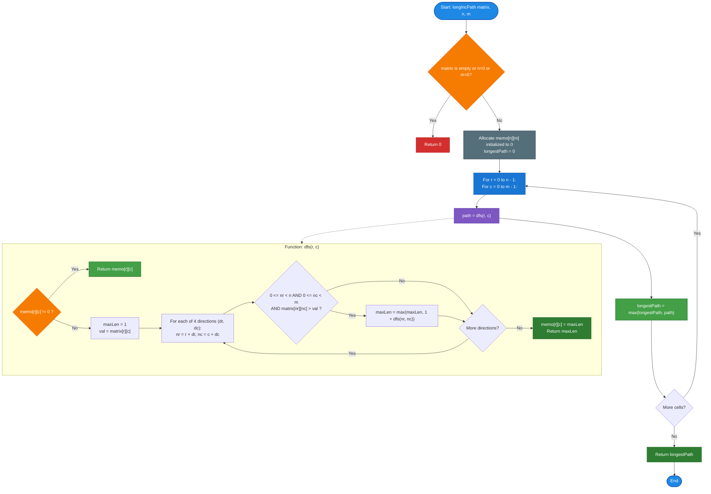

# GeeksforGeeks Problem of the Day: Longest Increasing Path in a Matrix

- **Problem Link:** [GeeksforGeeks - Longest Increasing Path in a Matrix](https://www.geeksforgeeks.org/problems/longest-increasing-path-in-a-matrix/1)
- **Difficulty:** Hard
- **Topic Tags:** Dynamic Programming, Graph, Depth-First Search (DFS), Memoization, Topological Sort, Directed Acyclic Graph (DAG)
- **Target Audience:** POTD Solvers, Computer Science Students, Competitive Programmers, Interview Preparation (FAANG/Tier-1 Tech)

---

## 1. Problem Statement

Given a 2D integer matrix with $n$ rows and $m$ columns, find the length of the **longest path** such that:
1. **Strictly Increasing Sequence:** The values along the path are strictly increasing. That is, if a path consists of cells $a_1, a_2, a_3, \dots, a_k$, then for every $i \in [2, k]$, the condition $a_i > a_{i-1}$ must hold.
2. **No Revisited Cells:** No cell should be revisited in the path (strictly distinct cells).
3. **4-Directional Movement:** From any cell $(r, c)$, you can move to adjacent cells in four directions: **Up**, **Down**, **Left**, or **Right**.
4. **Boundary Invariant:** Diagonal movements and moves outside the grid boundaries are prohibited.

### Objective
Return a single integer representing the maximum number of cells in any valid strictly increasing path within the matrix.

---

## 2. Examples & Explanations

### Example 1
- **Input:** $n = 3, m = 3$, `matrix = [[1, 2, 3], [4, 5, 6], [7, 8, 9]]`
- **Output:** `5`

#### Grid Layout:
```text
       c = 0    c = 1    c = 2
r = 0 +--------+--------+--------+
      |    1   |    2   |    3   |
r = 1 +--------+--------+--------+
      |    4   |    5   |    6   |
r = 2 +--------+--------+--------+
      |    7   |    8   |    9   |
      +--------+--------+--------+
```

#### Traversal Path Explanation:
- One optimal increasing path is:
  $$1 \xrightarrow{\text{Right}} 2 \xrightarrow{\text{Right}} 3 \xrightarrow{\text{Down}} 6 \xrightarrow{\text{Down}} 9$$
- Sequence of values: $[1, 2, 3, 6, 9]$
- Total cells visited: $5$.
- Another valid path of length 5 is: $1 \to 4 \to 7 \to 8 \to 9$.
- Both paths achieve the maximum length of **5**.

---

### Example 2
- **Input:** $n = 3, m = 3$, `matrix = [[3, 4, 5], [6, 2, 6], [2, 2, 1]]`
- **Output:** `4`

#### Grid Layout:
```text
       c = 0    c = 1    c = 2
r = 0 +--------+--------+--------+
      |    3   |    4   |    5   |
r = 1 +--------+--------+--------+
      |    6   |    2   |    6   |
r = 2 +--------+--------+--------+
      |    2   |    2   |    1   |
      +--------+--------+--------+
```

#### Traversal Path Explanation:
- The longest strictly increasing path is:
  $$3 \xrightarrow{\text{Right}} 4 \xrightarrow{\text{Right}} 5 \xrightarrow{\text{Down}} 6$$
- Sequence of values: $[3, 4, 5, 6]$
- Total cells visited: **4**.
- Notice: We cannot move from $5 \to 6$ and then to another $6$ because the sequence must be **strictly** increasing ($6 \ngtr 6$).

---

### Example 3: Single Element Grid ($1 \times 1$)
- **Input:** $n = 1, m = 1$, `matrix = [[42]]`
- **Output:** `1`
- **Explanation:** The path contains just the single cell itself. Length $= 1$.

---

### Example 4: All Equal Elements
- **Input:** $n = 2, m = 2$, `matrix = [[7, 7], [7, 7]]`
- **Output:** `1`
- **Explanation:** All adjacent cells are equal ($7 = 7$). Since steps must be strictly increasing, no moves can be made. The longest path length is $1$.

---

## 3. Constraints

- $1 \le n, m \le 1000$
- Total cells: $N \times M \le 1,000,000$ ($10^6$)
- $0 \le \text{matrix}[i][j] \le 2^{30}$
- **Expected Time Complexity:** $\mathcal{O}(n \times m)$
- **Expected Auxiliary Space:** $\mathcal{O}(n \times m)$

---

## 4. Visual Architecture & The Directed Acyclic Graph (DAG) Model

### Why Cycles are Mathematically Impossible

A common concern in grid pathfinding is whether a visited array is needed to avoid infinite loops:
> **The Strict Monotonicity Theorem:**  
> Suppose a path starts at cell $u$ and could return to $u$ via a sequence of transitions:
> $$u \to v_1 \to v_2 \to \dots \to v_k \to u$$
> Since every move requires a strictly greater value:
> $$\text{val}(u) < \text{val}(v_1) < \text{val}(v_2) < \dots < \text{val}(v_k) < \text{val}(u)$$
> This implies $\text{val}(u) < \text{val}(u)$, which is a logical contradiction!

Therefore:
1. **The grid is inherently a Directed Acyclic Graph (DAG)**, where directed edges $(u \to v)$ exist if and only if $v$ is adjacent to $u$ and $\text{matrix}[v] > \text{matrix}[u]$.
2. No visited set or cycle detection is required.
3. The problem reduces to finding the **Longest Path in a DAG**, which can be solved optimally in $\mathcal{O}(V + E) = \mathcal{O}(n \times m)$ time using **Top-Down Dynamic Programming (DFS with Memoization)**.

```mermaid
flowchart TD
    subgraph GridToDAG ["Grid Cells Form an Implicit DAG"]
        C1["Cell (0,0): 1"] -->|Edge (1 < 2)| C2["Cell (0,1): 2"]
        C1 -->|Edge (1 < 4)| C4["Cell (1,0): 4"]
        C2 -->|Edge (2 < 3)| C3["Cell (0,2): 3"]
        C2 -->|Edge (2 < 5)| C5["Cell (1,1): 5"]
        C4 -->|Edge (4 < 5)| C5
        C3 -->|Edge (3 < 6)| C6["Cell (1,2): 6"]
        C5 -->|Edge (5 < 6)| C6
        C6 -->|Edge (6 < 9)| C9["Cell (2,2): 9"]
    end

    subgraph DPTransition ["Optimal Substructure (Memoization)"]
        Formula["memo[r][c] = 1 + max( memo[nr][nc] for all valid nr, nc )<br/>Where matrix[nr][nc] > matrix[r][c]"]
    end

    GridToDAG -.-> DPTransition

    style C1 fill:#1E88E5,stroke:#0D47A1,color:#ffffff
    style C2 fill:#0288D1,stroke:#01579B,color:#ffffff
    style C3 fill:#00897B,stroke:#004D40,color:#ffffff
    style C4 fill:#0288D1,stroke:#01579B,color:#ffffff
    style C5 fill:#00897B,stroke:#004D40,color:#ffffff
    style C6 fill:#43A047,stroke:#1B5E20,color:#ffffff
    style C9 fill:#F57C00,stroke:#E65100,color:#ffffff
    style Formula fill:#7E57C2,stroke:#4527A0,color:#ffffff
```

---

## 5. Step-by-Step Simulation & Trace Table

### Tracing Example 2:
```text
Matrix:
[3, 4, 5]
[6, 2, 6]
[2, 2, 1]
```

Let $\text{memo}[r][c]$ store the longest increasing path starting from cell $(r, c)$:

| Cell $(r, c)$ | Value $\text{matrix}[r][c]$ | Valid Greater Neighbors $(nr, nc)$ | Recursive Transitions | Computed $\text{memo}[r][c]$ |
| :---: | :---: | :---: | :---: | :---: |
| **$(0, 2)$** | $5$ | $(1, 2) \to 6$ | $1 + \text{memo}[1][2]$ | $1 + 1 = \mathbf{2}$ |
| **$(1, 2)$** | $6$ | None (Local peak) | Base case | $\mathbf{1}$ |
| **$(0, 1)$** | $4$ | $(0, 2) \to 5$ | $1 + \text{memo}[0][2]$ | $1 + 2 = \mathbf{3}$ |
| **$(0, 0)$** | $3$ | $(0, 1) \to 4$, $(1, 0) \to 6$ | $\max(1 + \text{memo}[0][1], 1 + \text{memo}[1][0])$ | $\max(1 + 3, 1 + 1) = \mathbf{4}$ |
| **$(1, 0)$** | $6$ | None (Local peak) | Base case | $\mathbf{1}$ |
| **$(1, 1)$** | $2$ | $(0, 1) \to 4$, $(1, 0) \to 6$, $(1, 2) \to 6$ | $\max(1+3, 1+1, 1+1)$ | $1 + 3 = \mathbf{4}$ |
| **$(2, 0)$** | $2$ | $(1, 0) \to 6$ | $1 + \text{memo}[1][0]$ | $1 + 1 = \mathbf{2}$ |
| **$(2, 1)$** | $2$ | None greater | Base case | $\mathbf{1}$ |
| **$(2, 2)$** | $1$ | $(1, 2) \to 6$, $(2, 1) \to 2$ | $\max(1 + \text{memo}[1][2], 1 + \text{memo}[2][1])$ | $1 + 1 = \mathbf{2}$ |

**Global Maximum Path Length:** $\max(\text{memo}[r][c]) = \mathbf{4}$.

---

## 6. Algorithm Flowchart



---

## 7. From Naive to Pro: Algorithmic Progression

### Method 1: Naive (Brute-Force DFS Without Memoization)
- **Concept:** Launch an unmemoized depth-first search from every cell $(r, c)$. Recursively explore all strictly increasing branches to leaf nodes.
- **Why it is suboptimal:**
  - Identical paths and subgrids are traversed repeatedly across overlapping branches.
  - In a grid with monotonically increasing values, the recursion branches exponentially:
    $$\text{Total Calls} = \mathcal{O}(4^{n \times m})$$
  - For $n = m = 20$, $4^{400}$ operations would take longer than the age of the universe $\implies$ **Time Limit Exceeded (TLE)**.
- **Pseudocode:**
```text
function dfs_Naive(r, c, matrix, n, m):
    maxLen = 1
    for each (dr, dc) in [(-1, 0), (1, 0), (0, -1), (0, 1)]:
        nr = r + dr, nc = c + dc
        if 0 <= nr < n and 0 <= nc < m and matrix[nr][nc] > matrix[r][c]:
            maxLen = max(maxLen, 1 + dfs_Naive(nr, nc, matrix, n, m))
    return maxLen

function longIncPath_Naive(matrix, n, m):
    ans = 0
    for r from 0 to n - 1:
        for c from 0 to m - 1:
            ans = max(ans, dfs_Naive(r, c, matrix, n, m))
    return ans
```

---

### Method 2: Better (Topological Sort / Kahn's Algorithm on Grid DAG)
- **Concept:**
  - View the grid as a Directed Acyclic Graph where an edge points from a cell to any strictly greater adjacent neighbor.
  - Calculate the **out-degree** for each cell (number of neighbors with strictly greater values).
  - Cells with `out_degree == 0` are local maxima (peaks).
  - Enqueue all peaks (Layer 1).
  - Iteratively pop current level nodes, decrement the out-degree of their smaller neighbors, and enqueue neighbors that reach `out_degree == 0` for Layer + 1.
  - The total number of peel-off layers until the queue is empty is the length of the longest increasing path!
- **Advantages:** 100% iterative; zero recursion stack overhead; strictly $\mathcal{O}(n \times m)$ time.
- **Pseudocode:**
```text
function longIncPath_Kahn(matrix, n, m):
    out_degree = 2D array of size n x m
    for r from 0 to n - 1:
        for c from 0 to m - 1:
            for each neighbor (nr, nc):
                if matrix[nr][nc] > matrix[r][c]:
                    out_degree[r][c]++
                    
    queue = []
    for r from 0 to n - 1:
        for c from 0 to m - 1:
            if out_degree[r][c] == 0:
                queue.push((r, c))
                
    layers = 0
    while queue is not empty:
        layers++
        levelSize = queue.size()
        for i from 0 to levelSize - 1:
            (r, c) = queue.pop()
            for each neighbor (pr, pc):
                if matrix[pr][pc] < matrix[r][c]:
                    out_degree[pr][pc]--
                    if out_degree[pr][pc] == 0:
                        queue.push((pr, pc))
                        
    return layers
```

---

### Method 3: Pro Approach (DFS with Memoization / Top-Down Dynamic Programming)
- **The Core Strategy:**
  - Maintain a memoization table `memo[n][m]` initialized to $0$.
  - When visiting cell $(r, c)$:
    - If `memo[r][c] != 0`, return the cached result in $\mathcal{O}(1)$ time.
    - Otherwise, compute:
      $$\text{memo}[r][c] = 1 + \max_{(nr, nc) \in \text{valid neighbors}} \text{dfs}(nr, nc)$$
  - Each cell's optimal path is evaluated **exactly once**.
  - Since each state explores at most $4$ neighbors, total transitions across all cells are bounded by $4 \times (n \times m)$.
  - **Single pass, zero dynamic graph construction, maximum CPU cache locality.**
- **Complexity:**
  - Time: $\mathcal{O}(n \times m)$
  - Auxiliary Space: $\mathcal{O}(n \times m)$ for the memo table and call stack.
- **Pseudocode:**
```text
function dfs_Optimal(r, c, matrix, n, m, memo):
    if memo[r][c] != 0:
        return memo[r][c]
        
    maxLen = 1
    val = matrix[r][c]
    
    for (dr, dc) in [(-1, 0), (1, 0), (0, -1), (0, 1)]:
        nr = r + dr, nc = c + dc
        if 0 <= nr < n and 0 <= nc < m and matrix[nr][nc] > val:
            maxLen = max(maxLen, 1 + dfs_Optimal(nr, nc, matrix, n, m, memo))
            
    memo[r][c] = maxLen
    return maxLen

function longIncPath_Optimal(matrix, n, m):
    if n == 0 or m == 0: return 0
    memo = 2D array of size n x m initialized to 0
    longestPath = 0
    
    for r from 0 to n - 1:
        for c from 0 to m - 1:
            longestPath = max(longestPath, dfs_Optimal(r, c, matrix, n, m, memo))
            
    return longestPath
```

---

## 8. Complexity Comparison Table

| Metric | Method 1: Naive (Brute-Force DFS) | Method 2: Better (Topological Sort / BFS) | Method 3: Pro (DFS + Memoization) |
| :--- | :--- | :--- | :--- |
| **Time Complexity** | $\mathcal{O}(4^{n \times m})$ (Exponential) | $\mathcal{O}(n \times m)$ | $\mathbf{\mathcal{O}(n \times m)}$ (Optimal linear scan) |
| **Auxiliary Space** | $\mathcal{O}(n \times m)$ (Call stack) | $\mathcal{O}(n \times m)$ (Degree array + Queue) | $\mathbf{\mathcal{O}(n \times m)}$ (Memo table + Call stack) |
| **Precomputation Overhead** | None | High (Calculates all out-degrees) | **Zero (On-demand lazy evaluation)** |
| **Cache Locality** | Extremely poor (Random jumps) | Moderate (Queue traversal) | **High (Contiguous memo array lookups)** |
| **Code Length** | Short but unusable | Long ($\approx 50$ lines) | **Compact & Highly Elegant ($\approx 25$ lines)** |
| **Interview Verdict** | TLE on $N, M > 15$ | Good graph-theoretic perspective | **Gold Standard (FAANG / Tier-1 Pick)** |

---

## 9. Comprehensive Corner Cases Handled

1. **Single Cell Grid ($n = 1, m = 1$):**
   - No neighbors exist. `maxLen` stays $1$. Returns $1$ correctly.
2. **All Identical Values:**
   - E.g., all cells equal $5$. The condition `matrix[nr][nc] > matrix[r][c]` is never satisfied. Returns $1$.
3. **Strictly Monotonic Grid (Snake / Spiral Path):**
   - E.g., values arranged along a serpentine path spanning all $n \times m$ cells. The path length equals $n \times m$.
4. **Disjoint Increasing Paths:**
   - Multiple disconnected peaks and valleys. The outer loops examine every cell, ensuring the global maximum is never missed.
5. **Maximum Dimension Limits ($n = 1000, m = 1000$):**
   - $10^6$ cells. In C++, Java, and JavaScript, the memoization table fits comfortably in memory ($\approx 4\text{ MB}$).
   - In Python, `sys.setrecursionlimit(2000000)` ensures the deep call stack does not trigger a `RecursionError`.

---

## 10. Complete Multi-Language Implementations

### Java (21)

```java
class Solution {
    // 4 cardinal directions: Up, Down, Left, Right
    private static final int[][] DIRS = {{-1, 0}, {1, 0}, {0, -1}, {0, 1}};

    /**
     * Depth-First Search with Memoization
     * 
     * @param matrix 2D grid of values
     * @param r Current row
     * @param c Current column
     * @param n Total rows
     * @param m Total columns
     * @param memo DP table storing longest path starting from (r, c)
     * @return Longest increasing path length from (r, c)
     */
    private int dfs(int[][] matrix, int r, int c, int n, int m, int[][] memo) {
        // Return precomputed result if already evaluated
        if (memo[r][c] != 0) {
            return memo[r][c];
        }

        int maxLen = 1;
        int val = matrix[r][c];

        for (int[] dir : DIRS) {
            int nr = r + dir[0];
            int nc = c + dir[1];

            // Strict boundary check and strictly increasing condition
            if (nr >= 0 && nr < n && nc >= 0 && nc < m && matrix[nr][nc] > val) {
                maxLen = Math.max(maxLen, 1 + dfs(matrix, nr, nc, n, m, memo));
            }
        }

        // Cache and return
        return memo[r][c] = maxLen;
    }

    /**
     * Finds the length of the longest strictly increasing path in the matrix.
     * 
     * Time Complexity: O(n * m)
     * Auxiliary Space: O(n * m)
     */
    public int longIncPath(int[][] matrix, int n, int m) {
        if (matrix == null || n == 0 || m == 0) {
            return 0;
        }

        int[][] memo = new int[n][m];
        int longestPath = 0;

        for (int i = 0; i < n; i++) {
            for (int j = 0; j < m; j++) {
                longestPath = Math.max(longestPath, dfs(matrix, i, j, n, m, memo));
            }
        }

        return longestPath;
    }
}
```

---

### Python3

```python
import sys

# Set high recursion limit for deep snake-like paths in large grids (up to 10^6 cells)
sys.setrecursionlimit(2000000)

class Solution:
    def longIncPath(self, matrix: list[list[int]], n: int, m: int) -> int:
        """
        Finds the length of the longest strictly increasing path in the matrix.
        
        Time Complexity: O(n * m)
        Auxiliary Space: O(n * m)
        """
        if not matrix or n == 0 or m == 0:
            return 0

        # memo[r][c] stores the longest path starting from cell (r, c)
        memo = [[0] * m for _ in range(n)]
        dirs = ((-1, 0), (1, 0), (0, -1), (0, 1))

        def dfs(r: int, c: int) -> int:
            if memo[r][c] != 0:
                return memo[r][c]

            max_len = 1
            val = matrix[r][c]

            for dr, dc in dirs:
                nr, nc = r + dr, c + dc
                if 0 <= nr < n and 0 <= nc < m and matrix[nr][nc] > val:
                    max_len = max(max_len, 1 + dfs(nr, nc))

            memo[r][c] = max_len
            return max_len

        longest_path = 0
        for i in range(n):
            for j in range(m):
                longest_path = max(longest_path, dfs(i, j))

        return longest_path
```

---

### C++ (17)

```cpp
#include <vector>
#include <algorithm>

using namespace std;

class Solution {
private:
    int dfs(const vector<vector<int>>& matrix, int r, int c, int n, int m, vector<vector<int>>& memo) {
        // Return precomputed result if already evaluated
        if (memo[r][c] != 0) {
            return memo[r][c];
        }

        int maxLen = 1;
        int val = matrix[r][c];

        static const int dr[] = {-1, 1, 0, 0};
        static const int dc[] = {0, 0, -1, 1};

        for (int i = 0; i < 4; ++i) {
            int nr = r + dr[i];
            int nc = c + dc[i];

            // Strict boundary check and strictly increasing condition
            if (nr >= 0 && nr < n && nc >= 0 && nc < m && matrix[nr][nc] > val) {
                maxLen = max(maxLen, 1 + dfs(matrix, nr, nc, n, m, memo));
            }
        }

        return memo[r][c] = maxLen;
    }

public:
    /**
     * Finds the length of the longest strictly increasing path in the matrix.
     * 
     * Time Complexity: O(n * m)
     * Auxiliary Space: O(n * m)
     */
    int longIncPath(vector<vector<int>> &matrix, int n, int m) {
        if (n == 0 || m == 0) return 0;

        // memo table initialized to 0
        vector<vector<int>> memo(n, vector<int>(m, 0));
        int longestPath = 0;

        for (int i = 0; i < n; ++i) {
            for (int j = 0; j < m; ++j) {
                longestPath = max(longestPath, dfs(matrix, i, j, n, m, memo));
            }
        }

        return longestPath;
    }
};
```

---

### Javascript (Node v22)

```javascript
/**
 * @param {number[][]} matrix
 * @param {number} n
 * @param {number} m
 * @return {number}
 */
class Solution {
    /**
     * Finds the length of the longest strictly increasing path in the matrix.
     * 
     * Time Complexity: O(n * m)
     * Auxiliary Space: O(n * m)
     */
    longIncPath(matrix, n, m) {
        if (!matrix || n === 0 || m === 0) {
            return 0;
        }

        // Int32Array for fast access and minimal memory footprint
        const memo = Array.from({ length: n }, () => new Int32Array(m));
        const dr = [-1, 1, 0, 0];
        const dc = [0, 0, -1, 1];

        function dfs(r, c) {
            if (memo[r][c] !== 0) {
                return memo[r][c];
            }

            let maxLen = 1;
            const val = matrix[r][c];

            for (let i = 0; i < 4; i++) {
                const nr = r + dr[i];
                const nc = c + dc[i];

                if (nr >= 0 && nr < n && nc >= 0 && nc < m && matrix[nr][nc] > val) {
                    const len = 1 + dfs(nr, nc);
                    if (len > maxLen) {
                        maxLen = len;
                    }
                }
            }

            memo[r][c] = maxLen;
            return maxLen;
        }

        let longestPath = 0;
        for (let i = 0; i < n; i++) {
            for (let j = 0; j < m; j++) {
                const pathLen = dfs(i, j);
                if (pathLen > longestPath) {
                    longestPath = pathLen;
                }
            }
        }

        return longestPath;
    }
}
```

---

### C#

```csharp
using System;

class Solution {
    private static readonly int[] dr = { -1, 1, 0, 0 };
    private static readonly int[] dc = { 0, 0, -1, 1 };

    private int Dfs(int[,] matrix, int r, int c, int n, int m, int[,] memo) {
        if (memo[r, c] != 0) {
            return memo[r, c];
        }

        int maxLen = 1;
        int val = matrix[r, c];

        for (int i = 0; i < 4; i++) {
            int nr = r + dr[i];
            int nc = c + dc[i];

            if (nr >= 0 && nr < n && nc >= 0 && nc < m && matrix[nr, nc] > val) {
                maxLen = Math.Max(maxLen, 1 + Dfs(matrix, nr, nc, n, m, memo));
            }
        }

        return memo[r, c] = maxLen;
    }

    public int LongIncPath(int[,] matrix, int n, int m) {
        if (matrix == null || n == 0 || m == 0) {
            return 0;
        }

        int[,] memo = new int[n, m];
        int longestPath = 0;

        for (int i = 0; i < n; i++) {
            for (int j = 0; j < m; j++) {
                longestPath = Math.Max(longestPath, Dfs(matrix, i, j, n, m, memo));
            }
        }

        return longestPath;
    }
}
```

---

### TypeScript

```typescript
class Solution {
    /**
     * Finds the length of the longest strictly increasing path in the matrix.
     * 
     * Time Complexity: O(n * m)
     * Auxiliary Space: O(n * m)
     * 
     * @param matrix 2D grid of values
     * @param n Total rows
     * @param m Total columns
     * @returns Longest strictly increasing path length
     */
    longIncPath(matrix: number[][], n: number, m: number): number {
        if (!matrix || n === 0 || m === 0) {
            return 0;
        }

        const memo: Int32Array[] = Array.from({ length: n }, () => new Int32Array(m));
        const dr: number[] = [-1, 1, 0, 0];
        const dc: number[] = [0, 0, -1, 1];

        function dfs(r: number, c: number): number {
            if (memo[r][c] !== 0) {
                return memo[r][c];
            }

            let maxLen: number = 1;
            const val: number = matrix[r][c];

            for (let i: number = 0; i < 4; i++) {
                const nr: number = r + dr[i];
                const nc: number = c + dc[i];

                if (nr >= 0 && nr < n && nc >= 0 && nc < m && matrix[nr][nc] > val) {
                    const len: number = 1 + dfs(nr, nc);
                    if (len > maxLen) {
                        maxLen = len;
                    }
                }
            }

            memo[r][c] = maxLen;
            return maxLen;
        }

        let longestPath: number = 0;
        for (let i: number = 0; i < n; i++) {
            for (let j: number = 0; j < m; j++) {
                const pathLen: number = dfs(i, j);
                if (pathLen > longestPath) {
                    longestPath = pathLen;
                }
            }
        }

        return longestPath;
    }
}
```
