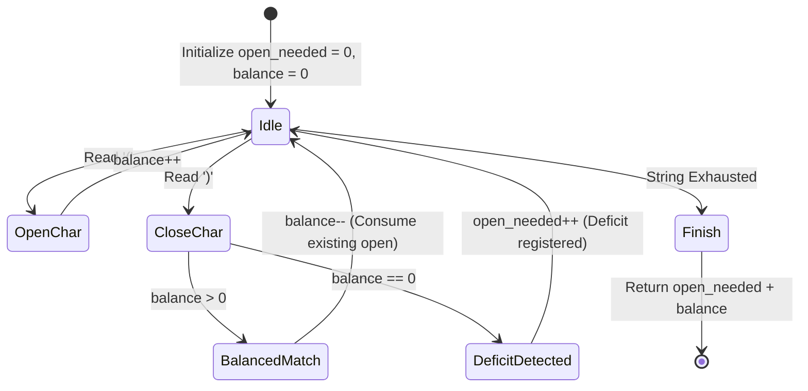
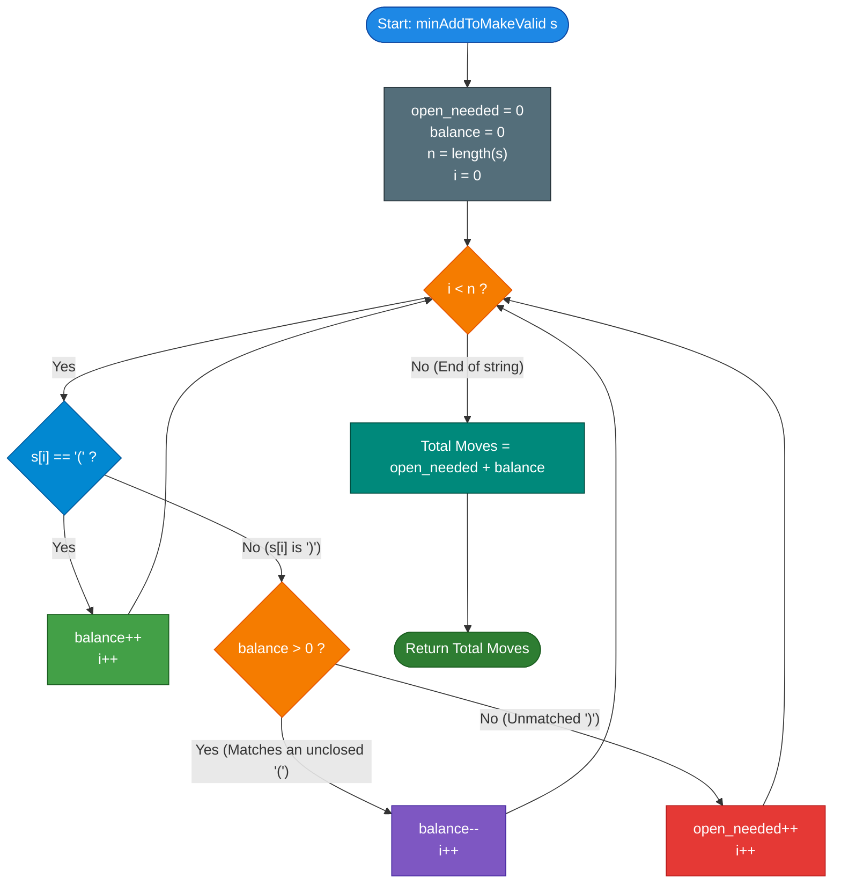

# LeetCode Problem of the Day: Minimum Add to Make Parentheses Valid

- **Problem Link:** [LeetCode 921 - Minimum Add to Make Parentheses Valid](https://leetcode.com/problems/minimum-add-to-make-parentheses-valid/)
- **Difficulty:** Medium
- **Topic Tags:** String, Stack, Greedy, Dyck Path Analysis, Prefix Sums, State Machine
- **Target Audience:** POTD Solvers, Computer Science Students, Competitive Programmers, Interview Preparation (FAANG/Tier-1 Tech)

---

## 1. Problem Statement

A parentheses string is considered **valid** if and only if:
1. It is the empty string `""`,
2. It can be written as $AB$ ($A$ concatenated with $B$), where $A$ and $B$ are both valid strings, or
3. It can be written as $(A)$, where $A$ is a valid string.

You are given a parentheses string `s`. In a single move, you can insert an opening `'('` or closing `')'` parenthesis at **any arbitrary position** within the string.

### Objective
Return the **minimum number of moves** (insertions) required to make the string `s` valid.

---

## 2. Examples & Explanations

### Example 1: Single Unmatched Closing Bracket
- **Input:** `s = "())"`
- **Output:** `1`
- **Explanation:** 
  - The first two characters `"()"` form a balanced pair.
  - The remaining character `")"` at index 2 is an excess closing parenthesis with no corresponding `'('`.
  - Inserting a single `'('` at the beginning yields `"()()"`, which is valid. Hence, $1$ move is sufficient.

---

### Example 2: Pure Unclosed Open Brackets
- **Input:** `s = "((("`
- **Output:** `3`
- **Explanation:** 
  - All three characters are opening brackets with no closing brackets present.
  - We must append three `')'` brackets to close them: `"((()))"`.
  - Minimum moves required = $3$.

---

### Example 3: Already Perfectly Balanced String
- **Input:** `s = "()"`
- **Output:** `0`
- **Explanation:** 
  - The string is already valid. No insertions are required.

---

### Example 4: Interleaved Unmatched Segments
- **Input:** `s = "()))(("`
- **Output:** `4`
- **Explanation:**
  - Index 0–1 `"()"` matches.
  - Index 2–3 `"))"` are closing brackets with no preceding `'('` available. They require **2** opening brackets `'('`.
  - Index 4–5 `"(("` are open brackets that are never closed. They require **2** closing brackets `')'`.
  - Total minimum insertions: $2 + 2 = 4$.

---

### Example 5: Inverted Adjacent Pair
- **Input:** `s = ")("`
- **Output:** `2`
- **Explanation:**
  - The leading `")"` cannot match the trailing `'('` because bracket order is directional (open before close).
  - The `")"` requires an opening bracket `'('` before it.
  - The `'('` requires a closing bracket `')'` after it.
  - Total insertions = $2$ (e.g., transforming to `"()()"`).

---

## 3. Constraints & Complexity Targets

- $1 \le |s| \le 1000$
- `s[i]` is either `'('` or `')'`.
- **Target Time Complexity:** $\mathcal{O}(N)$ where $N = |s|$.
- **Target Auxiliary Space:** $\mathcal{O}(1)$ optimal (or $\mathcal{O}(N)$ using a Stack).

---

## 4. Visual Architecture & Theoretical Model

### 1. The Dyck Path / Elevation Analogy

Any parentheses sequence can be mapped to a 2D walk (a **Dyck Path**):
- An opening bracket `'('` represents a step **up** ($+1$ in altitude).
- A closing bracket `')'` represents a step **down** ($-1$ in altitude).

```text
Altitude (+ / -)
  +2 |             / \
  +1 |   /\       /   \         /\
   0 +--/--\-----/-----\-------/--\----> Baseline (0)
  -1 |      \   /       \     /
  -2 |       \_/         \___/   <-- Sea Level Breach: Unmatched ')'
```

#### Fundamental Invariants:
1. **Never Dip Below Zero:** At any point in a valid string, the running balance cannot be negative ($\text{Altitude} \ge 0$). Whenever the path dips to $-1$, an **unmatched closing parenthesis** has occurred. To prevent the dip, we must conceptually insert an opening bracket `'('` before it, immediately resetting the baseline.
2. **End at Sea Level:** At the end of the string, the final altitude must be exactly $0$. If $\text{Altitude} = k > 0$, there are $k$ unclosed opening brackets that require $k$ closing brackets `')'`.

$$\mathbf{\text{Total Additions}} = \mathbf{\text{Open Brackets Needed (Negative Dips)}} + \mathbf{\text{Close Brackets Needed (Final Surplus)}}$$

---

### 2. State Machine Diagram



---

## 5. Step-by-Step Simulation & Trace Table

Let us trace the input `s = "()))(("` ($N = 6$):

| Step $i$ | Char `s[i]` | `balance` Before | Action Taken | `open_needed` After | `balance` After | Cumulative Deficit Note |
| :---: | :---: | :---: | :---: | :---: | :---: | :--- |
| **0** | `'('` | 0 | `balance++` | 0 | 1 | 1 open bracket pending |
| **1** | `')'` | 1 | Matches pending `'('` $\implies$ `balance--` | 0 | 0 | Balanced so far (`"()"`) |
| **2** | `')'` | 0 | No open bracket! Deficit $\implies$ `open_needed++` | **1** | 0 | Missing 1 `'('` for index 2 |
| **3** | `')'` | 0 | No open bracket! Deficit $\implies$ `open_needed++` | **2** | 0 | Missing another `'('` for index 3 |
| **4** | `'('` | 0 | `balance++` | 2 | 1 | 1 open bracket pending |
| **5** | `'('` | 1 | `balance++` | 2 | 2 | 2 open brackets pending |

### Final Summary:
- **`open_needed`** $= 2$ (representing required `'('` additions to satisfy the excess `')'` brackets).
- **`balance`** $= 2$ (representing required `')'` additions to satisfy the trailing unclosed `'('` brackets).
- **Total Minimum Additions** $= 2 + 2 = \mathbf{4}$.

---

## 6. Algorithm Flowchart



---

## 7. From Naive to Pro: Algorithmic Progression

### Method 1: Naive (Iterative Substring Elimination / Reduction)
- **Concept:** Repeatedly find and remove the adjacent valid pair `"()"` from the string until no more `"()"` pairs exist. The remaining characters are all irreducible unmatched brackets, and each one requires exactly 1 move to fix.
- **Why it is suboptimal:**
  - Finding and replacing substrings creates new string objects in memory repeatedly.
  - In the worst case (e.g., `"((((...))))"`), the reduction takes $N/2$ passes, each taking $\mathcal{O}(N)$ time.
- **Time Complexity:** $\mathcal{O}(N^2)$
- **Space Complexity:** $\mathcal{O}(N)$ due to new string allocations.
- **Pseudocode:**
```text
function minAddToMakeValid_Naive(s):
    while s contains "()":
        s = s.replaceFirst("()", "")
    return length(s)
```

---

### Method 2: Better (Stack-Based Elimination)
- **Concept:** Simulate bracket matching using an explicit stack.
  - When encountering `'('`, push it onto the stack.
  - When encountering `')'`:
    - If the stack is non-empty and the top is `'('`, pop it (pair matched!).
    - Otherwise, push `')'` onto the stack (unmatched closing bracket).
  - After processing the entire string, all matched pairs have canceled out. The remaining elements on the stack are precisely the unmatched brackets.
- **Advantages:** Eliminates repeated string scanning; executes in a single linear pass.
- **Time Complexity:** $\mathcal{O}(N)$
- **Space Complexity:** $\mathcal{O}(N)$ auxiliary stack memory.
- **Pseudocode:**
```text
function minAddToMakeValid_Stack(s):
    stack = empty stack
    for char in s:
        if char == '(':
            stack.push('(')
        else:
            if not stack.isEmpty() and stack.top() == '(':
                stack.pop()
            else:
                stack.push(')')
    return stack.size()
```

---

### Method 3: Pro (Optimal Counter-Based Invariant / Constant Space)
- **The Core Strategy:**
  - Notice that the stack only ever contains either:
    1. A sequence of unmatched `')'` (which can never be cancelled by future characters), or
    2. A sequence of unclosed `'('` waiting for future `')'`.
  - Because all opening brackets are identical and all closing brackets are identical, we **do not need to store the actual characters**!
  - We only need two integer counters:
    1. `open_needed`: Counts unmatched `')'` brackets (each one immediately demands an inserted `'('`).
    2. `balance`: Counts currently unclosed `'('` brackets (each one will demand an inserted `')'` if never closed).
- **Why It Is Optimal:**
  - Single forward pass: exactly $N$ iterations.
  - Constant auxiliary memory: only two primitive integer registers.
  - Zero dynamic heap allocation.
- **Time Complexity:** $\mathcal{O}(N)$
- **Space Complexity:** $\mathcal{O}(1)$
- **Pseudocode:**
```text
function minAddToMakeValid_Optimal(s):
    open_needed = 0
    balance = 0
    for each char c in s:
        if c == '(':
            balance += 1
        else:
            if balance > 0:
                balance -= 1
            else:
                open_needed += 1
    return open_needed + balance
```

---

## 8. Complexity Comparison Table

| Metric | Method 1: Naive (Substring Reduction) | Method 2: Better (Stack Simulation) | Method 3: Pro (Dual-Counter Invariant) |
| :--- | :--- | :--- | :--- |
| **Time Complexity** | $\mathcal{O}(N^2)$ | $\mathcal{O}(N)$ | $\mathbf{\mathcal{O}(N)}$ (Optimal single pass) |
| **Auxiliary Space** | $\mathcal{O}(N)$ (Temporary strings) | $\mathcal{O}(N)$ (Explicit stack) | $\mathbf{\mathcal{O}(1)}$ (Two integer variables) |
| **Memory Allocations** | High (Repeated reallocations) | Moderate (Stack node/array growth) | **Zero Heap Allocations** |
| **Cache Locality** | Poor | Moderate | **Optimal (Sequential character scan)** |
| **Lines of Code** | Short, but deceptive | $\sim 15$ lines | **$\sim 10$ lines (Clean & elegant)** |
| **Interview Verdict** | Inefficient brute-force | Acceptable textbook baseline | **Gold Standard (Production-grade)** |

---

## 9. Comprehensive Corner Cases Handled

1. **Already Balanced String (`s = "()()"` or `"((()))"`):**
   - Every `')'` finds `balance > 0`, decrementing `balance` back to $0$.
   - `open_needed = 0`, `balance = 0`. Returns $0 + 0 = 0$.
2. **All Opening Brackets (`s = "(((("`):**
   - `balance` increments to $4$, `open_needed` remains $0$.
   - Returns $0 + 4 = 4$.
3. **All Closing Brackets (`s = "))))"`):**
   - `balance` stays $0$, `open_needed` increments to $4$.
   - Returns $4 + 0 = 4$.
4. **Completely Inverted String (`s = ")()("`):**
   - Leading `')'` triggers `open_needed = 1`.
   - Middle `"()"` balances out.
   - Trailing `'('` leaves `balance = 1`.
   - Returns $1 + 1 = 2$.
5. **Single Character String (`s = "("` or `s = ")"`):**
   - If `"("` $\implies$ `balance = 1, open_needed = 0` $\implies$ returns $1$.
   - If `")"` $\implies$ `balance = 0, open_needed = 1` $\implies$ returns $1$.
6. **Maximum Length ($N = 1000$):**
   - Both counters fit comfortably in 32-bit signed integers (maximum value $\le 1000$).
   - Constant-space solution executes in under $1\text{ ms}$.

---

## 10. Complete Multi-Language Implementations

### Java (OpenJDK 21.0)

```java
class Solution {
    /**
     * Calculates the minimum number of moves required to make a parentheses string valid.
     * 
     * Time Complexity:  O(N) - Single pass through the string
     * Auxiliary Space:  O(1) - Two primitive integer registers
     * 
     * @param s The input string containing only '(' and ')'
     * @return Minimum number of insertions needed
     */
    public int minAddToMakeValid(String s) {
        int openNeeded = 0;
        int balance = 0;

        int n = s.length();
        for (int i = 0; i < n; i++) {
            char c = s.charAt(i);
            if (c == '(') {
                balance++;
            } else {
                if (balance > 0) {
                    balance--;
                } else {
                    openNeeded++;
                }
            }
        }

        return openNeeded + balance;
    }
}
```

---

### Python3 (3.12.11)

```python
class Solution:
    def minAddToMakeValid(self, s: str) -> int:
        """
        Calculates the minimum number of moves required to make a parentheses string valid.
        
        Time Complexity:  O(N) - Single linear scan
        Auxiliary Space:  O(1) - Only two integer counters
        """
        open_needed = 0
        balance = 0
        
        for char in s:
            if char == '(':
                balance += 1
            else:
                if balance > 0:
                    balance -= 1
                else:
                    open_needed += 1
                    
        return open_needed + balance
```

---

### C (GCC 13.2.0)

```c
#include <stdio.h>
#include <string.h>

/**
 * Calculates the minimum number of moves required to make a parentheses string valid.
 * 
 * Time Complexity:  O(N) - Linear pass through the null-terminated string
 * Auxiliary Space:  O(1) - Two integer registers
 * 
 * @param s Pointer to the null-terminated string
 * @return Minimum number of insertions needed
 */
int minAddToMakeValid(char* s) {
    int open_needed = 0;
    int balance = 0;

    for (int i = 0; s[i] != '\0'; i++) {
        if (s[i] == '(') {
            balance++;
        } else {
            if (balance > 0) {
                balance--;
            } else {
                open_needed++;
            }
        }
    }

    return open_needed + balance;
}
```

---

### C++ (GCC++ 13.2.0)

```cpp
#include <string>

using namespace std;

class Solution {
public:
    /**
     * Calculates the minimum number of moves required to make a parentheses string valid.
     * 
     * Time Complexity:  O(N) - Single pass over std::string
     * Auxiliary Space:  O(1) - Constant stack space
     * 
     * @param s The input string of parentheses
     * @return Minimum number of insertions required
     */
    int minAddToMakeValid(string s) {
        int openNeeded = 0;
        int balance = 0;

        for (char c : s) {
            if (c == '(') {
                balance++;
            } else {
                if (balance > 0) {
                    balance--;
                } else {
                    openNeeded++;
                }
            }
        }

        return openNeeded + balance;
    }
};
```

---

### C# (mcs 5.4.0.201)

```csharp
public class Solution {
    /**
     * Calculates the minimum number of moves required to make a parentheses string valid.
     * 
     * Time Complexity:  O(N) - Single linear iteration
     * Auxiliary Space:  O(1) - Constant auxiliary memory
     * 
     * @param s The input parentheses string
     * @return Minimum number of insertions needed
     */
    public int MinAddToMakeValid(string s) {
        int openNeeded = 0;
        int balance = 0;

        foreach (char c in s) {
            if (c == '(') {
                balance++;
            } else {
                if (balance > 0) {
                    balance--;
                } else {
                    openNeeded++;
                }
            }
        }

        return openNeeded + balance;
    }
}
```

---

### JavaScript (Node 24.4.1)

```javascript
/**
 * Calculates the minimum number of moves required to make a parentheses string valid.
 * 
 * Time Complexity:  O(N) - Single linear pass
 * Auxiliary Space:  O(1) - Two primitive counters
 * 
 * @param {string} s
 * @return {number}
 */
var minAddToMakeValid = function(s) {
    let openNeeded = 0;
    let balance = 0;

    for (let i = 0; i < s.length; i++) {
        if (s[i] === '(') {
            balance++;
        } else {
            if (balance > 0) {
                balance--;
            } else {
                openNeeded++;
            }
        }
    }

    return openNeeded + balance;
};
```

---

### TypeScript

```typescript
/**
 * Calculates the minimum number of moves required to make a parentheses string valid.
 * 
 * Time Complexity:  O(N) - Single linear scan
 * Auxiliary Space:  O(1) - Constant memory
 * 
 * @param s - The input string consisting solely of '(' and ')'
 * @returns Minimum number of insertions needed
 */
function minAddToMakeValid(s: string): number {
    let openNeeded: number = 0;
    let balance: number = 0;

    for (let i = 0; i < s.length; i++) {
        if (s[i] === '(') {
            balance++;
        } else {
            if (balance > 0) {
                balance--;
            } else {
                openNeeded++;
            }
        }
    }

    return openNeeded + balance;
}
```

---

## 11. Key Takeaways for Technical Interviews

1. **Greedy Elimination & The Dyck Invariant:**
   Parentheses matching possesses an inherent greedy property: an incoming `')'` should always match the most recent unmatched `'('`. If no unclosed `'('` is available, this `')'` is permanently unmatched and must be balanced with an inserted `'('`.
2. **Replacing Data Structures with Counters:**
   When all elements in a stack are homogeneous (e.g., only `'('`), you do not need an actual stack collection. Replacing an $\mathcal{O}(N)$ space stack with an integer counter `balance` is a classic FAANG optimization that interviewers look for.
3. **Partitioning Deficits:**
   Always remember that unmatched brackets come in two non-interfering categories:
   - Early closing brackets (`open_needed`)
   - Late opening brackets (`balance`)
   The total number of required additions is strictly their sum: $\text{open\_needed} + \text{balance}$.
