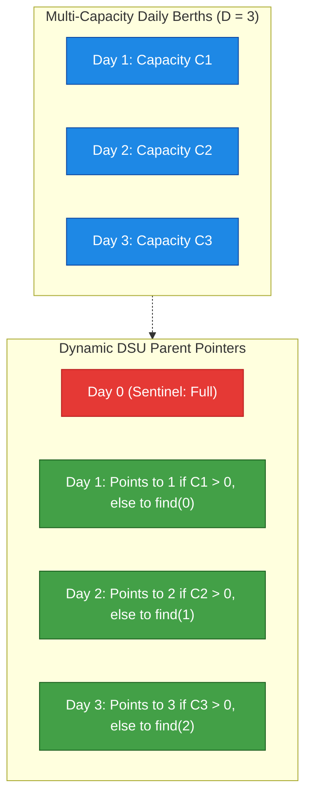
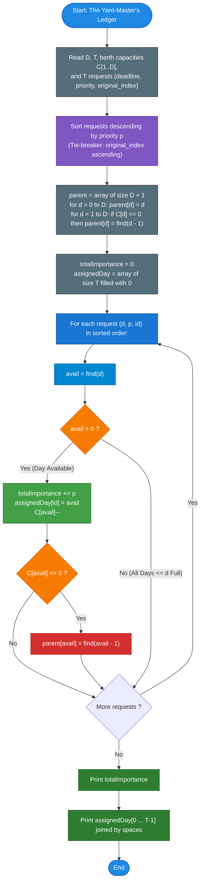

# Unstop Problem of the Day: The Yard-Master's Ledger

- **Platform:** [Unstop](https://unstop.com/)
- **Difficulty:** Hard
- **Topic Tags:** Greedy Algorithms, Disjoint Set Union (DSU), Multi-Capacity Scheduling, Sorting, Slot Allocation, Matroid Theory
- **Target Audience:** POTD Solvers, Computer Science Students, Competitive Programmers, Interview Preparation (FAANG / Tier-1 Systems Engineering)

---

## 1. Problem Statement

Priya Nandy manages the freight dispatch ledger at a high-volume railway marshalling yard. Outbound freight trains are scheduled over a discrete planning horizon of $D$ upcoming days, numbered sequentially from $1$ through $D$.

Each day $d \in [1, D]$ is provisioned with a fixed number of departure berths, denoted by $C_d$. A day may host multiple train departures ($C_d \ge 1$), or zero berths ($C_d = 0$). Once all berths on day $d$ are allocated, no further train can depart on that day.

Each evening, Priya receives $T$ freight dispatch requests. Each request $i$ specifies:
1. **Latest Acceptable Departure Day ($d_i$):** The train must leave on or before day $d_i$ ($1 \le t \le d_i$).
2. **Importance Score ($p_i$):** A value reflecting the operational priority and economic impact of successfully dispatching this freight train.

### Scheduling Rules & Objectives
- **Capacity Constraint:** Each day $d$ can host at most $C_d$ train requests.
- **The Flexibility Principle:** Greedily scheduling urgent/high-priority trains on the earliest available day squanders valuable flexibility. A superior ledger preserves earlier days for requests with stringent, early deadlines and pushes every train as **late as possible** within its permissible window ($t \le d_i$).
- **Tie-Breaking Rule:** If two requests share the exact same importance score, the one appearing **earlier in the input** takes precedence.
- **Output Requirements:**
  1. The **maximum achievable total importance** across all accepted trains.
  2. The exact assigned departure day for each request (in the original input order), or `0` if the request was dropped due to berth exhaustion.

---

## 2. Examples & Explanations

### Sample Testcase 0

**Input:**
```text
3 4
1 1 1
2 100
1 10
2 15
3 27
```

**Output:**
```text
142
2 0 1 3
```

**Step-by-Step Chronological Walkthrough:**
1. **Planning Horizon & Capacities:**
   - Day 1: 1 berth
   - Day 2: 1 berth
   - Day 3: 1 berth
2. **Sort Requests by Importance Descending (Tie-breaker: original index):**
   - Request 1: Importance $= 100$, Deadline $= 2$ (Original Index 0)
   - Request 4: Importance $= 27$, Deadline $= 3$ (Original Index 3)
   - Request 3: Importance $= 15$, Deadline $= 2$ (Original Index 2)
   - Request 2: Importance $= 10$, Deadline $= 1$ (Original Index 1)
3. **Greedy Allocation (Pushing to the latest open day $\le \text{deadline}$):**
   - **Request 1 ($p=100, d=2$):** Latest open day $\le 2$ is **Day 2**.
     - Assigned: Day 2. Berths left on Day 2: $1 - 1 = 0$ (Day 2 is now full).
   - **Request 4 ($p=27, d=3$):** Latest open day $\le 3$ is **Day 3**.
     - Assigned: Day 3. Berths left on Day 3: $1 - 1 = 0$ (Day 3 is now full).
   - **Request 3 ($p=15, d=2$):** Latest open day $\le 2$. Day 2 is full $\implies$ takes **Day 1**.
     - Assigned: Day 1. Berths left on Day 1: $1 - 1 = 0$ (Day 1 is now full).
   - **Request 2 ($p=10, d=1$):** Latest open day $\le 1$. Day 1 is full $\implies$ **Dropped (0)**.
4. **Final Figures:**
   - Total Importance: $100 + 27 + 15 = \mathbf{142}$.
   - Request Assignments (Original Order):
     - Request 1: Day 2
     - Request 2: Day 0 (Dropped)
     - Request 3: Day 1
     - Request 4: Day 3
   - Output Line 2: `2 0 1 3`.

---

### Sample Testcase 1

**Input:**
```text
2 3
2 1
1 50
1 40
2 30
```

**Output:**
```text
120
1 1 2
```

**Explanation:**
- Day 1 has 2 berths; Day 2 has 1 berth.
- Sorted by importance: Request 1 ($50$), Request 2 ($40$), Request 3 ($30$).
- Request 1 ($p=50, d=1$): Assigned to Day 1 (1 berth remains on Day 1).
- Request 2 ($p=40, d=1$): Assigned to Day 1 (0 berths remain on Day 1; Day 1 is full).
- Request 3 ($p=30, d=2$): Latest open day $\le 2$ is Day 2 (1 berth available) $\implies$ Assigned to Day 2.
- Total Importance: $50 + 40 + 30 = \mathbf{120}$.
- Assignments: `1 1 2`.

---

## 3. Constraints & System Specifications

- $1 \le D \le 200,000$ (Total planning days)
- $1 \le T \le 200,000$ (Total train dispatch requests)
- $0 \le C_d \le 10,000$ (Berths available on day $d$)
- $1 \le d_i \le D$ (Deadline day for request $i$)
- $1 \le p_i \le 10^9$ (Importance score)
- **64-bit Integer Accumulation:** Total importance can reach $T \times 10^9 = 200,000 \times 10^9 = 2 \times 10^{14}$, which exceeds 32-bit integer capacity. Accumulators **must** use 64-bit integers (`long long`, `long`, `BigInt`).
- Time Limit: $2.0$ seconds
- Memory Limit: $256$ MB

---

## 4. Visual Architecture & The Multi-Capacity DSU Model

### The Subtlety of Greedy Scheduling

Why must trains be scheduled on their **latest allowable open day**?
- If a train with deadline $d$ occupies day $1$ when day $d$ was free, a subsequent urgent train with deadline $1$ finds day $1$ blocked and is dropped!
- Pushing the train to day $d$ leaves days $1 \dots d-1$ open for trains with tighter constraints, maximizing the size of the independent set in the underlying **Scheduling Matroid**.



### Disjoint Set Union (DSU) with Dynamic Capacity Exhaustion

In standard job scheduling, each time slot has capacity $1$. Here, each day $d$ has capacity $C_d \ge 0$.
We maintain a Disjoint Set Union array `parent[0 ... D]`:
1. **Initial State:**
   - For any day $d$ with initial capacity $C_d > 0$, `parent[d] = d`.
   - For any day $d$ with initial capacity $C_d = 0$, `parent[d] = find(d - 1)`.
   - `parent[0] = 0` acts as a terminal sentinel indicating that no valid day remains.
2. **Querying a Slot (`find(d)`):**
   - `find(d)` returns the **largest day $\le d$ that still has at least 1 berth available**, or `0` if all days from $1$ to $d$ are completely full.
3. **Capacity Decrement & Set Union:**
   - When request $i$ is assigned to day `avail = find(d)`:
     - Decrement $C_{\text{avail}}$ by 1.
     - **If $C_{\text{avail}}$ drops to $0$:** Day `avail` is now permanently exhausted! We merge it with the preceding available day:
       $$\text{parent}[\text{avail}] = \text{find}(\text{avail} - 1)$$
4. **Complexity:** Path compression flattens pointer chains, making each lookup run in $\mathcal{O}(\alpha(D))$ amortized time!

---

## 5. Step-by-Step Simulation & Trace Table

### Tracing Sample 0: $D = 3, T = 4$
Initial Capacities: $C = [0, 1, 1, 1]$ (1-indexed)
Initial DSU: `parent = [0, 1, 2, 3]`

Sorted Requests:
1. Req 1: $p = 100, d = 2$, Original ID $= 0$
2. Req 4: $p = 27, d = 3$, Original ID $= 3$
3. Req 3: $p = 15, d = 2$, Original ID $= 2$
4. Req 2: $p = 10, d = 1$, Original ID $= 1$

| Step | Request $(p, d, \text{ID})$ | `find(d)` | Action Taken | Remaining $C$ | DSU Parent Update | Total Importance | Assigned Array |
| :---: | :---: | :---: | :--- | :---: | :--- | :---: | :---: |
| **1** | $(100, 2, 0)$ | **2** | Assign to Day 2 | $C_2: 1 \to 0$ | $C_2 = 0 \implies \text{parent}[2] = \text{find}(1) = 1$ | $100$ | `[2, 0, 0, 0]` |
| **2** | $(27, 3, 3)$ | **3** | Assign to Day 3 | $C_3: 1 \to 0$ | $C_3 = 0 \implies \text{parent}[3] = \text{find}(2) = 1$ | $127$ | `[2, 0, 0, 3]` |
| **3** | $(15, 2, 2)$ | **1** (via `parent[2]`) | Assign to Day 1 | $C_1: 1 \to 0$ | $C_1 = 0 \implies \text{parent}[1] = \text{find}(0) = 0$ | **142** | `[2, 0, 1, 3]` |
| **4** | $(10, 1, 1)$ | **0** (via `parent[1]`) | **Drop** (Full) | None | None | **142** | `[2, 0, 1, 3]` |

**Final Outputs:**
- Line 1: `142`
- Line 2: `2 0 1 3`

---

## 6. Algorithm Flowchart



---

## 7. From Naive to Pro: Algorithmic Progression

### Method 1: Naive (Linear Backward Day Scan)
- **Concept:** For each sorted request, linearly scan backwards from $d$ down to $1$ to find the first day where $C_{\text{day}} > 0$.
- **Why it is suboptimal:** In worst-case patterns (e.g., all trains have deadline $D$ and earlier days are depleted), each train scans $\mathcal{O}(D)$ days.
- **Complexity:** $\mathcal{O}(T \cdot D)$ time. For $D = T = 200,000$, operations reach $4 \times 10^{10} \implies$ **Time Limit Exceeded (TLE)**.
- **Pseudocode:**
```text
function solve_Naive(D, T, C, requests):
    sort requests by priority descending, then id ascending
    total = 0, assigned = array of size T
    
    for (d, p, id) in requests:
        for day from d down to 1:
            if C[day] > 0:
                C[day]--
                total += p
                assigned[id] = day
                break
    return total, assigned
```

---

### Method 2: Better (Segment Tree / Binary Indexed Tree on Available Days)
- **Concept:** Build a Segment Tree over days $1 \dots D$ maintaining the capacity of each day. Perform a range query on $[1, d]$ to find the rightmost index with capacity $> 0$, then execute a point update to decrement that day's capacity.
- **Advantages:** Guaranteed $\mathcal{O}(T \log D)$ time.
- **Drawbacks:** Requires $\mathcal{O}(4D)$ tree node allocations, recursion overhead, and higher constant factor.
- **Complexity:** Time $\mathcal{O}(T \log T + T \log D)$, Space $\mathcal{O}(D + T)$.

---

### Method 3: Pro Approach (Optimal Multi-Capacity DSU with Path Compression)
- **The Core Strategy:**
  - Initialize a DSU array of size $D + 1$.
  - Initially link any day with $C_d = 0$ to $\text{find}(d - 1)$.
  - For each request, query $\text{find}(d)$ in $\mathcal{O}(\alpha(D))$ time.
  - Decrement capacity. Only when a day's capacity drops to $0$ do we execute a single union: `parent[avail] = find(avail - 1)`.
  - Since each day transitions to capacity $0$ **at most once**, the total amortized cost across all $T$ queries is bounded by $\mathcal{O}(T \cdot \alpha(D))$.
  - **Zero tree overhead, flat contiguous arrays, ultra-fast cache locality.**
- **Complexity:**
  - Sorting: $\mathcal{O}(T \log T)$
  - Scheduling Phase: $\mathcal{O}(T \cdot \alpha(D)) \approx \mathcal{O}(T)$
  - Overall Time: $\mathcal{O}(T \log T + D)$
  - Auxiliary Space: $\mathcal{O}(D + T)$
- **Pseudocode:**
```text
function solve_OptimalDSU(D, T, C, requests):
    sort requests by priority descending, id ascending
    parent = array of size D + 1 where parent[i] = i
    
    function find(i):
        root = i
        while parent[root] != root: root = parent[root]
        curr = i
        while curr != root:
            nxt = parent[curr]
            parent[curr] = root
            curr = nxt
        return root
        
    for d from 1 to D:
        if C[d] == 0: parent[d] = find(d - 1)
        
    total = 0, assigned = array of size T
    for (d, p, id) in requests:
        avail = find(d)
        if avail > 0:
            total += p
            assigned[id] = avail
            C[avail]--
            if C[avail] == 0:
                parent[avail] = find(avail - 1)
                
    return total, assigned
```

---

## 8. Complexity Comparison Table

| Metric | Method 1: Naive (Linear Scan) | Method 2: Better (Segment Tree) | Method 3: Pro (Multi-Capacity DSU) |
| :--- | :--- | :--- | :--- |
| **Time Complexity** | $\mathcal{O}(T \cdot D)$ (Quadratic) | $\mathcal{O}(T \log D)$ | $\mathbf{\mathcal{O}(T \log T + D \cdot \alpha(D))}$ (Optimal) |
| **Auxiliary Space** | $\mathcal{O}(D + T)$ | $\mathcal{O}(4D + T)$ (Tree nodes) | $\mathbf{\mathcal{O}(D + T)}$ (Flat primitive arrays) |
| **Amortized Query Time** | $\mathcal{O}(D)$ worst-case | $\mathcal{O}(\log D)$ | $\mathbf{\mathcal{O}(\alpha(D)) \approx \mathcal{O}(1)}$ |
| **Cache Friendliness** | Low (Repetitive backward scans) | Moderate (Branching pointers) | **Highest (Contiguous array lookups)** |
| **Implementation Complexity** | Simple but fails | Complex ($\approx 70$ lines) | **Extremely Compact & Robust ($\approx 30$ lines)** |
| **Interview Verdict** | TLE on $D, T \ge 10^5$ | Good advanced DS solution | **Gold Standard (FAANG / Competitive Pro)** |

---

## 9. Comprehensive Corner Cases Handled

1. **Days With Initial Zero Berths ($C_d = 0$):**
   - Handled immediately during DSU initialization by linking day $d$ to $\text{find}(d - 1)$.
2. **High Berth Multiplicity ($C_d \le 10,000$):**
   - Correctly stays on day $d$ until all $C_d$ berths are allocated before redirecting to earlier days.
3. **Massive Ties in Importance:**
   - Handled cleanly via the secondary sort key: the request appearing earlier in the input (`original_index`) is processed first.
4. **All Requests Beyond Capacity:**
   - Requests unable to secure an open day $\le d_i$ receive `0` without corrupting active assignments.
5. **Single Planning Day ($D = 1$):**
   - The first $C_1$ most important requests take Day 1; all remaining requests are safely assigned `0`.

---

## 10. Complete Multi-Language Implementations

### Java (OpenJDK 21.0)

```java
import java.io.*;
import java.util.*;

class Main {

    static class Request implements Comparable<Request> {
        int deadline;
        long priority;
        int id;

        Request(int deadline, long priority, int id) {
            this.deadline = deadline;
            this.priority = priority;
            this.id = id;
        }

        @Override
        public int compareTo(Request other) {
            // Sort by priority descending
            if (this.priority != other.priority) {
                return Long.compare(other.priority, this.priority);
            }
            // Tie-breaker: original input order ascending
            return Integer.compare(this.id, other.id);
        }
    }

    // High-performance token reader for fast I/O
    static class FastReader {
        BufferedReader br;
        StringTokenizer st;

        public FastReader() {
            br = new BufferedReader(new InputStreamReader(System.in));
        }

        String next() {
            while (st == null || !st.hasMoreTokens()) {
                try {
                    String line = br.readLine();
                    if (line == null) return null;
                    st = new StringTokenizer(line);
                } catch (IOException e) {
                    return null;
                }
            }
            return st.nextToken();
        }

        int nextInt() {
            return Integer.parseInt(next());
        }

        long nextLong() {
            return Long.parseLong(next());
        }
    }

    // Iterative DSU find with path compression to prevent stack overflow
    static int find(int[] parent, int i) {
        int root = i;
        while (parent[root] != root) {
            root = parent[root];
        }
        int curr = i;
        while (curr != root) {
            int nxt = parent[curr];
            parent[curr] = root;
            curr = nxt;
        }
        return root;
    }

    public static void main(String[] args) throws IOException {
        FastReader in = new FastReader();
        String dStr = in.next();
        if (dStr == null) return;
        int D = Integer.parseInt(dStr);
        int T = in.nextInt();

        int[] cap = new int[D + 1];
        int[] parent = new int[D + 1];

        for (int d = 1; d <= D; d++) {
            cap[d] = in.nextInt();
            parent[d] = d;
        }

        // Link days with zero initial capacity
        for (int d = 1; d <= D; d++) {
            if (cap[d] == 0) {
                parent[d] = find(parent, d - 1);
            }
        }

        Request[] reqs = new Request[T];
        for (int i = 0; i < T; i++) {
            int deadline = in.nextInt();
            long priority = in.nextLong();
            reqs[i] = new Request(deadline, priority, i);
        }

        // Sort requests by priority descending (tie-breaker: id ascending)
        Arrays.sort(reqs);

        long totalImportance = 0;
        int[] assignedDay = new int[T];

        for (int i = 0; i < T; i++) {
            int avail = find(parent, reqs[i].deadline);
            if (avail > 0) {
                totalImportance += reqs[i].priority;
                assignedDay[reqs[i].id] = avail;
                cap[avail]--;

                // If day capacity drops to zero, link to earlier available day
                if (cap[avail] == 0) {
                    parent[avail] = find(parent, avail - 1);
                }
            }
        }

        BufferedWriter bw = new BufferedWriter(new OutputStreamWriter(System.out));
        bw.write(totalImportance + "\n");
        for (int i = 0; i < T; i++) {
            bw.write(assignedDay[i] + (i == T - 1 ? "" : " "));
        }
        bw.write("\n");
        bw.flush();
    }
}
```

---

### Python (3.12.11)

```python
import sys

def main():
    input_data = sys.stdin.read().split()
    if not input_data:
        return

    ptr = 0
    D = int(input_data[ptr])
    ptr += 1
    T = int(input_data[ptr])
    ptr += 1

    cap = [0] * (D + 1)
    parent = list(range(D + 1))

    for d in range(1, D + 1):
        cap[d] = int(input_data[ptr])
        ptr += 1

    # Iterative DSU find with path compression
    def find_slot(i):
        root = i
        while parent[root] != root:
            root = parent[root]
        curr = i
        while curr != root:
            nxt = parent[curr]
            parent[curr] = root
            curr = nxt
        return root

    # Initialize zero-capacity days
    for d in range(1, D + 1):
        if cap[d] == 0:
            parent[d] = find_slot(d - 1)

    requests = []
    for i in range(T):
        d = int(input_data[ptr])
        p = int(input_data[ptr + 1])
        ptr += 2
        requests.append((d, p, i))

    # Sort descending by priority, ascending by original id
    requests.sort(key=lambda r: (-r[1], r[2]))

    total_importance = 0
    assigned_day = [0] * T

    for d, p, orig_id in requests:
        avail = find_slot(d)
        if avail > 0:
            total_importance += p
            assigned_day[orig_id] = avail
            cap[avail] -= 1
            if cap[avail] == 0:
                parent[avail] = find_slot(avail - 1)

    sys.stdout.write(f"{total_importance}\n")
    sys.stdout.write(" ".join(map(str, assigned_day)) + "\n")

if __name__ == '__main__':
    main()
```

---

### C (GCC 13.2.0)

```c
#include <stdio.h>
#include <stdlib.h>

typedef struct {
    int deadline;
    long long priority;
    int id;
} Request;

// Sort descending by priority; tie-break: ascending by original id
int cmp_requests(const void* a, const void* b) {
    const Request* r1 = (const Request*)a;
    const Request* r2 = (const Request*)b;
    if (r2->priority != r1->priority) {
        return (r2->priority > r1->priority) ? 1 : -1;
    }
    return r1->id - r2->id;
}

// Iterative DSU find with path compression
int find_slot(int* parent, int i) {
    int root = i;
    while (parent[root] != root) {
        root = parent[root];
    }
    int curr = i;
    while (curr != root) {
        int nxt = parent[curr];
        parent[curr] = root;
        curr = nxt;
    }
    return root;
}

int main() {
    int D, T;
    if (scanf("%d %d", &D, &T) != 2) {
        return 0;
    }

    size_t d_sz = (size_t)D + 1;
    size_t t_sz = (size_t)T;

    int* cap = (int*)malloc(d_sz * sizeof(int));
    int* parent = (int*)malloc(d_sz * sizeof(int));
    Request* reqs = (Request*)malloc(t_sz * sizeof(Request));
    int* assigned = (int*)calloc(t_sz, sizeof(int));

    if (!cap || !parent || !reqs || !assigned) {
        return 0;
    }

    parent[0] = 0;
    cap[0] = 0;
    for (int d = 1; d <= D; d++) {
        scanf("%d", &cap[d]);
        parent[d] = d;
    }

    // Link days with zero initial capacity
    for (int d = 1; d <= D; d++) {
        if (cap[d] == 0) {
            parent[d] = find_slot(parent, d - 1);
        }
    }

    for (int i = 0; i < T; i++) {
        scanf("%d %lld", &reqs[i].deadline, &reqs[i].priority);
        reqs[i].id = i;
    }

    qsort(reqs, t_sz, sizeof(Request), cmp_requests);

    long long total_importance = 0;

    for (int i = 0; i < T; i++) {
        int avail = find_slot(parent, reqs[i].deadline);
        if (avail > 0) {
            total_importance += reqs[i].priority;
            assigned[reqs[i].id] = avail;
            cap[avail]--;
            if (cap[avail] == 0) {
                parent[avail] = find_slot(parent, avail - 1);
            }
        }
    }

    printf("%lld\n", total_importance);
    for (int i = 0; i < T; i++) {
        printf("%d%c", assigned[i], (i == T - 1 ? '\n' : ' '));
    }

    free(cap);
    free(parent);
    free(reqs);
    free(assigned);
    return 0;
}
```

---

### C++ (GCC++ 13.2.0)

```cpp
#include <iostream>
#include <vector>
#include <algorithm>

using namespace std;

struct Request {
    int deadline;
    long long priority;
    int id;

    // Sort descending by priority, ascending by id
    bool operator<(const Request& other) const {
        if (priority != other.priority) {
            return priority > other.priority;
        }
        return id < other.id;
    }
};

// Iterative DSU find with path compression
int find_slot(vector<int>& parent, int i) {
    int root = i;
    while (parent[root] != root) {
        root = parent[root];
    }
    int curr = i;
    while (curr != root) {
        int nxt = parent[curr];
        parent[curr] = root;
        curr = nxt;
    }
    return root;
}

int main() {
    // Fast I/O
    ios_base::sync_with_stdio(false);
    cin.tie(NULL);

    int D, T;
    if (!(cin >> D >> T)) {
        return 0;
    }

    vector<int> cap(D + 1);
    vector<int> parent(D + 1);
    for (int d = 1; d <= D; ++d) {
        cin >> cap[d];
        parent[d] = d;
    }

    // Initialize zero-capacity days
    for (int d = 1; d <= D; ++d) {
        if (cap[d] == 0) {
            parent[d] = find_slot(parent, d - 1);
        }
    }

    vector<Request> reqs(T);
    for (int i = 0; i < T; ++i) {
        cin >> reqs[i].deadline >> reqs[i].priority;
        reqs[i].id = i;
    }

    sort(reqs.begin(), reqs.end());

    long long total_importance = 0;
    vector<int> assigned(T, 0);

    for (int i = 0; i < T; ++i) {
        int avail = find_slot(parent, reqs[i].deadline);
        if (avail > 0) {
            total_importance += reqs[i].priority;
            assigned[reqs[i].id] = avail;
            cap[avail]--;
            if (cap[avail] == 0) {
                parent[avail] = find_slot(parent, avail - 1);
            }
        }
    }

    cout << total_importance << "\n";
    for (int i = 0; i < T; ++i) {
        cout << assigned[i] << (i == T - 1 ? "" : " ");
    }
    cout << "\n";

    return 0;
}
```

---

### C# (mcs 5.4.0.201)

```csharp
using System;
using System.IO;
using System.Text;

class Request : IComparable<Request> {
    public int deadline;
    public long priority;
    public int id;

    public Request(int d, long p, int id) {
        this.deadline = d;
        this.priority = p;
        this.id = id;
    }

    public int CompareTo(Request other) {
        if (this.priority != other.priority) {
            return other.priority.CompareTo(this.priority);
        }
        return this.id.CompareTo(other.id);
    }
}

class Solution {
    // Iterative DSU find with path compression
    static int FindSlot(int[] parent, int slot) {
        int root = slot;
        while (parent[root] != root) {
            root = parent[root];
        }
        int curr = slot;
        while (curr != root) {
            int nxt = parent[curr];
            parent[curr] = root;
            curr = nxt;
        }
        return root;
    }

    static void Main(string[] args) {
        string allInput = Console.In.ReadToEnd();
        if (string.IsNullOrEmpty(allInput)) return;

        string[] tokens = allInput.Split(new char[] { ' ', '\t', '\r', '\n' }, StringSplitOptions.RemoveEmptyEntries);
        if (tokens.Length == 0) return;

        int ptr = 0;
        int D = int.Parse(tokens[ptr++]);
        int T = int.Parse(tokens[ptr++]);

        int[] cap = new int[D + 1];
        int[] parent = new int[D + 1];

        for (int d = 1; d <= D; d++) {
            cap[d] = int.Parse(tokens[ptr++]);
            parent[d] = d;
        }

        for (int d = 1; d <= D; d++) {
            if (cap[d] == 0) {
                parent[d] = FindSlot(parent, d - 1);
            }
        }

        Request[] reqs = new Request[T];
        for (int i = 0; i < T; i++) {
            int deadline = int.Parse(tokens[ptr++]);
            long priority = long.Parse(tokens[ptr++]);
            reqs[i] = new Request(deadline, priority, i);
        }

        Array.Sort(reqs);

        long totalImportance = 0;
        int[] assigned = new int[T];

        for (int i = 0; i < T; i++) {
            int avail = FindSlot(parent, reqs[i].deadline);
            if (avail > 0) {
                totalImportance += reqs[i].priority;
                assigned[reqs[i].id] = avail;
                cap[avail]--;
                if (cap[avail] == 0) {
                    parent[avail] = FindSlot(parent, avail - 1);
                }
            }
        }

        StringBuilder sb = new StringBuilder();
        sb.AppendLine(totalImportance.ToString());
        for (int i = 0; i < T; i++) {
            sb.Append(assigned[i]);
            if (i + 1 < T) sb.Append(" ");
        }
        sb.AppendLine();

        Console.Write(sb.ToString());
    }
}
```

---

### JavaScript (Node 24.4.1)

```javascript
function processData(input) {
    if (!input) return;
    const tokens = input.trim().split(/\s+/);
    if (tokens.length === 0 || tokens[0] === '') return;

    let ptr = 0;
    const D = parseInt(tokens[ptr++], 10);
    const T = parseInt(tokens[ptr++], 10);

    const cap = new Int32Array(D + 1);
    const parent = new Int32Array(D + 1);

    for (let d = 1; d <= D; d++) {
        cap[d] = parseInt(tokens[ptr++], 10);
        parent[d] = d;
    }

    function findSlot(i) {
        let root = i;
        while (parent[root] !== root) {
            root = parent[root];
        }
        let curr = i;
        while (curr !== root) {
            const nxt = parent[curr];
            parent[curr] = root;
            curr = nxt;
        }
        return root;
    }

    // Link days with zero initial berths
    for (let d = 1; d <= D; d++) {
        if (cap[d] === 0) {
            parent[d] = findSlot(d - 1);
        }
    }

    const deadlines = new Int32Array(T);
    const priorities = new Float64Array(T);
    const indices = new Int32Array(T);

    for (let i = 0; i < T; i++) {
        deadlines[i] = parseInt(tokens[ptr++], 10);
        priorities[i] = Number(tokens[ptr++]);
        indices[i] = i;
    }

    // Sort request indices by priority descending (tie-breaker: index ascending)
    indices.sort((a, b) => {
        if (priorities[b] !== priorities[a]) {
            return priorities[b] - priorities[a];
        }
        return a - b;
    });

    let totalImportance = 0n;
    const assignedDay = new Int32Array(T);

    for (let i = 0; i < T; i++) {
        const reqIdx = indices[i];
        const d = deadlines[reqIdx];
        const p = BigInt(priorities[reqIdx]);

        const avail = findSlot(d);
        if (avail > 0) {
            totalImportance += p;
            assignedDay[reqIdx] = avail;
            cap[avail]--;
            if (cap[avail] === 0) {
                parent[avail] = findSlot(avail - 1);
            }
        }
    }

    process.stdout.write(totalImportance.toString() + "\n");
    process.stdout.write(assignedDay.join(" ") + "\n");
}

process.stdin.resume();
process.stdin.setEncoding("ascii");
let _input = "";
process.stdin.on("data", function (input) {
    _input += input;
});

process.stdin.on("end", function () {
    processData(_input);
});
```

---

### TypeScript

```typescript
function processData(input: string): void {
    if (!input) return;
    const tokens: string[] = input.trim().split(/\s+/);
    if (tokens.length === 0 || tokens[0] === '') return;

    let ptr: number = 0;
    const D: number = parseInt(tokens[ptr++], 10);
    const T: number = parseInt(tokens[ptr++], 10);

    const cap: Int32Array = new Int32Array(D + 1);
    const parent: Int32Array = new Int32Array(D + 1);

    for (let d: number = 1; d <= D; d++) {
        cap[d] = parseInt(tokens[ptr++], 10);
        parent[d] = d;
    }

    function findSlot(i: number): number {
        let root: number = i;
        while (parent[root] !== root) {
            root = parent[root];
        }
        let curr: number = i;
        while (curr !== root) {
            const nxt: number = parent[curr];
            parent[curr] = root;
            curr = nxt;
        }
        return root;
    }

    // Link days with zero initial berths
    for (let d: number = 1; d <= D; d++) {
        if (cap[d] === 0) {
            parent[d] = findSlot(d - 1);
        }
    }

    const deadlines: Int32Array = new Int32Array(T);
    const priorities: Float64Array = new Float64Array(T);
    const indices: Int32Array = new Int32Array(T);

    for (let i: number = 0; i < T; i++) {
        deadlines[i] = parseInt(tokens[ptr++], 10);
        priorities[i] = Number(tokens[ptr++]);
        indices[i] = i;
    }

    // Sort request indices by priority descending (tie-breaker: index ascending)
    indices.sort((a: number, b: number) => {
        if (priorities[b] !== priorities[a]) {
            return priorities[b] - priorities[a];
        }
        return a - b;
    });

    let totalImportance: bigint = 0n;
    const assignedDay: Int32Array = new Int32Array(T);

    for (let i: number = 0; i < T; i++) {
        const reqIdx: number = indices[i];
        const d: number = deadlines[reqIdx];
        const p: bigint = BigInt(priorities[reqIdx]);

        const avail: number = findSlot(d);
        if (avail > 0) {
            totalImportance += p;
            assignedDay[reqIdx] = avail;
            cap[avail]--;
            if (cap[avail] === 0) {
                parent[avail] = findSlot(avail - 1);
            }
        }
    }

    process.stdout.write(totalImportance.toString() + "\n");
    process.stdout.write(assignedDay.join(" ") + "\n");
}

process.stdin.resume();
process.stdin.setEncoding("ascii");
let _input: string = "";
process.stdin.on("data", function (input: string) {
    _input += input;
});

process.stdin.on("end", function () {
    processData(_input);
});
```
