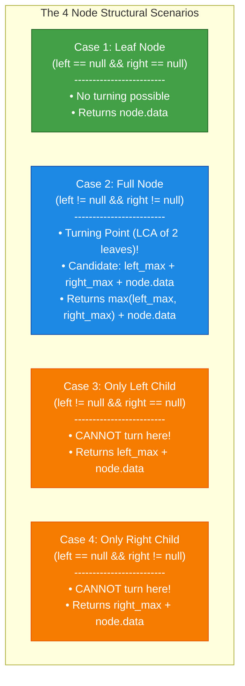
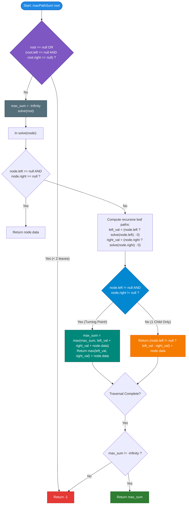

# GeeksforGeeks Problem of the Day: Maximum Path Sum (Between Two Leaves)

- **Problem Link:** [GeeksforGeeks - Maximum Path Sum / Max Path Sum Between Two Leaves](https://www.geeksforgeeks.org/problems/maximum-path-sum/1)
- **Difficulty:** Hard
- **Topic Tags:** Binary Tree, Tree Traversal, Depth-First Search (DFS), Postorder Traversal, Divide and Conquer, Tree Dynamic Programming
- **Target Audience:** POTD Solvers, Computer Science Students, Competitive Programmers, Interview Preparation (Amazon, Microsoft, Samsung, FAANG/Tier-1 Tech)

---

## 1. Problem Statement

Given the root of a binary tree, where each node contains an integer value, find the **maximum possible path sum between any two leaf nodes**.

### Path Rules & Definitions:
1. **Leaf Node Definition:** A leaf node is a node with **no children** (`node.left == null && node.right == null`).
2. **Path Definition:** A path between two leaf nodes is a sequence of nodes starting at one leaf node $L_1$ and ending at a distinct leaf node $L_2$ ($L_1 \neq L_2$), such that:
   - Every consecutive pair of nodes in the sequence is connected by a tree edge.
   - No node appears in the sequence more than once (simple path).
3. **Fewer Than Two Leaves:** If the tree has **fewer than two leaf nodes** (e.g., empty tree, single-node tree, or a strictly skewed linked-list tree with only one leaf), return $\mathbf{-1}$.

### Objective
Return a single integer representing the maximum possible sum of values along any valid simple path connecting two leaf nodes. If no such path exists, return $-1$.

---

## 2. Examples & Explanations

### Example 1: Full Subtree Turning Point
- **Input:** `root = [3, 4, 5, -10, 4, N, N]`
- **Output:** `16`

#### Tree Representation:
```text
          3
        /   \
       4     5 (leaf)
      / \
-10(leaf) 4(leaf)
```

#### Identified Leaf Nodes:
- Leaf 1: `-10`
- Leaf 2: `4` (right child of 4)
- Leaf 3: `5`

#### All Possible Leaf-to-Leaf Paths:
1. **Path 1:** `-10 -> 4 -> 3 -> 5`
   $$\text{Sum} = (-10) + 4 + 3 + 5 = 2$$
2. **Path 2:** `-10 -> 4 -> 4`
   $$\text{Sum} = (-10) + 4 + 4 = -2$$
3. **Path 3:** `4 -> 4 -> 3 -> 5`
   $$\text{Sum} = 4 + 4 + 3 + 5 = \mathbf{16}$$

- **Maximum Path Sum:** $\max(2, -2, 16) = \mathbf{16}$.

---

### Example 2: Deeply Branched Tree with Negative Values
- **Input:** `root = [-15, 5, 6, -8, 1, 3, 9, 2, -3, N, N, N, N, N, 0, N, N, N, N, 4, -1, N, N, 10]`
- **Output:** `27`

#### Tree Representation:
```text
               -15
             /     \
            5       6
          /   \    / \
        -8     1  3   9
        / \            \
       2  -3            0
                       / \
                      4  -1
                           \
                            10
```

#### Identified Leaf Nodes:
- Leaves: `2`, `-3`, `1`, `4`, `10`, `3`

#### Evaluated Leaf-to-Leaf Candidates:
1. `2 -> -8 -> 5 -> 1` $\implies 2 + (-8) + 5 + 1 = 0$
2. `-3 -> -8 -> 5 -> 1` $\implies -3 + (-8) + 5 + 1 = -5$
3. `2 -> -8 -> 5 -> -15 -> 6 -> 3` $\implies 2 - 8 + 5 - 15 + 6 + 3 = -7$
4. `1 -> 5 -> -15 -> 6 -> 9 -> 0 -> 4` $\implies 1 + 5 - 15 + 6 + 9 + 0 + 4 = 10$
5. `3 -> 6 -> 9 -> 0 -> -1 -> 10` $\implies 3 + 6 + 9 + 0 + (-1) + 10 = \mathbf{27}$

- **Maximum Path Sum:** $\mathbf{27}$.

---

### Example 3: Subtree Dominance
- **Input:** `root = [3, 4, 1, -10, 4, N, N]`
- **Output:** `12`

#### Tree Representation:
```text
          3
        /   \
       4     1 (leaf)
      / \
-10(leaf) 4(leaf)
```

- Path between leaf `4` and leaf `1`: $4 \to 4 \to 3 \to 1 = 4 + 4 + 3 + 1 = \mathbf{12}$.

---

### Example 4: Skewed Tree (Fewer Than 2 Leaf Nodes)
- **Input:** `root = [1, 2, N, 3, N]` (A single linear chain $1 \to 2 \to 3$)
- **Output:** `-1`
- **Explanation:** Only node $3$ has no children. The tree contains only **1 leaf node**. Since no two distinct leaves exist, we return **`-1`**.

---

### Example 5: Single Node Tree
- **Input:** `root = [10]`
- **Output:** `-1`
- **Explanation:** The single root node is the only leaf in the entire tree. With fewer than 2 leaves, we return **`-1`**.

---

## 3. Constraints & Complexity Targets

- **Number of Nodes ($N$):** $0 \le N \le 10^4$
- **Node Values:** $-10^3 \le \text{node.data} \le 10^3$
- **Expected Time Complexity:** $\mathcal{O}(N)$
- **Expected Auxiliary Space:** $\mathcal{O}(H)$, where $H$ is the height of the binary tree ($\mathcal{O}(\log N)$ for balanced, $\mathcal{O}(N)$ for skewed) due to recursion stack frames.

---

## 4. Visual Architecture & Theoretical Framework

### Critical Distinction: LeetCode 124 vs. GFG Max Path Sum Between Two Leaves

| Dimension | LeetCode 124 (Any Node to Any Node) | GFG (Between Two Leaves) |
| :--- | :--- | :--- |
| **Start/End Constraint** | Any node $\to$ Any node | **Strictly Leaf $\to$ Strictly Leaf** |
| **Negative Truncation** | Can take $\max(0, \text{left})$ to prune negative subtrees | **CANNOT prune!** Must continue all the way to a leaf |
| **Single-Child Node** | Can be a turning point (treat missing child as $0$) | **CANNOT be a turning point!** Leaf path must pass through both sides |
| **Base Return** | Returns max path from current node down | Returns max path from current node to **a descendant leaf** |

---

### The 4 Structural Node Cases During Postorder Traversal



### Why a Single-Child Node Cannot Be an Apex / Turning Point:
Suppose node $U$ has a left child $L$ but no right child ($R = \text{null}$).
- Any path passing through $U$ and reaching a leaf in $L$'s subtree must exit $U$ towards its parent.
- If $U$ were the highest point (turning point) of a path, the path would have to stop at $U$.
- But $U$ is **NOT a leaf** (it has a child $L$). Thus, a path ending at $U$ would violate the rule that paths must start and end at **leaf nodes**!
- Therefore, $U$ can only act as an **intermediate pass-through node** forwarding a leaf path from $L$ up to its ancestors.

---

## 5. Step-by-Step Simulation & Trace Table

### Tracing Example 1: `root = [3, 4, 5, -10, 4, N, N]`

```text
Global Max Sum initialized to: -Infinity
```

| Postorder Step | Node Visited | Node Type | Left Child Return | Right Child Return | Turning Point Candidate ($\text{L} + \text{R} + \text{data}$) | Global Max Sum Updated | Value Returned to Parent |
| :---: | :---: | :---: | :---: | :---: | :---: | :---: | :---: |
| **1** | `-10` | Leaf | — | — | Not applicable | $-\infty$ | **`-10`** |
| **2** | `4` (right of 4) | Leaf | — | — | Not applicable | $-\infty$ | **`4`** |
| **3** | `4` (parent) | Both Children | `-10` | `4` | $(-10) + 4 + 4 = \mathbf{-2}$ | $\max(-\infty, -2) = \mathbf{-2}$ | $\max(-10, 4) + 4 = \mathbf{8}$ |
| **4** | `5` | Leaf | — | — | Not applicable | `-2` | **`5`** |
| **5** | `3` (root) | Both Children | `8` | `5` | $8 + 5 + 3 = \mathbf{16}$ | $\max(-2, 16) = \mathbf{16}$ | $\max(8, 5) + 3 = \mathbf{11}$ |

### Final Verification:
- Global Max Sum $= 16$.
- Number of leaves encountered $= 3 \ge 2$.
- Final Result Returned: **`16`**.

---

## 6. Algorithm Flowchart



---

## 7. From Naive to Pro: Algorithmic Progression

### Method 1: Naive (Collect All Leaves + Compute Pairwise Distances via LCA)
- **Concept:** 
  1. Traverse the tree and store all leaf node pointers in an array $L$ of size $K$.
  2. For every pair of leaves $(L_i, L_j)$, compute their Lowest Common Ancestor (LCA) and traverse up from both leaves to sum node values along the path.
  3. Track the maximum across all $\binom{K}{2}$ pairs.
- **Why it is suboptimal:**
  - In a balanced tree, $K \approx N/2$. The number of pairs is $\mathcal{O}(N^2)$.
  - Computing the path sum for each pair takes $\mathcal{O}(N)$.
  - Total time complexity explodes to $\mathcal{O}(N^3)$ (or $\mathcal{O}(N^2)$ with fast LCA/prefix sums).
- **Time Complexity:** $\mathcal{O}(N^2)$ to $\mathcal{O}(N^3)$
- **Space Complexity:** $\mathcal{O}(N)$
- **Pseudocode:**
```text
function maxPathSum_Naive(root):
    leaves = findLeaves(root)
    if length(leaves) < 2: return -1
    
    max_sum = -Infinity
    for i from 0 to length(leaves) - 1:
        for j from i + 1 to length(leaves) - 1:
            curr_sum = computePathSumBetween(leaves[i], leaves[j])
            max_sum = max(max_sum, curr_sum)
            
    return max_sum
```

---

### Method 2: Better (Bottom-Up Tree DP with Hash Tables)
- **Concept:**
  - Perform postorder traversal where each node returns a list/hash map of all reachable leaf path sums from its subtree.
  - At each node with two children, compute all cross sums between the left and right lists.
- **Why it is suboptimal:**
  - Passing lists or maps up the tree incurs substantial heap memory allocation and merging overhead ($\mathcal{O}(N^2)$ in worst cases).
- **Time Complexity:** $\mathcal{O}(N \log N)$ average, $\mathcal{O}(N^2)$ worst case
- **Space Complexity:** $\mathcal{O}(N^2)$ memory for stored path lists.

---

### Method 3: Pro Approach (Optimal Single-Pass Postorder DFS)
- **The Core Strategy:**
  - Notice that to find the maximum sum connecting a leaf in the left subtree and a leaf in the right subtree through node $U$, we **only need the maximum leaf-to-node path from the left** and the **maximum leaf-to-node path from the right**.
  - All suboptimal leaf paths from either child can be safely discarded!
  - Therefore, the helper function `solve(node)` only needs to return a **single integer**: the maximum path sum from `node` to any leaf in its subtree.
  - While calculating this, if `node` has **both children**, it tests the candidate path:
    $$\text{candidate} = \text{left\_path} + \text{right\_path} + \text{node.data}$$
    and updates the global `max_sum`.
  - If `node` has only one child, it does **not** update `max_sum` (since it cannot be a leaf-to-leaf turning point), and simply forwards:
    $$\text{return } (\text{child\_path}) + \text{node.data}$$
  - If the tree has fewer than 2 leaves, `max_sum` is never updated and remains $-\infty$, in which case we return $-1$.
- **Time Complexity:** $\mathcal{O}(N)$ — visits each node exactly once.
- **Space Complexity:** $\mathcal{O}(H)$ — maximum recursion depth bounded by tree height.
- **Pseudocode:**
```text
function maxPathSum_Optimal(root):
    if root == null or (root.left == null and root.right == null):
        return -1
        
    max_sum = -Infinity
    
    function solve(node):
        if node.left == null and node.right == null:
            return node.data
            
        left_val = (node.left != null) ? solve(node.left) : 0
        right_val = (node.right != null) ? solve(node.right) : 0
        
        if node.left != null and node.right != null:
            max_sum = max(max_sum, left_val + right_val + node.data)
            return max(left_val, right_val) + node.data
            
        return (node.left != null ? left_val : right_val) + node.data
        
    solve(root)
    return (max_sum == -Infinity) ? -1 : max_sum
```

---

## 8. Complexity Comparison Table

| Metric | Method 1: Naive (Pairwise LCA) | Method 2: Better (Tree DP Lists) | Method 3: Pro (Single-Pass Postorder) |
| :--- | :--- | :--- | :--- |
| **Time Complexity** | $\mathcal{O}(N^2)$ to $\mathcal{O}(N^3)$ | $\mathcal{O}(N \log N)$ to $\mathcal{O}(N^2)$ | $\mathbf{\mathcal{O}(N)}$ (Optimal linear scan) |
| **Auxiliary Space** | $\mathcal{O}(N)$ (Leaf array + LCA) | $\mathcal{O}(N^2)$ (Path collections) | $\mathbf{\mathcal{O}(H)}$ (Call stack only) |
| **Heap Allocations** | High | Extremely High | **Zero Heap Allocations** |
| **Negative Values** | Handled, but slow | Handled | **Handled flawlessly** |
| **Single-Child Logic**| Difficult to generalize | Complex list filtering | **Handled via conditional guard** |
| **Interview Verdict**| Unacceptable in interviews | Over-engineered | **Gold Standard (FAANG expected)** |

---

## 9. Comprehensive Corner Cases Handled

1. **Fewer Than 2 Leaf Nodes:**
   - Empty tree ($N = 0$): returns `-1`.
   - Single node tree ($N = 1$): root is the only leaf, returns `-1`.
   - Strictly skewed linear tree (e.g., $1 \to 2 \to 3$): has only 1 leaf node at the bottom. No node has both children, `max_sum` remains $-\infty$, returns `-1`.
2. **Root Has Only One Child, but Subtree Has $\ge 2$ Leaves:**
   - Example: Root $10$ has only left child $20$, and $20$ has children $30$ and $40$.
   - Root $10$ cannot be an apex, but node $20$ is an apex for leaves $30$ and $40$.
   - Global `max_sum` correctly captures $30 + 40 + 20 = 90$.
3. **All Node Values Are Negative:**
   - Because `-1` is the sentinel return for "fewer than two leaves", initializing `max_sum = -1` would create ambiguity if a valid negative path sum were also `-1`.
   - **Remedy:** Initialize `max_sum` to `Integer.MIN_VALUE` (or `float('-inf')`). Only return `-1` if `max_sum` was **never** updated.
4. **No Integer Underflow/Overflow:**
   - Minimum possible sum: $10^4 \times (-10^3) = -10^7$, well within 32-bit signed integer range $[-2 \times 10^9, 2 \times 10^9]$.
   - Recursive calls avoid adding `Integer.MIN_VALUE` to non-null paths by conditionally executing recursion only on existing children.

---

## 10. Complete Multi-Language Implementations

### Java (21)

```java
/* Node Structure
class Node
{
    int data;
    Node left, right;

    Node(int item)
    {
        data = item;
        left = right = null;
    }
} */

class Solution {
    private int maxSum;

    /**
     * Finds the maximum path sum between any two leaf nodes in a binary tree.
     * 
     * Time Complexity:  O(N) - Visits every node in the binary tree once
     * Auxiliary Space:  O(H) - Recursion call stack bounded by tree height H
     * 
     * @param root The root node of the binary tree
     * @return Maximum path sum between two leaf nodes, or -1 if fewer than two leaves exist
     */
    public int maxPathSum(Node root) {
        if (root == null || (root.left == null && root.right == null)) {
            return -1;
        }

        maxSum = Integer.MIN_VALUE;
        solve(root);

        // If no node had both children, the tree has fewer than two leaf nodes
        return (maxSum == Integer.MIN_VALUE) ? -1 : maxSum;
    }

    private int solve(Node node) {
        // Base case: Leaf node
        if (node.left == null && node.right == null) {
            return node.data;
        }

        // Compute max leaf path sums for existing children
        int leftVal = (node.left != null) ? solve(node.left) : 0;
        int rightVal = (node.right != null) ? solve(node.right) : 0;

        // If current node has BOTH children, it can serve as a turning point (LCA)
        if (node.left != null && node.right != null) {
            maxSum = Math.max(maxSum, leftVal + rightVal + node.data);
            return Math.max(leftVal, rightVal) + node.data;
        }

        // If node has only one child, it cannot be a turning point for leaf-to-leaf path
        return (node.left != null ? leftVal : rightVal) + node.data;
    }
}
```

---

### Python3

```python
'''
# Node Class:
class Node:
    def __init__(self, val):
        self.data = val
        self.left = None
        self.right = None
'''

class Solution:
    def maxPathSum(self, root):
        """
        Finds the maximum path sum between any two leaf nodes in a binary tree.
        
        Time Complexity:  O(N) - Linear postorder traversal
        Auxiliary Space:  O(H) - Recursion stack frames
        """
        if not root or (not root.left and not root.right):
            return -1
        
        max_sum = float('-inf')

        def solve(node):
            nonlocal max_sum
            
            # Base case: Leaf node
            if not node.left and not node.right:
                return node.data

            # Recursively compute leaf path sums for children
            left_val = solve(node.left) if node.left else 0
            right_val = solve(node.right) if node.right else 0

            # If both children exist, this node is an LCA turning point between two leaves
            if node.left and node.right:
                max_sum = max(max_sum, left_val + right_val + node.data)
                return max(left_val, right_val) + node.data

            # If only one child exists, forward the leaf path upward
            return (left_val if node.left else right_val) + node.data

        solve(root)
        
        return max_sum if max_sum != float('-inf') else -1
```

---

### C++ (17)

```cpp
#include <algorithm>
#include <climits>

/* Node Structure
class Node {
  public:
    int data;
    Node *left;
    Node *right;

    Node(int data) {
        this->data = data;
        left = nullptr;
        right = nullptr;
    }
};
*/

class Solution {
  private:
    int maxSum;

    int solve(Node *node) {
        // Base case: Leaf node
        if (node->left == nullptr && node->right == nullptr) {
            return node->data;
        }

        // Recursively compute maximum leaf path sums for existing children
        int leftVal = (node->left != nullptr) ? solve(node->left) : 0;
        int rightVal = (node->right != nullptr) ? solve(node->right) : 0;

        // If node has BOTH children, it can act as a turning point (LCA)
        if (node->left != nullptr && node->right != nullptr) {
            maxSum = std::max(maxSum, leftVal + rightVal + node->data);
            return std::max(leftVal, rightVal) + node->data;
        }

        // If node has only one child, it cannot be a turning point
        return (node->left != nullptr ? leftVal : rightVal) + node->data;
    }

  public:
    /**
     * Finds the maximum path sum between any two leaf nodes in a binary tree.
     * 
     * Time Complexity:  O(N) - Linear single-pass traversal
     * Auxiliary Space:  O(H) - Recursion stack space
     */
    int maxPathSum(Node *root) {
        if (root == nullptr || (root->left == nullptr && root->right == nullptr)) {
            return -1;
        }

        maxSum = INT_MIN;
        solve(root);

        return (maxSum == INT_MIN) ? -1 : maxSum;
    }
};
```

---

### C#

```csharp
using System;

/*
public class Node
{
    public int data;
    public Node left;
    public Node right;

    public Node(int item)
    {
        data = item;
        left = right = null;
    }
}
*/

class Solution {
    private int maxSum;

    /**
     * Finds the maximum path sum between any two leaf nodes in a binary tree.
     * 
     * Time Complexity:  O(N) - Single pass DFS
     * Auxiliary Space:  O(H) - Call stack bounded by height H
     */
    public int maxPathSum(Node root) {
        if (root == null || (root.left == null && root.right == null)) {
            return -1;
        }

        maxSum = int.MinValue;
        Solve(root);

        return (maxSum == int.MinValue) ? -1 : maxSum;
    }

    private int Solve(Node node) {
        // Base case: Leaf node
        if (node.left == null && node.right == null) {
            return node.data;
        }

        int leftVal = (node.left != null) ? Solve(node.left) : 0;
        int rightVal = (node.right != null) ? Solve(node.right) : 0;

        // If current node has both children, it forms a candidate leaf-to-leaf path
        if (node.left != null && node.right != null) {
            maxSum = Math.Max(maxSum, leftVal + rightVal + node.data);
            return Math.Max(leftVal, rightVal) + node.data;
        }

        // If only one child exists, pass the valid leaf path sum upward
        return (node.left != null ? leftVal : rightVal) + node.data;
    }
}
```

---

### JavaScript (Node v22)

```javascript
/*
class Node
{
    constructor(x){
        this.key=x;
        this.left=null;
        this.right=null;
    }
}
*/

/**
 * @param {Node} root
 * @return {number}
 */
class Solution {
    /**
     * Finds the maximum path sum between any two leaf nodes in a binary tree.
     * 
     * Time Complexity:  O(N) - Single pass depth-first search
     * Auxiliary Space:  O(H) - Recursion call stack
     */
    maxPathSum(root) {
        if (!root || (!root.left && !root.right)) {
            return -1;
        }

        let maxSum = -Infinity;

        const solve = (node) => {
            // Defensively extract node value supporting both node.data and node.key
            const val = (node.data !== undefined) ? node.data : node.key;

            // Base case: Leaf node
            if (!node.left && !node.right) {
                return val;
            }

            // Compute maximum leaf paths from existing children
            const leftVal = node.left ? solve(node.left) : 0;
            const rightVal = node.right ? solve(node.right) : 0;

            // If node has BOTH children, it is a valid turning point (LCA)
            if (node.left && node.right) {
                maxSum = Math.max(maxSum, leftVal + rightVal + val);
                return Math.max(leftVal, rightVal) + val;
            }

            // If node has only one child, forward the path upward
            return (node.left ? leftVal : rightVal) + val;
        };

        solve(root);

        return (maxSum === -Infinity) ? -1 : maxSum;
    }
}
```

---

## 11. Key Takeaways for Technical Interviews

1. **Verify Path Endpoint Constraints:**
   - When an interviewer says *"Maximum Path Sum"*, **always clarify the endpoints**:
     - Can the path start and end at *any* nodes? (e.g., LeetCode 124)
     - Must the path connect *root to leaf*? (e.g., LeetCode 129 / Max Leaf Path)
     - Must the path connect *two leaf nodes*? (this problem!)
2. **Never Prune Negative Paths to Zero:**
   - In LeetCode 124, you can do `Math.max(0, left)` because you are permitted to stop at the current node.
   - In this problem, **you are NOT allowed to stop early** — the path MUST reach all the way down to a leaf. If all descendants are negative, you must still choose the least negative leaf path!
3. **Beware of Single-Child Nodes:**
   - A single-child node cannot be the apex of a leaf-to-leaf path. Treating a single-child node as a turning point with a missing child considered $0$ is the most common bug that candidates write in interviews!
4. **Sentinel Return Value vs. Valid Negative Result:**
   - Because node values can be negative, a valid maximum path sum could evaluate to `-1`. Therefore, never initialize your global tracker to `-1`. Use `Integer.MIN_VALUE` / `-Infinity` as the uninitialized sentinel, and only return `-1` if the tracker was never modified.
