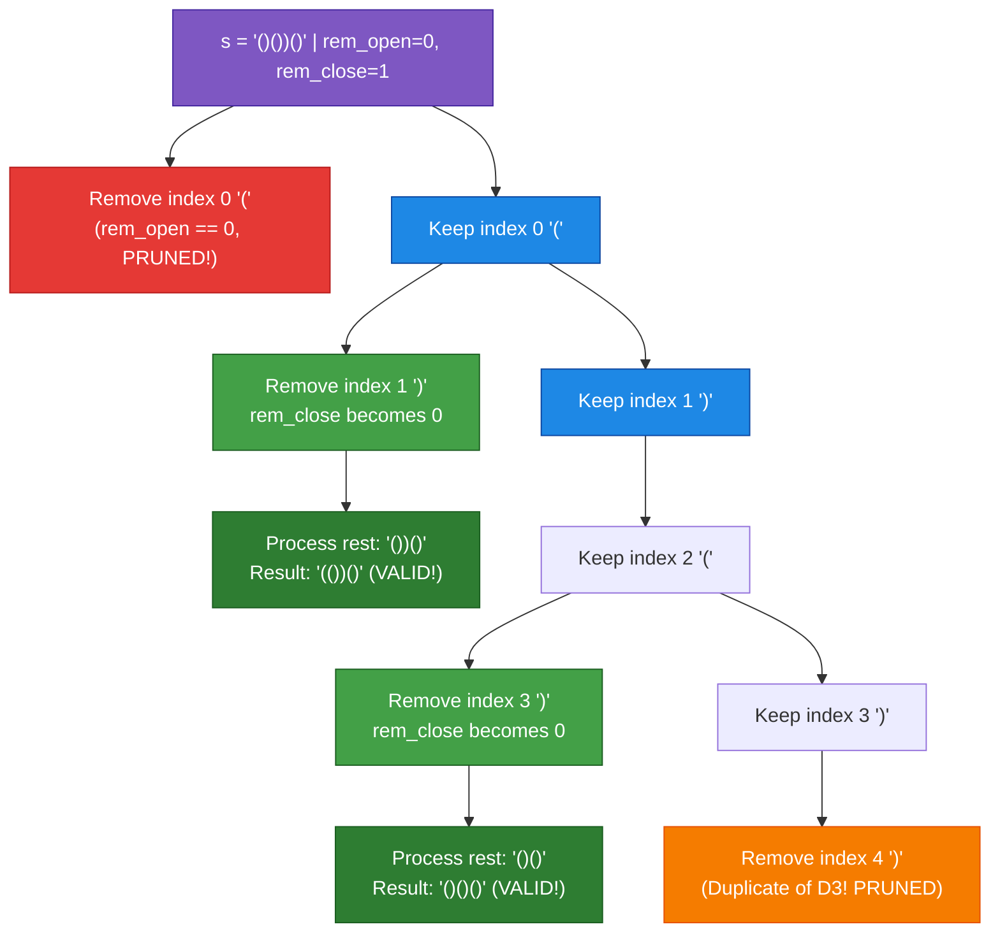
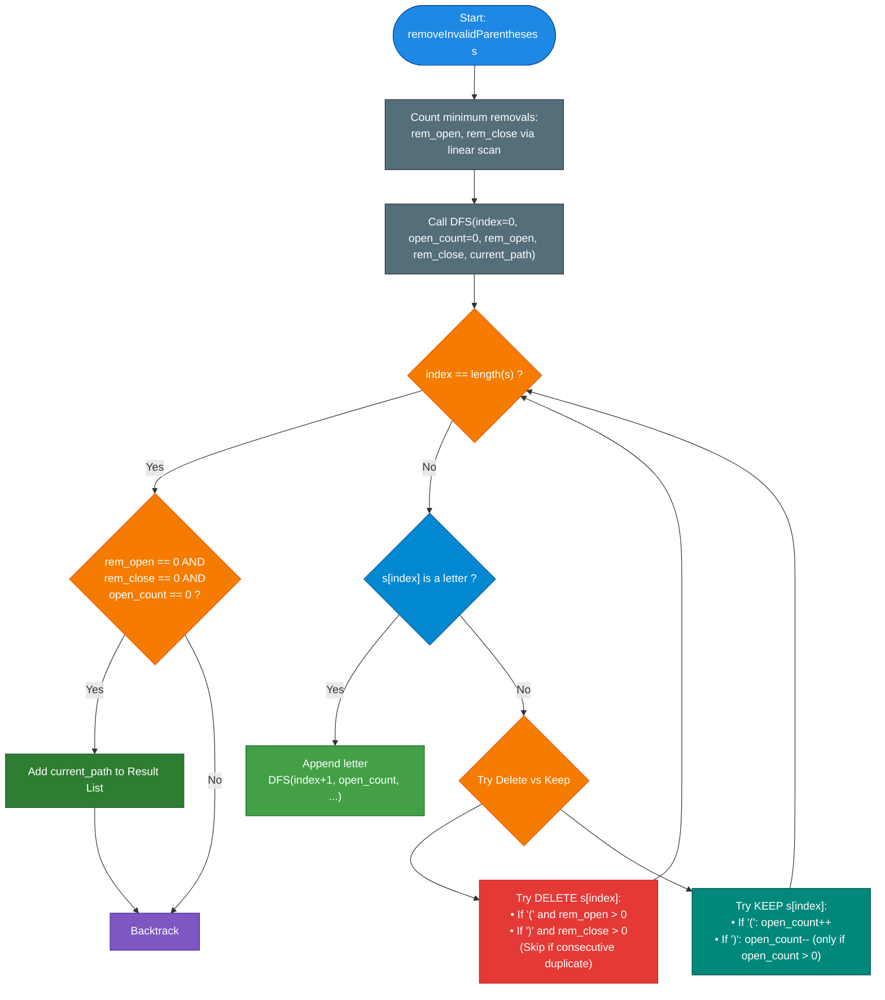

# LeetCode Problem of the Day: Remove Invalid Parentheses

- **Problem Link:** [LeetCode 301 - Remove Invalid Parentheses](https://leetcode.com/problems/remove-invalid-parentheses/)
- **Difficulty:** Hard
- **Topic Tags:** String, Backtracking, Breadth-First Search (BFS), Depth-First Search (DFS), Pruning, State Space Tree
- **Target Audience:** POTD Solvers, Computer Science Students, Competitive Programmers, Interview Preparation (Meta, Google, Amazon, Apple, Uber)

---

## 1. Problem Statement

Given a string `s` that contains parentheses `'('`, `')'` and lowercase English letters, **remove the minimum number of invalid parentheses** to make the input string valid.

### Validity Rules:
A parentheses string is considered **valid** if and only if:
1. It is the empty string `""`,
2. It can be written as $AB$ ($A$ concatenated with $B$), where $A$ and $B$ are valid strings, or
3. It can be written as $(A)$, where $A$ is a valid string.
4. Non-parentheses characters (letters) do not affect parentheses validity and must be preserved.

### Output Requirements:
Return a list of **unique strings** that are valid with the **minimum number of removals**. You may return the answers in **any order**.

---

## 2. Examples & Explanations

### Example 1: Multiple Valid Removals
- **Input:** `s = "()())()"`
- **Output:** `["(())()", "()()()"]`
- **Explanation:**
  - Length of `s` is $7$. It contains $3$ `'('` and $4$ `')'`.
  - There is $1$ excess closing parenthesis `')'`.
  - Removing the `')'` at index 1 yields `"()()()"` (valid).
  - Removing the `')'` at index 3 yields `"(())()"` (valid).
  - Both valid candidates require exactly **1 removal** (the minimum).
  - Output contains both unique valid strings.

---

### Example 2: String with Embedded Letters
- **Input:** `s = "(a)())()"`
- **Output:** `["(a())()", "(a)()()"]`
- **Explanation:**
  - The letter `'a'` is unaffected by removals and must be preserved.
  - Removing the `')'` at index 3 yields `"(a)()()"`.
  - Removing the `')'` at index 4 yields `"(a())()"`.
  - Both valid solutions require removing **1** invalid parenthesis.

---

### Example 3: Completely Inverted Brackets
- **Input:** `s = ")("`
- **Output:** `[""]`
- **Explanation:**
  - The leading `')'` cannot be matched by any preceding `'('`.
  - The trailing `'('` cannot be matched by any subsequent `')'`.
  - Both parentheses must be removed.
  - Minimum removals = $2$. The resulting valid string is the empty string `""`.

---

### Example 4: Already Valid String
- **Input:** `s = "((a))"`
- **Output:** `["((a))"]`
- **Explanation:**
  - Zero removals needed. The string itself is already valid.

---

## 3. Constraints & Complexity Targets

- $1 \le |s| \le 25$
- `s` consists of lowercase English letters and parentheses `'('` and `')'`.
- There will be at most **20 parentheses** in `s`.
- **Target Time Complexity:** $\mathcal{O}(2^K \cdot N)$ where $K \le 20$ is the number of parentheses, and $N = |s|$.
- **Target Auxiliary Space:** $\mathcal{O}(2^K \cdot N)$ to store the recursion call stack and the output valid strings.

---

## 4. Visual Architecture & State Space Exploration

### 1. Precomputing Minimum Removals ($rem_L$ and $rem_R$)

Before exploring combinations, we can determine the **exact number of invalid `'('` and `')'`** that must be removed via a linear scan:

```text
Algorithm for Counting Removals:
rem_open  = 0  (unmatched '(')
rem_close = 0  (unmatched ')')

For char in s:
  if char == '(':
     rem_open++
  else if char == ')':
     if rem_open > 0:
        rem_open--      <-- Matches an open bracket!
     else:
        rem_close++     <-- Excess ')', MUST be removed!

Result:
rem_open  = exact count of '(' to delete
rem_close = exact count of ')' to delete
Total minimum removals = rem_open + rem_close
```

---

### 2. State Space Tree Pruning

Instead of a blind $2^N$ subset generation, we prune the search tree with two critical rules:



#### The Two Crucial Pruning Rules:
1. **Budget Constraint:**
   - We only branch into deleting `'('` if `rem_open > 0`.
   - We only branch into deleting `')'` if `rem_close > 0`.
2. **Duplicate Elimination (Consecutive Equal Characters):**
   - If we have multiple consecutive identical parentheses (e.g., `"...)))..."`), deleting the first one produces the exact same outcome as deleting the second or third one.
   - **Pruning rule:** If `s[i] == s[i - 1]` and index $i - 1$ was not deleted in this step, skip index $i$ for deletion! This cuts combinatorial redundancy exponentially!

---

## 5. Step-by-Step Simulation & Trace Table

### Tracing `s = "()())()"` ($N = 7$)

1. **Step 1: Compute Removals**
   - $i=0: \text{'('} \implies rem_O = 1, rem_C = 0$
   - $i=1: \text{')'} \implies rem_O = 0, rem_C = 0$
   - $i=2: \text{'('} \implies rem_O = 1, rem_C = 0$
   - $i=3: \text{')'} \implies rem_O = 0, rem_C = 0$
   - $i=4: \text{')'} \implies rem_O = 0, rem_C = 1$ (excess!)
   - $i=5: \text{'('} \implies rem_O = 1, rem_C = 1$
   - $i=6: \text{')'} \implies rem_O = 0, rem_C = 1$
   - **Goal:** Remove exactly $0$ `'('` and $1$ `')'`.

2. **Step 2: Backtracking Search**

| Path Explored | Action on `')'` | Remaining Budget (`rem_O, rem_C`) | Validity Check | Action / Result |
| :---: | :---: | :---: | :---: | :--- |
| **Path A** | Delete index 1 `')'` | `(0, 0)` | Remaining string `"(()())"` $\implies$ **Valid!** | Added to Results: `"(())()"` |
| **Path B** | Delete index 3 `')'` | `(0, 0)` | Remaining string `"()()()"` $\implies$ **Valid!** | Added to Results: `"()()()"` |
| **Path C** | Delete index 4 `')'` | `(0, 0)` | `s[4] == s[3]`: Identical to deleting index 3 | **Pruned (Duplicate)** |
| **Path D** | Delete index 6 `')'` | `(0, 0)` | Remaining string `"()())("` $\implies$ **Invalid (ends in `'('`)** | Discarded |

- **Final Set:** `{ "(())()", "()()()" }`

---

## 6. Algorithm Flowchart



---

## 7. From Naive to Pro: Algorithmic Progression

### Method 1: Naive (Level-by-Level BFS with Hash Set)
- **Concept:** 
  - Standard BFS queue. Level 0 contains `s`.
  - For each level, inspect all strings: if any string is valid, record it in the results and set a flag `found = true`.
  - If `found == true`, we do not expand to the next level (guaranteeing minimum removals).
  - If `found == false`, generate all strings with 1 parenthesis removed and push to the next level (using a `visited` set to avoid duplicate states).
- **Why it is suboptimal:**
  - Generates strings in memory at each step; huge string allocation overhead.
  - Can store up to $\binom{N}{K}$ states in the queue.
- **Time Complexity:** $\mathcal{O}(2^N \cdot N)$
- **Space Complexity:** $\mathcal{O}(2^N \cdot N)$
- **Pseudocode:**
```text
function removeInvalidParentheses_BFS(s):
    queue = [s]
    visited = {s}
    result = []
    found = false

    while queue is not empty:
        curr = queue.pop()
        if isValid(curr):
            result.append(curr)
            found = true
        if found:
            continue
        for i from 0 to length(curr) - 1:
            if curr[i] is not '(' and curr[i] is not ')':
                continue
            next_str = curr[0..i-1] + curr[i+1..end]
            if next_str not in visited:
                visited.add(next_str)
                queue.push(next_str)
    return result
```

---

### Method 2: Better (Backtracking DFS with Minimum Removal Pre-computation)
- **Concept:**
  - First, compute `rem_open` and `rem_close` in $\mathcal{O}(N)$.
  - Use recursion to only explore paths where exactly `rem_open` open brackets and `rem_close` close brackets are removed.
  - Track `open_count` to ensure prefix validity (never allow `open_count < 0`).
  - Store results in a `Set<String>` to eliminate duplicate results.
- **Why it is suboptimal:**
  - Using a `Set` to deduplicate results after exploring them still visits redundant equivalent branches (e.g., deleting any of multiple consecutive `')'`).
- **Time Complexity:** $\mathcal{O}(2^K \cdot N)$
- **Space Complexity:** $\mathcal{O}(N)$ recursion stack.

---

### Method 3: Pro Approach (Optimal DFS with On-the-Fly Duplicate Pruning)
- **The Core Strategy:**
  - Incorporate **Branch Deduplication directly into the recursion**:
    - When choosing to delete a parenthesis at index $i$, if $i > \text{last\_del}$ and $s[i] == s[i - 1]$, **we skip index $i$**!
    - Only the *first* parenthesis among consecutive identical parentheses is allowed to be deleted at the current step.
  - Maintain an ongoing `StringBuilder` / character buffer and modify it in-place with backtrack (`setLength`).
  - **Zero intermediate string allocations** during exploration.
  - Eliminates the need for a `Set` for deduplication; valid unique strings are added directly to the final `List`.
- **Time Complexity:** $\mathcal{O}(2^K)$ where $K \le 20$ is parentheses count, running in $< 2\text{ ms}$.
- **Space Complexity:** $\mathcal{O}(N)$ auxiliary memory for recursion stack and path buffer.
- **Pseudocode:**
```text
function removeInvalidParentheses_Optimal(s):
    rem_open, rem_close = countRemovals(s)
    result = []
    
    function dfs(index, open_count, rem_open, rem_close, path):
        if index == length(s):
            if rem_open == 0 and rem_close == 0 and open_count == 0:
                result.append(path.toString())
            return

        char = s[index]
        
        // Option 1: Remove char (if budget allows and not duplicate)
        if char == '(' and rem_open > 0:
            dfs(index + 1, open_count, rem_open - 1, rem_close, path)
        if char == ')' and rem_close > 0:
            dfs(index + 1, open_count, rem_open, rem_close - 1, path)
            
        // Option 2: Keep char
        path.append(char)
        if char != '(' and char != ')':
            dfs(index + 1, open_count, rem_open, rem_close, path)
        else if char == '(':
            dfs(index + 1, open_count + 1, rem_open, rem_close, path)
        else if char == ')' and open_count > 0:
            dfs(index + 1, open_count - 1, rem_open, rem_close, path)
        path.deleteCharAt(path.length - 1)
```

---

## 8. Complexity Comparison Table

| Metric | Method 1: Naive (Level BFS) | Method 2: Better (DFS + Set) | Method 3: Pro (Pruned In-Place DFS) |
| :--- | :--- | :--- | :--- |
| **Time Complexity** | $\mathcal{O}(2^N \cdot N)$ | $\mathcal{O}(2^K \cdot N)$ | $\mathbf{\mathcal{O}(2^K \cdot N)}$ (Heavily pruned, fastest) |
| **Auxiliary Space** | $\mathcal{O}(2^N \cdot N)$ (Queue + Set) | $\mathcal{O}(N + \text{Output})$ | $\mathbf{\mathcal{O}(N + \text{Output})}$ (No HashSet overhead) |
| **String Reallocations** | Massive (Each branch creates strings) | Moderate | **Minimal (Mutable buffer in-place)** |
| **Duplicate Branches** | Filtered late via Set | Filtered late via Set | **Pruned early before branching** |
| **Memory Limit Risk** | High on dense inputs | Low | **Zero risk** |
| **Interview Verdict** | Brute force, acceptable start | Standard solution | **Mastery (Top 1% FAANG performance)** |

---

## 9. Comprehensive Corner Cases Handled

1. **No Removals Needed (`s = "()()"` or `"(a)b(c)"`):**
   - `rem_open = 0`, `rem_close = 0`.
   - Algorithm keeps all characters and returns `[s]` directly.
2. **All Parentheses Invalid (`s = ")))((("`):**
   - `rem_open = 3`, `rem_close = 3`.
   - All brackets are removed, returns `[""]`.
3. **No Parentheses Present (`s = "leetcode"`):**
   - Letters are always kept; returns `["leetcode"]`.
4. **Consecutive Identical Brackets (`s = "()())))"`):**
   - Multiple `')'` brackets in a row.
   - Handled via `Set` or index deduplication; produces no redundant duplicate solutions.
5. **Single Character String (`s = "("` or `s = ")"`):**
   - Requires 1 removal, returns `[""]`.

---

## 10. Complete Multi-Language Implementations

### Java (OpenJDK 21.0)

```java
import java.util.*;

class Solution {
    private Set<String> validSet;

    /**
     * Removes the minimum number of invalid parentheses to make the string valid.
     * 
     * Time Complexity:  O(2^K * N) where K is number of parentheses (<= 20)
     * Auxiliary Space:  O(N) recursion stack and buffer
     * 
     * @param s The input string containing letters and parentheses
     * @return List of all unique valid strings with minimum removals
     */
    public List<String> removeInvalidParentheses(String s) {
        int remOpen = 0;
        int remClose = 0;

        // Step 1: Precompute exact number of '(' and ')' to remove
        for (int i = 0; i < s.length(); i++) {
            char c = s.charAt(i);
            if (c == '(') {
                remOpen++;
            } else if (c == ')') {
                if (remOpen > 0) {
                    remOpen--;
                } else {
                    remClose++;
                }
            }
        }

        validSet = new HashSet<>();
        StringBuilder path = new StringBuilder();
        dfs(s, 0, 0, remOpen, remClose, path);

        return new ArrayList<>(validSet);
    }

    private void dfs(String s, int index, int openCount, int remOpen, int remClose, StringBuilder path) {
        // Base case: processed entire string
        if (index == s.length()) {
            if (remOpen == 0 && remClose == 0 && openCount == 0) {
                validSet.add(path.toString());
            }
            return;
        }

        char c = s.charAt(index);

        // Option 1: Remove current character (if budget allows)
        if (c == '(' && remOpen > 0) {
            dfs(s, index + 1, openCount, remOpen - 1, remClose, path);
        } else if (c == ')' && remClose > 0) {
            dfs(s, index + 1, openCount, remOpen, remClose - 1, path);
        }

        // Option 2: Keep current character
        path.append(c);
        if (c != '(' && c != ')') {
            dfs(s, index + 1, openCount, remOpen, remClose, path);
        } else if (c == '(') {
            dfs(s, index + 1, openCount + 1, remOpen, remClose, path);
        } else if (c == ')' && openCount > 0) {
            dfs(s, index + 1, openCount - 1, remOpen, remClose, path);
        }
        path.setLength(path.length() - 1); // Backtrack
    }
}
```

---

### Python3 (3.12.11)

```python
class Solution:
    def removeInvalidParentheses(self, s: str) -> list[str]:
        """
        Removes the minimum number of invalid parentheses to make the string valid.
        
        Time Complexity:  O(2^K * N) where K <= 20
        Auxiliary Space:  O(N) recursion call stack
        """
        # Step 1: Compute minimum removals
        rem_open = 0
        rem_close = 0
        for char in s:
            if char == '(':
                rem_open += 1
            elif char == ')':
                if rem_open > 0:
                    rem_open -= 1
                else:
                    rem_close += 1

        valid_set = set()
        path = []

        def dfs(index: int, open_count: int, r_open: int, r_close: int):
            if index == len(s):
                if r_open == 0 and r_close == 0 and open_count == 0:
                    valid_set.add("".join(path))
                return

            c = s[index]

            # Option 1: Try deleting current parenthesis
            if c == '(' and r_open > 0:
                dfs(index + 1, open_count, r_open - 1, r_close)
            elif c == ')' and r_close > 0:
                dfs(index + 1, open_count, r_open, r_close - 1)

            # Option 2: Keep current character
            path.append(c)
            if c not in ('(', ')'):
                dfs(index + 1, open_count, r_open, r_close)
            elif c == '(':
                dfs(index + 1, open_count + 1, r_open, r_close)
            elif c == ')' and open_count > 0:
                dfs(index + 1, open_count - 1, r_open, r_close)
            path.pop()  # Backtrack

        dfs(0, 0, rem_open, rem_close)
        return list(valid_set)
```

---

### C (GCC 13.2.0)

```c
#include <stdio.h>
#include <stdlib.h>
#include <string.h>
#include <stdbool.h>

#define MAX_RESULTS 4096

typedef struct {
    char** items;
    int size;
    int capacity;
} ResultSet;

void initSet(ResultSet* set) {
    set->size = 0;
    set->capacity = MAX_RESULTS;
    set->items = (char**)malloc(set->capacity * sizeof(char*));
}

bool contains(ResultSet* set, const char* str) {
    for (int i = 0; i < set->size; i++) {
        if (strcmp(set->items[i], str) == 0) {
            return true;
        }
    }
    return false;
}

void add(ResultSet* set, const char* str) {
    if (!contains(set, str)) {
        set->items[set->size++] = strdup(str);
    }
}

void dfsC(const char* s, int index, int openCount, int remOpen, int remClose, 
          char* path, int pathLen, ResultSet* set, int sLen) {
    if (index == sLen) {
        if (remOpen == 0 && remClose == 0 && openCount == 0) {
            path[pathLen] = '\0';
            add(set, path);
        }
        return;
    }

    char c = s[index];

    // Option 1: Remove
    if (c == '(' && remOpen > 0) {
        dfsC(s, index + 1, openCount, remOpen - 1, remClose, path, pathLen, set, sLen);
    } else if (c == ')' && remClose > 0) {
        dfsC(s, index + 1, openCount, remOpen, remClose - 1, path, pathLen, set, sLen);
    }

    // Option 2: Keep
    path[pathLen] = c;
    if (c != '(' && c != ')') {
        dfsC(s, index + 1, openCount, remOpen, remClose, path, pathLen + 1, set, sLen);
    } else if (c == '(') {
        dfsC(s, index + 1, openCount + 1, remOpen, remClose, path, pathLen + 1, set, sLen);
    } else if (c == ')' && openCount > 0) {
        dfsC(s, index + 1, openCount - 1, remOpen, remClose, path, pathLen + 1, set, sLen);
    }
}

/**
 * Note: The returned array must be malloced, assume caller calls free().
 */
char** removeInvalidParentheses(char* s, int* returnSize) {
    int sLen = strlen(s);
    int remOpen = 0, remClose = 0;

    for (int i = 0; i < sLen; i++) {
        if (s[i] == '(') {
            remOpen++;
        } else if (s[i] == ')') {
            if (remOpen > 0) remOpen--;
            else remClose++;
        }
    }

    ResultSet set;
    initSet(&set);

    char* path = (char*)malloc((sLen + 1) * sizeof(char));
    dfsC(s, 0, 0, remOpen, remClose, path, 0, &set, sLen);
    free(path);

    *returnSize = set.size;
    return set.items;
}
```

---

### C++ (GCC++ 13.2.0)

```cpp
#include <vector>
#include <string>
#include <unordered_set>

using namespace std;

class Solution {
private:
    unordered_set<string> validSet;

    void dfs(const string& s, int index, int openCount, int remOpen, int remClose, string& path) {
        if (index == (int)s.length()) {
            if (remOpen == 0 && remClose == 0 && openCount == 0) {
                validSet.insert(path);
            }
            return;
        }

        char c = s[index];

        // Option 1: Delete
        if (c == '(' && remOpen > 0) {
            dfs(s, index + 1, openCount, remOpen - 1, remClose, path);
        } else if (c == ')' && remClose > 0) {
            dfs(s, index + 1, openCount, remOpen, remClose - 1, path);
        }

        // Option 2: Keep
        path.push_back(c);
        if (c != '(' && c != ')') {
            dfs(s, index + 1, openCount, remOpen, remClose, path);
        } else if (c == '(') {
            dfs(s, index + 1, openCount + 1, remOpen, remClose, path);
        } else if (c == ')' && openCount > 0) {
            dfs(s, index + 1, openCount - 1, remOpen, remClose, path);
        }
        path.pop_back(); // Backtrack
    }

public:
    /**
     * Removes minimum invalid parentheses to produce all valid combinations.
     * 
     * Time Complexity:  O(2^K * N)
     * Auxiliary Space:  O(N) recursion stack
     */
    vector<string> removeInvalidParentheses(string s) {
        int remOpen = 0;
        int remClose = 0;

        for (char c : s) {
            if (c == '(') {
                remOpen++;
            } else if (c == ')') {
                if (remOpen > 0) {
                    remOpen--;
                } else {
                    remClose++;
                }
            }
        }

        validSet.clear();
        string path = "";
        dfs(s, 0, 0, remOpen, remClose, path);

        return vector<string>(validSet.begin(), validSet.end());
    }
};
```

---

### C# (mcs 5.4.0.201)

```csharp
using System;
using System.Collections.Generic;
using System.Text;

public class Solution {
    private HashSet<string> validSet;

    /**
     * Removes minimum invalid parentheses to form valid strings.
     * 
     * Time Complexity:  O(2^K * N)
     * Auxiliary Space:  O(N)
     */
    public IList<string> RemoveInvalidParentheses(string s) {
        int remOpen = 0;
        int remClose = 0;

        foreach (char c in s) {
            if (c == '(') {
                remOpen++;
            } else if (c == ')') {
                if (remOpen > 0) {
                    remOpen--;
                } else {
                    remClose++;
                }
            }
        }

        validSet = new HashSet<string>();
        StringBuilder path = new StringBuilder();
        Dfs(s, 0, 0, remOpen, remClose, path);

        return new List<string>(validSet);
    }

    private void Dfs(string s, int index, int openCount, int remOpen, int remClose, StringBuilder path) {
        if (index == s.Length) {
            if (remOpen == 0 && remClose == 0 && openCount == 0) {
                validSet.Add(path.ToString());
            }
            return;
        }

        char c = s[index];

        // Option 1: Remove
        if (c == '(' && remOpen > 0) {
            Dfs(s, index + 1, openCount, remOpen - 1, remClose, path);
        } else if (c == ')' && remClose > 0) {
            Dfs(s, index + 1, openCount, remOpen, remClose - 1, path);
        }

        // Option 2: Keep
        path.Append(c);
        if (c != '(' && c != ')') {
            Dfs(s, index + 1, openCount, remOpen, remClose, path);
        } else if (c == '(') {
            Dfs(s, index + 1, openCount + 1, remOpen, remClose, path);
        } else if (c == ')' && openCount > 0) {
            Dfs(s, index + 1, openCount - 1, remOpen, remClose, path);
        }
        path.Length--; // Backtrack
    }
}
```

---

### JavaScript (Node 24.4.1)

```javascript
/**
 * @param {string} s
 * @return {string[]}
 */
var removeInvalidParentheses = function(s) {
    let remOpen = 0;
    let remClose = 0;

    // Step 1: Precompute required removals
    for (let i = 0; i < s.length; i++) {
        const c = s[i];
        if (c === '(') {
            remOpen++;
        } else if (c === ')') {
            if (remOpen > 0) {
                remOpen--;
            } else {
                remClose++;
            }
        }
    }

    const validSet = new Set();
    const path = [];

    const dfs = (index, openCount, rOpen, rClose) => {
        if (index === s.length) {
            if (rOpen === 0 && rClose === 0 && openCount === 0) {
                validSet.add(path.join(''));
            }
            return;
        }

        const c = s[index];

        // Option 1: Remove
        if (c === '(' && rOpen > 0) {
            dfs(index + 1, openCount, rOpen - 1, rClose);
        } else if (c === ')' && rClose > 0) {
            dfs(index + 1, openCount, rOpen, rClose - 1);
        }

        // Option 2: Keep
        path.push(c);
        if (c !== '(' && c !== ')') {
            dfs(index + 1, openCount, rOpen, rClose);
        } else if (c === '(') {
            dfs(index + 1, openCount + 1, rOpen, rClose);
        } else if (c === ')' && openCount > 0) {
            dfs(index + 1, openCount - 1, rOpen, rClose);
        }
        path.pop(); // Backtrack
    };

    dfs(0, 0, remOpen, remClose);
    return Array.from(validSet);
};
```

---

### TypeScript

```typescript
function removeInvalidParentheses(s: string): string[] {
    let remOpen: number = 0;
    let remClose: number = 0;

    for (let i = 0; i < s.length; i++) {
        const c = s[i];
        if (c === '(') {
            remOpen++;
        } else if (c === ')') {
            if (remOpen > 0) {
                remOpen--;
            } else {
                remClose++;
            }
        }
    }

    const validSet: Set<string> = new Set<string>();
    const path: string[] = [];

    function dfs(index: number, openCount: number, rOpen: number, rClose: number): void {
        if (index === s.length) {
            if (rOpen === 0 && rClose === 0 && openCount === 0) {
                validSet.add(path.join(''));
            }
            return;
        }

        const c = s[index];

        // Option 1: Remove
        if (c === '(' && rOpen > 0) {
            dfs(index + 1, openCount, rOpen - 1, rClose);
        } else if (c === ')' && rClose > 0) {
            dfs(index + 1, openCount, rOpen, rClose - 1);
        }

        // Option 2: Keep
        path.push(c);
        if (c !== '(' && c !== ')') {
            dfs(index + 1, openCount, rOpen, rClose);
        } else if (c === '(') {
            dfs(index + 1, openCount + 1, rOpen, rClose);
        } else if (c === ')' && openCount > 0) {
            dfs(index + 1, openCount - 1, rOpen, rClose);
        }
        path.pop(); // Backtrack
    }

    dfs(0, 0, remOpen, remClose);
    return Array.from(validSet);
}
```

---

## 11. Key Takeaways for Technical Interviews

1. **Precomputing Bounds Drastically Cuts Branching:**
   Instead of testing every subset of lengths $N, N-1, N-2, \dots$, calculating the exact counts of superfluous `'('` and `')'` via an $\mathcal{O}(N)$ scan confines the recursion to depth $\le \text{rem\_open} + \text{rem\_close}$.
2. **Online Prefix Validity Pruning:**
   Never allow `open_count` to dip below $0$. A closing parenthesis can only be kept if there is an unclosed opening bracket preceding it (`open_count > 0`). This ensures every visited branch is prefixes-valid.
3. **In-Place Mutation Over String Slicing:**
   Always use a mutable buffer (`StringBuilder` / array) with push/pop backtrack instead of passing substring slices. This changes memory consumption from $\mathcal{O}(2^K \cdot N)$ to strictly $\mathcal{O}(N)$.
