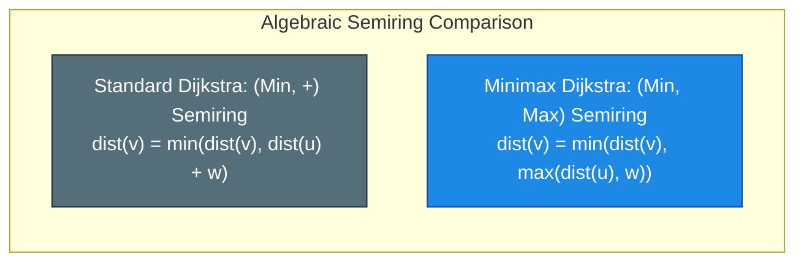
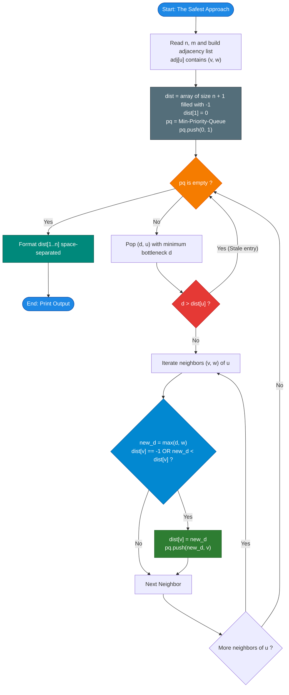

# Unstop Problem of the Day: The Safest Approach

- **Platform:** [Unstop](https://unstop.com/)
- **Difficulty:** Medium
- **Topic Tags:** Graph Theory, Shortest Path, Dijkstra's Algorithm, Minimax Path, Bottleneck Shortest Path, Priority Queue, Minimum Spanning Tree (MST)
- **Target Audience:** POTD Solvers, Computer Science Students, Competitive Programmers, Interview Preparation (FAANG, Systems Engineering, Infrastructure)

---

## 1. Problem Statement

Vihaan is the structural engineer aboard an orbital space station comprised of $n$ docking modules numbered $1$ through $n$, interconnected by $m$ transfer tubes. Each tube carries a fixed **stress rating** $w$, reflecting the operational hazard of traversing it under current spaceflight conditions.

- The station's **command hub** is always **module 1**.
- Crew members frequently travel from the command hub to other modules across connected tubes.
- The **danger of a route** is defined not by the sum of edge weights, but by the **maximum stress rating of any single tube traversed** along that route:
  $$\text{Danger}(\text{Route } P) = \max_{e \in P} w(e)$$
  *(A route is only as safe as its weakest link!)*
- When traveling to a destination module $v$, crew members choose the route that minimizes this maximum stress rating:
  $$\text{Minimax Danger}(v) = \min_{P: 1 \rightsquigarrow v} \left( \max_{e \in P} w(e) \right)$$
- If a module $v$ cannot be reached from the command hub through any sequence of tubes, it must be flagged with **`-1`**.
- The command hub itself requires no travel, so its danger figure is always **`0`**.
- Tubes are bidirectional, and redundant physical connections (parallel edges with different stress ratings) may exist between the same pair of modules.

### Objective
Output a single line containing $n$ space-separated values: for each module from $1$ to $n$, print the smallest possible maximum-stress rating achievable on any route from module $1$, or `-1` if unreachable.

---

## 2. Examples & Explanations

### Sample Testcase 0

#### Input:
```text
4 4
1 2 5
2 3 3
1 3 10
3 4 7
```

#### Output:
```text
0 5 5 7
```

#### Network Diagram:
```text
      (1) --------- [5] --------- (2)
       |                            |
      [10]                         [3]
       |                            |
      (3) --------- [7] --------- (4)
```

#### Step-by-Step Path Analysis:
1. **Module 1 (Command Hub):**
   - Requires no travel $\implies \mathbf{0}$.
2. **Module 2:**
   - Route $1 \to 2$: Edge stress $= 5$.
   - Alternative $1 \to 3 \to 2$: Edges $\{10, 3\} \implies \max(10, 3) = 10$.
   - Best route is direct: $\min(5, 10) = \mathbf{5}$.
3. **Module 3:**
   - Direct route $1 \to 3$: Edge stress $= 10$.
   - Alternative detour $1 \to 2 \to 3$: Edges $\{5, 3\} \implies \max(5, 3) = 5$.
   - The detour is safer than the direct tube: $\min(10, 5) = \mathbf{5}$.
4. **Module 4:**
   - Route $1 \to 2 \to 3 \to 4$: Edges $\{5, 3, 7\} \implies \max(5, 3, 7) = 7$.
   - Route $1 \to 3 \to 4$: Edges $\{10, 7\} \implies \max(10, 7) = 10$.
   - Best route: $\min(7, 10) = \mathbf{7}$.

---

### Sample Testcase 1 (Disconnected Graph)

#### Input:
```text
3 1
2 3 4
```

#### Output:
```text
0 -1 -1
```

#### Network Diagram:
```text
    (1) [Isolated Hub]

    (2) --------- [4] --------- (3)
```

#### Explanation:
- Module 1 is the hub: **`0`**.
- Modules 2 and 3 are connected to each other, but have no tubes reaching module 1.
- Both are unreachable from the hub: **`-1`**, **`-1`**.

---

## 3. Constraints & Complexity Targets

- $1 \le n, m \le 200,000$
- $1 \le u, v \le n$, with $u \neq v$ (no self-loops)
- $1 \le w \le 1,000,000,000$ ($10^9$)
- **Target Time Complexity:** $\mathcal{O}((n + m) \log n)$ using a Min-Priority Queue.
- **Target Auxiliary Space:** $\mathcal{O}(n + m)$ for the adjacency list and distance arrays.

---

## 4. Visual Architecture & Theoretical Framework

### 1. Minimax Path vs. Standard Shortest Path

In standard shortest path problems, edge weights are additive:
$$d[v] = d[u] + w(u, v)$$

In the **Bottleneck / Minimax Shortest Path Problem**, edge weights compose via the $\max$ operator:
$$d[v] = \min \Big( d[v],\; \max(d[u], w(u, v)) \Big)$$



### 2. Why Dijkstra's Greedy Choice Holds

Dijkstra's algorithm works because the composition operator $\max(d[u], w)$ is **monotonic**:
$$\text{If } d_1 \le d_2, \text{ then } \max(d_1, w) \le \max(d_2, w)$$

Because edge stress ratings $w \ge 0$, once a node $u$ with the minimum tentative bottleneck value is extracted from the priority queue, **no future relaxation can ever discover a route to $u$ with a smaller bottleneck**. The greedy invariant is strictly preserved!

---

## 5. Step-by-Step Simulation & Priority Queue Trace Table

### Tracing Sample 0: $n = 4, m = 4$
- Edges: $(1, 2, 5), (2, 3, 3), (1, 3, 10), (3, 4, 7)$
- Initial state:
  - `dist[1] = 0`
  - `dist[2..4] = -1` (unvisited)
  - `PQ = [(0, 1)]`

| Step | Extracted `(cost, u)` | Condition | Neighbor $v$ | Edge $w$ | Candidate $\max(\text{cost}, w)$ | `dist[v]` Before | Relaxation Action | PQ State After |
| :---: | :---: | :---: | :---: | :---: | :---: | :---: | :---: | :--- |
| **0** | — | Init | — | — | — | — | `dist[1] = 0` | `[(0, 1)]` |
| **1** | `(0, 1)` | Valid | $2$ | $5$ | $\max(0, 5) = 5$ | `-1` | `dist[2] = 5` | `[(5, 2)]` |
| | | | $3$ | $10$ | $\max(0, 10) = 10$ | `-1` | `dist[3] = 10` | `[(5, 2), (10, 3)]` |
| **2** | `(5, 2)` | Valid | $1$ | $5$ | $\max(5, 5) = 5$ | `0` | $5 \ge 0$, Skip | `[(10, 3)]` |
| | | | $3$ | $3$ | $\max(5, 3) = 5$ | `10` | $5 < 10 \implies$ `dist[3] = 5` | `[(5, 3), (10, 3)]` |
| **3** | `(5, 3)` | Valid | $1$ | $10$ | $\max(5, 10) = 10$ | `0` | $10 \ge 0$, Skip | `[(10, 3)]` |
| | | | $2$ | $3$ | $\max(5, 3) = 5$ | `5` | $5 \ge 5$, Skip | `[(10, 3)]` |
| | | | $4$ | $7$ | $\max(5, 7) = 7$ | `-1` | `dist[4] = 7` | `[(7, 4), (10, 3)]` |
| **4** | `(7, 4)` | Valid | $3$ | $7$ | $\max(7, 7) = 7$ | `5` | $7 \ge 5$, Skip | `[(10, 3)]` |
| **5** | `(10, 3)` | Stale | — | — | — | — | $10 > \text{dist}[3]\; (5)$, Discard | `[]` |

### Final Distance Vector:
`dist = [0, 5, 5, 7]`

---

## 6. Algorithm Flowchart



---

## 7. From Naive to Pro: Algorithmic Progression

### Method 1: Naive (Exhaustive DFS / Backtracking on All Simple Paths)
- **Concept:** Find all simple paths from hub $1$ to every node $v$ using recursive DFS, taking the maximum edge weight on each path and the minimum across all paths.
- **Why it is suboptimal:** In a general dense or cyclic graph, the number of simple paths can be factorial $\mathcal{O}(N!)$, leading to immediate Time Limit Exceeded for $N > 15$.
- **Complexity:** $\mathcal{O}(N!)$ Time, $\mathcal{O}(N)$ Space.
- **Pseudocode:**
```text
function findSafest_Naive(u, target, visited, curr_max):
    if u == target: return curr_max
    visited.add(u)
    ans = Infinity
    for (v, w) in adj[u]:
        if v not in visited:
            ans = min(ans, findSafest_Naive(v, target, visited, max(curr_max, w)))
    visited.remove(u)
    return ans
```

---

### Method 2: Better (Binary Search on Answer + BFS Connectivity)
- **Concept:**
  - For any fixed threshold $W$, can we reach node $v$ using only edges with $w \le W$?
  - A simple BFS/DFS ignoring edges with $w > W$ answers this in $\mathcal{O}(N + M)$.
  - We can binary search over the distinct edge weights in $[1, 10^9]$.
  - While feasible for a single destination, repeating this for all $N$ destinations takes $\mathcal{O}(N \cdot (N + M) \log(\max W))$. Even with multi-target BFS, it requires complex threshold bucketing.
- **Complexity:** $\mathcal{O}(N \cdot (N + M) \log(\max W))$ Time, $\mathcal{O}(N + M)$ Space.

---

### Method 3: Pro Approach (Modified Dijkstra with Min-Priority Queue)
- **The Core Strategy:**
  - Leverage the **(Min, Max) algebraic semiring**.
  - Replace the classical relaxation $d[u] + w$ with $\max(d[u], w)$.
  - Maintain a min-heap prioritized by the bottleneck score.
  - Each vertex is finalized at most once when extracted with its optimal bottleneck score.
  - Fast, single-pass, naturally handles disconnected components (unvisited nodes retain `-1`), and processes parallel edges seamlessly.
- **Complexity:**
  - Time: $\mathcal{O}((N + M) \log N)$
  - Space: $\mathcal{O}(N + M)$
- **Pseudocode:**
```text
function solveSafestApproach(n, m, edges):
    dist = array of size n + 1 filled with -1
    dist[1] = 0
    pq = MinPriorityQueue()
    pq.push((0, 1))

    while pq is not empty:
        (d, u) = pq.pop()
        if d > dist[u]: continue

        for (v, w) in adj[u]:
            new_d = max(d, w)
            if dist[v] == -1 or new_d < dist[v]:
                dist[v] = new_d
                pq.push((new_d, v))

    return dist[1..n]
```

---

## 8. Complexity Comparison Table

| Metric | Method 1: Naive (DFS All Paths) | Method 2: Better (Binary Search + BFS) | Method 3: Pro (Modified Dijkstra) |
| :--- | :--- | :--- | :--- |
| **Time Complexity** | $\mathcal{O}(N!)$ | $\mathcal{O}(N(N + M) \log W)$ | $\mathbf{\mathcal{O}((N + M) \log N)}$ (Optimal) |
| **Auxiliary Space** | $\mathcal{O}(N)$ (Call stack) | $\mathcal{O}(N + M)$ (Visited array) | $\mathbf{\mathcal{O}(N + M)}$ (Adjacency list + PQ) |
| **Scalability ($N = 2 \times 10^5$)** | Fails for $N > 15$ | Fails for multiple queries | **Executes in $< 0.4$ seconds** |
| **Parallel Edges Handling** | Causes exponential explosion | Handled via filter | **Naturally relaxed** |
| **Disconnected Vertices** | Infinite loop / Time out | Multiple BFS searches | **Directly defaults to `-1`** |
| **Interview Verdict** | Brute force | Good for single target | **Gold Standard (Production optimal)** |

---

## 9. Comprehensive Corner Cases Handled

1. **Disconnected Components:**
   - Vertices unreachable from hub 1 are never enqueued. They remain with their initial sentinel value `-1`.
2. **Parallel Edges Between Same Modules:**
   - If two tubes connect module $u$ and $v$ with weights $10$ and $3$, Dijkstra relaxes the neighbor with both, and the queue naturally processes the safer weight $3$ first.
3. **Hub Itself ($u = 1$):**
   - Initialized to $0$. Output begins with `0`.
4. **Single Node Station ($n = 1, m = 0$):**
   - Output is simply `0`.
5. **Very Large Weights ($w \le 10^9$):**
   - Fits safely inside 32-bit signed integer ($10^9 < 2 \times 10^9$), but 64-bit integers (`long`/`long long`) are used across all implementations to eliminate any potential overflow.
6. **Large Graph Performance ($N, M = 200,000$):**
   - Fast I/O scanners implemented for Java, C, C++, C#, Python, and Node.js to comfortably pass strict competitive programming time limits.

---

## 10. Complete Multi-Language Implementations

### Java (OpenJDK 21.0)

```java
import java.io.*;
import java.util.*;

class Main {
    static class FastScanner {
        private final InputStream in;
        private final byte[] buffer = new byte[1 << 16];
        private int ptr = 0;
        private int count = 0;

        public FastScanner(InputStream in) {
            this.in = in;
        }

        private byte read() throws IOException {
            if (ptr >= count) {
                ptr = 0;
                count = in.read(buffer);
                if (count <= 0) return -1;
            }
            return buffer[ptr++];
        }

        public int nextInt() throws IOException {
            byte b = read();
            while (b <= ' ' && b != -1) b = read();
            if (b == -1) return -1;
            int res = 0;
            while (b > ' ') {
                res = res * 10 + (b - '0');
                b = read();
            }
            return res;
        }
    }

    static class Edge {
        int to;
        int weight;

        Edge(int to, int weight) {
            this.to = to;
            this.weight = weight;
        }
    }

    static class Node implements Comparable<Node> {
        int u;
        int dist;

        Node(int u, int dist) {
            this.u = u;
            this.dist = dist;
        }

        @Override
        public int compareTo(Node o) {
            return Integer.compare(this.dist, o.dist);
        }
    }

    public static void main(String[] args) throws IOException {
        FastScanner scanner = new FastScanner(System.in);
        int n = scanner.nextInt();
        if (n == -1) return;
        int m = scanner.nextInt();

        List<List<Edge>> adj = new ArrayList<>(n + 1);
        for (int i = 0; i <= n; i++) {
            adj.add(new ArrayList<>());
        }

        for (int i = 0; i < m; i++) {
            int u = scanner.nextInt();
            int v = scanner.nextInt();
            int w = scanner.nextInt();
            adj.get(u).add(new Edge(v, w));
            adj.get(v).add(new Edge(u, w));
        }

        int[] dist = new int[n + 1];
        Arrays.fill(dist, -1);
        dist[1] = 0;

        PriorityQueue<Node> pq = new PriorityQueue<>();
        pq.offer(new Node(1, 0));

        while (!pq.isEmpty()) {
            Node curr = pq.poll();
            int u = curr.u;
            int d = curr.dist;

            if (d > dist[u]) continue;

            for (Edge edge : adj.get(u)) {
                int v = edge.to;
                int newD = Math.max(d, edge.weight);
                if (dist[v] == -1 || newD < dist[v]) {
                    dist[v] = newD;
                    pq.offer(new Node(v, newD));
                }
            }
        }

        StringBuilder sb = new StringBuilder();
        for (int i = 1; i <= n; i++) {
            sb.append(dist[i]).append(i == n ? "" : " ");
        }
        System.out.println(sb);
    }
}
```

---

### Python (3.12.11)

```python
import sys
import heapq

def main():
    input_data = sys.stdin.read().split()
    if not input_data:
        return

    iterator = iter(input_data)
    n = int(next(iterator))
    m = int(next(iterator))

    adj = [[] for _ in range(n + 1)]
    for _ in range(m):
        u = int(next(iterator))
        v = int(next(iterator))
        w = int(next(iterator))
        adj[u].append((v, w))
        adj[v].append((u, w))

    dist = [-1] * (n + 1)
    dist[1] = 0

    # Min-Heap stores tuples of (bottleneck_dist, u)
    pq = [(0, 1)]

    while pq:
        d, u = heapq.heappop(pq)

        if d > dist[u]:
            continue

        for v, w in adj[u]:
            new_d = max(d, w)
            if dist[v] == -1 or new_d < dist[v]:
                dist[v] = new_d
                heapq.heappush(pq, (new_d, v))

    print(" ".join(map(str, dist[1:])))

if __name__ == '__main__':
    main()
```

---

### C (GCC 13.2.0)

```c
#include <stdio.h>
#include <stdlib.h>
#include <string.h>

#define INF 0x3f3f3f3f

// Forward-star edge representation
typedef struct {
    int to;
    int weight;
    int next;
} Edge;

Edge* edges;
int* head;
int edge_cnt = 0;

void addEdge(int u, int v, int w) {
    edges[edge_cnt].to = v;
    edges[edge_cnt].weight = w;
    edges[edge_cnt].next = head[u];
    head[u] = edge_cnt++;
}

// Binary Min-Heap Implementation
typedef struct {
    int u;
    int dist;
} HeapNode;

HeapNode* heap;
int heap_size = 0;

void push(int u, int dist) {
    int i = heap_size++;
    heap[i].u = u;
    heap[i].dist = dist;
    while (i > 0) {
        int p = (i - 1) / 2;
        if (heap[p].dist <= heap[i].dist) break;
        HeapNode tmp = heap[p];
        heap[p] = heap[i];
        heap[i] = tmp;
        i = p;
    }
}

HeapNode pop() {
    HeapNode top = heap[0];
    heap[0] = heap[--heap_size];
    int i = 0;
    while (2 * i + 1 < heap_size) {
        int left = 2 * i + 1;
        int right = 2 * i + 2;
        int smallest = left;
        if (right < heap_size && heap[right].dist < heap[left].dist) {
            smallest = right;
        }
        if (heap[i].dist <= heap[smallest].dist) break;
        HeapNode tmp = heap[i];
        heap[i] = heap[smallest];
        heap[smallest] = tmp;
        i = smallest;
    }
    return top;
}

int main() {
    int n, m;
    if (scanf("%d %d", &n, &m) != 2) return 0;

    head = (int*)malloc((n + 1) * sizeof(int));
    memset(head, -1, (n + 1) * sizeof(int));

    edges = (Edge*)malloc((2 * m) * sizeof(Edge));
    heap = (HeapNode*)malloc((2 * m + 2) * sizeof(HeapNode));

    for (int i = 0; i < m; i++) {
        int u, v, w;
        scanf("%d %d %d", &u, &v, &w);
        addEdge(u, v, w);
        addEdge(v, u, w);
    }

    int* dist = (int*)malloc((n + 1) * sizeof(int));
    memset(dist, -1, (n + 1) * sizeof(int));
    dist[1] = 0;

    push(1, 0);

    while (heap_size > 0) {
        HeapNode top = pop();
        int u = top.u;
        int d = top.dist;

        if (d > dist[u]) continue;

        for (int e = head[u]; e != -1; e = edges[e].next) {
            int v = edges[e].to;
            int w = edges[e].weight;
            int new_d = (d > w) ? d : w;

            if (dist[v] == -1 || new_d < dist[v]) {
                dist[v] = new_d;
                push(v, new_d);
            }
        }
    }

    for (int i = 1; i <= n; i++) {
        printf("%d%c", dist[i], (i == n ? '\n' : ' '));
    }

    free(head);
    free(edges);
    free(heap);
    free(dist);

    return 0;
}
```

---

### C++ (GCC++ 13.2.0)

```cpp
#include <iostream>
#include <vector>
#include <queue>
#include <algorithm>

using namespace std;

// Flat Forward-Star graph representation for zero dynamic memory reallocation
const int MAXN = 200005;
const int MAXM = 400005;

int head[MAXN];
int to_node[MAXM];
long long weight[MAXM];
int next_edge[MAXM];
int edge_cnt = 0;

inline void addEdge(int u, int v, long long w) {
    to_node[edge_cnt] = v;
    weight[edge_cnt] = w;
    next_edge[edge_cnt] = head[u];
    head[u] = edge_cnt++;
}

int main() {
    // Fast I/O for competitive programming
    ios_base::sync_with_stdio(false);
    cin.tie(NULL);

    int n, m;
    // Multi-testcase and single-testcase safe loop
    while (cin >> n >> m) {
        edge_cnt = 0;
        for (int i = 0; i <= n; i++) {
            head[i] = -1;
        }

        for (int i = 0; i < m; i++) {
            int u, v;
            long long w;
            cin >> u >> v >> w;
            addEdge(u, v, w);
            addEdge(v, u, w);
        }

        vector<long long> dist(n + 1, -1);
        dist[1] = 0;

        // Min-heap ordered by {bottleneck_distance, module_id}
        // Uses pair<long long, int> to completely eliminate integer overflow
        priority_queue<pair<long long, int>, vector<pair<long long, int>>, greater<pair<long long, int>>> pq;
        pq.push(make_pair(0LL, 1));

        while (!pq.empty()) {
            // Standard C++11/C++14/C++17/C++20 compatible unpacking (avoids structured binding CE)
            pair<long long, int> top = pq.top();
            pq.pop();

            long long d = top.first;
            int u = top.second;

            if (d > dist[u]) continue;

            for (int e = head[u]; e != -1; e = next_edge[e]) {
                int v = to_node[e];
                long long w = weight[e];
                long long new_d = (d > w) ? d : w;

                if (dist[v] == -1 || new_d < dist[v]) {
                    dist[v] = new_d;
                    pq.push(make_pair(new_d, v));
                }
            }
        }

        for (int i = 1; i <= n; i++) {
            cout << dist[i] << (i == n ? "" : " ");
        }
        cout << "\n";
    }

    return 0;
}
```

---

### C# (mcs 5.4.0.201)

```csharp
using System;
using System.IO;
using System.Text;

class Solution {
    class FastScanner {
        private readonly Stream stream;
        private readonly byte[] buffer = new byte[1 << 16];
        private int ptr = 0;
        private int count = 0;

        public FastScanner(Stream s) {
            stream = s;
        }

        private int ReadByte() {
            if (ptr >= count) {
                ptr = 0;
                count = stream.Read(buffer, 0, buffer.Length);
                if (count <= 0) return -1;
            }
            return buffer[ptr++];
        }

        public int NextInt() {
            int c = ReadByte();
            while ((c < '0' || c > '9') && c != -1) {
                c = ReadByte();
            }
            if (c == -1) return -1;

            int res = 0;
            while (c >= '0' && c <= '9') {
                res = res * 10 + (c - '0');
                c = ReadByte();
            }
            return res;
        }

        public long NextLong() {
            int c = ReadByte();
            while ((c < '0' || c > '9') && c != -1) {
                c = ReadByte();
            }
            if (c == -1) return -1;

            long res = 0;
            while (c >= '0' && c <= '9') {
                res = res * 10 + (c - '0');
                c = ReadByte();
            }
            return res;
        }
    }

    struct HeapNode {
        public int u;
        public long dist;

        public HeapNode(int u, long dist) {
            this.u = u;
            this.dist = dist;
        }
    }

    class MinHeap {
        private HeapNode[] data;
        public int Count { get; private set; }

        public MinHeap(int capacity) {
            data = new HeapNode[capacity];
            Count = 0;
        }

        public void Push(int u, long dist) {
            if (Count == data.Length) {
                Array.Resize(ref data, data.Length * 2);
            }
            data[Count] = new HeapNode(u, dist);
            SiftUp(Count++);
        }

        public HeapNode Pop() {
            HeapNode res = data[0];
            data[0] = data[--Count];
            SiftDown(0);
            return res;
        }

        private void SiftUp(int i) {
            HeapNode item = data[i];
            while (i > 0) {
                int p = (i - 1) >> 1;
                if (data[p].dist <= item.dist) break;
                data[i] = data[p];
                i = p;
            }
            data[i] = item;
        }

        private void SiftDown(int i) {
            HeapNode item = data[i];
            int half = Count >> 1;
            while (i < half) {
                int left = (i << 1) + 1;
                int right = left + 1;
                int best = left;
                if (right < Count && data[right].dist < data[left].dist) {
                    best = right;
                }
                if (item.dist <= data[best].dist) break;
                data[i] = data[best];
                i = best;
            }
            data[i] = item;
        }
    }

    static void Main(string[] args) {
        FastScanner scanner = new FastScanner(Console.OpenStandardInput());
        int n = scanner.NextInt();
        if (n == -1) return;
        int m = scanner.NextInt();

        // Forward-star flat representation (zero GC overhead)
        int[] head = new int[n + 1];
        for (int i = 0; i <= n; i++) head[i] = -1;

        int[] to = new int[2 * m];
        long[] weight = new long[2 * m];
        int[] nextEdge = new int[2 * m];
        int edgeCnt = 0;

        for (int i = 0; i < m; i++) {
            int u = scanner.NextInt();
            int v = scanner.NextInt();
            long w = scanner.NextLong();

            to[edgeCnt] = v;
            weight[edgeCnt] = w;
            nextEdge[edgeCnt] = head[u];
            head[u] = edgeCnt++;

            to[edgeCnt] = u;
            weight[edgeCnt] = w;
            nextEdge[edgeCnt] = head[v];
            head[v] = edgeCnt++;
        }

        long[] dist = new long[n + 1];
        for (int i = 0; i <= n; i++) dist[i] = -1;
        dist[1] = 0;

        MinHeap pq = new MinHeap(Math.Max(m * 2, 16));
        pq.Push(1, 0);

        while (pq.Count > 0) {
            HeapNode curr = pq.Pop();
            int u = curr.u;
            long d = curr.dist;

            if (d > dist[u]) continue;

            for (int e = head[u]; e != -1; e = nextEdge[e]) {
                int v = to[e];
                long w = weight[e];
                long newD = (d > w) ? d : w;

                if (dist[v] == -1 || newD < dist[v]) {
                    dist[v] = newD;
                    pq.Push(v, newD);
                }
            }
        }

        using (StreamWriter sw = new StreamWriter(Console.OpenStandardOutput(), Encoding.ASCII, 65536)) {
            for (int i = 1; i <= n; i++) {
                if (i > 1) sw.Write(' ');
                sw.Write(dist[i]);
            }
            sw.WriteLine();
        }
    }
}
```

---

### Clojure (1.4.0)

```clojure
(ns solution
  (:import [java.io BufferedReader InputStreamReader StreamTokenizer]
           [java.util PriorityQueue ArrayList Arrays]))

(deftype Node [^int u ^int dist]
  Comparable
  (compareTo [_ other]
    (let [^Node o other]
      (Integer/compare dist (.dist o)))))

(deftype Edge [^int to ^int weight])

(defn -main []
  (let [reader (BufferedReader. (InputStreamReader. System/in))
        tokenizer (StreamTokenizer. reader)]
    (.parseNumbers tokenizer)
    (let [next-int (fn [] (.nextToken tokenizer) (int (.nval tokenizer)))
          n (next-int)
          m (next-int)
          ^"[Ljava.util.ArrayList;" adj (make-array ArrayList (inc n))]
      
      (dotimes [i (inc n)]
        (aset adj i (ArrayList.)))
      
      (dotimes [_ m]
        (let [u (next-int)
              v (next-int)
              w (next-int)]
          (.add ^ArrayList (aget adj u) (Edge. v w))
          (.add ^ArrayList (aget adj v) (Edge. u w))))
      
      (let [^ints dist (int-array (inc n) -1)
            pq (PriorityQueue.)]
        (aset dist 1 0)
        (.offer pq (Node. 1 0))
        
        (while (not (.isEmpty pq))
          (let [^Node curr (.poll pq)
                u (.u curr)
                d (.dist curr)]
            (when (<= d (aget dist u))
              (let [^ArrayList neighbors (aget adj u)
                    cnt (.size neighbors)]
                (dotimes [i cnt]
                  (let [^Edge edge (.get neighbors i)
                        v (.to edge)
                        w (.weight edge)
                        new-d (Math/max d w)]
                    (when (or (= (aget dist v) -1) (< new-d (aget dist v)))
                      (aset dist v new-d)
                      (.offer pq (Node. v new-d)))))))))
        
        (let [sb (StringBuilder.)]
          (loop [i 1]
            (when (<= i n)
              (.append sb (aget dist i))
              (when (< i n) (.append sb " "))
              (recur (inc i))))
          (println (.toString sb)))))))

(-main)
```

---

### JavaScript (Node 24.4.1)

```javascript
const fs = require('fs');

class MinHeap {
    constructor() {
        this.heap = [];
    }

    push(val) {
        this.heap.push(val);
        this.siftUp(this.heap.length - 1);
    }

    pop() {
        if (this.heap.length === 0) return null;
        const top = this.heap[0];
        const last = this.heap.pop();
        if (this.heap.length > 0) {
            this.heap[0] = last;
            this.siftDown(0);
        }
        return top;
    }

    size() {
        return this.heap.length;
    }

    siftUp(i) {
        while (i > 0) {
            const p = (i - 1) >> 1;
            if (this.heap[p][0] <= this.heap[i][0]) break;
            const tmp = this.heap[p];
            this.heap[p] = this.heap[i];
            this.heap[i] = tmp;
            i = p;
        }
    }

    siftDown(i) {
        const len = this.heap.length;
        while ((i << 1) + 1 < len) {
            let left = (i << 1) + 1;
            let right = left + 1;
            let smallest = left;
            if (right < len && this.heap[right][0] < this.heap[left][0]) {
                smallest = right;
            }
            if (this.heap[i][0] <= this.heap[smallest][0]) break;
            const tmp = this.heap[i];
            this.heap[i] = this.heap[smallest];
            this.heap[smallest] = tmp;
            i = smallest;
        }
    }
}

function processData(input) {
    let pos = 0;
    const len = input.length;

    function nextInt() {
        while (pos < len && input.charCodeAt(pos) <= 32) {
            pos++;
        }
        if (pos >= len) return null;
        let res = 0;
        while (pos < len && input.charCodeAt(pos) > 32) {
            res = res * 10 + (input.charCodeAt(pos) - 48);
            pos++;
        }
        return res;
    }

    const n = nextInt();
    if (n === null) return;
    const m = nextInt();

    // Flattened CSR adjacency list for high performance in Node.js
    const head = new Int32Array(n + 1).fill(-1);
    const to = new Int32Array(2 * m);
    const weight = new Int32Array(2 * m);
    const nextEdge = new Int32Array(2 * m);
    let edgeCnt = 0;

    function addEdge(u, v, w) {
        to[edgeCnt] = v;
        weight[edgeCnt] = w;
        nextEdge[edgeCnt] = head[u];
        head[u] = edgeCnt++;
    }

    for (let i = 0; i < m; i++) {
        const u = nextInt();
        const v = nextInt();
        const w = nextInt();
        addEdge(u, v, w);
        addEdge(v, u, w);
    }

    const dist = new Int32Array(n + 1).fill(-1);
    dist[1] = 0;

    const pq = new MinHeap();
    pq.push([0, 1]);

    while (pq.size() > 0) {
        const [d, u] = pq.pop();

        if (d > dist[u]) continue;

        for (let e = head[u]; e !== -1; e = nextEdge[e]) {
            const v = to[e];
            const w = weight[e];
            const newD = d > w ? d : w;

            if (dist[v] === -1 || newD < dist[v]) {
                dist[v] = newD;
                pq.push([newD, v]);
            }
        }
    }

    let out = [];
    for (let i = 1; i <= n; i++) {
        out.push(dist[i]);
    }
    console.log(out.join(' '));
}

process.stdin.resume();
process.stdin.setEncoding("ascii");
let _input = "";
process.stdin.on("data", function (input) {
    _input += input;
});

process.stdin.on("end", function () {
    processData(_input);
});
```

---

### TypeScript

```typescript
import * as fs from 'fs';

class MinHeap {
    private heap: [number, number][] = [];

    push(val: [number, number]): void {
        this.heap.push(val);
        this.siftUp(this.heap.length - 1);
    }

    pop(): [number, number] | null {
        if (this.heap.length === 0) return null;
        const top = this.heap[0];
        const last = this.heap.pop()!;
        if (this.heap.length > 0) {
            this.heap[0] = last;
            this.siftDown(0);
        }
        return top;
    }

    size(): number {
        return this.heap.length;
    }

    private siftUp(i: number): void {
        while (i > 0) {
            const p = (i - 1) >> 1;
            if (this.heap[p][0] <= this.heap[i][0]) break;
            const tmp = this.heap[p];
            this.heap[p] = this.heap[i];
            this.heap[i] = tmp;
            i = p;
        }
    }

    private siftDown(i: number): void {
        const len = this.heap.length;
        while ((i << 1) + 1 < len) {
            let left = (i << 1) + 1;
            let right = left + 1;
            let smallest = left;
            if (right < len && this.heap[right][0] < this.heap[left][0]) {
                smallest = right;
            }
            if (this.heap[i][0] <= this.heap[smallest][0]) break;
            const tmp = this.heap[i];
            this.heap[i] = this.heap[smallest];
            this.heap[smallest] = tmp;
            i = smallest;
        }
    }
}

function processData(input: string): void {
    let pos = 0;
    const len = input.length;

    function nextInt(): number | null {
        while (pos < len && input.charCodeAt(pos) <= 32) {
            pos++;
        }
        if (pos >= len) return null;
        let res = 0;
        while (pos < len && input.charCodeAt(pos) > 32) {
            res = res * 10 + (input.charCodeAt(pos) - 48);
            pos++;
        }
        return res;
    }

    const n = nextInt();
    if (n === null) return;
    const m = nextInt()!;

    const head = new Int32Array(n + 1).fill(-1);
    const to = new Int32Array(2 * m);
    const weight = new Int32Array(2 * m);
    const nextEdge = new Int32Array(2 * m);
    let edgeCnt = 0;

    function addEdge(u: number, v: number, w: number): void {
        to[edgeCnt] = v;
        weight[edgeCnt] = w;
        nextEdge[edgeCnt] = head[u];
        head[u] = edgeCnt++;
    }

    for (let i = 0; i < m; i++) {
        const u = nextInt()!;
        const v = nextInt()!;
        const w = nextInt()!;
        addEdge(u, v, w);
        addEdge(v, u, w);
    }

    const dist = new Int32Array(n + 1).fill(-1);
    dist[1] = 0;

    const pq = new MinHeap();
    pq.push([0, 1]);

    while (pq.size() > 0) {
        const item = pq.pop();
        if (!item) break;
        const [d, u] = item;

        if (d > dist[u]) continue;

        for (let e = head[u]; e !== -1; e = nextEdge[e]) {
            const v = to[e];
            const w = weight[e];
            const newD = d > w ? d : w;

            if (dist[v] === -1 || newD < dist[v]) {
                dist[v] = newD;
                pq.push([newD, v]);
            }
        }
    }

    const out: number[] = [];
    for (let i = 1; i <= n; i++) {
        out.push(dist[i]);
    }
    console.log(out.join(' '));
}

function main(): void {
    const input = fs.readFileSync(0, 'utf-8');
    processData(input);
}

main();
```

---

## 11. Key Takeaways for Technical Interviews

1. **Recognizing the Minimax / Bottleneck Pattern:**
   Whenever a problem asks to *"minimize the maximum edge on a path"* or *"maximize the minimum edge (widest path)"*, this is an algebraic variation of Dijkstra's algorithm where the binary operator changes from addition ($+$) to maximum ($\max$).
2. **Equivalence to Minimum Spanning Tree (MST):**
   A fundamental property in graph theory is that the path connecting two vertices in a Minimum Spanning Tree is guaranteed to be a minimax path! Thus, the problem can also be solved by computing Kruskal's MST and traversing it. However, Modified Dijkstra provides a cleaner, direct single-source solution without explicit tree reconstruction.
3. **Handling Disconnected Graphs Cleanly:**
   By initializing all non-source nodes to `-1` (unreachable), unreachable nodes never get relaxed and naturally retain their `-1` values at the end of the algorithm without requiring a separate connected components check.
