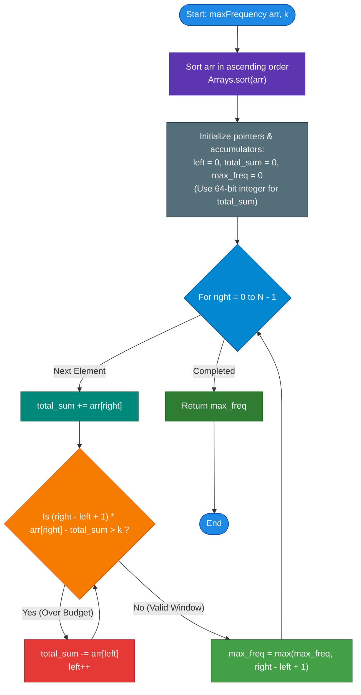

# GeeksforGeeks Problem of the Day: Maximum Frequency with K Increments

- **Problem Link:** [GeeksforGeeks - Maximum Frequency with K Increments](https://www.geeksforgeeks.org/problems/maximum-frequency-1662528911/1)
- **Difficulty:** Medium
- **Topic Tags:** Arrays, Sorting, Two Pointers, Sliding Window, Prefix Sums, Binary Search, Greedy Algorithms
- **Target Audience:** POTD Solvers, Computer Science Students, Competitive Programmers, Interview Preparation (Google, Amazon, Meta, Microsoft, Uber, Apple, Atlassian)

---

## 1. Problem Statement

Given an integer array `arr[]` and an integer `k`. In one operation, you can choose any index $i$ ($0 \le i < \text{arr.length}$) and increment its value by $1$ (`arr[i] = arr[i] + 1`).

Find the **maximum possible frequency of any element** in the array after performing at most `k` operations.

### Key Rules & Invariants:
1. **Unidirectional Operations:** You can **only increment** values; decrementing is not allowed.
2. **Target Choice:** To maximize the frequency of some target value $X$, $X$ must be chosen as an element already present in `arr[]` (or higher). However, since every increment consumes $1$ unit of the operation budget $k$, choosing a target value larger than the maximum of our chosen group wastes operations. Therefore, the optimal target value is always an **existing element** in the array.
3. **Budget Constraint:** The sum of differences between the target value and each chosen element must not exceed $k$.

---

## 2. Examples & Explanations

### Example 1: Standard Balanced Expansion
- **Input:** `arr[] = [2, 2, 4], k = 4`
- **Output:** `3`
- **Explanation:**
  - Target value chosen: `4`
  - Current elements: `2`, `2`, `4`
  - Operations needed for index 0: $4 - 2 = 2$
  - Operations needed for index 1: $4 - 2 = 2$
  - Operations needed for index 2: $4 - 4 = 0$
  - Total operations used: $2 + 2 + 0 = 4 \le 4$ ($k$)
  - Array becomes `[4, 4, 4]`. The frequency of `4` is **`3`**.

---

### Example 2: Uniform Array (Zero Operations Needed)
- **Input:** `arr[] = [7, 7, 7, 7], k = 5`
- **Output:** `4`
- **Explanation:**
  - All elements are already equal to `7`.
  - Initial frequency of `7` is `4`.
  - Operations consumed: $0 \le 5$.
  - Maximum frequency achievable is **`4`**.

---

### Example 3: Partial Elevation with Leftover Budget
- **Input:** `arr[] = [1, 2, 4], k = 5`
- **Output:** `3`
- **Explanation:**
  - Target value chosen: `4`
  - To make all 3 elements equal to `4`:
    - Increment `1` to `4`: requires $4 - 1 = 3$ operations.
    - Increment `2` to `4`: requires $4 - 2 = 2$ operations.
    - Element `4` requires $0$ operations.
  - Total operations used: $3 + 2 + 0 = 5 \le 5$.
  - Array becomes `[4, 4, 4]`. Maximum frequency is **`3`**.

---

### Example 4: Large Differences Forcing a Restricted Window
- **Input:** `arr[] = [1, 4, 8, 13], k = 5`
- **Output:** `2`
- **Explanation:**
  - Target = `4`: window `[1, 4]`, cost $= 4 - 1 = 3 \le 5 \implies$ frequency = `2`.
  - Target = `8`: window `[4, 8]`, cost $= 8 - 4 = 4 \le 5 \implies$ frequency = `2`. Window `[1, 4, 8]` requires $(8-1) + (8-4) = 7 + 4 = 11 > 5$ (exceeds budget).
  - Target = `13`: window `[8, 13]`, cost $= 13 - 8 = 5 \le 5 \implies$ frequency = `2`. Window `[4, 8, 13]` requires $(13-4) + (13-8) = 9 + 5 = 14 > 5$.
  - The maximum frequency achievable with $k = 5$ is **`2`**.

---

## 3. Constraints & Complexity Targets

- **Array Length ($N$):** $1 \le \text{arr.size()} \le 10^5$
- **Element Range:** $1 \le arr[i] \le 10^6$
- **Operation Budget ($k$):** $0 \le k \le 10^5$
- **Expected Time Complexity:** $\mathcal{O}(N \log N)$ (Dominated by sorting; sliding window runs in $\mathcal{O}(N)$)
- **Expected Auxiliary Space:** $\mathcal{O}(1)$ (In-place sorting and two pointers)
- **Data Range Precaution:** 
  - Maximum window size: $10^5$
  - Maximum element value: $10^6$
  - Potential product $(R - L + 1) \times arr[R] \approx 10^5 \times 10^6 = 10^{11}$, which **exceeds 32-bit signed integer limit** ($2^{31} - 1 \approx 2.14 \times 10^9$).
  - **Must use 64-bit integer types** (`long` in Java/C#, `long long` in C++).

---

## 4. Visual Architecture & Theoretical Framework

### The Geometry of Sorting & The "Staircase Water-Fill"

Why must we sort the array?
1. **Contiguity Property:** When looking to raise elements to a target $arr[R]$, the "cheapest" elements to increment are those that are already closest in value to $arr[R]$ (i.e., immediately preceding $arr[R]$ in sorted order).
2. Any optimal subset of elements made equal to $arr[R]$ forms a **contiguous subarray (sliding window)** ending at index $R$ in the sorted array:
   $$arr[L], arr[L+1], \dots, arr[R]$$

```text
Target: arr[R] = 8, Window [L, R] = [1, 2, 3] with values [4, 6, 8], k = 6

   Value
     8 |         +-------+-------+  <-- Target Level: arr[R] = 8
     7 |         |       |       |
     6 |         |  ░░░  +-------+
     5 |         |  ░░░  |       |
     4 | +-------+  ░░░  |       |  <-- Area of shaded region (░) = Operations Needed
     3 | |       |       |       |
     2 | |       |       |       |
     1 | |       |       |       |
       +---------+-------+-------+
          arr[L]  arr[L+1] arr[R]
          (val 4) (val 6)  (val 8)

   Total Bounding Box Area = (R - L + 1) * arr[R] = 3 * 8 = 24
   Sum of Elements in Window = 4 + 6 + 8 = 18
   Required Operations (Cost) = 24 - 18 = 6 <= k (Valid Window of size 3!)
```

### Mathematical Formulation:

For a window $[L, R]$ with target $arr[R]$:
$$\text{Cost}(L, R) = \sum_{i=L}^{R} (arr[R] - arr[i])$$
$$\text{Cost}(L, R) = \left( \sum_{i=L}^{R} arr[R] \right) - \left( \sum_{i=L}^{R} arr[i] \right)$$
$$\mathbf{\text{Cost}(L, R) = (R - L + 1) \cdot arr[R] - \text{WindowSum}}$$

### Monotonicity & Sliding Window Invariant:
- Expanding $R$ increases the window length and potentially raises the target $arr[R]$, increasing the cost.
- If $\text{Cost}(L, R) > k$, incrementing $L$ strictly decreases the required operations:
  $$\text{Cost}(L+1, R) = \text{Cost}(L, R) - (arr[R] - arr[L]) \le \text{Cost}(L, R)$$
- Because both $L$ and $R$ move strictly from left to right, each pointer visits each index at most once, providing a linear $\mathcal{O}(N)$ scan.

---

## 5. Step-by-Step Simulation & Trace Table

### Tracing Input: `arr = [1, 4, 8, 13], k = 5`
Array is already sorted: `arr = [1, 4, 8, 13]`, $k = 5$.

| Step | $R$ | $arr[R]$ | Added to Sum | $L$ | Window $[L, R]$ | $\text{Size}$ | $\text{WindowSum}$ | $\text{TargetSum} = \text{Size} \times arr[R]$ | $\text{Cost} = \text{TargetSum} - \text{Sum}$ | Valid? ($\text{Cost} \le 5$) | Action Taken | Max Freq |
| :---: | :---: | :---: | :---: | :---: | :---: | :---: | :---: | :---: | :---: | :---: | :---: | :---: |
| **1** | `0` | `1` | `+1` | `0` | `[0, 0]` (`[1]`) | `1` | `1` | $1 \times 1 = 1$ | $1 - 1 = \mathbf{0}$ | Yes ($0 \le 5$) | Valid window | **`1`** |
| **2** | `1` | `4` | `+4` | `0` | `[0, 1]` (`[1, 4]`) | `2` | `5` | $2 \times 4 = 8$ | $8 - 5 = \mathbf{3}$ | Yes ($3 \le 5$) | Valid window | **`2`** |
| **3** | `2` | `8` | `+8` | `0` | `[0, 2]` (`[1, 4, 8]`) | `3` | `13` | $3 \times 8 = 24$ | $24 - 13 = \mathbf{11}$ | No ($11 > 5$) | Shrink from Left: remove $arr[0]=1$, $L \to 1$ | `2` |
| **3b**| `2` | `8` | — | `1` | `[1, 2]` (`[4, 8]`) | `2` | `12` | $2 \times 8 = 16$ | $16 - 12 = \mathbf{4}$ | Yes ($4 \le 5$) | Valid window | **`2`** |
| **4** | `3` | `13` | `+13` | `1` | `[1, 3]` (`[4, 8, 13]`) | `3` | `25` | $3 \times 13 = 39$ | $39 - 25 = \mathbf{14}$ | No ($14 > 5$) | Shrink from Left: remove $arr[1]=4$, $L \to 2$ | `2` |
| **4b**| `3` | `13` | — | `2` | `[2, 3]` (`[8, 13]`) | `2` | `21` | $2 \times 13 = 26$ | $26 - 21 = \mathbf{5}$ | Yes ($5 \le 5$) | Valid window | **`2`** |

**Final Answer:** $\mathbf{2}$

---

## 6. Algorithm Flowchart



---

## 7. From Naive to Pro: Algorithmic Progression

### Method 1: Naive Brute Force ($\mathcal{O}(N^2)$)
- **Concept:** 
  1. Sort the array.
  2. For every index $i$ as the potential target element $arr[i]$, iterate backwards from $j = i$ down to $0$.
  3. Greedily accumulate operations needed: $(arr[i] - arr[j])$. If cumulative operations $\le k$, increment candidate frequency. If operations exceed $k$, break early.
- **Limitation:** For $N = 10^5$, $N^2 = 10^{10}$ operations, causing Time Limit Exceeded (TLE).
- **Time Complexity:** $\mathcal{O}(N^2)$
- **Space Complexity:** $\mathcal{O}(1)$
- **Pseudocode:**
```text
function maxFrequency_Naive(arr, k):
    sort(arr)
    max_freq = 1
    for i from 0 to length(arr) - 1:
        current_k = k
        freq = 0
        for j from i down to 0:
            cost = arr[i] - arr[j]
            if current_k >= cost:
                current_k -= cost
                freq += 1
            else:
                break
        max_freq = max(max_freq, freq)
    return max_freq
```

---

### Method 2: Better Approach — Prefix Sums + Binary Search ($\mathcal{O}(N \log N)$)
- **Concept:**
  1. Sort the array and precompute a 64-bit prefix sum array `pref`.
  2. For each target index $R \in [0, N-1]$, the required operations to include elements from index $L$ to $R$ is:
     $$\text{Cost}(L, R) = (R - L + 1) \cdot arr[R] - (\text{pref}[R + 1] - \text{pref}[L])$$
  3. Since $\text{Cost}(L, R)$ decreases monotonically as $L$ increases, binary search for the minimum valid $L \in [0, R]$ such that $\text{Cost}(L, R) \le k$.
  4. The frequency achieved for target $R$ is $(R - L_{\min} + 1)$.
- **Time Complexity:** $\mathcal{O}(N \log N)$ (sorting takes $\mathcal{O}(N \log N)$, plus $N$ binary searches of $\mathcal{O}(\log N)$).
- **Space Complexity:** $\mathcal{O}(N)$ for prefix sums.
- **Pseudocode:**
```text
function maxFrequency_BinarySearch(arr, k):
    sort(arr)
    n = length(arr)
    pref = array of size (n + 1) initialized to 0
    for i from 0 to n - 1:
        pref[i + 1] = pref[i] + arr[i]
        
    max_freq = 1
    for R from 0 to n - 1:
        low = 0, high = R, best_L = R
        while low <= high:
            mid = (low + high) / 2
            count = R - mid + 1
            cost = count * arr[R] - (pref[R + 1] - pref[mid])
            if cost <= k:
                best_L = mid
                high = mid - 1   // Try to expand further left
            else:
                low = mid + 1    // Shrink window
        max_freq = max(max_freq, R - best_L + 1)
    return max_freq
```

---

### Method 3: Pro Approach — Two-Pointer Sliding Window ($\mathcal{O}(N \log N)$ Time, $\mathcal{O}(1)$ Space)
- **Concept:**
  1. Sort `arr` in ascending order.
  2. Maintain a sliding window $[L, R]$ and a running 64-bit sum `total_sum`.
  3. Expand `right` from $0$ to $N - 1$. Add `arr[right]` to `total_sum`.
  4. While the cost `(right - left + 1) * arr[right] - total_sum > k`:
     - Subtract `arr[left]` from `total_sum`.
     - Increment `left`.
  5. Update `max_freq = max(max_freq, right - left + 1)`.
- **Why it is optimal:** Both pointers move forward monotonically. No extra arrays needed.
- **Time Complexity:** $\mathcal{O}(N \log N)$ total ($\mathcal{O}(N \log N)$ sort $+ \mathcal{O}(N)$ window traversal).
- **Space Complexity:** $\mathcal{O}(1)$ auxiliary space.
- **Pseudocode:**
```text
function maxFrequency_SlidingWindow(arr, k):
    sort(arr)
    left = 0
    total_sum = 0 (64-bit)
    max_freq = 0
    
    for right from 0 to length(arr) - 1:
        total_sum += arr[right]
        while (right - left + 1) * arr[right] - total_sum > k:
            total_sum -= arr[left]
            left += 1
        max_freq = max(max_freq, right - left + 1)
        
    return max_freq
```

---

### Method 4: Ultra-Pro — Non-Shrinking Sliding Window ($\mathcal{O}(N \log N)$ Time, $\mathcal{O}(1)$ Space)
- **Concept:**
  - Notice that we only care about the **maximum window size** ever achieved.
  - When a window $[L, R]$ becomes invalid (cost $> k$), instead of shrinking the window with a `while` loop until it is valid again, we simply **shift** the window rightward by incrementing `left` once (`if` instead of `while`).
  - The window length $(R - L + 1)$ never decreases! It either grows by $1$ or shifts by $1$.
  - At the end of the loop, the final window length is simply $N - L$.
- **Time Complexity:** $\mathcal{O}(N \log N)$
- **Space Complexity:** $\mathcal{O}(1)$
- **Pseudocode:**
```text
function maxFrequency_NonShrink(arr, k):
    sort(arr)
    left = 0
    total_sum = 0 (64-bit)
    
    for right from 0 to length(arr) - 1:
        total_sum += arr[right]
        if (right - left + 1) * arr[right] - total_sum > k:
            total_sum -= arr[left]
            left += 1
            
    return length(arr) - left
```

---

## 8. Complexity Comparison Table

| Metric | Method 1: Naive Brute Force | Method 2: Prefix Sum + Binary Search | Method 3: Two Pointers (Standard) | Method 4: Non-Shrinking Window |
| :--- | :--- | :--- | :--- | :--- |
| **Time Complexity** | $\mathcal{O}(N^2)$ | $\mathcal{O}(N \log N)$ | $\mathcal{O}(N \log N)$ | $\mathcal{O}(N \log N)$ |
| **Auxiliary Space** | $\mathcal{O}(1)$ | $\mathcal{O}(N)$ (prefix sum table) | $\mathcal{O}(1)$ (in-place) | $\mathcal{O}(1)$ (in-place) |
| **Pointer Traversal** | Resets $j$ for every $i$ | Binary search per $R$ | Monotonic amortized $\mathcal{O}(N)$ | Strictly $N$ iterations |
| **Integer Overflow Risk** | Low (bounded by $k$) | High (requires 64-bit prefix) | High (requires 64-bit sum) | High (requires 64-bit sum) |
| **POTD / Online Judge** | ❌ TLE on large $N$ | ✅ Accepted | ✅ Accepted (Standard) | ✅ Accepted (Fastest) |
| **Interview Assessment** | Demonstrates basic thought | Good for demonstrating BS | **Optimal & Industry Standard** | Ultra-clean competitive trick |

---

## 9. Corner Cases & Edge Condition Handling

1. **$k = 0$ (No Operations Allowed):**
   - No elements can be incremented.
   - The algorithm correctly identifies the maximum frequency of identical adjacent elements in the sorted array (e.g., `arr = [1, 2, 2, 3]`, $k = 0 \implies 2$).
2. **Single Element Array ($N = 1$):**
   - The loop runs for $R = 0$, window length is $1$, cost is $0 \le k$, returns `1`.
3. **All Elements Identical:**
   - Window expands to full array without ever violating cost $\le k$. Returns $N$.
4. **Huge Budget ($k \ge N \times \max(arr)$):**
   - All elements can easily be elevated to the maximum element. Returns $N$.
5. **Integer Overflow in 32-bit signed types:**
   - When $(R - L + 1) = 10^5$ and $arr[R] = 10^6$, the product is $10^{11}$.
   - In 32-bit signed integers, this overflows to negative values, causing infinite loops or incorrect answers.
   - **Protection:** Cast to 64-bit integer (`long` in Java/C#, `long long` in C++) before multiplication.

---

## 10. Complete Multi-Language Source Codes

### Java (21)

```java
import java.util.Arrays;

class Solution {
    /**
     * Finds the maximum possible frequency of any element after performing at most k increments.
     * 
     * @param arr The input array of integers
     * @param k The maximum allowed increment operations
     * @return The maximum frequency achievable
     */
    public int maxFrequency(int[] arr, int k) {
        // Step 1: Sort the array in ascending order
        Arrays.sort(arr);
        
        int n = arr.length;
        int left = 0;
        long totalSum = 0; // 64-bit integer to prevent overflow
        int maxFreq = 0;
        
        // Step 2: Expand the right boundary of the sliding window
        for (int right = 0; right < n; right++) {
            totalSum += arr[right];
            
            // Step 3: Shrink the window from the left if operations exceed budget k
            // Cost = (window length) * arr[right] - totalSum
            while ((long) arr[right] * (right - left + 1) - totalSum > k) {
                totalSum -= arr[left];
                left++;
            }
            
            // Step 4: Record the maximum valid window size
            maxFreq = Math.max(maxFreq, right - left + 1);
        }
        
        return maxFreq;
    }
}
```

---

### Python3

```python
class Solution:
    def maxFrequency(self, arr: list[int], k: int) -> int:
        """
        Finds the maximum possible frequency of any element after at most k increments.
        
        Time Complexity: O(N log N) dominated by sorting.
        Auxiliary Space: O(1) in-place sliding window.
        """
        # Step 1: Sort the array in non-decreasing order
        arr.sort()
        
        left = 0
        total_sum = 0
        max_freq = 0
        
        # Step 2: Expand the right pointer
        for right in range(len(arr)):
            total_sum += arr[right]
            
            # Step 3: Shrink window from the left if required operations exceed k
            while (right - left + 1) * arr[right] - total_sum > k:
                total_sum -= arr[left]
                left += 1
                
            # Step 4: Update the maximum frequency observed
            max_freq = max(max_freq, right - left + 1)
            
        return max_freq
```

---

### C++ (17)

```cpp
#include <vector>
#include <algorithm>

using namespace std;

class Solution {
  public:
    /**
     * @brief Computes the maximum frequency of any element achievable with <= k increments.
     * 
     * @param arr Vector of integers
     * @param k Maximum operation budget
     * @return int Maximum frequency
     */
    int maxFrequency(vector<int>& arr, int k) {
        // Step 1: Sort elements in ascending order
        sort(arr.begin(), arr.end());
        
        int n = arr.size();
        int left = 0;
        long long totalSum = 0; // 64-bit integer to avoid 32-bit integer overflow
        int maxFreq = 0;
        
        // Step 2: Expand window with right pointer
        for (int right = 0; right < n; ++right) {
            totalSum += arr[right];
            
            // Step 3: Check if operations needed to make all elements equal to arr[right] exceed k
            while (1LL * arr[right] * (right - left + 1) - totalSum > k) {
                totalSum -= arr[left];
                left++;
            }
            
            // Step 4: Update the maximum window length
            maxFreq = max(maxFreq, right - left + 1);
        }
        
        return maxFreq;
    }
};
```

---

### C#

```csharp
using System;

class Solution {
    /// <summary>
    /// Computes the maximum possible frequency of any element with at most k increments.
    /// </summary>
    /// <param name="arr">The array of integers</param>
    /// <param name="k">The maximum allowed increments</param>
    /// <returns>The maximum frequency</returns>
    public int maxFrequency(int[] arr, int k) {
        // Step 1: Sort the array in non-decreasing order
        Array.Sort(arr);
        
        int left = 0;
        long totalSum = 0; // 64-bit integer to prevent integer overflow
        int maxFreq = 0;
        
        // Step 2: Expand the right pointer across the array
        for (int right = 0; right < arr.Length; right++) {
            totalSum += arr[right];
            
            // Step 3: Contract the left boundary if cost exceeds budget k
            while ((long)arr[right] * (right - left + 1) - totalSum > k) {
                totalSum -= arr[left];
                left++;
            }
            
            // Step 4: Update maximum valid window size
            int currentWindow = right - left + 1;
            if (currentWindow > maxFreq) {
                maxFreq = currentWindow;
            }
        }
        
        return maxFreq;
    }
}
```

---

### Javascript (Node v22)

```javascript
/**
 * @param {number[]} arr
 * @param {number} k
 * @returns {number}
 */

class Solution {
    maxFrequency(arr, k) {
        // Step 1: Sort array in ascending numerical order
        arr.sort((a, b) => a - b);
        
        let left = 0;
        let totalSum = 0;
        let maxFreq = 0;
        
        // Step 2: Iterate with right pointer
        for (let right = 0; right < arr.length; right++) {
            totalSum += arr[right];
            
            // Step 3: Shrink window from the left while operations exceed budget k
            // In JavaScript, Number.MAX_SAFE_INTEGER is 9e15, which safely handles 1e11
            while ((right - left + 1) * arr[right] - totalSum > k) {
                totalSum -= arr[left];
                left++;
            }
            
            // Step 4: Track the maximum window size
            maxFreq = Math.max(maxFreq, right - left + 1);
        }
        
        return maxFreq;
    }
}
```

---

## 11. Key Takeaways & Interview Discussion Points

1. **Why is the greedy target always an existing element?**
   If you elevate a set of numbers to a value $X > \max(S)$, reducing $X$ to $\max(S)$ saves operations for all elements in $S$ while keeping the frequency unchanged. Thus, the optimal target is always an existing array value.
2. **Why does sorting ensure contiguity?**
   Suppose you choose a target $T$. The elements requiring the least operations to reach $T$ are the largest values $\le T$. In a sorted array, these are always immediately adjacent to $T$ on its left.
3. **Difference between Shrinking vs. Non-Shrinking Windows:**
   - **Shrinking Window:** Standard two-pointer loop with `while`. Intuitively maintains the invariant that the current window is always valid.
   - **Non-Shrinking Window:** Replaces `while` with `if`. The window never shrinks; it only preserves or increases the maximum size found so far. The final answer is directly $N - L$.
4. **Complexity Summary:**
   - **Time:** $\mathcal{O}(N \log N)$ (Sorting is the bottleneck; sliding window is $\mathcal{O}(N)$).
   - **Space:** $\mathcal{O}(1)$ auxiliary space.
