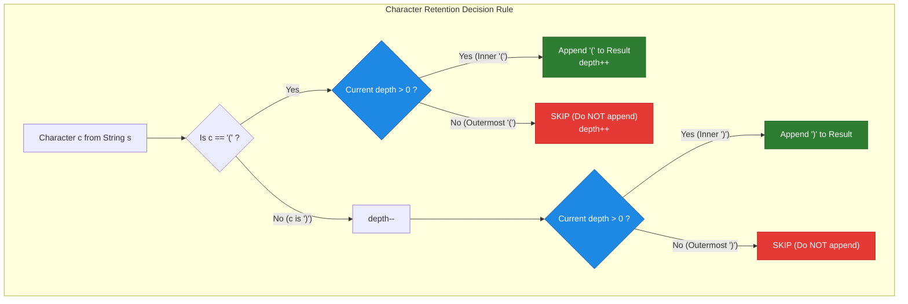
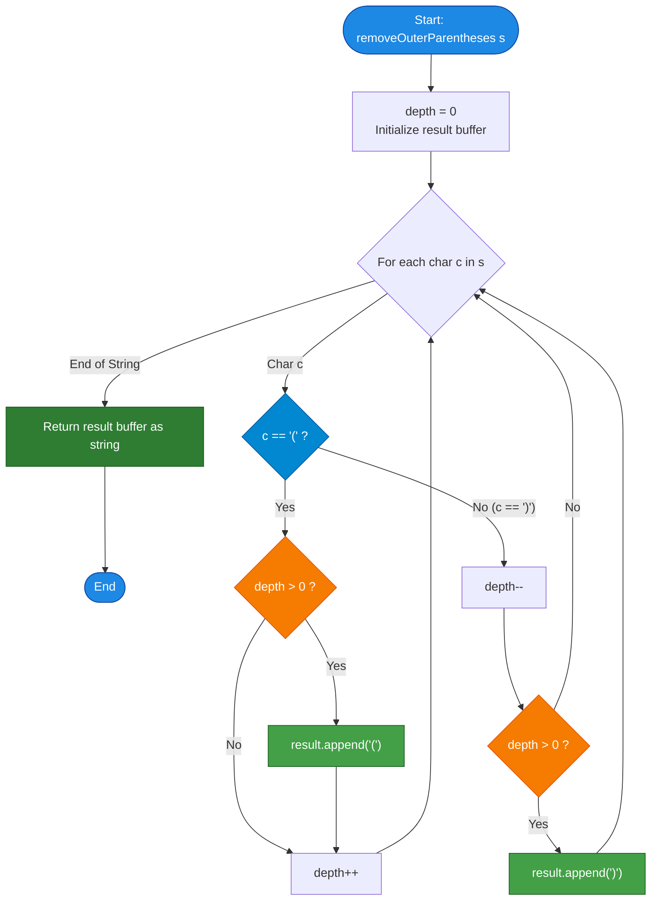

# LeetCode Problem of the Day: Remove Outermost Parentheses

- **Problem Link:** [LeetCode 1021 - Remove Outermost Parentheses](https://leetcode.com/problems/remove-outermost-parentheses/description/?envType=daily-question&envId=2026-10-08)
- **Difficulty:** Easy
- **Topic Tags:** String, Stack, Two Pointers, Simulation, State Machine, Greedy
- **Target Audience:** POTD Solvers, Computer Science Students, Competitive Programmers, Interview Preparation (FAANG/Tier-1 Tech)

---

## 1. Problem Statement

A valid parentheses string is either empty `""`, `"(" + A + ")"`, or `A + B`, where `A` and `B` are valid parentheses strings, and `+` represents string concatenation.
- For example, `""`, `"()"`, `"(())()"`, and `"(()(()))"` are all valid parentheses strings.

A valid parentheses string `s` is **primitive** if it is non-empty, and there does not exist a way to split it into `s = A + B`, with `A` and `B` being non-empty valid parentheses strings.

Given a valid parentheses string `s`, consider its **primitive decomposition**:
$$s = P_1 + P_2 + \dots + P_k$$
where each $P_i$ is a non-empty primitive valid parentheses string.

Return `s` after **removing the outermost parentheses** of every primitive string in the primitive decomposition of `s`.

---

## 2. Examples & Explanations

### Example 1: Multiple Sub-Primitives
- **Input:** `s = "(()())(())"`
- **Output:** `"()()()"`
- **Explanation:**
  - The input string can be decomposed into two primitive strings:
    $$P_1 = \text{"(()())"}, \quad P_2 = \text{"(())"}$$
    $$\implies s = P_1 + P_2$$
  - Removing the outermost parentheses of $P_1$:
    $$\text{"("} + \text{"()()"} + \text{")"} \implies \text{"()()"}$$
  - Removing the outermost parentheses of $P_2$:
    $$\text{"("} + \text{"()"} + \text{")"} \implies \text{"()"}$$
  - Concatenating the inner parts:
    $$\text{"()()"} + \text{"()"} = \mathbf{\text{"()()()"}}$$

---

### Example 2: Compound Nested Primitives
- **Input:** `s = "(()())(())(()(()))"`
- **Output:** `"()()()()(())"`
- **Explanation:**
  - Primitive decomposition:
    $$P_1 = \text{"(()())"}, \quad P_2 = \text{"(())"}, \quad P_3 = \text{"(()(()))"}$$
  - Removing outermost parentheses:
    - From $P_1$: `"()()"`
    - From $P_2$: `"()"`
    - From $P_3$: `"()(())"`
  - Concatenation:
    $$\text{"()()"} + \text{"()"} + \text{"()(())"} = \mathbf{\text{"()()()()(())"}}$$

---

### Example 3: Atomic Primitives (Complete Removal)
- **Input:** `s = "()()"`
- **Output:** `""`
- **Explanation:**
  - Primitive decomposition:
    $$P_1 = \text{"()"}, \quad P_2 = \text{"()"}$$
  - Removing outermost parentheses from each:
    - From $P_1$: `""`
    - From $P_2$: `""`
  - Concatenation:
    $$\text{""} + \text{""} = \mathbf{\text{""}}$$

---

### Example 4: Single Deeply Nested Primitive
- **Input:** `s = "(((())))"`
- **Output:** `"((()))"`
- **Explanation:**
  - $s$ is already a single primitive of depth 4.
  - Removing the first character `'('` and last character `')'` yields `"((()))"`.

---

## 3. Constraints & Complexity Targets

- **String Length ($N$):** $1 \le |s| \le 10^5$
- **Alphabet:** `s[i]` is either `'('` or `')'`.
- **Precondition:** `s` is guaranteed to be a **valid parentheses string**.
- **Expected Time Complexity:** $\mathcal{O}(N)$ single linear pass.
- **Expected Auxiliary Space:** $\mathcal{O}(1)$ beyond the required output buffer (or in-place compaction where mutable).

---

## 4. Visual Architecture & The Depth Balance Model

### Understanding the Depth Profile ("The Mountain Analogy")

Let $\text{depth}$ represent the count of currently open, unmatched parentheses as we scan left to right:
- When encountering `'('`: depth increases by $+1$.
- When encountering `')'`: depth decreases by $-1$.

Because $s$ is composed of primitive segments $P_1, P_2, \dots$:
1. A primitive begins at depth $0$ and immediately climbs to depth $1$.
2. The depth stays strictly $\ge 1$ inside the primitive.
3. The primitive ends precisely when the depth returns to $0$.

```text
String:   ( ( ) ( ) )   ( ( ) )
Index:    0 1 2 3 4 5   6 7 8 9

Depth:
  2          /\  /\        /\
  1        /   \/  \     /   \
  0    ---*---------*---*-----*---
          ^         ^   ^     ^
          |         |   |     |
         P1        P1  P2    P2
        Outer     Outer Outer Outer
        Open      Close Open  Close
```

### The Invariant for Outermost Characters:
- **Outermost `'('`:** An opening parenthesis that occurs when the current $\text{depth} = 0$. (It initiates a primitive and shifts depth from $0 \to 1$).
- **Outermost `')'`:** A closing parenthesis whose inclusion brings the $\text{depth}$ back to $0$. (It terminates a primitive and shifts depth from $1 \to 0$).
- **Inner Parentheses (To Keep):**
  - An opening parenthesis `'('` is kept **if and only if** $\text{depth} > 0$ **before** incrementing.
  - A closing parenthesis `')'` is kept **if and only if** $\text{depth} > 1$ **before** decrementing (or $\text{depth} > 0$ **after** decrementing).



---

## 5. Step-by-Step Simulation & Trace Table

### Tracing Input: `s = "(()())(())"` (Length $N = 10$)

| Index $i$ | Char `s[i]` | Initial `depth` | Condition Evaluated | Decision | Updated `depth` | Output Buffer | Primitive Context |
| :---: | :---: | :---: | :---: | :---: | :---: | :---: | :---: |
| **0** | `'('` | `0` | `'('` and `depth == 0` | **SKIP** (Outermost Open) | `1` | `""` | $P_1$ begins |
| **1** | `'('` | `1` | `'('` and `depth > 0` | **KEEP** | `2` | `"("` | Inside $P_1$ |
| **2** | `')'` | `2` | `')'`: `depth-- = 1 > 0` | **KEEP** | `1` | `"()"` | Inside $P_1$ |
| **3** | `'('` | `1` | `'('` and `depth > 0` | **KEEP** | `2` | `"()("` | Inside $P_1$ |
| **4** | `')'` | `2` | `')'`: `depth-- = 1 > 0` | **KEEP** | `1` | `"()()"` | Inside $P_1$ |
| **5** | `')'` | `1` | `')'`: `depth-- = 0` | **SKIP** (Outermost Close)| `0` | `"()()"` | $P_1$ ends |
| **6** | `'('` | `0` | `'('` and `depth == 0` | **SKIP** (Outermost Open) | `1` | `"()()"` | $P_2$ begins |
| **7** | `'('` | `1` | `'('` and `depth > 0` | **KEEP** | `2` | `"()()("` | Inside $P_2$ |
| **8** | `')'` | `2` | `')'`: `depth-- = 1 > 0` | **KEEP** | `1` | `"()()()"` | Inside $P_2$ |
| **9** | `')'` | `1` | `')'`: `depth-- = 0` | **SKIP** (Outermost Close)| `0` | `"()()()"` | $P_2$ ends |

**Final Result Returned:** **`"()()()"`**

---

## 6. Algorithm Flowchart



---

## 7. From Naïve to Pro: Algorithmic Progression

### Method 1: Naïve Approach — Explicit Stack & Substring Slicing
- **Concept:** 
  1. Use an explicit `Stack` to keep track of bracket balance.
  2. Maintain a `start` pointer marking the beginning of the current primitive.
  3. When an `'('` is seen, push to the stack. When `')'` is seen, pop.
  4. When the stack becomes empty, the substring $s[\text{start} \dots i]$ is a completed primitive $P$.
  5. Slice the inner part $s[\text{start} + 1 \dots i - 1]$ and concatenate it to the accumulator.
- **Why it is suboptimal:** 
  - Creates extensive heap allocations due to repeated substring creation and stack objects.
- **Time Complexity:** $\mathcal{O}(N)$
- **Space Complexity:** $\mathcal{O}(N)$ for stack and substrings.
- **Pseudocode:**
```text
function removeOuterParentheses_Stack(s):
    stack = []
    result = ""
    start = 0
    for i from 0 to length(s) - 1:
        if s[i] == '(':
            stack.push('(')
        else:
            stack.pop()
        
        if stack.is_empty():
            // Primitive completed: s[start...i]
            result += s.substring(start + 1, i)
            start = i + 1
    return result
```

---

### Method 2: Better Approach — Index Tracking with Balance Counter
- **Concept:**
  - Replace the stack with a primitive integer counter `balance`.
  - When `balance == 0` at index $i$, slice $s[\text{start} + 1 \dots i]$ and update $\text{start} = i + 1$.
- **Improvement:** Removes stack allocation overhead, maintaining $\mathcal{O}(1)$ working auxiliary space.
- **Time Complexity:** $\mathcal{O}(N)$
- **Space Complexity:** $\mathcal{O}(1)$ auxiliary space (excluding substrings).
- **Pseudocode:**
```text
function removeOuterParentheses_IndexTracking(s):
    result = ""
    balance = 0
    start = 0
    for i from 0 to length(s) - 1:
        if s[i] == '(': balance++
        else: balance--
        
        if balance == 0:
            result += s.substring(start + 1, i)
            start = i + 1
    return result
```

---

### Method 3: Pro Approach — Single-Pass Direct Depth Filter ($\mathcal{O}(1)$ Auxiliary Space)
- **Concept:**
  - Avoid creating intermediate substrings altogether.
  - Append individual characters directly into a pre-allocated dynamic string buffer (`StringBuilder` in Java/C#, `std::string::reserve` in C++, or `char[]` in C).
  - Use the clean depth check:
    - Include `'('` if `depth > 0`, then `depth++`.
    - `depth--`, then include `')'` if `depth > 0`.
- **Why it is optimal:**
  - Single pass.
  - Zero substring slicing.
  - Exactly one allocation for the final output string.
- **Time Complexity:** $\mathcal{O}(N)$
- **Space Complexity:** $\mathcal{O}(1)$ auxiliary space (excluding the output buffer).
- **Pseudocode:**
```text
function removeOuterParentheses_Pro(s):
    buffer = create_string_buffer(capacity = length(s))
    depth = 0
    
    for each char c in s:
        if c == '(':
            if depth > 0: buffer.append('(')
            depth++
        else:
            depth--
            if depth > 0: buffer.append(')')
            
    return buffer.to_string()
```

---

### Method 4: Ultra-Pro — In-Place Character Compaction (in C / C++)
- **Concept:**
  - In languages where strings or character arrays are mutable (C, C++), we can overwrite `s` in-place using two pointers:
    - `read` pointer iterating from $0$ to $N - 1$.
    - `write` pointer recording valid non-outermost characters.
  - Replaces all dynamic allocations, achieving **strictly $\mathcal{O}(1)$ memory**.
- **Pseudocode:**
```text
function removeOuterParentheses_InPlace(s):
    write = 0
    depth = 0
    for read from 0 to length(s) - 1:
        if s[read] == '(':
            if depth > 0: s[write++] = '('
            depth++
        else:
            depth--
            if depth > 0: s[write++] = ')'
    s[write] = '\0'
    return s
```

---

## 8. Complexity Comparison Table

| Metric | Method 1: Stack & Slice | Method 2: Counter & Substring | Method 3: Pro Depth Filter | Method 4: In-Place Compaction |
| :--- | :--- | :--- | :--- | :--- |
| **Time Complexity** | $\mathcal{O}(N)$ | $\mathcal{O}(N)$ | $\mathcal{O}(N)$ | $\mathcal{O}(N)$ |
| **Auxiliary Space** | $\mathcal{O}(N)$ (Stack) | $\mathcal{O}(1)$ (Counter) | $\mathcal{O}(1)$ (Scalar) | $\mathcal{O}(1)$ (Zero extra memory) |
| **Heap Allocations** | High (Stack + Substrings) | Medium (Substrings) | Minimal (Single buffer) | **Zero (In-place mutation)** |
| **Pass Count** | 1 Pass | 1 Pass | 1 Pass | 1 Pass |
| **Cache Friendliness**| Low (Pointer chasing) | Medium | Very High | Maximum |
| **Interview Appeal** | Shows basic stack thought | Shows index arithmetic | **Industry Standard (Clean)** | **Competitive / System Expert** |

---

## 9. Corner Cases & Edge Condition Handling

1. **Atomic Primitives (`s = "()"`):**
   - The first `'('` has `depth = 0` $\implies$ skipped. `depth` becomes 1.
   - The second `')'` has `depth-- = 0` $\implies$ skipped.
   - Output buffer is empty: returns `""`. Correct!
2. **Consecutive Atomic Primitives (`s = "()()()"`):**
   - Each pair is independently processed and stripped to empty.
   - Returns `""`. Correct!
3. **Deep Monolithic Nesting (`s = "(((())))"`):**
   - Only the outermost pair at indices 0 and 7 have `depth = 0`.
   - Returns `"((()))"`. Correct!
4. **Alternating Compound Groups (`s = "(()())(())"`):**
   - Seamlessly resets `depth` to `0` at the end of each primitive group without requiring state flushes.
   - Produces `"()()()"`. Correct!
5. **Maximum Length ($N = 10^5$):**
   - Pre-allocating capacity on string builders guarantees linear time with zero quadratic string reallocations.

---

## 10. Complete Multi-Language Source Codes

### Java

```java
class Solution {
    /**
     * Removes the outermost parentheses of every primitive string in s.
     * 
     * Time Complexity: O(N) single linear scan.
     * Auxiliary Space: O(1) auxiliary space (excluding StringBuilder output).
     * 
     * @param s A valid parentheses string
     * @return String with outermost parentheses removed
     */
    public String removeOuterParentheses(String s) {
        StringBuilder sb = new StringBuilder(s.length());
        int depth = 0;
        
        for (int i = 0; i < s.length(); i++) {
            char c = s.charAt(i);
            
            if (c == '(') {
                // If depth > 0, this '(' is not the outermost one of the primitive
                if (depth > 0) {
                    sb.append(c);
                }
                depth++;
            } else {
                // Decrement depth first
                depth--;
                // If depth > 0, this ')' is not the outermost one of the primitive
                if (depth > 0) {
                    sb.append(c);
                }
            }
        }
        
        return sb.toString();
    }
}
```

---

### Python3

```python
class Solution:
    def removeOuterParentheses(self, s: str) -> str:
        """
        Removes the outermost parentheses of every primitive valid string in s.
        
        Time Complexity: O(N)
        Auxiliary Space: O(1) beyond the output list
        """
        result = []
        depth = 0
        
        for char in s:
            if char == '(':
                # Only include if we are already inside a primitive (depth > 0)
                if depth > 0:
                    result.append(char)
                depth += 1
            else:
                depth -= 1
                # Only include if we remain inside a primitive after closing (depth > 0)
                if depth > 0:
                    result.append(char)
                    
        return "".join(result)
```

---

### C

```c
#include <stdlib.h>
#include <string.h>

/**
 * Note: The returned string must be malloced, assume caller calls free().
 * 
 * Time Complexity: O(N)
 * Auxiliary Space: O(1) beyond the allocated result string
 */
char* removeOuterParentheses(char* s) {
    int n = strlen(s);
    // Allocate buffer for maximum possible size plus null terminator
    char* result = (char*)malloc((n + 1) * sizeof(char));
    
    int depth = 0;
    int write_idx = 0;
    
    for (int i = 0; i < n; i++) {
        if (s[i] == '(') {
            if (depth > 0) {
                result[write_idx++] = '(';
            }
            depth++;
        } else {
            depth--;
            if (depth > 0) {
                result[write_idx++] = ')';
            }
        }
    }
    
    // Null-terminate the output string
    result[write_idx] = '\0';
    return result;
}
```

---

### C++

```cpp
#include <string>

using namespace std;

class Solution {
public:
    /**
     * @brief Removes outermost parentheses from every primitive valid block.
     * 
     * Time Complexity: O(N)
     * Auxiliary Space: O(1) auxiliary space
     */
    string removeOuterParentheses(string s) {
        string result = "";
        result.reserve(s.length()); // Pre-allocate to prevent dynamic resizes
        int depth = 0;
        
        for (char c : s) {
            if (c == '(') {
                if (depth > 0) {
                    result.push_back(c);
                }
                depth++;
            } else {
                depth--;
                if (depth > 0) {
                    result.push_back(c);
                }
            }
        }
        
        return result;
    }
};
```

---

### C#

```csharp
using System.Text;

public class Solution {
    /// <summary>
    /// Removes outermost parentheses of every primitive substring in s.
    /// </summary>
    /// <param name="s">Valid parentheses string</param>
    /// <returns>Decomposed string without outer parentheses</returns>
    public string RemoveOuterParentheses(string s) {
        StringBuilder sb = new StringBuilder(s.Length);
        int depth = 0;
        
        foreach (char c in s) {
            if (c == '(') {
                if (depth > 0) {
                    sb.Append(c);
                }
                depth++;
            } else {
                depth--;
                if (depth > 0) {
                    sb.Append(c);
                }
            }
        }
        
        return sb.ToString();
    }
}
```

---

### Javascript

```javascript
/**
 * @param {string} s
 * @return {string}
 */
var removeOuterParentheses = function(s) {
    let result = '';
    let depth = 0;
    
    for (let i = 0; i < s.length; i++) {
        const char = s[i];
        if (char === '(') {
            if (depth > 0) {
                result += char;
            }
            depth++;
        } else {
            depth--;
            if (depth > 0) {
                result += char;
            }
        }
    }
    
    return result;
};
```

---

### Typescript

```typescript
/**
 * Removes the outermost parentheses of every primitive string in s.
 * 
 * @param s A valid parentheses string
 * @returns Filtered string without outermost parentheses
 */
function removeOuterParentheses(s: string): string {
    let result: string = '';
    let depth: number = 0;
    
    for (let i = 0; i < s.length; i++) {
        const char: string = s[i];
        if (char === '(') {
            if (depth > 0) {
                result += char;
            }
            depth++;
        } else {
            depth--;
            if (depth > 0) {
                result += char;
            }
        }
    }
    
    return result;
}
```

---

## 11. Key Takeaways & Interview Discussion Points

1. **Why is a stack NOT required?**
   - A full `Stack<Character>` is necessary when dealing with multiple types of brackets (e.g., `()`, `[]`, `{}` in LeetCode 20) where bracket type and pairing order matter.
   - For a single bracket type with a guaranteed valid string, the stack's state is completely described by a single scalar integer: `depth = stack.size()`.
2. **Order of Depth Modification:**
   - For `'('`: Evaluate `depth > 0` **before** incrementing `depth++`. (The outermost open bracket enters at `depth == 0`).
   - For `')'`: Decrement `depth--` **before** evaluating `depth > 0`. (The outermost close bracket exits down to `depth == 0`).
3. **Pre-Allocation Matters:**
   - In languages like C++, Java, and C#, pre-allocating the string buffer capacity (`reserve(s.length())` or `new StringBuilder(s.length())`) avoids $\mathcal{O}(\log N)$ buffer reallocations, ensuring a strict $\mathcal{O}(N)$ execution time.
