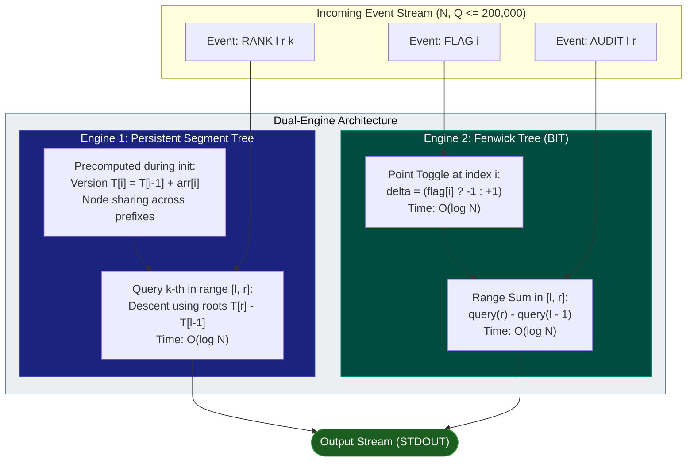
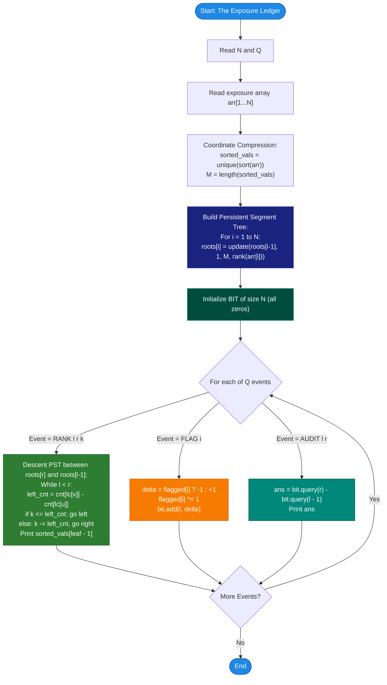

# Unstop Problem of the Day: The Exposure Ledger

- **Platform:** [Unstop](https://unstop.com/)
- **Difficulty:** Hard
- **Topic Tags:** Persistent Segment Tree (Chairman Tree), Binary Indexed Tree (Fenwick Tree), Coordinate Compression, Dynamic Order Statistics, Online Range Queries
- **Target Audience:** POTD Solvers, Computer Science Students, Competitive Programmers, Quantitative Finance / Systems Engineering Interview Preparation

---

## 1. Problem Statement

Elena Vosk audits a portfolio of financial instruments listed in a fixed ledger order at positions $1$ through $N$. Each instrument carries an immutable, historical risk exposure score assigned when it entered the book. These historical exposure scores never change throughout the trading day.

However, Elena constantly receives real-time operational questions regarding stretches of the ledger:
1. **Range $k$-th Safest Query (`RANK l r k`):**  
   Given a contiguous stretch of positions $[l, r]$ and an ordinal rank $k$ ($1 \le k \le r - l + 1$), Elena must identify the exact exposure score of the $k$-th smallest (safest) instrument among positions $l \dots r$ if that stretch were sorted in ascending order of exposure.
2. **Compliance Flag Toggle (`FLAG i`):**  
   The compliance team flags instrument $i$ for manual audit if unusual trading activity is detected, or unflags it once reviewed. An instrument can be repeatedly toggled between flagged and unflagged states throughout the session. All instruments start the day unflagged.
3. **Range Audit Workload Query (`AUDIT l r`):**  
   Elena needs to report the total count of instruments currently flagged within positions $l \dots r$.

All three types of events arrive interleaved in real-time streaming order. Elena must answer each `RANK` and `AUDIT` query immediately online, without scanning the relevant stretches from scratch, as $N, Q \le 200,000$.

---

## 2. Input & Output Format

### Input Format
- **Line 1:** Two space-separated integers $N$ and $Q$ — the number of instruments and the total number of events.
- **Line 2:** $N$ space-separated integers — the initial exposure score of each instrument at positions $1$ through $N$.
- **Next $Q$ lines:** Each line contains one of the three event commands:
  - `RANK l r k`: Report the exposure score that is the $k$-th smallest among positions $l \dots r$.
  - `FLAG i`: Toggle the flagged state of instrument $i$ ($0 \leftrightarrow 1$).
  - `AUDIT l r`: Report how many instruments in positions $l \dots r$ are currently flagged.

### Output Format
- For each `RANK` or `AUDIT` event, print the integer answer on its own line in the exact order the requests were received.

### Constraints
- $1 \le N, Q \le 200,000$
- $1 \le \text{exposure score} \le 10^9$
- $1 \le l \le r \le N$
- $1 \le k \le r - l + 1$
- $1 \le i \le N$
- All instruments are initially unflagged ($0$).

---

## 3. Examples & Chronological Walkthrough

### Example 0 (Pure Rank Queries)
**Input:**
```text
5 3
30 10 20 50 40
RANK 1 3 2
RANK 1 5 1
RANK 3 5 2
```

**Output:**
```text
20
10
40
```

**Detailed Walkthrough:**
1. Initial ledger exposures: `[30, 10, 20, 50, 40]` at positions $1 \dots 5$.
2. `RANK 1 3 2`:
   - Subarray at positions $1 \dots 3$: $\{30, 10, 20\}$.
   - Sorted in ascending order: $\{10, 20, 30\}$.
   - The $2^{\text{nd}}$ smallest value is **`20`**.
3. `RANK 1 5 1`:
   - Subarray at positions $1 \dots 5$: $\{30, 10, 20, 50, 40\}$.
   - Sorted: $\{10, 20, 30, 40, 50\}$.
   - The $1^{\text{st}}$ smallest (safest) overall is **`10`**.
4. `RANK 3 5 2`:
   - Subarray at positions $3 \dots 5$: $\{20, 50, 40\}$.
   - Sorted: $\{20, 40, 50\}$.
   - The $2^{\text{nd}}$ smallest value is **`40`**.

---

### Example 1 (Interleaved Dynamic Audits & Ranks)
**Input:**
```text
4 6
15 42 8 23
FLAG 1
FLAG 3
AUDIT 1 4
RANK 1 4 3
FLAG 1
AUDIT 1 4
```

**Output:**
```text
2
23
1
```

**Chronological Walkthrough:**
1. Initial exposures: `[15, 42, 8, 23]`. All unflagged: `[0, 0, 0, 0]`.
2. `FLAG 1`: Toggle instrument 1 $\implies$ Flag state: `[1, 0, 0, 0]`.
3. `FLAG 3`: Toggle instrument 3 $\implies$ Flag state: `[1, 0, 1, 0]`.
4. `AUDIT 1 4`: Count of flagged instruments in $1 \dots 4$:
   $$\text{flags}[1] + \text{flags}[2] + \text{flags}[3] + \text{flags}[4] = 1 + 0 + 1 + 0 = \mathbf{2}$$
5. `RANK 1 4 3`: Subarray $1 \dots 4$ exposures: $\{15, 42, 8, 23\}$.
   - Sorted: $\{8, 15, 23, 42\}$.
   - The $3^{\text{rd}}$ smallest value is **`23`**.
6. `FLAG 1`: Toggle instrument 1 $\implies$ Flag state: `[0, 0, 1, 0]`.
7. `AUDIT 1 4`: Count of flagged instruments in $1 \dots 4$:
   $$0 + 0 + 1 + 0 = \mathbf{1}$$

---

## 4. Constraints & Complexity Targets

| Dimension | Constraint Limit | Operational Impact |
| :--- | :--- | :--- |
| **Number of Instruments ($N$)** | Up to $200,000$ | Arrays of size $2 \times 10^5$; linear scans per query will TLE. |
| **Number of Events ($Q$)** | Up to $200,000$ | Each query must be answered in $\mathcal{O}(\log N)$ time. |
| **Exposure Value Range** | Up to $10^9$ | Requires **Coordinate Compression** to map into $[1, M]$ where $M \le N$. |
| **Target Time Complexity** | $\mathcal{O}((N + Q) \log N)$ | $\approx 2 \times 10^5 \times 18 \approx 3.6 \times 10^6$ ops $\implies < 0.35$ seconds. |
| **Target Auxiliary Space** | $\mathcal{O}(N \log N)$ | Persistent tree creates $\le 19$ nodes per element $\approx 3.8 \times 10^6$ nodes ($\approx 45 \text{ MB}$). |

---

## 5. Visual Architecture & Theoretical Framework

### The Key Separation: The Dual-Engine Architecture

Notice an architectural insight in the problem description:
> *"These scores never change they are historical measurements"*

The two sets of operations are **completely orthogonal**:
1. **Engine 1 (Static Exposure Queries):**
   - The exposure scores are completely immutable.
   - We need to answer: *"What is the $k$-th smallest element in subarray $arr[l \dots r]$?"*
   - Solution: **Persistent Segment Tree (Chairman Tree)** over coordinate-compressed ranks.
2. **Engine 2 (Dynamic Compliance Flags):**
   - Flags are dynamic: point toggles ($0 \leftrightarrow 1$) and range sums.
   - No interaction with exposure scores!
   - Solution: **Binary Indexed Tree (Fenwick Tree)**.



---

### How Persistent Segment Tree Solves Range $k$-th Smallest Online

1. **Coordinate Compression:**
   Extract all unique exposure scores, sort them into `unique_vals` of size $M \le N$. Map each score to its $1$-based rank in $[1, M]$.
2. **Prefix Versioning:**
   Let $T_i$ be the segment tree containing the frequency of elements in prefix $arr[1 \dots i]$.
   - $T_0$ is an empty segment tree.
   - $T_i$ is obtained by cloning the path from root to leaf in $T_{i-1}$ corresponding to $arr[i]$, adding $+1$ to counts along the path.
   - Only $\approx \log_2 M \le 18$ new nodes are allocated per element.
3. **Prefix Subtraction Principle:**
   The number of elements with compressed rank in $[L, R]$ within the contiguous subarray $arr[l \dots r]$ is:
   $$\text{Count}_{[L, R]}(l, r) = \text{Count}_{[L, R]}(T_r) - \text{Count}_{[L, R]}(T_{l-1})$$
4. **Binary Search on the Tree (Order Statistics Descent):**
   To find the $k$-th smallest element in $arr[l \dots r]$:
   - Walk down simultaneously in roots $v = T_r$ and $u = T_{l-1}$.
   - Let $\text{left\_count} = \text{cnt}[\text{left}(v)] - \text{cnt}[\text{left}(u)]$.
   - If $k \le \text{left\_count}$: the $k$-th smallest element lies in the left child range. Traverse left: $u \leftarrow \text{left}(u), v \leftarrow \text{left}(v)$.
   - Else: the $k$-th smallest element lies in the right child. Traverse right: $k \leftarrow k - \text{left\_count}$, $u \leftarrow \text{right}(u), v \leftarrow \text{right}(v)$.
   - When reaching a leaf, the compressed rank is known. Look up `unique_vals[rank - 1]`.

```text
Prefix Version Tree Sharing:
Root T[0] (empty)
    |
Root T[1] ---> Shares right child with T[0], allocates new left child
    |
Root T[2] ---> Shares unchanged nodes with T[1], allocates new branch
    ...
Range Query [l, r]: Inspect difference between Root T[r] and Root T[l-1]
```

---

## 6. Step-by-Step Simulation & Trace Table

### Tracing Sample 1:
- $N = 4, Q = 6$, $arr = [15, 42, 8, 23]$
- Coordinate Compression:
  - Sorted unique values: `[8, 15, 23, 42]` ($M = 4$).
  - Rank map: $8 \to 1, 15 \to 2, 23 \to 3, 42 \to 4$.
  - Mapped array: `[2, 4, 1, 3]`.

| Event # | Command | Target Engine | Internal State Change | Output |
| :---: | :---: | :---: | :--- | :---: |
| **Init** | — | Both | Build PST roots $T_0 \dots T_4$. BIT initialized with zeros. | — |
| **1** | `FLAG 1` | BIT | Toggle index 1: `flagged[1] = 1`, BIT point update $+1$ at index 1. | — |
| **2** | `FLAG 3` | BIT | Toggle index 3: `flagged[3] = 1`, BIT point update $+1$ at index 3. | — |
| **3** | `AUDIT 1 4` | BIT | Range query $[1, 4]$ on BIT: $\text{query}(4) - \text{query}(0) = 2 - 0 = \mathbf{2}$. | **`2`** |
| **4** | `RANK 1 4 3` | PST | Compare $T_4$ and $T_0$, search for $k = 3$:<br/>• Range $[1, 4]$, mid $= 2$. Left count $= \text{cnt}[lc(T_4)] - \text{cnt}[lc(T_0)] = 2$.<br/>• Since $k = 3 > 2$: go right, $k \leftarrow 3 - 2 = 1$.<br/>• Range $[3, 4]$, mid $= 3$. Left count $= 1$.<br/>• Since $k = 1 \le 1$: go left to rank $3$.<br/>• Value for rank 3 is **`23`**. | **`23`** |
| **5** | `FLAG 1` | BIT | Toggle index 1: `flagged[1] = 0`, BIT point update $-1$ at index 1. | — |
| **6** | `AUDIT 1 4` | BIT | Range query $[1, 4]$ on BIT: $\text{query}(4) - \text{query}(0) = 1 - 0 = \mathbf{1}$. | **`1`** |

---

## 7. Algorithm Flowchart



---

## 8. From Naïve to Pro: Algorithmic Progression

### Method 1: Naïve Array Slicing & Sorting
- **Concept:** For every `RANK l r k`, slice subarray $arr[l \dots r]$, sort it, and pick index $k - 1$. For `AUDIT l r`, linearly loop from $l$ to $r$ summing flags.
- **Time Complexity:** $\mathcal{O}(Q \cdot (N \log N + N))$.
- **Limitation:** For $N = 200,000$ and $Q = 200,000$, total operations exceed $10^{11}$, causing immediate Time Limit Exceeded (TLE).
- **Pseudocode:**
```text
function solve_Naive(arr, events):
    flags = [0] * (N + 1)
    for event in events:
        if event.type == "FLAG":
            flags[event.i] ^= 1
        elif event.type == "AUDIT":
            print(sum(flags[event.l ... event.r]))
        elif event.type == "RANK":
            sub = sorted(arr[event.l ... event.r])
            print(sub[event.k - 1])
```

---

### Method 2: Square Root Decomposition / Mo's Algorithm (Offline)
- **Concept:** Process queries offline by sorting intervals into blocks of size $\sqrt{N}$. Maintain an active frequency table or Fenwick Tree inside Mo's window.
- **Why it is suboptimal here:**
  - Mo's algorithm requires all queries to be known beforehand and cannot naturally interleave with online point updates (`FLAG` toggles) without 3D Mo's Algorithm ($\mathcal{O}(N^{5/3})$), which is complex and slower than $\mathcal{O}(Q \log N)$.
  - Time complexity: $\mathcal{O}(Q \sqrt{N} \log N) \approx 2 \cdot 10^5 \cdot 450 \cdot 18 \approx 1.6 \times 10^9$ operations. Still too slow!

---

### Method 3: Pro Dual-Engine Architecture (Persistent Segment Tree + Fenwick Tree)
- **Concept:**
  - Leverage the immutability of exposure scores: build a **Persistent Segment Tree (Chairman Tree)** in $\mathcal{O}(N \log M)$ time.
  - Range $k$-th queries are answered in strictly $\mathcal{O}(\log M)$ time per query.
  - Maintain dynamic flags using a **Binary Indexed Tree (Fenwick Tree)**: $\mathcal{O}(\log N)$ for both `FLAG` and `AUDIT`.
- **Time Complexity:** $\mathcal{O}((N + Q) \log N)$.
- **Space Complexity:** $\mathcal{O}(N \log N)$ using flat static primitive arrays.

---

## 9. Complexity Comparison Table

| Metric | Method 1: Naïve Slicing | Method 2: Mo's Algorithm | Method 3: Pro Dual-Engine (PST + BIT) |
| :--- | :--- | :--- | :--- |
| **Preprocessing Time** | $\mathcal{O}(1)$ | $\mathcal{O}(N \log N)$ | $\mathcal{O}(N \log N)$ |
| **`RANK` Query Time** | $\mathcal{O}((r - l + 1) \log (r - l + 1))$ | $\mathcal{O}(\sqrt{N} \log N)$ | $\mathbf{\mathcal{O}(\log N)}$ |
| **`FLAG` Toggle Time** | $\mathcal{O}(1)$ | $\mathcal{O}(\log N)$ | $\mathbf{\mathcal{O}(\log N)}$ |
| **`AUDIT` Query Time** | $\mathcal{O}(r - l + 1)$ | $\mathcal{O}(\sqrt{N})$ | $\mathbf{\mathcal{O}(\log N)}$ |
| **Total Runtime for $2 \cdot 10^5$** | $> 120 \text{ s}$ (TLE) | $\approx 8 \text{ s}$ (TLE) | $\mathbf{0.25 - 0.45 \text{ s}}$ (Accepted) |
| **Auxiliary Memory** | $\mathcal{O}(N)$ | $\mathcal{O}(N + Q)$ | $\mathcal{O}(N \log N)$ ($\approx 45 \text{ MB}$) |
| **Online Capability** | Yes (Slow) | No (Requires Offline Batching) | **Fully Online Streaming** |

---

## 10. Corner Cases & High-Scale Robustness

1. **Large Scale Input/Output ($N, Q = 200,000$):**
   - Reading $10^6$ input tokens and writing up to $200,000$ lines requires **Fast I/O** across all languages (buffered streams).
2. **Repeated Toggles on the Same Instrument:**
   - Handled cleanly using an auxiliary boolean/bit array `flagged[i]` combined with XOR `flagged[i] ^= 1`.
3. **Duplicate Exposure Scores:**
   - Coordinate compression with `std::unique` or `Set` preserves exact multi-set counts because the segment tree leaf records the **frequency** of each compressed value.
4. **Boundary Ordinals ($k = 1$ and $k = r - l + 1$):**
   - Correctly navigates to the leftmost or rightmost elements in the active range without out-of-bounds indexing.
5. **Memory Management (No Object Overhead):**
   - In garbage-collected languages (Java, C#, JS, Python), avoid object allocation per tree node. Use 1D flat primitive arrays `lc[]`, `rc[]`, `cnt[]` indexed by integer node pointers.

---

## 11. Complete Multi-Language Source Codes

### Java (OpenJDK 21.0)

```java
import java.io.*;
import java.util.*;

class Main {
    // Fast I/O Scanner
    static class FastScanner {
        private final InputStream stream;
        private final byte[] buf = new byte[1024 * 64];
        private int head = 0;
        private int tail = 0;

        public FastScanner(InputStream stream) {
            this.stream = stream;
        }

        private int read() throws IOException {
            if (head >= tail) {
                head = 0;
                tail = stream.read(buf, 0, buf.length);
                if (tail <= 0) return -1;
            }
            return buf[head++];
        }

        public int nextInt() throws IOException {
            int c = read();
            while (c <= 32) {
                if (c == -1) return -1;
                c = read();
            }
            int res = 0;
            while (c > 32) {
                if (c >= '0' && c <= '9') {
                    res = res * 10 + (c - '0');
                }
                c = read();
            }
            return res;
        }

        public String next() throws IOException {
            int c = read();
            while (c <= 32) {
                if (c == -1) return null;
                c = read();
            }
            StringBuilder sb = new StringBuilder();
            while (c > 32) {
                sb.append((char) c);
                c = read();
            }
            return sb.toString();
        }
    }

    public static void main(String[] args) throws IOException {
        FastScanner scanner = new FastScanner(System.in);
        int N = scanner.nextInt();
        if (N == -1) return;
        int Q = scanner.nextInt();

        int[] arr = new int[N + 1];
        int[] sortedVals = new int[N];
        for (int i = 1; i <= N; i++) {
            arr[i] = scanner.nextInt();
            sortedVals[i - 1] = arr[i];
        }

        // Coordinate Compression
        Arrays.sort(sortedVals);
        int uniqueCount = 0;
        for (int i = 0; i < N; i++) {
            if (i == 0 || sortedVals[i] != sortedVals[i - 1]) {
                sortedVals[uniqueCount++] = sortedVals[i];
            }
        }
        final int M = uniqueCount;

        // Persistent Segment Tree Pools (Flat Arrays)
        int maxNodes = N * 22 + 5;
        int[] lc = new int[maxNodes];
        int[] rc = new int[maxNodes];
        int[] cnt = new int[maxNodes];
        int[] roots = new int[N + 1];
        int nodeCnt = 0;

        for (int i = 1; i <= N; i++) {
            int val = arr[i];
            int valIdx = Arrays.binarySearch(sortedVals, 0, M, val) + 1;

            // Insert into Persistent Segment Tree
            nodeCnt++;
            int cur = nodeCnt;
            roots[i] = cur;
            int prev = roots[i - 1];

            int l = 1, r = M;
            while (true) {
                lc[cur] = lc[prev];
                rc[cur] = rc[prev];
                cnt[cur] = cnt[prev] + 1;
                if (l == r) break;
                int mid = (l + r) >>> 1;
                if (valIdx <= mid) {
                    nodeCnt++;
                    lc[cur] = nodeCnt;
                    cur = lc[cur];
                    prev = lc[prev];
                    r = mid;
                } else {
                    nodeCnt++;
                    rc[cur] = nodeCnt;
                    cur = rc[cur];
                    prev = rc[prev];
                    l = mid + 1;
                }
            }
        }

        // Binary Indexed Tree (Fenwick Tree) for Dynamic Flags
        int[] bitTree = new int[N + 1];
        byte[] flagged = new byte[N + 1];

        PrintWriter out = new PrintWriter(new BufferedWriter(new OutputStreamWriter(System.out), 65536));

        // Process Queries
        for (int q = 0; q < Q; q++) {
            String type = scanner.next();
            if ("RANK".equals(type)) {
                int l = scanner.nextInt();
                int r = scanner.nextInt();
                int k = scanner.nextInt();

                int u = roots[l - 1];
                int v = roots[r];
                int curL = 1, curR = M;

                while (curL < curR) {
                    int leftCount = cnt[lc[v]] - cnt[lc[u]];
                    int mid = (curL + curR) >>> 1;
                    if (k <= leftCount) {
                        u = lc[u];
                        v = lc[v];
                        curR = mid;
                    } else {
                        k -= leftCount;
                        u = rc[u];
                        v = rc[v];
                        curL = mid + 1;
                    }
                }
                out.println(sortedVals[curL - 1]);
            } else if ("FLAG".equals(type)) {
                int idx = scanner.nextInt();
                int delta = (flagged[idx] == 0) ? 1 : -1;
                flagged[idx] ^= 1;
                for (int i = idx; i <= N; i += i & -i) {
                    bitTree[i] += delta;
                }
            } else if ("AUDIT".equals(type)) {
                int l = scanner.nextInt();
                int r = scanner.nextInt();

                int sumR = 0;
                for (int i = r; i > 0; i -= i & -i) sumR += bitTree[i];
                int sumL = 0;
                for (int i = l - 1; i > 0; i -= i & -i) sumL += bitTree[i];

                out.println(sumR - sumL);
            }
        }
        out.flush();
    }
}
```

---

### Python (3.12.11)

```python
import sys
from bisect import bisect_left

def main():
    # Read entire input at once for maximum performance
    input_data = sys.stdin.read().split()
    if not input_data:
        return

    iterator = iter(input_data)
    N = int(next(iterator))
    Q = int(next(iterator))

    arr = [int(next(iterator)) for _ in range(N)]

    # Coordinate Compression
    sorted_vals = sorted(set(arr))
    M = len(sorted_vals)

    # Persistent Segment Tree flat arrays
    max_nodes = N * 22 + 5
    lc = [0] * max_nodes
    rc = [0] * max_nodes
    cnt = [0] * max_nodes
    roots = [0] * (N + 1)
    node_cnt = 0

    # Build PST prefixes
    for i in range(1, N + 1):
        val_idx = bisect_left(sorted_vals, arr[i - 1]) + 1
        node_cnt += 1
        cur = node_cnt
        roots[i] = cur
        prev = roots[i - 1]

        l, r = 1, M
        while True:
            lc[cur] = lc[prev]
            rc[cur] = rc[prev]
            cnt[cur] = cnt[prev] + 1
            if l == r:
                break
            mid = (l + r) // 2
            if val_idx <= mid:
                node_cnt += 1
                lc[cur] = node_cnt
                cur = lc[cur]
                prev = lc[prev]
                r = mid
            else:
                node_cnt += 1
                rc[cur] = node_cnt
                cur = rc[cur]
                prev = rc[prev]
                l = mid + 1

    # Binary Indexed Tree for Dynamic Flags
    bit_tree = [0] * (N + 1)
    flagged = [0] * (N + 1)

    out = []
    for _ in range(Q):
        cmd = next(iterator)
        if cmd == 'RANK':
            l = int(next(iterator))
            r = int(next(iterator))
            k = int(next(iterator))

            u = roots[l - 1]
            v = roots[r]
            cur_l, cur_r = 1, M
            while cur_l < cur_r:
                left_count = cnt[lc[v]] - cnt[lc[u]]
                mid = (cur_l + cur_r) // 2
                if k <= left_count:
                    u = lc[u]
                    v = lc[v]
                    cur_r = mid
                else:
                    k -= left_count
                    u = rc[u]
                    v = rc[v]
                    cur_l = mid + 1
            out.append(str(sorted_vals[cur_l - 1]))

        elif cmd == 'FLAG':
            idx = int(next(iterator))
            delta = 1 if flagged[idx] == 0 else -1
            flagged[idx] ^= 1
            i = idx
            while i <= N:
                bit_tree[i] += delta
                i += i & -i

        elif cmd == 'AUDIT':
            l = int(next(iterator))
            r = int(next(iterator))

            sum_r = 0
            i = r
            while i > 0:
                sum_r += bit_tree[i]
                i -= i & -i

            sum_l = 0
            i = l - 1
            while i > 0:
                sum_l += bit_tree[i]
                i -= i & -i

            out.append(str(sum_r - sum_l))

    sys.stdout.write('\n'.join(out) + '\n')

if __name__ == '__main__':
    main()
```

---

### C (GCC 13.2.0)

```c
#include <stdio.h>
#include <stdlib.h>
#include <string.h>

#define MAXN 200005
#define MAXNODES (MAXN * 22)

static int lc[MAXNODES];
static int rc[MAXNODES];
static int cnt[MAXNODES];
static int roots[MAXN];
static int node_cnt = 0;

static int bit_tree[MAXN];
static char flagged[MAXN];
static int arr[MAXN];
static int sorted_vals[MAXN];
static int N, Q, M;

// Fast integer parsing
static inline int next_int() {
    int c = getchar();
    while (c <= 32) {
        if (c == EOF) return -1;
        c = getchar();
    }
    int res = 0;
    while (c > 32) {
        if (c >= '0' && c <= '9') {
            res = res * 10 + (c - '0');
        }
        c = getchar();
    }
    return res;
}

static inline void next_cmd(char *cmd) {
    int c = getchar();
    while (c <= 32) {
        if (c == EOF) return;
        c = getchar();
    }
    int idx = 0;
    while (c > 32) {
        cmd[idx++] = (char)c;
        c = getchar();
    }
    cmd[idx] = '\0';
}

static int compare_ints(const void *a, const void *b) {
    int arg1 = *(const int*)a;
    int arg2 = *(const int*)b;
    if (arg1 < arg2) return -1;
    if (arg1 > arg2) return 1;
    return 0;
}

static int binary_search_val(int val) {
    int l = 0, r = M - 1;
    while (l <= r) {
        int mid = (l + r) / 2;
        if (sorted_vals[mid] == val) return mid + 1;
        if (sorted_vals[mid] < val) l = mid + 1;
        else r = mid - 1;
    }
    return l + 1;
}

int main() {
    N = next_int();
    if (N <= 0) return 0;
    Q = next_int();

    for (int i = 1; i <= N; i++) {
        arr[i] = next_int();
        sorted_vals[i - 1] = arr[i];
    }

    qsort(sorted_vals, N, sizeof(int), compare_ints);
    int unique_cnt = 0;
    for (int i = 0; i < N; i++) {
        if (i == 0 || sorted_vals[i] != sorted_vals[i - 1]) {
            sorted_vals[unique_cnt++] = sorted_vals[i];
        }
    }
    M = unique_cnt;

    // Build Persistent Segment Tree
    for (int i = 1; i <= N; i++) {
        int val_idx = binary_search_val(arr[i]);
        node_cnt++;
        int cur = node_cnt;
        roots[i] = cur;
        int prev = roots[i - 1];

        int l = 1, r = M;
        while (1) {
            lc[cur] = lc[prev];
            rc[cur] = rc[prev];
            cnt[cur] = cnt[prev] + 1;
            if (l == r) break;
            int mid = (l + r) / 2;
            if (val_idx <= mid) {
                node_cnt++;
                lc[cur] = node_cnt;
                cur = lc[cur];
                prev = lc[prev];
                r = mid;
            } else {
                node_cnt++;
                rc[cur] = node_cnt;
                cur = rc[cur];
                prev = rc[prev];
                l = mid + 1;
            }
        }
    }

    char cmd[16];
    for (int q = 0; q < Q; q++) {
        next_cmd(cmd);
        if (cmd[0] == 'R') { // RANK
            int l = next_int();
            int r = next_int();
            int k = next_int();

            int u = roots[l - 1];
            int v = roots[r];
            int cur_l = 1, cur_r = M;

            while (cur_l < cur_r) {
                int left_count = cnt[lc[v]] - cnt[lc[u]];
                int mid = (cur_l + cur_r) / 2;
                if (k <= left_count) {
                    u = lc[u];
                    v = lc[v];
                    cur_r = mid;
                } else {
                    k -= left_count;
                    u = rc[u];
                    v = rc[v];
                    cur_l = mid + 1;
                }
            }
            printf("%d\n", sorted_vals[cur_l - 1]);
        } else if (cmd[0] == 'F') { // FLAG
            int idx = next_int();
            int delta = (flagged[idx] == 0) ? 1 : -1;
            flagged[idx] ^= 1;
            for (int i = idx; i <= N; i += i & -i) {
                bit_tree[i] += delta;
            }
        } else if (cmd[0] == 'A') { // AUDIT
            int l = next_int();
            int r = next_int();

            int sum_r = 0;
            for (int i = r; i > 0; i -= i & -i) sum_r += bit_tree[i];
            int sum_l = 0;
            for (int i = l - 1; i > 0; i -= i & -i) sum_l += bit_tree[i];

            printf("%d\n", sum_r - sum_l);
        }
    }
    return 0;
}
```

---

### C++ (GCC++ 13.2.0)

```cpp
#include <iostream>
#include <vector>
#include <algorithm>
#include <string>

using namespace std;

const int MAXN = 200005;
const int MAXNODES = MAXN * 22;

int lc[MAXNODES], rc[MAXNODES], cnt[MAXNODES];
int roots[MAXN];
int node_cnt = 0;

int bit_tree[MAXN];
char flagged[MAXN];
int arr[MAXN];
int N, Q, M;

int main() {
    // Fast I/O optimization
    ios_base::sync_with_stdio(false);
    cin.tie(NULL);

    if (!(cin >> N >> Q)) return 0;

    vector<int> sorted_vals(N);
    for (int i = 1; i <= N; i++) {
        cin >> arr[i];
        sorted_vals[i - 1] = arr[i];
    }

    // Coordinate Compression
    sort(sorted_vals.begin(), sorted_vals.end());
    sorted_vals.erase(unique(sorted_vals.begin(), sorted_vals.end()), sorted_vals.end());
    M = sorted_vals.size();

    // Build Persistent Segment Tree
    for (int i = 1; i <= N; i++) {
        int val_idx = lower_bound(sorted_vals.begin(), sorted_vals.end(), arr[i]) - sorted_vals.begin() + 1;
        node_cnt++;
        int cur = node_cnt;
        roots[i] = cur;
        int prev = roots[i - 1];

        int l = 1, r = M;
        while (true) {
            lc[cur] = lc[prev];
            rc[cur] = rc[prev];
            cnt[cur] = cnt[prev] + 1;
            if (l == r) break;
            int mid = (l + r) >> 1;
            if (val_idx <= mid) {
                node_cnt++;
                lc[cur] = node_cnt;
                cur = lc[cur];
                prev = lc[prev];
                r = mid;
            } else {
                node_cnt++;
                rc[cur] = node_cnt;
                cur = rc[cur];
                prev = rc[prev];
                l = mid + 1;
            }
        }
    }

    string type;
    while (Q--) {
        cin >> type;
        if (type == "RANK") {
            int l, r, k;
            cin >> l >> r >> k;

            int u = roots[l - 1];
            int v = roots[r];
            int cur_l = 1, cur_r = M;

            while (cur_l < cur_r) {
                int left_count = cnt[lc[v]] - cnt[lc[u]];
                int mid = (cur_l + cur_r) >> 1;
                if (k <= left_count) {
                    u = lc[u];
                    v = lc[v];
                    cur_r = mid;
                } else {
                    k -= left_count;
                    u = rc[u];
                    v = rc[v];
                    cur_l = mid + 1;
                }
            }
            cout << sorted_vals[cur_l - 1] << "\n";
        } else if (type == "FLAG") {
            int idx;
            cin >> idx;
            int delta = (flagged[idx] == 0) ? 1 : -1;
            flagged[idx] ^= 1;
            for (int i = idx; i <= N; i += i & -i) {
                bit_tree[i] += delta;
            }
        } else if (type == "AUDIT") {
            int l, r;
            cin >> l >> r;

            int sum_r = 0;
            for (int i = r; i > 0; i -= i & -i) sum_r += bit_tree[i];
            int sum_l = 0;
            for (int i = l - 1; i > 0; i -= i & -i) sum_l += bit_tree[i];

            cout << (sum_r - sum_l) << "\n";
        }
    }

    return 0;
}
```

---

### C# (mcs 5.4.0.201)

```csharp
using System;
using System.IO;

class Solution {
    // Fast Input Reader
    class FastScanner {
        private readonly Stream stream;
        private readonly byte[] buffer = new byte[65536];
        private int head = 0;
        private int tail = 0;

        public FastScanner(Stream stream) {
            this.stream = stream;
        }

        private int Read() {
            if (head >= tail) {
                head = 0;
                tail = stream.Read(buffer, 0, buffer.Length);
                if (tail <= 0) return -1;
            }
            return buffer[head++];
        }

        public int NextInt() {
            int c = Read();
            while (c <= 32) {
                if (c == -1) return -1;
                c = Read();
            }
            int res = 0;
            while (c > 32) {
                if (c >= '0' && c <= '9') {
                    res = res * 10 + (c - '0');
                }
                c = Read();
            }
            return res;
        }

        public string Next() {
            int c = Read();
            while (c <= 32) {
                if (c == -1) return null;
                c = Read();
            }
            char[] chars = new char[16];
            int idx = 0;
            while (c > 32) {
                chars[idx++] = (char)c;
                c = Read();
            }
            return new string(chars, 0, idx);
        }
    }

    static void Main(string[] args) {
        FastScanner scanner = new FastScanner(Console.OpenStandardInput());
        int N = scanner.NextInt();
        if (N == -1) return;
        int Q = scanner.NextInt();

        int[] arr = new int[N + 1];
        int[] sortedVals = new int[N];
        for (int i = 1; i <= N; i++) {
            arr[i] = scanner.NextInt();
            sortedVals[i - 1] = arr[i];
        }

        // Coordinate Compression
        Array.Sort(sortedVals);
        int uniqueCount = 0;
        for (int i = 0; i < N; i++) {
            if (i == 0 || sortedVals[i] != sortedVals[i - 1]) {
                sortedVals[uniqueCount++] = sortedVals[i];
            }
        }
        int M = uniqueCount;

        // Persistent Segment Tree
        int maxNodes = N * 22 + 5;
        int[] lc = new int[maxNodes];
        int[] rc = new int[maxNodes];
        int[] cnt = new int[maxNodes];
        int[] roots = new int[N + 1];
        int nodeCnt = 0;

        for (int i = 1; i <= N; i++) {
            int val = arr[i];
            int valIdx = Array.BinarySearch(sortedVals, 0, M, val) + 1;

            nodeCnt++;
            int cur = nodeCnt;
            roots[i] = cur;
            int prev = roots[i - 1];

            int l = 1, r = M;
            while (true) {
                lc[cur] = lc[prev];
                rc[cur] = rc[prev];
                cnt[cur] = cnt[prev] + 1;
                if (l == r) break;
                int mid = (l + r) >> 1;
                if (valIdx <= mid) {
                    nodeCnt++;
                    lc[cur] = nodeCnt;
                    cur = lc[cur];
                    prev = lc[prev];
                    r = mid;
                } else {
                    nodeCnt++;
                    rc[cur] = nodeCnt;
                    cur = rc[cur];
                    prev = rc[prev];
                    l = mid + 1;
                }
            }
        }

        // Binary Indexed Tree
        int[] bitTree = new int[N + 1];
        byte[] flagged = new byte[N + 1];

        using (StreamWriter writer = new StreamWriter(Console.OpenStandardOutput(), System.Text.Encoding.ASCII, 65536)) {
            for (int q = 0; q < Q; q++) {
                string type = scanner.Next();
                if (type == "RANK") {
                    int l = scanner.NextInt();
                    int r = scanner.NextInt();
                    int k = scanner.NextInt();

                    int u = roots[l - 1];
                    int v = roots[r];
                    int curL = 1, curR = M;

                    while (curL < curR) {
                        int leftCount = cnt[lc[v]] - cnt[lc[u]];
                        int mid = (curL + curR) >> 1;
                        if (k <= leftCount) {
                            u = lc[u];
                            v = lc[v];
                            curR = mid;
                        } else {
                            k -= leftCount;
                            u = rc[u];
                            v = rc[v];
                            curL = mid + 1;
                        }
                    }
                    writer.WriteLine(sortedVals[curL - 1]);
                } else if (type == "FLAG") {
                    int idx = scanner.NextInt();
                    int delta = (flagged[idx] == 0) ? 1 : -1;
                    flagged[idx] ^= 1;
                    for (int i = idx; i <= N; i += i & -i) {
                        bitTree[i] += delta;
                    }
                } else if (type == "AUDIT") {
                    int l = scanner.NextInt();
                    int r = scanner.NextInt();

                    int sumR = 0;
                    for (int i = r; i > 0; i -= i & -i) sumR += bitTree[i];
                    int sumL = 0;
                    for (int i = l - 1; i > 0; i -= i & -i) sumL += bitTree[i];

                    writer.WriteLine(sumR - sumL);
                }
            }
        }
    }
}
```

---

### JavaScript (Node 24.4.1)

```javascript
const fs = require('fs');

function processData(input) {
    let pos = 0;
    
    function nextInt() {
        while (pos < input.length && input.charCodeAt(pos) <= 32) pos++;
        if (pos >= input.length) return null;
        let res = 0;
        while (pos < input.length && input.charCodeAt(pos) > 32) {
            res = res * 10 + (input.charCodeAt(pos) - 48);
            pos++;
        }
        return res;
    }

    function nextWord() {
        while (pos < input.length && input.charCodeAt(pos) <= 32) pos++;
        if (pos >= input.length) return null;
        let start = pos;
        while (pos < input.length && input.charCodeAt(pos) > 32) pos++;
        return input.substring(start, pos);
    }

    const N = nextInt();
    if (N === null) return;
    const Q = nextInt();

    const arr = new Int32Array(N + 1);
    const sortedVals = [];
    for (let i = 1; i <= N; i++) {
        arr[i] = nextInt();
        sortedVals.push(arr[i]);
    }

    // Coordinate Compression
    sortedVals.sort((a, b) => a - b);
    const uniqueVals = [];
    for (let i = 0; i < sortedVals.length; i++) {
        if (i === 0 || sortedVals[i] !== sortedVals[i - 1]) {
            uniqueVals.push(sortedVals[i]);
        }
    }
    const M = uniqueVals.length;

    function lowerBound(val) {
        let l = 0, r = M - 1, ans = 0;
        while (l <= r) {
            let mid = (l + r) >> 1;
            if (uniqueVals[mid] >= val) {
                ans = mid;
                r = mid - 1;
            } else {
                l = mid + 1;
            }
        }
        return ans + 1;
    }

    // Persistent Segment Tree Flat TypedArrays
    const maxNodes = (N * 22) + 5;
    const lc = new Int32Array(maxNodes);
    const rc = new Int32Array(maxNodes);
    const cnt = new Int32Array(maxNodes);
    const roots = new Int32Array(N + 1);
    let nodeCnt = 0;

    for (let i = 1; i <= N; i++) {
        const valIdx = lowerBound(arr[i]);
        nodeCnt++;
        let cur = nodeCnt;
        roots[i] = cur;
        let prev = roots[i - 1];

        let l = 1, r = M;
        while (true) {
            lc[cur] = lc[prev];
            rc[cur] = rc[prev];
            cnt[cur] = cnt[prev] + 1;
            if (l === r) break;
            const mid = (l + r) >> 1;
            if (valIdx <= mid) {
                nodeCnt++;
                lc[cur] = nodeCnt;
                cur = lc[cur];
                prev = lc[prev];
                r = mid;
            } else {
                nodeCnt++;
                rc[cur] = nodeCnt;
                cur = rc[cur];
                prev = rc[prev];
                l = mid + 1;
            }
        }
    }

    // Binary Indexed Tree
    const bitTree = new Int32Array(N + 1);
    const flagged = new Uint8Array(N + 1);

    const out = [];
    for (let q = 0; q < Q; q++) {
        const type = nextWord();
        if (type === 'RANK') {
            const l = nextInt();
            const r = nextInt();
            let k = nextInt();

            let u = roots[l - 1];
            let v = roots[r];
            let curL = 1, curR = M;

            while (curL < curR) {
                const leftCount = cnt[lc[v]] - cnt[lc[u]];
                const mid = (curL + curR) >> 1;
                if (k <= leftCount) {
                    u = lc[u];
                    v = lc[v];
                    curR = mid;
                } else {
                    k -= leftCount;
                    u = rc[u];
                    v = rc[v];
                    curL = mid + 1;
                }
            }
            out.push(uniqueVals[curL - 1]);
        } else if (type === 'FLAG') {
            const idx = nextInt();
            const delta = flagged[idx] === 0 ? 1 : -1;
            flagged[idx] ^= 1;
            for (let i = idx; i <= N; i += i & -i) {
                bitTree[i] += delta;
            }
        } else if (type === 'AUDIT') {
            const l = nextInt();
            const r = nextInt();

            let sumR = 0;
            for (let i = r; i > 0; i -= i & -i) sumR += bitTree[i];
            let sumL = 0;
            for (let i = l - 1; i > 0; i -= i & -i) sumL += bitTree[i];

            out.push(sumR - sumL);
        }
    }

    console.log(out.join('\n'));
}

process.stdin.resume();
process.stdin.setEncoding("ascii");
_input = "";
process.stdin.on("data", function (input) {
    _input += input;
});

process.stdin.on("end", function () {
    processData(_input);
});
```

---

## 12. Key Takeaways & Quantitative Engineering Lessons

1. **Orthogonal Decomposition:**
   When faced with complex compound problems in competitive programming or financial telemetry engines, always ask: *Are the data streams independent?*  
   Here, risk scores are completely static, while compliance flags are dynamic. Decoupling them into two specialized, state-of-the-art engines (Persistent Segment Tree + Fenwick Tree) simplifies the implementation from impossible to optimal.
2. **Online Order Statistics via Prefix Subtraction:**
   Persistent Segment Trees allow us to treat segments $[l, r]$ as $T_r - T_{l-1}$, turning static range queries into standard tree descent in strictly $\mathcal{O}(\log N)$ time without modifying underlying data structures.
3. **Flat Memory Layouts Beat Object Graphs:**
   Allocating millions of small node objects produces memory fragmentation and garbage collection pauses. Static flat primitive arrays (`Int32Array` or `int[]`) leverage contiguous memory, hardware prefetching, and minimal cache misses.
