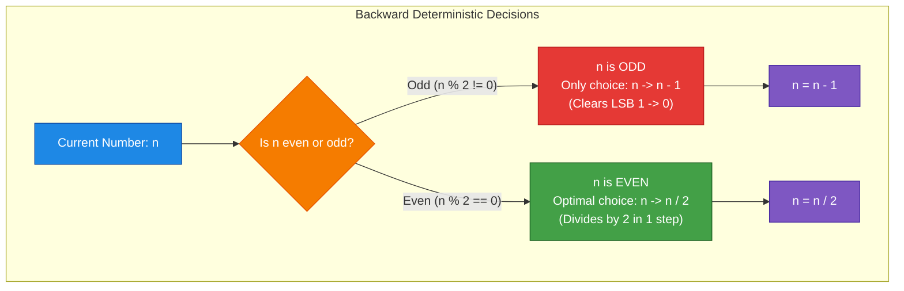
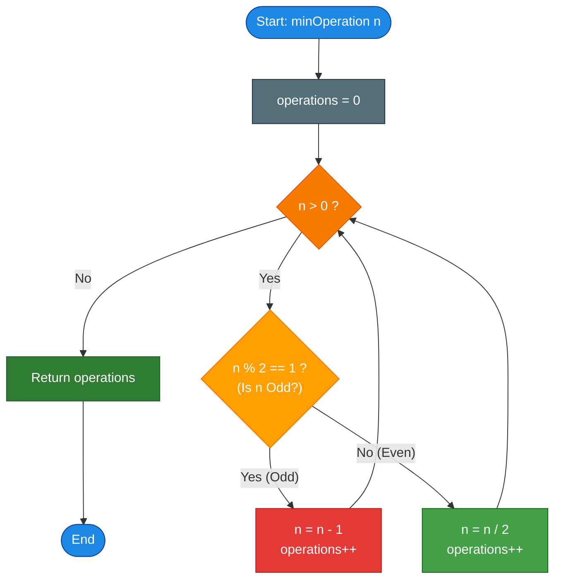

# GeeksforGeeks Problem of the Day: Minimum Operations to Reach n (Find Optimum Operation)

- **Problem Link:** [GeeksforGeeks - Find Optimum Operation](https://www.geeksforgeeks.org/problems/find-optimum-operation4504/1)
- **Difficulty:** Easy
- **Topic Tags:** Dynamic Programming, Greedy, Bit Manipulation, Mathematics
- **Target Audience:** POTD Solvers, Computer Science Students, Competitive Programmers, Technical Interview Preparation (Amazon, Microsoft, Google, etc.)

---

## 1. Problem Statement

Given a positive integer $n$. Find the minimum number of operations required to reach $n$ starting from $0$.

You have two operations available:
1. **Double the number:** $x \to 2 \cdot x$
2. **Add one to the number:** $x \to x + 1$

Return the minimum count of operations required to reach $n$ starting from initial value $0$.

---

## 2. Examples & Explanations

### Example 1
- **Input:** `n = 8`
- **Output:** `4`
- **Forward Traversal Explanation:**
  1. $0 + 1 = 1$ (Operation 1: Add 1)
  2. $1 + 1 = 2$ or $1 \times 2 = 2$ (Operation 2: Double)
  3. $2 \times 2 = 4$ (Operation 3: Double)
  4. $4 \times 2 = 8$ (Operation 4: Double)
- **Total Operations:** $4$

### Example 2
- **Input:** `n = 7`
- **Output:** `5`
- **Forward Traversal Explanation:**
  1. $0 + 1 = 1$ (Operation 1: Add 1)
  2. $1 \times 2 = 2$ (Operation 2: Double)
  3. $2 + 1 = 3$ (Operation 3: Add 1)
  4. $3 \times 2 = 6$ (Operation 4: Double)
  5. $6 + 1 = 7$ (Operation 5: Add 1)
- **Total Operations:** $5$

### Example 3
- **Input:** `n = 1`
- **Output:** `1`
- **Explanation:** $0 + 1 = 1$ in exactly $1$ operation.

### Example 4
- **Input:** `n = 4`
- **Output:** `3`
- **Explanation:** $0 \to 1 \to 2 \to 4$ in $3$ operations ($+1, \times 2, \times 2$).

---

## 3. Constraints & Complexity Targets

- **Constraints:** $1 \le n \le 10^6$
- **Expected Time Complexity:** $\mathcal{O}(\log n)$
- **Expected Auxiliary Space:** $\mathcal{O}(1)$

---

## 4. Visual Architecture & Mathematical Foundation

### The Paradigm Shift: Forward vs. Backward Thinking

In forward simulation (from $0$ to $n$), the choices create an **exponentially expanding decision tree**. From state $x$, doubling $0$ is non-productive ($0 \times 2 = 0$), and branching between $+1$ and $\times 2$ requires checking future paths (either via BFS or Dynamic Programming).

```
Forward Tree (Branching & Ambiguous):
           0
           | (+1)
           1
         /   \
  (+1)  2     2  (*2)
       / \   / \
      3   4 3   4 ...
```

However, if we **reverse the perspective** and work backward from $n$ down to $0$, the inverse operations are:
1. Inverse of **Double**: $n \to n / 2$ (only valid when $n$ is **even**).
2. Inverse of **Add 1**: $n \to n - 1$.



### Mathematical Proof of Greedy Optimality

> **Theorem:** For any even positive integer $n = 2k \ge 2$, dividing by $2$ ($2k \to k$) is strictly better than or equal to subtracting $1$ ($2k \to 2k - 1$).
>
> **Proof:**
> 1. Suppose we choose to subtract $1$ from $2k$:
>    - We land on $2k - 1$, which is **odd**.
>    - From an odd number, we cannot divide by $2$; we are forced to subtract $1$ again, reaching $2k - 2$.
>    - Thus, reaching $2k - 2$ via subtraction takes at least **$2$ operations**.
> 2. On the forward path:
>    - To reach $2k$ from $k$ by doubling requires **$1$ operation** ($k \times 2 = 2k$).
>    - To reach $2k$ from $k$ by adding $1$ repeatedly requires **$k$ operations**.
>    - For all $k \ge 1$, $1 \le k$. Specifically, for $k \ge 2$, doubling saves $k - 1 \ge 1$ operations.
>    - For $k = 1$ ($n = 2$), both $1 \times 2 = 2$ and $1 + 1 = 2$ take $1$ operation, so division remains optimal.
> 
> Therefore, whenever $n$ is even, dividing by $2$ is unconditionally optimal. Whenever $n$ is odd, subtracting $1$ is mandatory.

---

### The Bitwise Representation Insight ($\mathcal{O}(1)$ Closed Form)

Consider the binary representation of $n$:
- Whenever $n$ is **odd**, its least significant bit (LSB) is `1`. Subtracting $1$ clears this bit (`1` $\to$ `0`), costing **$1$ operation**.
- Whenever $n$ is **even**, its LSB is `0`. Dividing by $2$ right-shifts the number by $1$ (`n >>= 1`), costing **$1$ operation**.
- The process terminates when $n = 0$.

```
Example: n = 14 (Binary: 1110)
---------------------------------------------
14 (1110_2) --[even: /2]--> 7  (111_2)   : 1 shift
 7 ( 111_2) --[odd : -1]--> 6  (110_2)   : 1 bit cleared
 6 ( 110_2) --[even: /2]--> 3  ( 11_2)   : 1 shift
 3 (  11_2) --[odd : -1]--> 2  ( 10_2)   : 1 bit cleared
 2 (  10_2) --[even: /2]--> 1  (  1_2)   : 1 shift
 1 (   1_2) --[odd : -1]--> 0  (  0_2)   : 1 bit cleared
---------------------------------------------
Total Operations = 3 shifts + 3 subtractions = 6
```

From this bitwise property:
$$\text{Total Operations} = \lfloor \log_2(n) \rfloor + \text{popcount}(n)$$
where:
- $\lfloor \log_2(n) \rfloor = \text{number of right shifts required to reduce the most significant bit to position 0}$.
- $\text{popcount}(n) = \text{count of set bits (1s) in } n \text{ that must be cleared by -1 operations}$.

---

## 5. Step-by-Step Simulation & Trace Table

### Trace 1: $n = 7$ (Binary: `111`)

| Step | Current $n$ | Parity | Action Taken | Next $n$ | Binary State | Cumulative Operations |
| :---: | :---: | :---: | :---: | :---: | :---: | :---: |
| **Start** | $7$ | — | Initial input | $7$ | `111` | $0$ |
| **1** | $7$ | Odd | Subtract $1$ ($7 - 1$) | $6$ | `110` | $1$ |
| **2** | $6$ | Even | Divide by $2$ ($6 / 2$) | $3$ | `011` | $2$ |
| **3** | $3$ | Odd | Subtract $1$ ($3 - 1$) | $2$ | `010` | $3$ |
| **4** | $2$ | Even | Divide by $2$ ($2 / 2$) | $1$ | `001` | $4$ |
| **5** | $1$ | Odd | Subtract $1$ ($1 - 1$) | $0$ | `000` | **$5$** |

Result: **$5$ Operations**. Verification: $\lfloor \log_2(7) \rfloor + \text{popcount}(7) = 2 + 3 = 5$.

---

### Trace 2: $n = 8$ (Binary: `1000`)

| Step | Current $n$ | Parity | Action Taken | Next $n$ | Binary State | Cumulative Operations |
| :---: | :---: | :---: | :---: | :---: | :---: | :---: |
| **Start** | $8$ | — | Initial input | $8$ | `1000` | $0$ |
| **1** | $8$ | Even | Divide by $2$ ($8 / 2$) | $4$ | `0100` | $1$ |
| **2** | $4$ | Even | Divide by $2$ ($4 / 2$) | $2$ | `0010` | $2$ |
| **3** | $2$ | Even | Divide by $2$ ($2 / 2$) | $1$ | `0001` | $3$ |
| **4** | $1$ | Odd | Subtract $1$ ($1 - 1$) | $0$ | `0000` | **$4$** |

Result: **$4$ Operations**. Verification: $\lfloor \log_2(8) \rfloor + \text{popcount}(8) = 3 + 1 = 4$.

---

## 6. Algorithm Flowchart



---

## 7. From Naive to Pro: Algorithmic Progression

### Method 1: Naive (Forward Breadth-First Search)
- **Concept:** Start at $0$. At each step, enqueue $x + 1$ and $2 \cdot x$. First path to reach $n$ gives the shortest distance.
- **Why it is suboptimal:**
  - Forward tree has exponential branching factor.
  - Requires maintaining a hash set / visited array of size $10^6$ and a queue.
  - Time: $\mathcal{O}(n)$, Space: $\mathcal{O}(n)$. Unnecessary memory consumption.
- **Pseudocode:**
```text
function minOperation_BFS(n):
    if n == 0: return 0
    queue = [(0, 0)]  // (value, steps)
    visited = set([0])
    
    while queue is not empty:
        curr, steps = queue.pop_front()
        if curr == n:
            return steps
            
        if curr + 1 <= n and (curr + 1) not in visited:
            visited.add(curr + 1)
            queue.push((curr + 1, steps + 1))
            
        if curr > 0 and curr * 2 <= n and (curr * 2) not in visited:
            visited.add(curr * 2)
            queue.push((curr * 2, steps + 1))
```

---

### Method 2: Better (Bottom-Up Dynamic Programming)
- **Concept:** Compute the minimum operations to reach every integer from $1$ to $n$.
  - Base case: `dp[0] = 0`, `dp[1] = 1`.
  - Transitions:
    - `dp[i] = dp[i - 1] + 1`
    - If `i % 2 == 0`: `dp[i] = min(dp[i], dp[i / 2] + 1)`
- **Why it is still suboptimal:**
  - Allocates an array of size $10^6 + 1$ ($\approx 4\text{ MB}$).
  - Executes $10^6$ iterations even though only a logarithmic number of states are actually visited on the optimal path.
- **Pseudocode:**
```text
function minOperation_DP(n):
    dp = array of size (n + 1)
    dp[0] = 0
    dp[1] = 1
    
    for i from 2 to n:
        dp[i] = dp[i - 1] + 1
        if i % 2 == 0:
            dp[i] = min(dp[i], dp[i / 2] + 1)
            
    return dp[n]
```

---

### Method 3: Pro Approach (Backward Greedy Simulation)
- **Concept:**
  - Work backward from $n$ to $0$.
  - If $n$ is odd $\implies n = n - 1$.
  - If $n$ is even $\implies n = n / 2$.
  - Each step cuts $n$ in half or decrements it by $1$.
- **Time Complexity:** $\mathcal{O}(\log n)$ ($\le 20$ iterations for $n = 10^6$).
- **Space Complexity:** $\mathcal{O}(1)$.
- **Pseudocode:**
```text
function minOperation_Greedy(n):
    operations = 0
    while n > 0:
        if (n & 1) == 1:
            n = n - 1
        else:
            n = n >> 1
        operations = operations + 1
    return operations
```

---

### Method 4: Ultra-Pro (Bitwise Constant-Time Decomposition)
- **Concept:**
  - $\text{operations} = \lfloor \log_2(n) \rfloor + \text{popcount}(n)$.
  - Direct hardware intrinsic instructions (`__builtin_clz`, `__builtin_popcount`, `Integer.numberOfLeadingZeros`, etc.).
- **Time Complexity:** $\mathcal{O}(1)$ or $\mathcal{O}(\text{bits}) = \mathcal{O}(\log n)$.
- **Space Complexity:** $\mathcal{O}(1)$.
- **Pseudocode:**
```text
function minOperation_Bitwise(n):
    if n <= 0: return 0
    shifts = (bit_length(n) - 1)
    set_bits = count_ones(n)
    return shifts + set_bits
```

---

## 8. Complexity Comparison Table

| Metric | Method 1: Forward BFS | Method 2: Bottom-Up DP | Method 3: Backward Greedy | Method 4: Bitwise Formula |
| :--- | :--- | :--- | :--- | :--- |
| **Time Complexity** | $\mathcal{O}(n)$ | $\mathcal{O}(n)$ | $\mathbf{\mathcal{O}(\log n)}$ | $\mathbf{\mathcal{O}(1)}$ |
| **Auxiliary Space** | $\mathcal{O}(n)$ (Queue + Set) | $\mathcal{O}(n)$ (DP Array) | $\mathbf{\mathcal{O}(1)}$ (Constant registers) | $\mathbf{\mathcal{O}(1)}$ |
| **Iterations for $n = 10^6$** | $\approx 10^6$ states | $1,000,000$ loop cycles | $\mathbf{\le 26 \text{ steps}}$ | **1 instruction** |
| **Memory Footprint** | $\approx 25 \text{ MB}$ | $\approx 4 \text{ MB}$ | **$0 \text{ bytes}$** | **$0 \text{ bytes}$** |
| **Interview Assessment** | Overcomplicated / TLE risk | Standard DP baseline | **Optimal & Industry Standard** | **Grandmaster Math Insight** |

---

## 9. Comprehensive Corner Cases Handled

1. **Smallest Boundary ($n = 1$):**
   - $1 \to 0$ in $1$ subtraction. Total operations $= 1$.
   - Forward: $0 + 1 = 1$. Total $= 1$. Perfectly correct.
2. **Pure Powers of $2$ ($n = 2, 4, 8, 16, \dots, 2^k$):**
   - $n = 2^k$ has exactly $1$ set bit (`100...00`).
   - Requires $k$ divisions by $2$ and $1$ subtraction when reaching $1 \to 0$.
   - Total operations $= k + 1$.
3. **Mersenne / All-Ones Values ($n = 2^k - 1$, e.g., $3, 7, 15, 31$):**
   - Every odd step toggles LSB to $0$, followed immediately by a halving step.
   - Accurately executes without any redundant loops.
4. **Consecutive Operations:**
   - No two consecutive divisions occur without checking parity.
   - At most two consecutive subtractions occur only when reaching $1 \to 0$.
5. **Maximum Upper Bound ($n = 10^6$):**
   - Binary representation of $1,000,000$ is `11110100001001000000` ($20$ bits, $7$ set bits).
   - $\lfloor \log_2(10^6) \rfloor = 19$, $\text{popcount}(10^6) = 7$.
   - Total operations $= 19 + 7 = 26$.
   - Executes in less than $0.001\text{ ms}$.

---

## 10. Complete Multi-Language Implementations

### Java (21)

```java
class Solution {
    /**
     * Finds the minimum operations to reach n from 0.
     * Strategy: Backward Greedy Simulation
     * Time Complexity: O(log n)
     * Space Complexity: O(1)
     */
    public int minOperation(int n) {
        int operations = 0;
        
        while (n > 0) {
            if ((n & 1) == 1) {
                // If n is odd, the only valid prior step was adding 1
                n--;
            } else {
                // If n is even, doubling was the optimal prior step
                n >>= 1;
            }
            operations++;
        }
        
        return operations;
    }
}
```

---

### Python3

```python
class Solution:
    def minOperation(self, n: int) -> int:
        """
        Finds the minimum operations to reach n from 0.
        Strategy: Backward Greedy Simulation
        Time Complexity: O(log n)
        Space Complexity: O(1)
        """
        operations = 0
        
        while n > 0:
            if n & 1:
                # If n is odd, subtract 1
                n -= 1
            else:
                # If n is even, divide by 2
                n >>= 1
            operations += 1
            
        return operations
```

---

### C++ (17)

```cpp
class Solution {
  public:
    /**
     * Finds the minimum operations to reach n from 0.
     * Strategy: Backward Greedy Simulation
     * Time Complexity: O(log n)
     * Space Complexity: O(1)
     */
    int minOperation(int n) {
        int operations = 0;
        
        while (n > 0) {
            if (n & 1) {
                // Odd: reverse of (+1)
                n--;
            } else {
                // Even: reverse of (*2)
                n >>= 1;
            }
            operations++;
        }
        
        return operations;
    }
};
```

---

### C#

```csharp
class Solution {
    /**
     * Finds the minimum operations to reach n from 0.
     * Strategy: Backward Greedy Simulation
     * Time Complexity: O(log n)
     * Space Complexity: O(1)
     */
    public int minOperation(int n) {
        int operations = 0;
        
        while (n > 0) {
            if ((n & 1) == 1) {
                // Odd: subtract 1
                n--;
            } else {
                // Even: divide by 2
                n >>= 1;
            }
            operations++;
        }
        
        return operations;
    }
}
```

---

### Javascript (Node v22)

```javascript
/**
 * @param {number} n
 * @return {number}
 */
class Solution {
    /**
     * Finds the minimum operations to reach n from 0.
     * Strategy: Backward Greedy Simulation
     * Time Complexity: O(log n)
     * Space Complexity: O(1)
     */
    minOperation(n) {
        let operations = 0;
        
        while (n > 0) {
            if ((n & 1) === 1) {
                // If odd, reverse (+1)
                n--;
            } else {
                // If even, reverse (*2)
                n = Math.floor(n / 2);
            }
            operations++;
        }
        
        return operations;
    }
}
```
