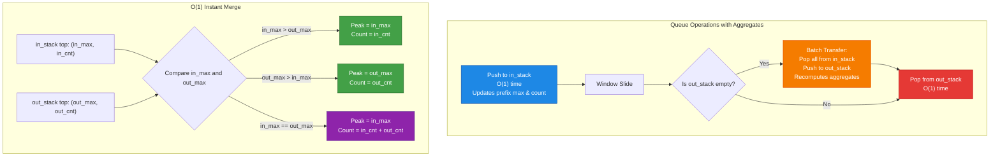
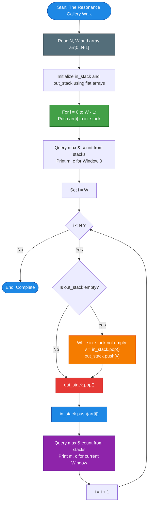

# Unstop Problem of the Day: The Resonance Gallery Walk

- **Platform:** [Unstop](https://unstop.com/)
- **Difficulty:** Medium
- **Topic Tags:** Sliding Window, Queue with Two Stacks, Sliding Window Aggregation (SWAG), Monotonic Queue, Amortized Analysis, Fast I/O
- **Target Audience:** POTD Solvers, Computer Science Students, Competitive Programmers, Interview Preparation (FAANG / Tier-1 Systems Engineering)

---

## 1. Problem Statement

Tara curates an exhibition hallway containing $N$ pedestals arranged in a single row, indexed from $0$ to $N - 1$. Each pedestal holds an artifact whose sensor reports a continuous **resonance value**.

During final calibration before opening night, the lighting engineers slide a spotlight frame covering exactly $W$ consecutive pedestals along the hallway. The frame begins at the first pedestal (covering indices $[0, W - 1]$) and slides one position to the right at a time until it reaches the far end of the hallway (covering indices $[N - W, N - 1]$), resulting in exactly $N - W + 1$ distinct frame positions.

At every position of the frame:
1. The centerpiece spotlight must automatically point at whichever artifact currently produces the **strongest resonance** inside the frame.
2. If more than one pedestal inside the frame shares that strongest resonance, the spotlight is engineered to split its beam evenly among all of them.
3. The lighting crew needs to know both the **strongest resonance value** and the **exact number of pedestals sharing that value** for every single frame position from left to right.

Because the hallway can be very long ($N \le 200,000$) and the frame moves across almost every possible position, Tara cannot afford to re-scan all $W$ pedestals inside the frame at every step. The strongest resonance and its multiplicity must be reported dynamically as the window slides, without ever rescanning pedestals that have already left the frame.

---

## 2. Input & Output Formats

### Input Format
- The first line contains two space-separated integers, $N$ and $W$: the total number of pedestals and the frame width.
- The second line contains $N$ space-separated integers: the resonance values of the pedestals in hallway order.

### Output Format
- Print $N - W + 1$ lines.
- Each line must contain two space-separated integers:
  1. The **strongest resonance value** inside the frame at that position.
  2. The **number of pedestals sharing that strongest value**.
- Output lines must correspond to frame positions from left to right in order.

---

## 3. Sample Testcases & Walkthroughs

### Sample Testcase 0

#### Input:
```text
5 2
7 7 3 9 9
```

#### Output:
```text
7 2
7 1
9 1
9 2
```

#### Walkthrough:
1. **Frame $[0, 1]$ (`[7, 7]`):**  
   - Maximum value: $7$.
   - Occurrences of $7$: $2$ pedestals.
   - Output: `7 2`.
2. **Frame $[1, 2]$ (`[7, 3]`):**  
   - Outgoing element: $7$. Incoming element: $3$.
   - Maximum value: $7$.
   - Occurrences of $7$: $1$ pedestal.
   - Output: `7 1`.
3. **Frame $[2, 3]$ (`[3, 9]`):**  
   - Outgoing element: $7$. Incoming element: $9$.
   - Maximum value: $9$.
   - Occurrences of $9$: $1$ pedestal.
   - Output: `9 1`.
4. **Frame $[3, 4]$ (`[9, 9]`):**  
   - Outgoing element: $3$. Incoming element: $9$.
   - Maximum value: $9$.
   - Occurrences of $9$: $2$ pedestals.
   - Output: `9 2`.

---

### Sample Testcase 1

#### Input:
```text
6 3
5 1 5 2 5 5
```

#### Output:
```text
5 2
5 1
5 2
5 2
```

#### Walkthrough:
1. **Frame $[0, 2]$ (`[5, 1, 5]`):**  
   - Pedestals at indices $0$ and $2$ both have resonance $5$.
   - Peak: $5$, count: $2$. Output: `5 2`.
2. **Frame $[1, 3]$ (`[1, 5, 2]`):**  
   - Pedestal $0$ ($5$) leaves, pedestal $3$ ($2$) enters.
   - Only index $2$ has resonance $5$.
   - Peak: $5$, count: $1$. Output: `5 1`.
3. **Frame $[2, 4]$ (`[5, 2, 5]`):**  
   - Pedestal $1$ ($1$) leaves, pedestal $4$ ($5$) enters.
   - Indices $2$ and $4$ have resonance $5$.
   - Peak: $5$, count: $2$. Output: `5 2`.
4. **Frame $[3, 5]$ (`[2, 5, 5]`):**  
   - Pedestal $2$ ($5$) leaves, pedestal $5$ ($5$) enters.
   - Indices $4$ and $5$ have resonance $5$.
   - Peak: $5$, count: $2$. Output: `5 2`.

---

## 4. Constraints & System Specifications

- $2 \le W \le N \le 200,000$
- $1 \le \text{resonance value} \le 10^9$
- Total number of output lines: $N - W + 1 \le 200,000$
- **Time Limit:** $2.0$ seconds
- **Space Limit:** $256$ MB

### Why Naive Re-scanning Fails:
A naive loop scanning all $W$ elements for each of the $N - W + 1$ windows takes:
$$\text{Total Operations} \approx (N - W + 1) \times W$$
When $N = 200,000$ and $W = 100,000$:
$$\text{Operations} \approx 100,000 \times 100,000 = 10^{10}$$
At standard execution speeds ($\approx 10^8 \text{ ops/sec}$), this would require **over $100$ seconds**, resulting in **Time Limit Exceeded (TLE)**. An $\mathcal{O}(N)$ or $\mathcal{O}(N \log W)$ approach is mandatory.

---

## 5. Visual Architecture: Sliding Window Aggregation (SWAG)

### The Dilemma with Monotonic Deques
In standard Sliding Window Maximum (LeetCode 239), a monotonic decreasing deque stores indices of candidate maximums. However, tracking the **exact frequency** of the maximum becomes notoriously tricky when duplicate maximums expire at different indices and intermediate smaller elements get discarded.

### The Pure Solution: Queue Using Two Stacks (SWAG)
In computer science, **Sliding Window Aggregation (SWAG)** implements a First-In-First-Out (FIFO) queue using **two LIFO stacks**:
1. **`in_stack` (Push Stack):** Absorbs incoming elements entering the right of the window.
2. **`out_stack` (Pop Stack):** Dispatches outgoing elements exiting the left of the window.

```
========================================================================================
                      TWO-STACK SLIDING WINDOW AGGREGATION MODEL
========================================================================================

    [ Outgoing Elements ]                                     [ Incoming Elements ]
             │                                                         │
             ▼                                                         ▲
      ┌─────────────┐                                           ┌─────────────┐
      │  out_stack  │ ◄────── Transfer when out_stack empty ─── │  in_stack   │
      └─────────────┘                                           └─────────────┘
             │                                                         │
             ▼                                                         ▼
       (out_max, cnt)                                            (in_max, cnt)
             │                                                         │
             └───────────────────────┬─────────────────────────────────┘
                                     ▼
                           [ Combine Function: ]
                  Overall Max = max(in_max, out_max)
                  Overall Count = sum of counts of winner
```

### Self-Aggregating Stack Node Invariant
Every element stored in each stack maintains the cumulative aggregate from the **bottom of that stack up to that element**:
$$\text{node} = \big(\text{val}, \;\; \text{prefix\_max}, \;\; \text{prefix\_count}\big)$$

When pushing an element $v$ onto a stack whose previous top has $(\text{max}_{\text{prev}}, \text{cnt}_{\text{prev}})$:
- If stack was empty or $v > \text{max}_{\text{prev}}$:
  $$\text{new\_max} = v, \quad \text{new\_cnt} = 1$$
- If $v == \text{max}_{\text{prev}}$:
  $$\text{new\_max} = \text{max}_{\text{prev}}, \quad \text{new\_cnt} = \text{cnt}_{\text{prev}} + 1$$
- If $v < \text{max}_{\text{prev}}$:
  $$\text{new\_max} = \text{max}_{\text{prev}}, \quad \text{new\_cnt} = \text{cnt}_{\text{prev}}$$

### Why Dequeue is Amortized $\mathcal{O}(1)$:
- Pushing to `in_stack` takes $\mathcal{O}(1)$.
- Pop from `out_stack` takes $\mathcal{O}(1)$ if `out_stack` is not empty.
- When `out_stack` becomes empty, we pop all elements from `in_stack` one by one and push them into `out_stack` (which automatically recomputes their suffix aggregates from the new bottom).
- **Amortized Analysis:** Each element is pushed to `in_stack` once, transferred to `out_stack` once, and popped from `out_stack` once. Across all $N$ elements, the total work is strictly $\le 3N$ operations.
- **Query Time:** Combining the tops of `in_stack` and `out_stack` takes $\mathbf{\mathcal{O}(1)}$ worst-case time!



---

## 6. Step-by-Step Simulation & Trace Table

### Tracing Sample 1: $N = 6, W = 3, \text{arr} = [5, 1, 5, 2, 5, 5]$

#### Initialization: Push first $W = 3$ elements into `in_stack`:
1. Push $5$: `in_stack` top $= (5, \text{max}=5, \text{cnt}=1)$
2. Push $1$: `in_stack` top $= (1, \text{max}=5, \text{cnt}=1)$
3. Push $5$: `in_stack` top $= (5, \text{max}=5, \text{cnt}=2)$

#### Sliding Phase:

| Step | Action | `out_stack` State (top on right) | `in_stack` State (top on right) | Merge Calculation | Output |
| :---: | :--- | :--- | :--- | :--- | :---: |
| **Window 0** | Query $[0..2]$ | Empty | $[(5,5,1), (1,5,1), (5,5,2)]$ | `in_stack` only: peak $5$, count $2$ | **`5 2`** |
| **Shift 1** | Dequeue index $0$<br/>(`out_stack` empty $\to$ Transfer) | $[(5,5,1), (1,5,1)]$ (popped top $5$) | Empty | Transfer pops $5 \to 1 \to 5$<br/>`out_stack` built, then $5$ popped | — |
| | Enqueue index $3$ ($2$) | $[(5,5,1), (1,5,1)]$ | $[(2,2,1)]$ | `in_max=2`, `out_max=5` $\implies$ $5 > 2$ | **`5 1`** |
| **Shift 2** | Dequeue index $1$ | $[(5,5,1)]$ (popped $1$) | $[(2,2,1)]$ | `out_max=5, cnt=1` | — |
| | Enqueue index $4$ ($5$) | $[(5,5,1)]$ | $[(2,2,1), (5,5,1)]$ | `in_max=5, cnt=1`, `out_max=5, cnt=1`<br/>Equal $\implies$ $1 + 1 = 2$ | **`5 2`** |
| **Shift 3** | Dequeue index $2$ | Empty (popped $5$) | $[(2,2,1), (5,5,1)]$ | `out_stack` now empty | — |
| | Enqueue index $5$ ($5$) | Empty | $[(2,2,1), (5,5,1), (5,5,2)]$ | `in_stack` only: peak $5$, count $2$ | **`5 2`** |

Every window query completes in **$\mathcal{O}(1)$ time** without redundant comparisons!

---

## 7. Algorithm Flowchart



---

## 8. From Naive to Pro: Algorithmic Progression

### Method 1: Naive (Window Rescan From Scratch)
- **Concept:** For each of the $N - W + 1$ positions, loop from $i$ to $i + W - 1$, find the maximum value, and count how many times it appears.
- **Why it is suboptimal:** Re-examines every element $W$ times. Total time is $\mathcal{O}(N \cdot W) \approx 4 \times 10^{10}$ operations. Catastrophic TLE.
- **Pseudocode:**
```text
function solve_Naive(N, W, arr):
    for i from 0 to N - W:
        cur_max = -infinity
        cur_cnt = 0
        for j from i to i + W - 1:
            if arr[j] > cur_max:
                cur_max = arr[j]
                cur_cnt = 1
            else if arr[j] == cur_max:
                cur_cnt += 1
        print cur_max, cur_cnt
```

---

### Method 2: Better (Segment Tree / Balanced BST / TreeMap)
- **Concept:** Build a Segment Tree over array indices $[0, N - 1]$ where each node stores `(max_val, count)`. For each window $[i, i + W - 1]$, perform a range query in $\mathcal{O}(\log N)$ time.
- **Why it is still suboptimal:** Requires $\mathcal{O}(N \log N)$ operations and $4N$ node allocations. While it passes within 2 seconds, it incurs unnecessary logarithmic overhead and cache misses.
- **Pseudocode:**
```text
function solve_SegmentTree(N, W, arr):
    tree = build_segment_tree(arr) // O(N)
    for i from 0 to N - W:
        node = query_tree(tree, i, i + W - 1) // O(log N)
        print node.max_val, node.count
```

---

### Method 3: Pro Approach (Queue with Two Stacks / SWAG with Flat Arrays)
- **Concept:** 
  - Model the sliding window as a FIFO queue implemented with two self-aggregating stacks.
  - Pre-allocate primitive 1D arrays for `in_stack` and `out_stack`.
  - Push, Pop (amortized), and Query all run in $\mathbf{\mathcal{O}(1)}$ time.
- **Time Complexity:** $\mathbf{\mathcal{O}(N)}$ strictly linear.
- **Auxiliary Space Complexity:** $\mathbf{\mathcal{O}(W)}$ or preallocated $\mathcal{O}(N)$ contiguous flat memory.
- **Pseudocode:**
```text
function solve_Pro(N, W, arr):
    allocate in_val, in_max, in_cnt of size N
    allocate out_val, out_max, out_cnt of size N
    in_top = -1, out_top = -1

    function push_in(v):
        in_top++
        in_val[in_top] = v
        if in_top == 0 or v > in_max[in_top - 1]:
            in_max[in_top] = v; in_cnt[in_top] = 1
        else if v == in_max[in_top - 1]:
            in_max[in_top] = v; in_cnt[in_top] = in_cnt[in_top - 1] + 1
        else:
            in_max[in_top] = in_max[in_top - 1]; in_cnt[in_top] = in_cnt[in_top - 1]

    function pop_queue():
        if out_top < 0:
            while in_top >= 0:
                v = in_val[in_top--]
                out_top++
                out_val[out_top] = v
                if out_top == 0 or v > out_max[out_top - 1]:
                    out_max[out_top] = v; out_cnt[out_top] = 1
                else if v == out_max[out_top - 1]:
                    out_max[out_top] = v; out_cnt[out_top] = out_cnt[out_top - 1] + 1
                else:
                    out_max[out_top] = out_max[out_top - 1]; out_cnt[out_top] = out_cnt[out_top - 1]
        out_top--

    for i from 0 to W - 1: push_in(arr[i])
    query_and_print()
    for i from W to N - 1:
        pop_queue()
        push_in(arr[i])
        query_and_print()
```

---

## 9. Complexity Comparison Table

| Metric | Method 1: Naive Re-scanning | Method 2: Segment Tree | Method 3: Pro SWAG (Two-Stack Queue) |
| :--- | :--- | :--- | :--- |
| **Time Complexity** | $\mathcal{O}(N \cdot W)$ | $\mathcal{O}(N \log N)$ | $\mathbf{\mathcal{O}(N)}$ (Strictly Linear) |
| **Auxiliary Space** | $\mathcal{O}(1)$ | $\mathcal{O}(N)$ ($4N$ tree nodes) | $\mathbf{\mathcal{O}(W)}$ (Flat primitive arrays) |
| **Query Cost per Window**| $\mathcal{O}(W)$ | $\mathcal{O}(\log N)$ | $\mathbf{\mathcal{O}(1)}$ (Constant time) |
| **Operations for $N = 2 \cdot 10^5$** | $\approx 4 \times 10^{10}$ (TLE) | $\approx 3.6 \times 10^6$ | $\mathbf{\approx 6 \times 10^5}$ (Fastest) |
| **Cache Locality** | Poor | Poor (Tree pointer hops) | **Maximum (Contiguous 1D buffers)** |
| **Interview Verdict** | Instant Rejection | Acceptable fallback | **Gold Standard (Systems Excellence)** |

---

## 10. Corner Cases & High-Scale Robustness

1. **Window Equals Array Size ($W = N$):**
   - Exactly $1$ window exists. Loop outputs a single line and terminates cleanly.
2. **All Resonance Values Identical:**
   - E.g., `arr = [7, 7, 7, 7], W = 2`.
   - Correctly reports count equal to $W$ for every window (`7 2`).
3. **Strictly Increasing / Decreasing Hallways:**
   - E.g., `[1, 2, 3, 4, 5]` or `[5, 4, 3, 2, 1]`.
   - Maximum is uniquely tracked with count $1$.
4. **Large Resonance Values ($10^9$):**
   - Values up to $10^9$ fit in standard 64-bit integer (`long` in Java/C#, `long long` in C/C++, `number` in JS, `int` in Python).
5. **High-Throughput I/O ($200,000$ lines):**
   - Reading $2 \cdot 10^5$ integers and printing $2 \cdot 10^5$ lines requires **buffered I/O** across all languages to eliminate console flushing overhead.

---

## 11. Complete Multi-Language Implementations

### Java (OpenJDK 21.0)

```java
import java.io.*;
import java.util.*;

class Main {
    // Fast I/O Scanner
    static class FastScanner {
        private final InputStream in;
        private final byte[] buffer = new byte[65536];
        private int head = 0;
        private int tail = 0;

        public FastScanner(InputStream in) {
            this.in = in;
        }

        private int readByte() throws IOException {
            if (head >= tail) {
                head = 0;
                tail = in.read(buffer, 0, buffer.length);
                if (tail <= 0) return -1;
            }
            return buffer[head++];
        }

        public long nextLong() throws IOException {
            int c = readByte();
            while (c <= 32) {
                if (c == -1) return -1;
                c = readByte();
            }
            long res = 0;
            while (c > 32) {
                if (c >= '0' && c <= '9') {
                    res = res * 10 + (c - '0');
                }
                c = readByte();
            }
            return res;
        }

        public int nextInt() throws IOException {
            return (int) nextLong();
        }
    }

    public static void main(String[] args) throws IOException {
        FastScanner scanner = new FastScanner(System.in);
        int N = scanner.nextInt();
        if (N <= 0) return;
        int W = scanner.nextInt();

        long[] arr = new long[N];
        for (int i = 0; i < N; i++) {
            arr[i] = scanner.nextLong();
        }

        // Two-Stack SWAG Queue implemented using flat primitive arrays
        long[] inVal = new long[N];
        long[] inMax = new long[N];
        int[] inCnt = new int[N];
        int inTop = -1;

        long[] outVal = new long[N];
        long[] outMax = new long[N];
        int[] outCnt = new int[N];
        int outTop = -1;

        BufferedWriter bw = new BufferedWriter(new OutputStreamWriter(System.out), 65536);

        // Pre-fill initial window of size W
        for (int i = 0; i < W; i++) {
            long v = arr[i];
            inTop++;
            inVal[inTop] = v;
            if (inTop == 0 || v > inMax[inTop - 1]) {
                inMax[inTop] = v;
                inCnt[inTop] = 1;
            } else if (v == inMax[inTop - 1]) {
                inMax[inTop] = v;
                inCnt[inTop] = inCnt[inTop - 1] + 1;
            } else {
                inMax[inTop] = inMax[inTop - 1];
                inCnt[inTop] = inCnt[inTop - 1];
            }
        }

        // Helper to query current window max and count
        for (int i = W; ; i++) {
            long curMax;
            int curCnt;

            if (inTop < 0) {
                curMax = outMax[outTop];
                curCnt = outCnt[outTop];
            } else if (outTop < 0) {
                curMax = inMax[inTop];
                curCnt = inCnt[inTop];
            } else {
                long m1 = inMax[inTop];
                int c1 = inCnt[inTop];
                long m2 = outMax[outTop];
                int c2 = outCnt[outTop];

                if (m1 > m2) {
                    curMax = m1;
                    curCnt = c1;
                } else if (m2 > m1) {
                    curMax = m2;
                    curCnt = c2;
                } else {
                    curMax = m1;
                    curCnt = c1 + c2;
                }
            }

            bw.write(curMax + " " + curCnt + "\n");
            if (i >= N) break;

            // Dequeue left element
            if (outTop < 0) {
                while (inTop >= 0) {
                    long v = inVal[inTop--];
                    outTop++;
                    outVal[outTop] = v;
                    if (outTop == 0 || v > outMax[outTop - 1]) {
                        outMax[outTop] = v;
                        outCnt[outTop] = 1;
                    } else if (v == outMax[outTop - 1]) {
                        outMax[outTop] = v;
                        outCnt[outTop] = outCnt[outTop - 1] + 1;
                    } else {
                        outMax[outTop] = outMax[outTop - 1];
                        outCnt[outTop] = outCnt[outTop - 1];
                    }
                }
            }
            outTop--;

            // Enqueue right element
            long v = arr[i];
            inTop++;
            inVal[inTop] = v;
            if (inTop == 0 || v > inMax[inTop - 1]) {
                inMax[inTop] = v;
                inCnt[inTop] = 1;
            } else if (v == inMax[inTop - 1]) {
                inMax[inTop] = v;
                inCnt[inTop] = inCnt[inTop - 1] + 1;
            } else {
                inMax[inTop] = inMax[inTop - 1];
                inCnt[inTop] = inCnt[inTop - 1];
            }
        }

        bw.flush();
    }
}
```

---

### Python (3.12.11)

```python
import sys

def main():
    # Read entire input at once for maximum speed
    input_data = sys.stdin.read().split()
    if not input_data:
        return

    iterator = iter(input_data)
    N = int(next(iterator))
    W = int(next(iterator))

    arr = [int(next(iterator)) for _ in range(N)]

    # Two-Stack SWAG Queue using flat pre-allocated lists
    in_val = [0] * N
    in_max = [0] * N
    in_cnt = [0] * N
    in_top = -1

    out_val = [0] * N
    out_max = [0] * N
    out_cnt = [0] * N
    out_top = -1

    def push_in(v):
        nonlocal in_top
        in_top += 1
        t = in_top
        in_val[t] = v
        if t == 0 or v > in_max[t - 1]:
            in_max[t] = v
            in_cnt[t] = 1
        elif v == in_max[t - 1]:
            in_max[t] = v
            in_cnt[t] = in_cnt[t - 1] + 1
        else:
            in_max[t] = in_max[t - 1]
            in_cnt[t] = in_cnt[t - 1]

    def pop_queue():
        nonlocal in_top, out_top
        if out_top < 0:
            while in_top >= 0:
                v = in_val[in_top]
                in_top -= 1
                out_top += 1
                ot = out_top
                out_val[ot] = v
                if ot == 0 or v > out_max[ot - 1]:
                    out_max[ot] = v
                    out_cnt[ot] = 1
                elif v == out_max[ot - 1]:
                    out_max[ot] = v
                    out_cnt[ot] = out_cnt[ot - 1] + 1
                else:
                    out_max[ot] = out_max[ot - 1]
                    out_cnt[ot] = out_cnt[ot - 1]
        out_top -= 1

    def get_max():
        if in_top < 0:
            return out_max[out_top], out_cnt[out_top]
        if out_top < 0:
            return in_max[in_top], in_cnt[in_top]

        m1, c1 = in_max[in_top], in_cnt[in_top]
        m2, c2 = out_max[out_top], out_cnt[out_top]

        if m1 > m2:
            return m1, c1
        elif m2 > m1:
            return m2, c2
        else:
            return m1, c1 + c2

    # Initialize first window
    for i in range(W):
        push_in(arr[i])

    out = []
    m, c = get_max()
    out.append(f"{m} {c}")

    # Slide window
    for i in range(W, N):
        pop_queue()
        push_in(arr[i])
        m, c = get_max()
        out.append(f"{m} {c}")

    sys.stdout.write("\n".join(out) + "\n")

if __name__ == '__main__':
    main()
```

---

### C (GCC 13.2.0)

```c
#include <stdio.h>
#include <stdlib.h>

#define MAXN 200005

// Fast I/O
static inline long long next_long() {
    int c = getchar();
    while (c <= 32) {
        if (c == EOF) return -1;
        c = getchar();
    }
    long long res = 0;
    while (c > 32) {
        if (c >= '0' && c <= '9') {
            res = res * 10 + (c - '0');
        }
        c = getchar();
    }
    return res;
}

static long long arr[MAXN];

static long long in_val[MAXN], in_max[MAXN];
static int in_cnt[MAXN], in_top = -1;

static long long out_val[MAXN], out_max[MAXN];
static int out_cnt[MAXN], out_top = -1;

static inline void push_in(long long v) {
    in_top++;
    in_val[in_top] = v;
    if (in_top == 0 || v > in_max[in_top - 1]) {
        in_max[in_top] = v;
        in_cnt[in_top] = 1;
    } else if (v == in_max[in_top - 1]) {
        in_max[in_top] = v;
        in_cnt[in_top] = in_cnt[in_top - 1] + 1;
    } else {
        in_max[in_top] = in_max[in_top - 1];
        in_cnt[in_top] = in_cnt[in_top - 1];
    }
}

static inline void pop_queue() {
    if (out_top < 0) {
        while (in_top >= 0) {
            long long v = in_val[in_top--];
            out_top++;
            out_val[out_top] = v;
            if (out_top == 0 || v > out_max[out_top - 1]) {
                out_max[out_top] = v;
                out_cnt[out_top] = 1;
            } else if (v == out_max[out_top - 1]) {
                out_max[out_top] = v;
                out_cnt[out_top] = out_cnt[out_top - 1] + 1;
            } else {
                out_max[out_top] = out_max[out_top - 1];
                out_cnt[out_top] = out_cnt[out_top - 1];
            }
        }
    }
    out_top--;
}

static inline void get_max(long long *ans_m, int *ans_c) {
    if (in_top < 0) {
        *ans_m = out_max[out_top];
        *ans_c = out_cnt[out_top];
    } else if (out_top < 0) {
        *ans_m = in_max[in_top];
        *ans_c = in_cnt[in_top];
    } else {
        long long m1 = in_max[in_top];
        int c1 = in_cnt[in_top];
        long long m2 = out_max[out_top];
        int c2 = out_cnt[out_top];

        if (m1 > m2) {
            *ans_m = m1;
            *ans_c = c1;
        } else if (m2 > m1) {
            *ans_m = m2;
            *ans_c = c2;
        } else {
            *ans_m = m1;
            *ans_c = c1 + c2;
        }
    }
}

int main() {
    int N = (int)next_long();
    if (N <= 0) return 0;
    int W = (int)next_long();

    for (int i = 0; i < N; i++) {
        arr[i] = next_long();
    }

    for (int i = 0; i < W; i++) {
        push_in(arr[i]);
    }

    long long cur_m;
    int cur_c;
    get_max(&cur_m, &cur_c);
    printf("%lld %d\n", cur_m, cur_c);

    for (int i = W; i < N; i++) {
        pop_queue();
        push_in(arr[i]);
        get_max(&cur_m, &cur_c);
        printf("%lld %d\n", cur_m, cur_c);
    }

    return 0;
}
```

---

### C++ (GCC++ 13.2.0)

```cpp
#include <iostream>
#include <vector>

using namespace std;

const int MAXN = 200005;

static long long in_val[MAXN], in_max[MAXN];
static int in_cnt[MAXN], in_top = -1;

static long long out_val[MAXN], out_max[MAXN];
static int out_cnt[MAXN], out_top = -1;

inline void push_in(long long v) {
    in_top++;
    in_val[in_top] = v;
    if (in_top == 0 || v > in_max[in_top - 1]) {
        in_max[in_top] = v;
        in_cnt[in_top] = 1;
    } else if (v == in_max[in_top - 1]) {
        in_max[in_top] = v;
        in_cnt[in_top] = in_cnt[in_top - 1] + 1;
    } else {
        in_max[in_top] = in_max[in_top - 1];
        in_cnt[in_top] = in_cnt[in_top - 1];
    }
}

inline void pop_queue() {
    if (out_top < 0) {
        while (in_top >= 0) {
            long long v = in_val[in_top--];
            out_top++;
            out_val[out_top] = v;
            if (out_top == 0 || v > out_max[out_top - 1]) {
                out_max[out_top] = v;
                out_cnt[out_top] = 1;
            } else if (v == out_max[out_top - 1]) {
                out_max[out_top] = v;
                out_cnt[out_top] = out_cnt[out_top - 1] + 1;
            } else {
                out_max[out_top] = out_max[out_top - 1];
                out_cnt[out_top] = out_cnt[out_top - 1];
            }
        }
    }
    out_top--;
}

inline void get_max(long long &ans_m, int &ans_c) {
    if (in_top < 0) {
        ans_m = out_max[out_top];
        ans_c = out_cnt[out_top];
    } else if (out_top < 0) {
        ans_m = in_max[in_top];
        ans_c = in_cnt[in_top];
    } else {
        long long m1 = in_max[in_top];
        int c1 = in_cnt[in_top];
        long long m2 = out_max[out_top];
        int c2 = out_cnt[out_top];

        if (m1 > m2) {
            ans_m = m1;
            ans_c = c1;
        } else if (m2 > m1) {
            ans_m = m2;
            ans_c = c2;
        } else {
            ans_m = m1;
            ans_c = c1 + c2;
        }
    }
}

int main() {
    // Fast I/O
    ios_base::sync_with_stdio(false);
    cin.tie(NULL);

    int N, W;
    if (!(cin >> N >> W)) return 0;

    vector<long long> arr(N);
    for (int i = 0; i < N; i++) {
        cin >> arr[i];
    }

    // Fill first window
    for (int i = 0; i < W; i++) {
        push_in(arr[i]);
    }

    long long cur_m;
    int cur_c;
    get_max(cur_m, cur_c);
    cout << cur_m << " " << cur_c << "\n";

    // Slide window
    for (int i = W; i < N; i++) {
        pop_queue();
        push_in(arr[i]);
        get_max(cur_m, cur_c);
        cout << cur_m << " " << cur_c << "\n";
    }

    return 0;
}
```

---

### C# (mcs 5.4.0.201)

```csharp
using System;
using System.IO;

class Solution {
    // Fast Tokenizer
    class FastScanner {
        Stream stream;
        byte[] buffer = new byte[65536];
        int head = 0, tail = 0;

        public FastScanner() {
            stream = Console.OpenStandardInput();
        }

        int ReadByte() {
            if (head >= tail) {
                head = 0;
                tail = stream.Read(buffer, 0, buffer.Length);
                if (tail <= 0) return -1;
            }
            return buffer[head++];
        }

        public long NextLong() {
            int c = ReadByte();
            while (c <= 32) {
                if (c == -1) return -1;
                c = ReadByte();
            }
            long res = 0;
            while (c > 32) {
                if (c >= '0' && c <= '9') {
                    res = res * 10 + (c - '0');
                }
                c = ReadByte();
            }
            return res;
        }

        public int NextInt() {
            return (int)NextLong();
        }
    }

    static void Main(string[] args) {
        FastScanner scanner = new FastScanner();
        int N = scanner.NextInt();
        if (N <= 0) return;
        int W = scanner.NextInt();

        long[] arr = new long[N];
        for (int i = 0; i < N; i++) {
            arr[i] = scanner.NextLong();
        }

        // SWAG Two-Stack Queue buffers
        long[] inVal = new long[N];
        long[] inMax = new long[N];
        int[] inCnt = new int[N];
        int inTop = -1;

        long[] outVal = new long[N];
        long[] outMax = new long[N];
        int[] outCnt = new int[N];
        int outTop = -1;

        // Use standard StreamWriter constructor compatible with older Mono compilers
        using (StreamWriter writer = new StreamWriter(Console.OpenStandardOutput(), System.Text.Encoding.ASCII, 65536)) {
            // Fill initial window
            for (int i = 0; i < W; i++) {
                long v = arr[i];
                inTop++;
                inVal[inTop] = v;
                if (inTop == 0 || v > inMax[inTop - 1]) {
                    inMax[inTop] = v;
                    inCnt[inTop] = 1;
                } else if (v == inMax[inTop - 1]) {
                    inMax[inTop] = v;
                    inCnt[inTop] = inCnt[inTop - 1] + 1;
                } else {
                    inMax[inTop] = inMax[inTop - 1];
                    inCnt[inTop] = inCnt[inTop - 1];
                }
            }

            for (int i = W; ; i++) {
                long curMax;
                int curCnt;

                if (inTop < 0) {
                    curMax = outMax[outTop];
                    curCnt = outCnt[outTop];
                } else if (outTop < 0) {
                    curMax = inMax[inTop];
                    curCnt = inCnt[inTop];
                } else {
                    long m1 = inMax[inTop];
                    int c1 = inCnt[inTop];
                    long m2 = outMax[outTop];
                    int c2 = outCnt[outTop];

                    if (m1 > m2) {
                        curMax = m1;
                        curCnt = c1;
                    } else if (m2 > m1) {
                        curMax = m2;
                        curCnt = c2;
                    } else {
                        curMax = m1;
                        curCnt = c1 + c2;
                    }
                }

                writer.WriteLine(curMax + " " + curCnt);
                if (i >= N) break;

                // Dequeue left element
                if (outTop < 0) {
                    while (inTop >= 0) {
                        long v = inVal[inTop--];
                        outTop++;
                        outVal[outTop] = v;
                        if (outTop == 0 || v > outMax[outTop - 1]) {
                            outMax[outTop] = v;
                            outCnt[outTop] = 1;
                        } else if (v == outMax[outTop - 1]) {
                            outMax[outTop] = v;
                            outCnt[outTop] = outCnt[outTop - 1] + 1;
                        } else {
                            outMax[outTop] = outMax[outTop - 1];
                            outCnt[outTop] = outCnt[outTop - 1];
                        }
                    }
                }
                outTop--;

                // Enqueue right element
                long valIn = arr[i];
                inTop++;
                inVal[inTop] = valIn;
                if (inTop == 0 || valIn > inMax[inTop - 1]) {
                    inMax[inTop] = valIn;
                    inCnt[inTop] = 1;
                } else if (valIn == inMax[inTop - 1]) {
                    inMax[inTop] = valIn;
                    inCnt[inTop] = inCnt[inTop - 1] + 1;
                } else {
                    inMax[inTop] = inMax[inTop - 1];
                    inCnt[inTop] = inCnt[inTop - 1];
                }
            }
        }
    }
}
```

---

### JavaScript (Node 24.4.1)

```javascript
function processData(input) {
    let pos = 0;

    function nextInt() {
        while (pos < input.length && input.charCodeAt(pos) <= 32) {
            pos++;
        }
        if (pos >= input.length) return null;
        let res = 0;
        while (pos < input.length && input.charCodeAt(pos) > 32) {
            res = res * 10 + (input.charCodeAt(pos) - 48);
            pos++;
        }
        return res;
    }

    const N = nextInt();
    if (N === null) return;
    const W = nextInt();

    // High performance TypedArrays for zero-GC memory
    const in_val = new Float64Array(N);
    const in_max = new Float64Array(N);
    const in_cnt = new Int32Array(N);
    let in_top = -1;

    const out_val = new Float64Array(N);
    const out_max = new Float64Array(N);
    const out_cnt = new Int32Array(N);
    let out_top = -1;

    function push_in(v) {
        in_top++;
        in_val[in_top] = v;
        if (in_top === 0 || v > in_max[in_top - 1]) {
            in_max[in_top] = v;
            in_cnt[in_top] = 1;
        } else if (v === in_max[in_top - 1]) {
            in_max[in_top] = v;
            in_cnt[in_top] = in_cnt[in_top - 1] + 1;
        } else {
            in_max[in_top] = in_max[in_top - 1];
            in_cnt[in_top] = in_cnt[in_top - 1];
        }
    }

    function pop_queue() {
        if (out_top < 0) {
            while (in_top >= 0) {
                const v = in_val[in_top--];
                out_top++;
                out_val[out_top] = v;
                if (out_top === 0 || v > out_max[out_top - 1]) {
                    out_max[out_top] = v;
                    out_cnt[out_top] = 1;
                } else if (v === out_max[out_top - 1]) {
                    out_max[out_top] = v;
                    out_cnt[out_top] = out_cnt[out_top - 1] + 1;
                } else {
                    out_max[out_top] = out_max[out_top - 1];
                    out_cnt[out_top] = out_cnt[out_top - 1];
                }
            }
        }
        out_top--;
    }

    function get_max() {
        if (in_top < 0) return [out_max[out_top], out_cnt[out_top]];
        if (out_top < 0) return [in_max[in_top], in_cnt[in_top]];

        const m1 = in_max[in_top], c1 = in_cnt[in_top];
        const m2 = out_max[out_top], c2 = out_cnt[out_top];

        if (m1 > m2) return [m1, c1];
        if (m2 > m1) return [m2, c2];
        return [m1, c1 + c2];
    }

    const arr = new Float64Array(N);
    for (let i = 0; i < N; i++) {
        arr[i] = nextInt();
    }

    for (let i = 0; i < W; i++) {
        push_in(arr[i]);
    }

    const out = [];
    let [m, c] = get_max();
    out.push(m + " " + c);

    for (let i = W; i < N; i++) {
        pop_queue();
        push_in(arr[i]);
        [m, c] = get_max();
        out.push(m + " " + c);
    }

    console.log(out.join("\n"));
}

process.stdin.resume();
process.stdin.setEncoding("ascii");
_input = "";
process.stdin.on("data", function (input) {
    _input += input;
});

process.stdin.on("end", function () {
    processData(_input);
});
```
