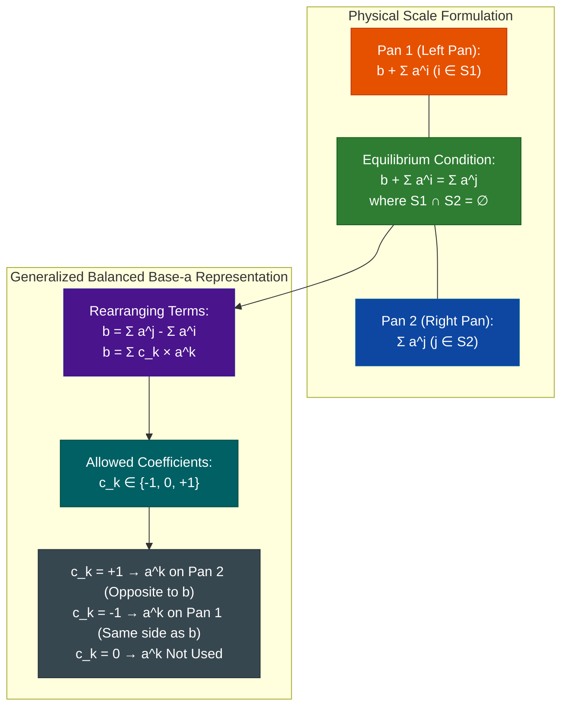
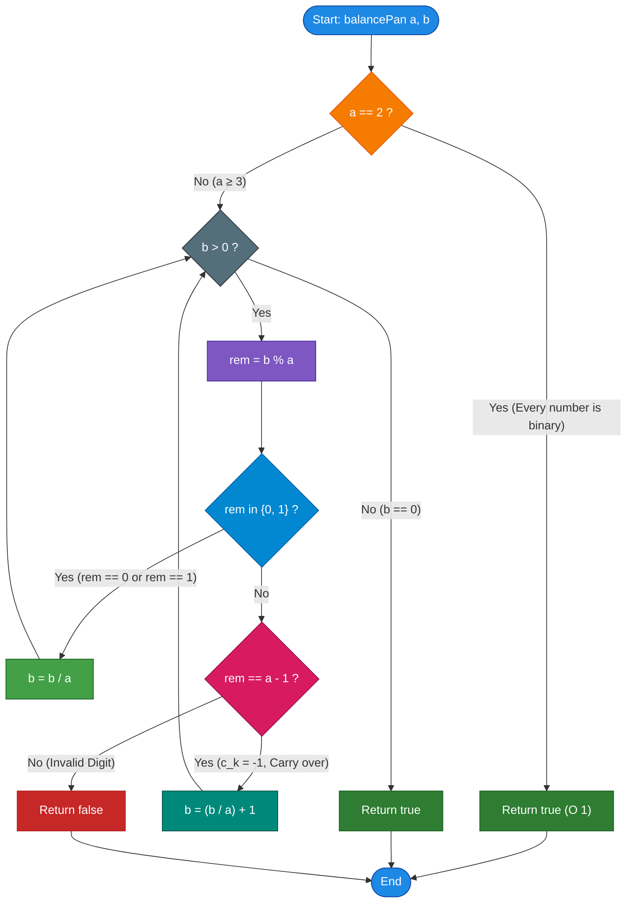

# GeeksforGeeks Problem of the Day: Balancing with Distinct Powers

- **Problem Link:** [GeeksforGeeks - Balancing with Distinct Powers](https://www.geeksforgeeks.org/problems/balancing-pan5038/1)
- **Difficulty:** Easy
- **Topic Tags:** Mathematics, Number Theory, Base Conversion, Balanced Ternary, Greedy, Bit Manipulation
- **Target Audience:** POTD Solvers, Computer Science Students, Competitive Programmers, Technical Interview Preparation (FAANG / Tier-1 Tech)

---

## 1. Problem Statement

Given a simple weighing scale with two pans, a target weight $b$, and an infinite set of weights where each available weight is a distinct power of $a$ ($a^0, a^1, a^2, a^3, \dots$):

Determine whether the scale can be perfectly balanced such that:
$$b + (\text{sum of some powers of } a) = (\text{sum of some other powers of } a)$$

### Important Note:
Exactly **one** weight is available for each power of $a$. This implies that each power $a^k$ ($k \ge 0$) can be used **at most once** across both pans (either on Pan 1, on Pan 2, or omitted entirely).

Return `true` if the scale can be balanced, otherwise return `false`.

---

## 2. Examples & Explanations

### Example 1
- **Input:** `a = 4`, `b = 11`
- **Output:** `true`
- **Explanation:**
  We can place weights $4^1 = 4$ and $4^0 = 1$ on the same pan as $b = 11$, and place $4^2 = 16$ on the opposite pan:
  $$11 + 4^1 + 4^0 = 16 \implies 11 + 4 + 1 = 16$$
  Both pans have total weight $16$. Hence, the scale is balanced.

```text
       Pan 1 (Left)                     Pan 2 (Right)
  +--------------------+             +--------------------+
  | Target Weight: 11  |             | Weight: 4^2 = 16   |
  | Weight: 4^1 = 4    |             |                    |
  | Weight: 4^0 = 1    |             |                    |
  +--------------------+             +--------------------+
  Total = 11 + 4 + 1 = 16            Total = 16
                \                           /
                 \                         /
                  =======[ BALANCE ]=======
```

---

### Example 2
- **Input:** `a = 3`, `b = 5`
- **Output:** `true`
- **Explanation:**
  Place $3^1 = 3$ and $3^0 = 1$ on Pan 1 along with $b = 5$, and place $3^2 = 9$ on Pan 2:
  $$5 + 3^1 + 3^0 = 9 \implies 5 + 3 + 1 = 9$$
  Both sides equal $9$. The scale is balanced.

```text
       Pan 1 (Left)                     Pan 2 (Right)
  +--------------------+             +--------------------+
  | Target Weight: 5   |             | Weight: 3^2 = 9    |
  | Weight: 3^1 = 3    |             |                    |
  | Weight: 3^0 = 1    |             |                    |
  +--------------------+             +--------------------+
   Total = 5 + 3 + 1 = 9             Total = 9
                \                           /
                 \                         /
                  =======[ BALANCE ]=======
```

---

### Example 3
- **Input:** `a = 5`, `b = 3`
- **Output:** `false`
- **Explanation:**
  Available powers of $5$ are $\{1, 5, 25, 125, \dots\}$.
  - If we place weight $1$ on Pan 1: $3 + 1 = 4 \ne 5$.
  - If we place weight $1$ on Pan 2: $3 \ne 1 + 5$ and $3 + 5 \ne 1$.
  - No combination of distinct powers of $5$ can balance $3$. Hence, output is `false`.

---

## 3. Constraints

- $2 \le a \le 10^9$
- $1 \le b \le 10^9$
- **Expected Time Complexity:** $\mathcal{O}(\log_a b)$
- **Expected Auxiliary Space:** $\mathcal{O}(1)$

---

## 4. Visual Architecture & Mathematical Foundation



### The Generalized Balanced Base-$a$ System

In standard positional number systems with base $a$, any integer is uniquely represented using digits from the set $\{0, 1, 2, \dots, a-1\}$.

However, on a two-pan balance scale, weights can be placed on **either pan**:
- Placing weight $a^k$ on the **opposite pan** adds $+a^k$ to the balance ($c_k = +1$).
- Placing weight $a^k$ on the **same pan** as $b$ acts as subtracting $-a^k$ ($c_k = -1$).
- Omitting weight $a^k$ contributes $0$ ($c_k = 0$).

Therefore, the problem reduces to:
$$\mathbf{b = \sum_{k=0}^{K} c_k \cdot a^k, \quad \text{where } c_k \in \{-1, 0, 1\}}$$

This is the exact generalization of the classic **Balanced Ternary** ($a = 3$) system to any arbitrary base $a \ge 2$.

---

### The Modular Reduction Invariant

Consider $b$ modulo $a$:
$$b = c_0 \cdot a^0 + c_1 \cdot a^1 + c_2 \cdot a^2 + \dots = c_0 + a(c_1 + c_2 a + \dots)$$

Taking modulo $a$ on both sides:
$$b \equiv c_0 \pmod a$$

Since the coefficient $c_0$ can only be chosen from $\{-1, 0, +1\}$:

| Remainder $r = b \pmod a$ | Meaning | Choice of $c_0$ | New Reduced Value $b_{\text{next}}$ |
| :--- | :--- | :---: | :--- |
| **$r = 0$** | No unit weight needed | $c_0 = 0$ | $b \leftarrow \frac{b}{a}$ |
| **$r = 1$** | Put $a^0$ on Pan 2 | $c_0 = +1$ | $b \leftarrow \frac{b - 1}{a} = \lfloor \frac{b}{a} \rfloor$ |
| **$r = a - 1$** | Put $a^0$ on Pan 1 (equivalent to $-1 \pmod a$) | $c_0 = -1$ | $b \leftarrow \frac{b - (-1)}{a} = \frac{b + 1}{a} = \lfloor \frac{b}{a} \rfloor + 1$ |
| **Any other remainder** | Impossible to satisfy with $\{-1, 0, 1\}$ | **None** | **Return `false` immediately** |

> **Key Takeaway:** If at any stage $b \pmod a \notin \{0, 1, a-1\}$, higher powers of $a$ (all multiples of $a$) can never fix the lower order remainder. The scale cannot be balanced!

---

## 5. Step-by-Step Simulation & Trace Table

### Trace 1: $a = 4, b = 11$ (Output: `true`)
Target $b = 11$, Base $a = 4$.

| Step $k$ | Current $b$ | $r = b \pmod 4$ | Condition Matched | $c_k$ | Pan Placement | Next $b$ Calculation | Next $b$ |
| :---: | :---: | :---: | :---: | :---: | :---: | :---: | :---: |
| **0** | $11$ | $3$ ($= a-1$) | $r == a-1$ | $-1$ | $4^0 = 1$ on Pan 1 | $(11 + 1) / 4 = 12 / 4$ | $3$ |
| **1** | $3$ | $3$ ($= a-1$) | $r == a-1$ | $-1$ | $4^1 = 4$ on Pan 1 | $(3 + 1) / 4 = 4 / 4$ | $1$ |
| **2** | $1$ | $1$ | $r == 1$ | $+1$ | $4^2 = 16$ on Pan 2 | $(1 - 1) / 4 = 0 / 4$ | $0$ |

- **Termination:** $b = 0$.
- **Result:** `true`.
- **Equation:** $11 + 4^1 + 4^0 = 4^2 \iff 11 + 4 + 1 = 16$.

---

### Trace 2: $a = 3, b = 5$ (Output: `true`)
Target $b = 5$, Base $a = 3$.

| Step $k$ | Current $b$ | $r = b \pmod 3$ | Condition Matched | $c_k$ | Pan Placement | Next $b$ Calculation | Next $b$ |
| :---: | :---: | :---: | :---: | :---: | :---: | :---: | :---: |
| **0** | $5$ | $2$ ($= a-1$) | $r == a-1$ | $-1$ | $3^0 = 1$ on Pan 1 | $(5 + 1) / 3 = 6 / 3$ | $2$ |
| **1** | $2$ | $2$ ($= a-1$) | $r == a-1$ | $-1$ | $3^1 = 3$ on Pan 1 | $(2 + 1) / 3 = 3 / 3$ | $1$ |
| **2** | $1$ | $1$ | $r == 1$ | $+1$ | $3^2 = 9$ on Pan 2 | $(1 - 1) / 3 = 0 / 3$ | $0$ |

- **Termination:** $b = 0$.
- **Result:** `true`.
- **Equation:** $5 + 3^1 + 3^0 = 3^2 \iff 5 + 3 + 1 = 9$.

---

### Trace 3: $a = 5, b = 3$ (Output: `false`)
Target $b = 3$, Base $a = 5$.

| Step $k$ | Current $b$ | $r = b \pmod 5$ | Condition Matched | Decision |
| :---: | :---: | :---: | :---: | :---: |
| **0** | $3$ | $3$ | $3 \notin \{0, 1, 4\}$ | **Fail: Cannot form remainder 3 with $c_0 \in \{-1, 0, 1\}$.** |

- **Result:** `false`.

---

### Trace 4: Base $a = 2$, Any Target $b$ (Always `true`)
For base $a = 2$:
- Remainders modulo $2$ can only be $0$ or $1$.
- Any non-negative integer $b$ has a unique standard binary representation:
  $$b = \sum_{k=0}^K d_k \cdot 2^k, \quad d_k \in \{0, 1\}$$
- All coefficients are non-negative ($c_k \in \{0, 1\}$), meaning **no weights are ever needed on Pan 1**. Every power needed is placed entirely on Pan 2.
- Therefore, for $a = 2$, the scale can **always** be balanced for any integer $b \ge 1$!

---

## 6. Algorithm Flowchart



---

## 7. From Naive to Pro: Algorithmic Progression

### Method 1: Naive (Recursive Backtracking / Ternary Subset Search)
- **Concept:** Generate all powers of $a$ up to $a^K$ where $a^K \ge b$. For each power $a^k$, explore three recursive branches:
  1. Place $a^k$ on Pan 1 (Subtract $a^k$).
  2. Place $a^k$ on Pan 2 (Add $a^k$).
  3. Do not use $a^k$ (Skip).
- **Why it is suboptimal:**
  - Branching factor of $3$ yields time complexity $\mathcal{O}(3^K)$ where $K \approx \log_a b$.
  - Incurs heavy recursion call overhead and risks Time Limit Exceeded (TLE) and Stack Overflow.
- **Pseudocode:**
```text
function canBalance_Naive(a, b, power):
    if b == 0:
        return true
    if power > b * a:
        return false
        
    // Option 1: Do not use power
    if canBalance_Naive(a, b, power * a):
        return true
    // Option 2: Place on Pan 2 (Subtract from remaining target)
    if canBalance_Naive(a, b - power, power * a):
        return true
    // Option 3: Place on Pan 1 (Add to remaining target)
    if canBalance_Naive(a, b + power, power * a):
        return true
        
    return false
```

---

### Method 2: Better (Base-$a$ Digit Extraction into Array + Carry Resolution)
- **Concept:** Convert $b$ into standard base-$a$ representation storing digits $d_0, d_1, \dots, d_K$ in a dynamic array.
  Then traverse from lowest to highest digit:
  - If $d_k \in \{0, 1\}$: valid, proceed.
  - If $d_k == a - 1$ or $d_k == a$: turn into $-1$ or $0$, and carry $+1$ to $d_{k+1}$.
  - Otherwise, return `false`.
- **Why it is suboptimal:**
  - Requires dynamic array allocation of size $\mathcal{O}(\log_a b)$.
  - Requires two passes: one to extract digits and another to ripple carries.
- **Pseudocode:**
```text
function canBalance_Better(a, b):
    digits = []
    while b > 0:
        digits.append(b % a)
        b = b / a
        
    carry = 0
    for i from 0 to length(digits) - 1:
        val = digits[i] + carry
        carry = 0
        if val == a:
            carry = 1
            digits[i] = 0
        else if val == a - 1:
            carry = 1
            digits[i] = -1
        else if val > 1:
            return false
    if carry == 1:
        return true
    return true
```

---

### Method 3: Pro Approach (In-Place Greedy Modulo Reduction)
- **The Core Strategy:**
  - Evaluate digits on the fly using modulo arithmetic in a single while-loop.
  - If $r \in \{0, 1\}$, simply divide $b$ by $a$.
  - If $r == a - 1$, adjust for carry by setting $b = \lfloor b / a \rfloor + 1$.
  - Any other remainder immediately triggers `false`.
  - Constant $\mathcal{O}(1)$ auxiliary memory, maximum $\approx 30$ loop iterations for $b \le 10^9$.
- **Pseudocode:**
```text
function balancePan_Optimal(a, b):
    if a == 2:
        return true
        
    while b > 0:
        rem = b % a
        if rem == 0 or rem == 1:
            b = b / a
        else if rem == a - 1:
            b = (b / a) + 1
        else:
            return false
            
    return true
```

---

## 8. Complexity Comparison Table

| Metric | Method 1: Naive (Backtracking) | Method 2: Better (Digit Array + Carry) | Method 3: Pro (In-Place Modulo Reduction) |
| :--- | :--- | :--- | :--- |
| **Time Complexity** | $\mathcal{O}(3^{\log_a b})$ (Exponential) | $\mathcal{O}(\log_a b)$ | $\mathbf{\mathcal{O}(\log_a b)}$ (Strictly minimal operations) |
| **Auxiliary Space** | $\mathcal{O}(\log_a b)$ (Recursion stack) | $\mathcal{O}(\log_a b)$ (Digit array) | $\mathbf{\mathcal{O}(1)}$ (Zero heap/stack allocations) |
| **Number of Passes** | Exponential tree traversal | 2 Passes (Extract + Ripple) | **1 Single Forward Pass** |
| **Max Operations ($b = 10^9$)**| $> 10^7$ (TLE risk) | $\approx 60$ operations | $\mathbf{\le 30}$ **operations** |
| **Interview Verdict** | Brute force; fails time limits | Acceptable, but wastes memory | **Gold Standard (FAANG / Competitive Ready)** |

---

## 9. Comprehensive Corner Cases Handled

1. **Base $a = 2$:**
   - Any integer $b$ has a valid binary representation using only $\{0, 1\}$ coefficients on Pan 2. Handled instantly via `if (a == 2) return true;` in $\mathcal{O}(1)$.
2. **Target Equal to Base ($b = a$):**
   - $b \pmod a = 0 \implies b \leftarrow 1$, then $1 \pmod a = 1 \implies b \leftarrow 0$. Returns `true` ($a = a^1$).
3. **Target Equal to Base Minus One ($b = a - 1$):**
   - $b \pmod a = a - 1 \implies b \leftarrow 1$, then $1 \pmod a = 1 \implies b \leftarrow 0$. Returns `true` ($b + a^0 = a^1$).
4. **Target Smaller Than Base ($b < a - 1$ and $b > 1$):**
   - e.g., $a = 5, b = 3 \implies 3 \pmod 5 = 3 \notin \{0, 1, 4\}$. Correctly returns `false`.
5. **Target Equal to One ($b = 1$):**
   - $1 \pmod a = 1 \implies b \leftarrow 0$. Returns `true` ($1 = a^0$).
6. **Large Constraints ($a, b = 10^9$):**
   - $b$ fits comfortably within standard signed 32-bit integer limits (up to $2.14 \times 10^9$).
   - In $(b / a) + 1$, division happens first, preventing integer overflow.

---

## 10. Complete Multi-Language Implementations

### Java (21)

```java
/**
 * GeeksforGeeks POTD: Balancing with Distinct Powers
 * Language: Java 21
 */
class Solution {
    /**
     * Determines whether target weight b can be balanced on a two-pan scale
     * using distinct powers of a.
     *
     * @param a The base of the power weights (2 <= a <= 10^9)
     * @param b The target weight (1 <= b <= 10^9)
     * @return true if the scale can be balanced, false otherwise
     */
    public boolean balancePan(int a, int b) {
        // Base case: In base 2, every positive integer has a unique
        // binary representation using only weights on Pan 2.
        if (a == 2) {
            return true;
        }

        // Iteratively extract digits of b in generalized balanced base-a
        while (b > 0) {
            int rem = b % a;

            if (rem == 0 || rem == 1) {
                // rem == 0 -> coefficient is 0 (weight not used)
                // rem == 1 -> coefficient is +1 (weight placed on Pan 2)
                b /= a;
            } else if (rem == a - 1) {
                // rem == a - 1 -> coefficient is -1 (weight placed on Pan 1)
                // Incur a carry of +1 to the next power
                b = (b / a) + 1;
            } else {
                // Any other remainder cannot be resolved with coefficients {-1, 0, 1}
                return false;
            }
        }

        return true;
    }
}
```

---

### Python3

```python
"""
GeeksforGeeks POTD: Balancing with Distinct Powers
Language: Python3
"""
class Solution:
    def balancePan(self, a: int, b: int) -> bool:
        """
        Determines whether target weight b can be balanced on a two-pan scale
        using distinct powers of a.
        
        :param a: Base integer (2 <= a <= 10^9)
        :param b: Target weight integer (1 <= b <= 10^9)
        :return: bool indicating if the scale can be balanced
        """
        # In base 2, every integer can be represented in standard binary
        # without placing any weights on the target pan.
        if a == 2:
            return True

        # Process each positional digit in base-a
        while b > 0:
            rem = b % a
            if rem == 0 or rem == 1:
                # Digit is 0 (omitted) or +1 (placed on Pan 2)
                b //= a
            elif rem == a - 1:
                # Digit is -1 (placed on Pan 1), contributes carry +1
                b = (b // a) + 1
            else:
                # Remainder cannot be balanced using coefficients in {-1, 0, 1}
                return False

        return True
```

---

### C++ (17)

```cpp
/**
 * GeeksforGeeks POTD: Balancing with Distinct Powers
 * Language: C++ (17)
 */
class Solution {
  public:
    /**
     * Determines whether target weight b can be balanced on a two-pan scale
     * using distinct powers of a.
     *
     * @param a Base of the weights (2 <= a <= 10^9)
     * @param b Target weight (1 <= b <= 10^9)
     * @return true if the scale can be balanced, false otherwise
     */
    bool balancePan(int a, int b) {
        // In base 2, all integers have a standard binary representation
        if (a == 2) {
            return true;
        }

        // Iteratively evaluate each digit in balanced base-a
        while (b > 0) {
            int rem = b % a;

            if (rem == 0 || rem == 1) {
                // Digit is 0 (not used) or +1 (placed on opposite pan)
                b /= a;
            } else if (rem == a - 1) {
                // Digit is -1 (placed on same pan as b), propagate carry +1
                b = (b / a) + 1;
            } else {
                // Impossible digit: remainder cannot be eliminated
                return false;
            }
        }

        return true;
    }
};
```

---

### C#

```csharp
/**
 * GeeksforGeeks POTD: Balancing with Distinct Powers
 * Language: C#
 */
public class Solution {
    /**
     * Determines whether target weight b can be balanced on a two-pan scale
     * using distinct powers of a.
     *
     * @param a Base integer (2 <= a <= 10^9)
     * @param b Target weight (1 <= b <= 10^9)
     * @return true if balanceable, false otherwise
     */
    public bool balancePan(int a, int b) {
        // Base 2 is always representable using binary coefficients {0, 1}
        if (a == 2) {
            return true;
        }

        // Iterate through powers of base a
        while (b > 0) {
            int rem = b % a;

            if (rem == 0 || rem == 1) {
                // Coefficient 0 or +1
                b /= a;
            } else if (rem == a - 1) {
                // Coefficient -1 with carry +1
                b = (b / a) + 1;
            } else {
                // Invalid remainder
                return false;
            }
        }

        return true;
    }
}
```

---

### Javascript (Node v22)

```javascript
/**
 * GeeksforGeeks POTD: Balancing with Distinct Powers
 * Language: Javascript (Node v22)
 */

/**
 * @param {number} a
 * @param {number} b
 * @return {boolean}
 */
class Solution {
    /**
     * Determines whether target weight b can be balanced on a two-pan scale
     * using distinct powers of a.
     *
     * @param {number} a - Base of weights (2 <= a <= 10^9)
     * @param {number} b - Target weight (1 <= b <= 10^9)
     * @return {boolean}
     */
    balancePan(a, b) {
        // Base 2 can represent any positive integer in standard binary
        if (a === 2) {
            return true;
        }

        // Extract and validate digits in generalized balanced base-a
        while (b > 0) {
            const rem = b % a;

            if (rem === 0 || rem === 1) {
                // Digit is 0 (omitted) or +1 (placed on Pan 2)
                b = Math.floor(b / a);
            } else if (rem === a - 1) {
                // Digit is -1 (placed on Pan 1), carry over +1
                b = Math.floor(b / a) + 1;
            } else {
                // Remainder cannot be satisfied
                return false;
            }
        }

        return true;
    }
}
```
