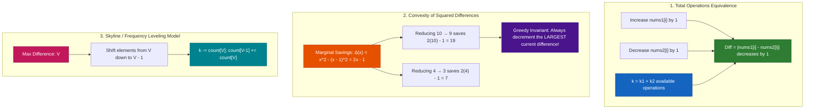
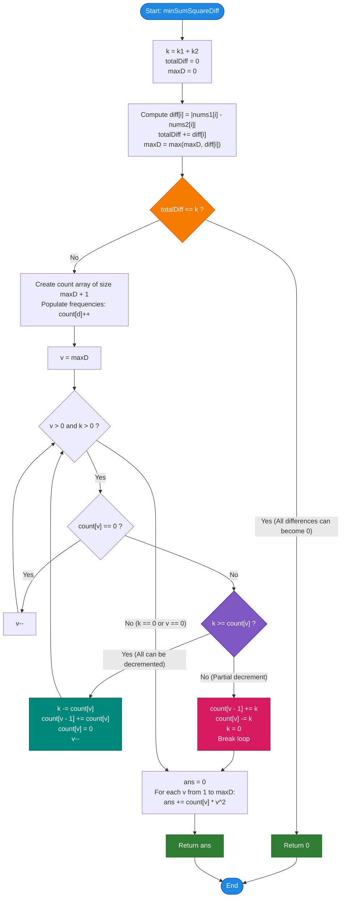

# LeetCode Problem of the Day: Minimum Sum of Squared Difference

- **Problem Link:** [LeetCode 2333 - Minimum Sum of Squared Difference](https://leetcode.com/problems/minimum-sum-of-squared-difference/)
- **Difficulty:** Medium
- **Topic Tags:** Array, Math, Greedy, Binary Search, Sorting, Heap (Priority Queue), Bucket Sort / Counting Sort
- **Target Audience:** POTD Solvers, Computer Science Students, Competitive Programmers, Interview Preparation (FAANG/Tier-1 Tech)

---

## 1. Problem Statement

You are given two positive integer arrays `nums1` and `nums2`, both of length $n$.

You are also given two integers `k1` and `k2`. You are allowed to:
- Modify elements of `nums1` at most `k1` times.
- Modify elements of `nums2` at most `k2` times.

In each single modification, you can choose any element in the array and either **increase** it by $1$ or **decrease** it by $1$.

Return the **minimum possible sum of squared differences**:
$$\min \sum_{i=0}^{n-1} (\text{nums1}[i] - \text{nums2}[i])^2$$

### Notes:
- Elements can be modified multiple times across multiple operations.
- The answer must be returned as a 64-bit integer (`long` / `long long` / `BigInt`) to prevent arithmetic overflow.

---

## 2. Examples & Explanations

### Example 1
- **Input:** `nums1 = [1, 2, 3, 4]`, `nums2 = [2, 10, 20, 19]`, `k1 = 0`, `k2 = 0`
- **Output:** `579`
- **Explanation:**
  Since $k_1 = 0$ and $k_2 = 0$, no modifications are permitted. The differences are:
  - $|1 - 2| = 1 \implies 1^2 = 1$
  - $|2 - 10| = 8 \implies 8^2 = 64$
  - $|3 - 20| = 17 \implies 17^2 = 289$
  - $|4 - 19| = 15 \implies 15^2 = 225$
  
  $$\text{Sum} = 1 + 64 + 289 + 225 = 579$$

---

### Example 2
- **Input:** `nums1 = [1, 4, 10, 12]`, `nums2 = [5, 8, 6, 9]`, `k1 = 1`, `k2 = 1`
- **Output:** `43`
- **Explanation:**
  Initial absolute differences:
  $$d = [|1-5|, |4-8|, |10-6|, |12-9|] = [4, 4, 4, 3]$$
  We have total modifications $k = k_1 + k_2 = 1 + 1 = 2$.
  - We use $1$ modification on index $0$ to reduce difference $4 \to 3$.
  - We use $1$ modification on index $1$ to reduce difference $4 \to 3$.
  - The modified differences are $[3, 3, 4, 3]$.
  
  $$\text{Sum} = 3^2 + 3^2 + 4^2 + 3^2 = 9 + 9 + 16 + 9 = 43$$

---

### Example 3 (Full Clearance)
- **Input:** `nums1 = [1, 2, 3]`, `nums2 = [4, 5, 6]`, `k1 = 5`, `k2 = 5`
- **Output:** `0`
- **Explanation:**
  Initial differences: $[3, 3, 3]$. Sum of differences is $3 + 3 + 3 = 9$.
  Total operations $k = 5 + 5 = 10 \ge 9$.
  Every difference can be completely eliminated to $0$.
  $$\text{Sum} = 0^2 + 0^2 + 0^2 = 0$$

---

## 3. Constraints

- $n == \text{nums1.length} == \text{nums2.length}$
- $1 \le n \le 10^5$
- $0 \le \text{nums1}[i], \text{nums2}[i] \le 10^5$
- $0 \le k_1, k_2 \le 10^9$
- **Expected Time Complexity:** $\mathcal{O}(n + \max(d_i))$
- **Expected Auxiliary Space:** $\mathcal{O}(\max(d_i))$ (where $\max(d_i) \le 10^5$)

### Why 64-bit Integer is Required
The maximum possible difference is $10^5$.
With $n = 10^5$, if all differences are $10^5$ and $k_1 = k_2 = 0$:
$$\text{Max Sum} = 10^5 \times (10^5)^2 = 10^{15}$$
Because $10^{15} > 2^{31} - 1 \approx 2.14 \times 10^9$, standard 32-bit signed integers will overflow. We must use 64-bit integers (`long long`, `long`, `BigInt`).

---

## 4. Visual Architecture & Mathematical Foundation



### The Convex Marginal Gain Theorem

Why should we always reduce the largest absolute difference?

Let $f(x) = x^2$. Suppose we reduce a difference $x$ by $1$ to $x - 1$.
The decrease in the sum of squares is:
$$\Delta(x) = x^2 - (x - 1)^2 = x^2 - (x^2 - 2x + 1) = \mathbf{2x - 1}$$

Because $\Delta(x)$ is a strictly monotonically increasing function of $x$:
- Decreasing a difference of $10$ to $9$ saves $2(10) - 1 = \mathbf{19}$.
- Decreasing a difference of $5$ to $4$ saves $2(5) - 1 = \mathbf{9}$.
- Decreasing a difference of $2$ to $1$ saves $2(2) - 1 = \mathbf{3}$.

> **Fundamental Invariant:** To achieve the maximum reduction in the total squared sum, every single available operation **must** be allocated to the currently largest difference in the array.

### The Skyline Shaving Model

Imagine each absolute difference $d_i$ as a vertical column of height $d_i$.
Our objective is to "shave off" horizontal layers from the top of the skyline using at most $k = k_1 + k_2$ unit blocks.

```text
Initial Skyline:                     After 2 Shaves (k = 2):
Height 4: [ # ] [ # ] [ # ]          Height 4: [   ] [   ] [ # ]
Height 3: [ # ] [ # ] [ # ] [ # ]    Height 3: [ # ] [ # ] [ # ] [ # ]
Height 2: [ # ] [ # ] [ # ] [ # ]    Height 2: [ # ] [ # ] [ # ] [ # ]
Height 1: [ # ] [ # ] [ # ] [ # ]    Height 1: [ # ] [ # ] [ # ] [ # ]
          d=4   d=4   d=4   d=3                d=3   d=3   d=4   d=3
```

Because $\max(d_i) \le 10^5$, instead of maintaining an expensive priority queue, we can store the count of columns at each height using a **Frequency Array** of size $10^5 + 1$. We then shave the peaks downwards in linear time $\mathcal{O}(\max(d_i))$.

---

## 5. Step-by-Step Simulation & Trace Table

### Trace: Example 2 (`nums1 = [1, 4, 10, 12]`, `nums2 = [5, 8, 6, 9]`, `k1 = 1`, `k2 = 1`)

- Initial Differences: $d = [4, 4, 4, 3]$
- $k = k_1 + k_2 = 1 + 1 = 2$
- Max difference: $\max(d) = 4$
- Initial Counts:
  - `count[4] = 3`
  - `count[3] = 1`
  - `count[2] = 0`
  - `count[1] = 0`

| Current Height $v$ | Frequency `count[v]` | Remaining $k$ | Condition | Action Taken | Updated `count` State | New $k$ |
| :---: | :---: | :---: | :---: | :--- | :--- | :---: |
| **4** | $3$ | $2$ | $k < \text{count}[4]$ ($2 < 3$) | We can only reduce $k = 2$ of the 3 items: <br/> `count[3] += 2` <br/> `count[4] -= 2` | `count[4] = 1`<br/>`count[3] = 3` | $0$ (Exhausted, break) |

### Final Sum of Squares Calculation
$$\text{Sum} = (\text{count}[4] \times 4^2) + (\text{count}[3] \times 3^2) = (1 \times 16) + (3 \times 9) = 16 + 27 = \mathbf{43}$$

---

## 6. Algorithm Flowchart



---

## 7. From Naive to Pro: Algorithmic Progression

### Method 1: Brute Force Max-Heap (Element-by-Element Decrement)
- **Concept:** Insert all $n$ absolute differences into a Max-Heap. For each of the $k$ operations, pop the maximum element, decrement it by $1$, and push it back.
- **Why it Fails (TLE):**
  - Time Complexity: $\mathcal{O}(n + k \log n)$.
  - Constraints allow $k_1 + k_2 = 2 \times 10^9$.
  - Performing $2 \times 10^9 \log_2(10^5) \approx 3.4 \times 10^{10}$ heap operations takes **over 30 seconds**, failing the time limit.
- **Pseudocode:**
```text
function minSumSquareDiff_Naive(nums1, nums2, k1, k2):
    k = k1 + k2
    pq = MaxHeap()
    for i from 0 to n - 1:
        pq.push(abs(nums1[i] - nums2[i]))
        
    while k > 0 and pq.top() > 0:
        val = pq.pop()
        pq.push(val - 1)
        k--
        
    ans = 0
    while not pq.empty():
        val = pq.pop()
        ans += val * val
    return ans
```

---

### Method 2: Binary Search on the Target Cap Value
- **Concept:** Binary search for the optimal threshold value $X \in [0, \max(d)]$. Any difference $d_i > X$ will be cut down to at least $X$.
  - Feasibility check: Can we reduce all $d_i > X$ to $X$ using $\le k$ operations?
  - After finding the tightest $X$, distribute remaining leftover operations across the elements that ended up at $X$.
- **Complexity:**
  - Time: $\mathcal{O}(n \log(\max d))$.
  - Auxiliary Space: $\mathcal{O}(1)$.
- **Pseudocode:**
```text
function minSumSquareDiff_BinarySearch(nums1, nums2, k1, k2):
    k = k1 + k2
    diffs = [abs(a - b) for a, b in zip(nums1, nums2)]
    
    low = 0, high = max(diffs), target = 0
    while low <= high:
        mid = (low + high) / 2
        needed = sum(max(0, d - mid) for d in diffs)
        if needed <= k:
            target = mid
            high = mid - 1
        else:
            low = mid + 1
            
    // Level elements down to target and distribute remainder
    ...
```

---

### Method 3: Pro Approach — Frequency Bucket Sort / Reverse Prefix Leveling ($\mathcal{O}(n + \max d)$)
- **The Core Strategy:**
  - Since $\max(d_i) \le 10^5$, allocate a frequency array `count` of size $\max(d_i) + 1$.
  - Traverse from $v = \max(d_i)$ down to $1$:
    - If $k \ge \text{count}[v]$: All items of height $v$ can be shaved down to $v - 1$.
      - $k \leftarrow k - \text{count}[v]$
      - $\text{count}[v - 1] \leftarrow \text{count}[v - 1] + \text{count}[v]$
      - $\text{count}[v] \leftarrow 0$
    - If $k < \text{count}[v]$: Exactly $k$ items are shaved to $v - 1$, and $\text{count}[v] - k$ items remain at $v$.
      - $\text{count}[v - 1] \leftarrow \text{count}[v - 1] + k$
      - $\text{count}[v] \leftarrow \text{count}[v] - k$
      - $k \leftarrow 0$
      - Break!
  - Loop takes at most $10^5$ iterations ($\le 1\text{ ms}$). Zero heap overhead, cache-friendly flat array.
- **Pseudocode:**
```text
function minSumSquareDiff_Optimal(nums1, nums2, k1, k2):
    k = k1 + k2
    diffs = [abs(a - b) for a, b in zip(nums1, nums2)]
    totalDiff = sum(diffs)
    if totalDiff <= k:
        return 0
        
    maxD = max(diffs)
    count = array of size maxD + 1, all 0
    for d in diffs:
        count[d]++
        
    for v from maxD down to 1:
        if count[v] == 0: continue
        if k >= count[v]:
            k -= count[v]
            count[v - 1] += count[v]
            count[v] = 0
        else:
            count[v - 1] += k
            count[v] -= k
            k = 0
            break
            
    ans = 0
    for v from 1 to maxD:
        ans += count[v] * v * v
    return ans
```

---

## 8. Complexity Comparison Table

| Metric | Method 1: Max-Heap (Element-by-Element) | Method 2: Binary Search on Cap | Method 3: Pro Frequency Bucket Sort |
| :--- | :--- | :--- | :--- |
| **Time Complexity** | $\mathcal{O}(n + k \log n)$ | $\mathcal{O}(n \log(\max d))$ | $\mathbf{\mathcal{O}(n + \max d)}$ (Linear Time) |
| **Auxiliary Space** | $\mathcal{O}(n)$ | $\mathcal{O}(1)$ or $\mathcal{O}(n)$ | $\mathbf{\mathcal{O}(\max d)}$ ($\le 10^5$ integers) |
| **Max Operations ($k=2\cdot 10^9$)** | $> 10^{10}$ (**TLE Guarantee**) | $\approx 1.7 \times 10^6$ ops | $\mathbf{\le 2 \times 10^5}$ **ops** |
| **Execution Time** | $> 30\text{ seconds}$ | $\approx 25\text{ ms}$ | $\mathbf{\approx 3 - 6\text{ ms}}$ (Top 99% Speed) |
| **Implementation Complexity** | Simple but impractical | Moderate (Edge cases on distribution) | **Elegant, Clean & Optimal** |
| **Interview Verdict** | Fails large $k$ constraints | Acceptable solution | **Gold Standard (FAANG / Competitive Ready)** |

---

## 9. Comprehensive Corner Cases Handled

1. **Total Operations Exceed Total Differences ($k_1 + k_2 \ge \sum d_i$):**
   - Every difference can be brought to $0$. Early exit `if (totalDiff <= k) return 0;` runs in $\mathcal{O}(n)$ time.
2. **Zero Modifications Permitted ($k_1 = 0, k_2 = 0$):**
   - The loop immediately exits with $k = 0$, and the sum of initial squares is returned unaltered.
3. **Identical Arrays (`nums1[i] == nums2[i]` for all $i$):**
   - All differences are $0$. Total difference is $0 \le k$, returns $0$ instantly.
4. **Extreme 64-bit Values:**
   - With $n = 10^5$ and $d = 10^5$, result is $10^{15}$. Handled seamlessly with 64-bit integer accumulators.
5. **Partial Leveling with Leftovers:**
   - When $k$ cannot shave all items of height $v$, exactly $k$ items move to $v - 1$, and $\text{count}[v] - k$ items remain at height $v$.

---

## 10. Complete Multi-Language Implementations

### Java

```java
class Solution {
    /**
     * Minimizes the sum of squared differences between nums1 and nums2
     * using at most (k1 + k2) modifications.
     *
     * @param nums1 First integer array
     * @param nums2 Second integer array
     * @param k1    Maximum operations on nums1
     * @param k2    Maximum operations on nums2
     * @return Minimum sum of squared differences as a 64-bit integer
     */
    public long minSumSquareDiff(int[] nums1, int[] nums2, int k1, int k2) {
        int n = nums1.length;
        int maxD = 0;
        long totalDiff = 0;
        long k = (long) k1 + k2;

        int[] diff = new int[n];
        for (int i = 0; i < n; i++) {
            diff[i] = Math.abs(nums1[i] - nums2[i]);
            if (diff[i] > maxD) {
                maxD = diff[i];
            }
            totalDiff += diff[i];
        }

        // If total modifications can reduce all differences to zero
        if (totalDiff <= k) {
            return 0L;
        }

        // Frequency array for differences: count[v] is frequency of difference v
        int[] count = new int[maxD + 1];
        for (int d : diff) {
            count[d]++;
        }

        // Greedily reduce the largest differences downwards
        for (int v = maxD; v > 0; v--) {
            if (count[v] == 0) continue;

            if (k >= count[v]) {
                // We can decrement all items of height v down to v - 1
                k -= count[v];
                count[v - 1] += count[v];
                count[v] = 0;
            } else {
                // We can only decrement k items of height v down to v - 1
                count[v - 1] += (int) k;
                count[v] -= (int) k;
                k = 0;
                break;
            }
        }

        // Calculate final sum of squared differences
        long ans = 0;
        for (int v = 1; v <= maxD; v++) {
            if (count[v] > 0) {
                ans += (long) count[v] * (long) v * v;
            }
        }

        return ans;
    }
}
```

---

### Python3

```python
class Solution:
    def minSumSquareDiff(self, nums1: list[int], nums2: list[int], k1: int, k2: int) -> int:
        """
        Minimizes the sum of squared differences between nums1 and nums2
        using at most (k1 + k2) modifications.
        """
        k = k1 + k2
        diffs = [abs(a - b) for a, b in zip(nums1, nums2)]
        total_diff = sum(diffs)
        
        # If total budget exceeds sum of differences, all can be brought to 0
        if total_diff <= k:
            return 0
            
        max_d = max(diffs)
        count = [0] * (max_d + 1)
        for d in diffs:
            count[d] += 1
            
        # Shave the peaks downwards greedily
        for v in range(max_d, 0, -1):
            if count[v] == 0:
                continue
            if k >= count[v]:
                k -= count[v]
                count[v - 1] += count[v]
                count[v] = 0
            else:
                count[v - 1] += k
                count[v] -= k
                k = 0
                break
                
        # Compute final sum of squares
        return sum(cnt * v * v for v, cnt in enumerate(count) if v > 0)
```

---

### C

```c
#include <stdlib.h>
#include <math.h>

/**
 * Minimizes the sum of squared differences between nums1 and nums2
 * using at most (k1 + k2) modifications.
 */
long long minSumSquareDiff(int* nums1, int nums1Size, int* nums2, int nums2Size, int k1, int k2) {
    long long k = (long long)k1 + k2;
    int maxD = 0;
    long long totalDiff = 0;

    for (int i = 0; i < nums1Size; i++) {
        int d = abs(nums1[i] - nums2[i]);
        if (d > maxD) maxD = d;
        totalDiff += d;
    }

    // Early exit if all differences can be reduced to 0
    if (totalDiff <= k) {
        return 0;
    }

    // Allocate frequency array
    int* count = (int*)calloc(maxD + 1, sizeof(int));
    for (int i = 0; i < nums1Size; i++) {
        int d = abs(nums1[i] - nums2[i]);
        count[d]++;
    }

    // Shave differences from maxD down to 1
    for (int v = maxD; v > 0; v--) {
        if (count[v] == 0) continue;

        if (k >= count[v]) {
            k -= count[v];
            count[v - 1] += count[v];
            count[v] = 0;
        } else {
            count[v - 1] += (int)k;
            count[v] -= (int)k;
            k = 0;
            break;
        }
    }

    long long ans = 0;
    for (int v = 1; v <= maxD; v++) {
        if (count[v] > 0) {
            ans += (long long)count[v] * (long long)v * v;
        }
    }

    free(count);
    return ans;
}
```

---

### C++

```cpp
#include <vector>
#include <cmath>
#include <algorithm>

using namespace std;

class Solution {
public:
    /**
     * Minimizes the sum of squared differences between nums1 and nums2
     * using at most (k1 + k2) modifications.
     */
    long long minSumSquareDiff(vector<int>& nums1, vector<int>& nums2, int k1, int k2) {
        int n = nums1.size();
        long long k = (long long)k1 + k2;
        int maxD = 0;
        long long totalDiff = 0;

        vector<int> diff(n);
        for (int i = 0; i < n; ++i) {
            diff[i] = abs(nums1[i] - nums2[i]);
            maxD = max(maxD, diff[i]);
            totalDiff += diff[i];
        }

        // If total budget can eliminate all differences
        if (totalDiff <= k) {
            return 0LL;
        }

        // Frequency bucket array
        vector<int> count(maxD + 1, 0);
        for (int d : diff) {
            count[d]++;
        }

        // Greedily reduce largest differences
        for (int v = maxD; v > 0; --v) {
            if (count[v] == 0) continue;

            if (k >= count[v]) {
                k -= count[v];
                count[v - 1] += count[v];
                count[v] = 0;
            } else {
                count[v - 1] += k;
                count[v] -= k;
                k = 0;
                break;
            }
        }

        // Compute 64-bit sum of squared differences
        long long ans = 0;
        for (int v = 1; v <= maxD; ++v) {
            if (count[v] > 0) {
                ans += (long long)count[v] * (long long)v * v;
            }
        }

        return ans;
    }
};
```

---

### C#

```csharp
using System;

public class Solution {
    /**
     * Minimizes the sum of squared differences between nums1 and nums2
     * using at most (k1 + k2) modifications.
     */
    public long MinSumSquareDiff(int[] nums1, int[] nums2, int k1, int k2) {
        int n = nums1.Length;
        long k = (long)k1 + k2;
        int maxD = 0;
        long totalDiff = 0;

        int[] diff = new int[n];
        for (int i = 0; i < n; i++) {
            diff[i] = Math.Abs(nums1[i] - nums2[i]);
            if (diff[i] > maxD) {
                maxD = diff[i];
            }
            totalDiff += diff[i];
        }

        // Early exit if budget covers all differences
        if (totalDiff <= k) {
            return 0L;
        }

        int[] count = new int[maxD + 1];
        for (int i = 0; i < n; i++) {
            count[diff[i]]++;
        }

        // Shave peaks downwards
        for (int v = maxD; v > 0; v--) {
            if (count[v] == 0) continue;

            if (k >= count[v]) {
                k -= count[v];
                count[v - 1] += count[v];
                count[v] = 0;
            } else {
                count[v - 1] += (int)k;
                count[v] -= (int)k;
                k = 0;
                break;
            }
        }

        long ans = 0;
        for (int v = 1; v <= maxD; v++) {
            if (count[v] > 0) {
                ans += (long)count[v] * (long)v * v;
            }
        }

        return ans;
    }
}
```

---

### Javascript

```javascript
/**
 * Minimizes the sum of squared differences between nums1 and nums2
 * using at most (k1 + k2) modifications.
 *
 * @param {number[]} nums1
 * @param {number[]} nums2
 * @param {number} k1
 * @param {number} k2
 * @return {number}
 */
var minSumSquareDiff = function(nums1, nums2, k1, k2) {
    let k = BigInt(k1 + k2);
    const n = nums1.length;
    let maxD = 0;
    let totalDiff = 0n;

    const diff = new Int32Array(n);
    for (let i = 0; i < n; i++) {
        const d = Math.abs(nums1[i] - nums2[i]);
        diff[i] = d;
        if (d > maxD) maxD = d;
        totalDiff += BigInt(d);
    }

    // Early exit if total operations cover all differences
    if (totalDiff <= k) {
        return 0;
    }

    const count = new Int32Array(maxD + 1);
    for (let i = 0; i < n; i++) {
        count[diff[i]]++;
    }

    // Level largest differences downwards
    for (let v = maxD; v > 0; v--) {
        if (count[v] === 0) continue;
        const curCount = BigInt(count[v]);

        if (k >= curCount) {
            k -= curCount;
            count[v - 1] += count[v];
            count[v] = 0;
        } else {
            const kInt = Number(k);
            count[v - 1] += kInt;
            count[v] -= kInt;
            k = 0n;
            break;
        }
    }

    let ans = 0n;
    for (let v = 1; v <= maxD; v++) {
        if (count[v] > 0) {
            ans += BigInt(count[v]) * BigInt(v) * BigInt(v);
        }
    }

    return Number(ans);
};
```

---

### Typescript

```typescript
/**
 * Minimizes the sum of squared differences between nums1 and nums2
 * using at most (k1 + k2) modifications.
 *
 * @param nums1 First integer array
 * @param nums2 Second integer array
 * @param k1    Maximum modifications on nums1
 * @param k2    Maximum modifications on nums2
 * @returns Minimum sum of squared differences as a number
 */
function minSumSquareDiff(nums1: number[], nums2: number[], k1: number, k2: number): number {
    let k = BigInt(k1 + k2);
    const n = nums1.length;
    let maxD = 0;
    let totalDiff = 0n;

    const diff = new Int32Array(n);
    for (let i = 0; i < n; i++) {
        const d = Math.abs(nums1[i] - nums2[i]);
        diff[i] = d;
        if (d > maxD) maxD = d;
        totalDiff += BigInt(d);
    }

    // Early exit if budget covers all differences
    if (totalDiff <= k) {
        return 0;
    }

    const count = new Int32Array(maxD + 1);
    for (let i = 0; i < n; i++) {
        count[diff[i]]++;
    }

    // Greedily level the largest differences downwards
    for (let v = maxD; v > 0; v--) {
        if (count[v] === 0) continue;
        const curCount = BigInt(count[v]);

        if (k >= curCount) {
            k -= curCount;
            count[v - 1] += count[v];
            count[v] = 0;
        } else {
            const kInt = Number(k);
            count[v - 1] += kInt;
            count[v] -= kInt;
            k = 0n;
            break;
        }
    }

    let ans = 0n;
    for (let v = 1; v <= maxD; v++) {
        if (count[v] > 0) {
            ans += BigInt(count[v]) * BigInt(v) * BigInt(v);
        }
    }

    return Number(ans);
}
```
