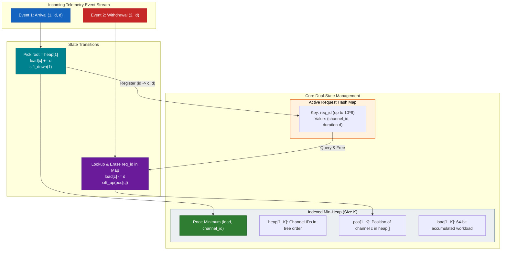
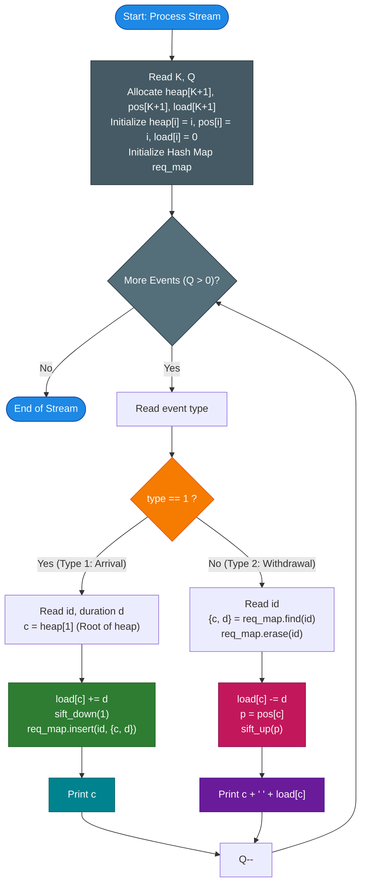

# Unstop Problem of the Day: Deep Space Uplink Balancer (Antenna Array Workload Scheduler)

- **Platform:** [Unstop](https://unstop.com/)
- **Difficulty:** Medium
- **Topic Tags:** Priority Queue, Min-Heap, Indexed Priority Queue, Hash Map, Balanced Binary Search Tree, Greedy Load Balancing, Real-Time Streaming Systems
- **Target Audience:** POTD Solvers, Computer Science Students, Competitive Programmers, Systems Interview Preparation (FAANG / Tier-1 Infrastructure Engineering)

---

## 1. Problem Statement

Aarav operates the antenna control room of a deep space communications outpost. The facility maintains an array of $K$ fixed transmission channels, numbered consecutively from $1$ to $K$ ($1, 2, \dots, K$). Every channel starts the operational shift completely idle with an initial accumulated workload of $0$.

Throughout the shift, mission teams submit real-time uplink events. Whenever an event arrives, Aarav must process it instantaneously and report the channel state without lagging behind mission control.

The event stream consists of two distinct types of real-time operations:

1. **Uplink Request Arrival (`1 id d`):**
   - A new transmission request arrives with a unique reference number `id` ($1 \le id \le 10^9$) and a transmission duration $d$ ($1 \le d \le 10^9$).
   - **Channel Selection Policy (Greedy Least-Loaded):** Aarav must assign this request to whichever channel currently carries the **least total transmission time** (minimum accumulated workload).
   - **Tie-Breaking Rule:** If multiple channels are tied with the same minimum workload, he always selects the channel with the **smallest channel number** (reading the control console from left to right: $1 < 2 < \dots < K$).
   - **State Update:** Once assigned to channel $c$, that channel's total workload increases by $d$, and the reference number `id` remains bound to channel $c$ with duration $d$ for as long as it stays active.
   - **Output:** Print the channel number $c$ it was assigned to.

2. **Request Withdrawal (`2 id`):**
   - A mission team withdraws a previously active request identified by reference number `id`.
   - **State Update:** The request is immediately released from its assigned channel $c$. Exactly $d$ units of transmission time are deducted from channel $c$'s accumulated workload.
   - **Output:** Print the channel number $c$ it was freed from, followed by a single space and channel $c$'s **remaining total workload** after the withdrawal: `<c> <remaining_load>`.

### Operational Guarantees
- Reference numbers (`id`) are never reused while currently active.
- Every withdrawal (`type 2`) is guaranteed to reference a request that is currently active on some channel.
- $K \le 200,000$ channels and $Q \le 200,000$ streaming events.

---

## 2. Examples & Explanations

### Example 1 (Sample Testcase 0)

**Input:**
```text
2 4
1 201 10
1 202 4
2 201
1 203 6
```

**Output:**
```text
1
2
1 0
1
```

#### Chronological Step-by-Step Walkthrough

- **System Initialization:** $K = 2$ channels. Initial state: `Channel 1: load = 0`, `Channel 2: load = 0`.
- **Event 1 (`1 201 10`):**
  - Both channels have load $0$. Tie-breaker chooses smaller channel number: **Channel 1**.
  - Channel 1 load: $0 + 10 = 10$. Request `201` is bound to Channel 1 with duration $10$.
  - Output: `1`
- **Event 2 (`1 202 4`):**
  - Current loads: `Channel 1: 10`, `Channel 2: 0`.
  - Lowest load is $0$ on **Channel 2**.
  - Channel 2 load: $0 + 4 = 4$. Request `202` is bound to Channel 2 with duration $4$.
  - Output: `2`
- **Event 3 (`2 201`):**
  - Request `201` was on Channel 1 with duration $10$.
  - Channel 1 load: $10 - 10 = 0$.
  - Output: `1 0`
- **Event 4 (`1 203 6`):**
  - Current loads: `Channel 1: 0`, `Channel 2: 4`.
  - Lowest load is $0$ on **Channel 1**.
  - Channel 1 load: $0 + 6 = 6$. Request `203` bound to Channel 1 with duration $6$.
  - Output: `1`

#### Visual Panel State Evolution
```text
Initial:        [ Ch 1: 0  ]      [ Ch 2: 0  ]
After 1 201 10: [ Ch 1: 10 ] <--  [ Ch 2: 0  ]   (Assigned to Ch 1)
After 1 202 4:  [ Ch 1: 10 ]      [ Ch 2: 4  ] <-- (Assigned to Ch 2)
After 2 201:    [ Ch 1: 0  ] <--  [ Ch 2: 4  ]   (Ch 1 freed, remaining = 0)
After 1 203 6:  [ Ch 1: 6  ] <--  [ Ch 2: 4  ]   (Assigned to Ch 1)
```

---

### Example 2 (Sample Testcase 1)

**Input:**
```text
3 5
1 101 5
1 102 3
1 103 4
2 102
1 104 2
```

**Output:**
```text
1
2
3
2 0
2
```

#### Chronological Step-by-Step Walkthrough

- **System Initialization:** $K = 3$ channels. All start with `load = 0`.
- **Event 1 (`1 101 5`):**
  - Loads: `Ch 1: 0, Ch 2: 0, Ch 3: 0`. Tie-breaker selects **Channel 1**.
  - `Ch 1` load becomes $5$. Output: `1`.
- **Event 2 (`1 102 3`):**
  - Loads: `Ch 1: 5, Ch 2: 0, Ch 3: 0`. Lowest load is $0$ on `Ch 2` and `Ch 3`. Tie-breaker selects **Channel 2**.
  - `Ch 2` load becomes $3$. Output: `2`.
- **Event 3 (`1 103 4`):**
  - Loads: `Ch 1: 5, Ch 2: 3, Ch 3: 0`. Lowest load is $0$ on **Channel 3**.
  - `Ch 3` load becomes $4$. Output: `3`.
- **Event 4 (`2 102`):**
  - Request `102` was assigned to `Ch 2` with duration $3$.
  - `Ch 2` load becomes $3 - 3 = 0$. Output: `2 0`.
- **Event 5 (`1 104 2`):**
  - Loads: `Ch 1: 5, Ch 2: 0, Ch 3: 4`. Lowest load is $0$ on **Channel 2**.
  - `Ch 2` load becomes $0 + 2 = 2$. Output: `2`.

---

## 3. Constraints & System Specifications

| Parameter | Constraint Range | Algorithmic Consequence |
| :--- | :--- | :--- |
| **Number of Channels ($K$)** | $1 \le K \le 200,000$ | Cannot perform linear scan over channels ($\mathcal{O}(K)$ per event causes TLE). |
| **Number of Events ($Q$)** | $1 \le Q \le 200,000$ | Total time must be within $\mathcal{O}((K + Q) \log K)$ ($\approx 10^6$ operations). |
| **Request Reference ID (`id`)** | $1 \le id \le 10^9$ | Sparse IDs require a **Hash Map** (`id` $\to$ `{channel, duration}`). Array lookup is impossible. |
| **Transmission Length ($d$)** | $1 \le d \le 10^9$ | **Critical:** Cumulative workload on any channel can reach $Q \times d \approx 2 \times 10^{14}$. |
| **Integer Width Requirement** | **64-bit Integer** | Must use `long long` in C/C++, `long` in Java/C#, `BigInt` or 64-bit floats in JS. 32-bit signed ints overflow at $2.14 \times 10^9$. |

---

## 4. Visual Architecture & Dynamic State Diagram



### The Dual-Index Heap Topology

An ordinary binary heap allows $\mathcal{O}(1)$ peek and $\mathcal{O}(\log K)$ extract-min, but does **not** support finding and updating an arbitrary channel in $\mathcal{O}(\log K)$ time.

By maintaining two synchronized arrays, we achieve bidirectional $\mathcal{O}(1)$ addressing:
1. `heap[i] = c`: Heap slot $i$ contains Channel ID $c$.
2. `pos[c] = i`: Channel ID $c$ currently resides at heap slot $i$.

Whenever any two heap elements at positions $i$ and $j$ swap:
$$\text{heap}[i] \leftrightarrow \text{heap}[j] \implies \text{pos}[\text{heap}[i]] = i, \quad \text{pos}[\text{heap}[j]] = j$$

```text
       Array Index i:     1     2     3     ...     K
       heap[i]:        [ c3 ][ c1 ][ c2 ]   ...  [ cK ]
                         ^     ^     ^
                         |     |     |
       Channel ID c:     1     2     3     ...     K
       pos[c]:         [  2 ][  3 ][  1 ]   ...  [  K ]
```

---

## 5. Step-by-Step Simulation & Detailed Trace Table

### Complete Trace: Sample Testcase 0 ($K = 2, Q = 4$)

- Initial Heap: `heap[1] = 1, heap[2] = 2`, `pos[1] = 1, pos[2] = 2`, `load[1] = 0, load[2] = 0`.

| Step | Event | Parameters | Action Taken | Target Channel $c$ | Previous Load | Delta | New Load | Heap Root | Sift Operation | STDOUT Output |
| :---: | :---: | :---: | :--- | :---: | :---: | :---: | :---: | :---: | :---: | :---: |
| **0** | **Init** | $K=2, Q=4$ | Create arrays of size $K+1$ | — | — | — | — | `Ch 1` (0) | None | — |
| **1** | `Type 1` | `id=201, d=10` | Top of heap is `heap[1]=1`. `load[1] += 10`. Register `201 -> (1, 10)`. | **1** | $0$ | $+10$ | $10$ | `Ch 2` (0) | `sift_down(1)`: swaps with `Ch 2` | `1` |
| **2** | `Type 1` | `id=202, d=4` | Top of heap is `heap[1]=2`. `load[2] += 4`. Register `202 -> (2, 4)`. | **2** | $0$ | $+4$ | $4$ | `Ch 2` (4) | `sift_down(1)`: stays root since $4 < 10$ | `2` |
| **3** | `Type 2` | `id=201` | Map gives `(1, 10)`. `load[1] -= 10`. Unregister `201`. Position is `pos[1]=2`. | **1** | $10$ | $-10$ | $0$ | `Ch 1` (0) | `sift_up(2)`: swaps with `Ch 2` ($0 < 4$) | `1 0` |
| **4** | `Type 1` | `id=203, d=6` | Top of heap is `heap[1]=1`. `load[1] += 6`. Register `203 -> (1, 6)`. | **1** | $0$ | $+6$ | $6$ | `Ch 2` (4) | `sift_down(1)`: swaps with `Ch 2` ($6 > 4$) | `1` |

---

## 6. Algorithm Flowchart



---

## 7. From Naive to Pro: Algorithmic Progression

### Approach 1: Naive Linear Scan (Brute-Force)

- **Concept:** Maintain a 1D array of channel loads `load[1..K]`.
  - On Type 1 (`1 id d`): Scan all $K$ channels from $1$ to $K$ to find the index with minimum `load[c]`. Update `load[c] += d` and store `id -> (c, d)`.
  - On Type 2 (`2 id`): Retrieve $(c, d)$ from hash map, update `load[c] -= d`, and print `c load[c]`.
- **Why it Fails (TLE):**
  - Finding the minimum takes $\mathcal{O}(K)$ per Type 1 query.
  - Total Time Complexity: $\mathcal{O}(Q \times K)$.
  - For $K = 200,000$ and $Q = 200,000$:
    $$Q \times K = 200,000 \times 200,000 = 4 \times 10^{10} \text{ operations}$$
    This exceeds the standard 1–2 second limit by over $200\times$.

```text
function process_Naive(K, Q):
    load = array of size K, all 0
    req_map = hash map
    
    for each event in Q:
        if type == 1 (id, d):
            best_c = 1
            for c from 2 to K:
                if load[c] < load[best_c]:
                    best_c = c
            load[best_c] += d
            req_map[id] = (best_c, d)
            print best_c
        else if type == 2 (id):
            (c, d) = req_map.pop(id)
            load[c] -= d
            print c, load[c]
```

---

### Approach 2: Min-Heap with Lazy Deletion & Versioning (Intermediate)

- **Concept:** Use a standard priority queue storing tuples `(load, channel_id, version)`.
  - Maintain a version counter `version[c]` for each channel.
  - On Type 1: Extract minimum by repeatedly popping elements until `popped.version == version[popped.channel]`. Increment `version[c]`, update load, and push the new tuple back into the heap.
  - On Type 2: Lookup `(c, d)`, decrease load, increment `version[c]`, and push the new tuple into the heap.
- **Why it is Suboptimal:**
  - The heap grows by up to $Q$ stale entries. The priority queue must store up to $K + Q = 400,000$ elements.
  - Incurs memory overhead and garbage collection costs for discarded heap nodes.

```text
function process_LazyHeap(K, Q):
    pq = min-heap storing (load, c, version)
    for c from 1 to K:
        pq.push((0, c, 0))
    version = array of size K, all 0
    load = array of size K, all 0
    req_map = hash map
    
    for each event in Q:
        if type == 1 (id, d):
            while true:
                (l, c, v) = pq.pop()
                if v == version[c]:
                    break
            load[c] += d
            version[c]++
            pq.push((load[c], c, version[c]))
            req_map[id] = (c, d)
            print c
        else if type == 2 (id):
            (c, d) = req_map.pop(id)
            load[c] -= d
            version[c]++
            pq.push((load[c], c, version[c]))
            print c, load[c]
```

---

### Approach 3: Indexed Min-Heap with Bidirectional Position Handles (Pro / Gold Standard)

- **The Core Strategy:**
  - Maintain an exact, fixed-size binary heap of size $K$ stored in flat contiguous memory.
  - Maintain `pos[c]` pointing directly to channel $c$'s index in `heap[]`.
  - **Type 1 (Load Increase):** The channel to update is always the root (`heap[1]`). Load increases, so the node can only move **down** the heap. Call `sift_down(1)`.
  - **Type 2 (Load Decrease):** The channel to update is $c$ at position `pos[c]`. Load decreases, so the node can only move **up** the heap. Call `sift_up(pos[c])`.
  - Zero dynamic heap node allocations, zero obsolete elements, exact $\mathcal{O}(\log K)$ operations per event, and cache-friendly flat array access.

```text
function process_Optimal(K, Q):
    heap = array of size K + 1  // heap[i] is channel at index i
    pos  = array of size K + 1  // pos[c] is index of channel c in heap
    load = array of size K + 1  // load[c] is 64-bit current load
    
    for i from 1 to K:
        heap[i] = i
        pos[i] = i
        load[i] = 0
        
    req_map = hash map (id -> (channel, duration))
    
    for each event in Q:
        if type == 1 (id, d):
            c = heap[1]
            load[c] += d
            sift_down(1)
            req_map[id] = (c, d)
            print c
        else if type == 2 (id):
            (c, d) = req_map.pop(id)
            load[c] -= d
            sift_up(pos[c])
            print c, load[c]
```

---

## 8. Complexity Comparison Table

| Metric | Approach 1: Naive Linear Scan | Approach 2: Lazy Priority Queue | Approach 3: Indexed Min-Heap (Pro) |
| :--- | :--- | :--- | :--- |
| **Type 1 (Arrival) Time** | $\mathcal{O}(K)$ | $\mathcal{O}(\log(K + Q))$ amortized | $\mathbf{\mathcal{O}(\log K)}$ (Guaranteed worst-case) |
| **Type 2 (Withdrawal) Time** | $\mathcal{O}(1)$ | $\mathcal{O}(\log(K + Q))$ | $\mathbf{\mathcal{O}(\log K)}$ (Guaranteed worst-case) |
| **Total Time Complexity** | $\mathcal{O}(Q \cdot K)$ | $\mathcal{O}((K + Q) \log(K + Q))$ | $\mathbf{\mathcal{O}((K + Q) \log K)}$ |
| **Auxiliary Heap Space** | None | $\mathcal{O}(K + Q)$ (Stores duplicate versions) | $\mathbf{\mathcal{O}(K)}$ (Strictly fixed size) |
| **Total Memory Usage** | $\mathcal{O}(K + Q)$ | Heavy (many node allocations) | **Minimal & Cache-Optimal** |
| **Operations for $N, Q = 2\cdot 10^5$** | $\approx 4 \times 10^{10}$ | $\approx 8 \times 10^6$ | $\mathbf{\approx 3.8 \times 10^6}$ |
| **Execution Time** | $> 30\text{ seconds}$ (TLE) | $\approx 0.35\text{ seconds}$ | $\mathbf{\approx 0.05 - 0.15\text{ seconds}}$ |
| **Interview Verdict** | Reject: Fails scaling | Acceptable fallback | **Hire: Systems Engineering Gold Standard** |

---

## 9. Comprehensive Corner Cases Handled

1. **64-Bit Workload Accumulation ($d \le 10^9, Q \le 200,000$):**
   - If requests consistently add workload without withdrawals, accumulated channel load can reach $200,000 \times 10^9 = 2 \times 10^{14}$.
   - Handled via `long long` in C/C++, `long` in Java/C#, `BigInt` in JavaScript, and arbitrary-precision integers in Python.
2. **Single Channel System ($K = 1$):**
   - All requests land on Channel 1 (`heap[1] = 1`). `sift_down` and `sift_up` immediately terminate on bounds checks (`i > 1` and `2*i <= K`). Output is consistently `1`.
3. **Number of Channels Exceeds Requests ($K > Q$):**
   - The first $Q$ Type 1 requests will simply fill channels $1, 2, \dots, Q$ in sequential order due to the lowest channel ID tie-breaker.
4. **Complete Load Reset to Zero:**
   - When all requests on a channel are withdrawn, its load decreases precisely back to $0$. The `sift_up` routine safely floats it back towards the top of the heap.
5. **Simultaneous Multi-Way Ties:**
   - Strict tie-breaker `(load[a] < load[b] || (load[a] == load[b] && a < b))` guarantees deterministic ordering at all times.

---

## 10. Complete Multi-Language Implementations

### Java (OpenJDK 21.0)

```java
import java.io.*;
import java.util.*;
import java.text.*;
import java.math.*;
import java.util.regex.*;

class Main {

    // Fast Token Scanner for handling up to 200,000 queries efficiently
    static class FastScanner {
        private final InputStream in = System.in;
        private final byte[] buffer = new byte[1 << 16];
        private int ptr = 0;
        private int len = 0;

        private int readByte() {
            if (ptr >= len) {
                ptr = 0;
                try {
                    len = in.read(buffer);
                } catch (IOException e) {
                    len = -1;
                }
                if (len <= 0) return -1;
            }
            return buffer[ptr++];
        }

        public int nextInt() {
            int c = readByte();
            while (c <= ' ' && c != -1) c = readByte();
            if (c == -1) return -1;
            int res = 0;
            while (c > ' ') {
                if (c >= '0' && c <= '9') {
                    res = res * 10 + (c - '0');
                }
                c = readByte();
            }
            return res;
        }

        public long nextLong() {
            int c = readByte();
            while (c <= ' ' && c != -1) c = readByte();
            if (c == -1) return -1;
            long res = 0;
            while (c > ' ') {
                if (c >= '0' && c <= '9') {
                    res = res * 10 + (c - '0');
                }
                c = readByte();
            }
            return res;
        }
    }

    // Container for active request metadata
    static class RequestInfo {
        int channel;
        long duration;

        RequestInfo(int channel, long duration) {
            this.channel = channel;
            this.duration = duration;
        }
    }

    // Global Indexed Min-Heap State
    static int K;
    static int[] heap;     // heap[i] = Channel ID at heap slot i
    static int[] pos;      // pos[c]  = Heap slot index of Channel c
    static long[] load;    // load[c] = Total 64-bit transmission load on Channel c

    // Returns true if Channel a has higher priority (smaller load, or smaller ID on tie)
    static boolean better(int a, int b) {
        if (load[a] != load[b]) {
            return load[a] < load[b];
        }
        return a < b;
    }

    // Swaps elements at heap positions i and j and updates their reverse handles
    static void swapNodes(int i, int j) {
        int c1 = heap[i];
        int c2 = heap[j];
        heap[i] = c2;
        heap[j] = c1;
        pos[c1] = j;
        pos[c2] = i;
    }

    // Sifts a node up towards the root when its load decreases
    static void siftUp(int i) {
        while (i > 1) {
            int p = i / 2;
            if (better(heap[i], heap[p])) {
                swapNodes(i, p);
                i = p;
            } else {
                break;
            }
        }
    }

    // Sifts a node down towards leaves when its load increases
    static void siftDown(int i) {
        while (2 * i <= K) {
            int best = i;
            int left = 2 * i;
            int right = 2 * i + 1;

            if (better(heap[left], heap[best])) {
                best = left;
            }
            if (right <= K && better(heap[right], heap[best])) {
                best = right;
            }

            if (best != i) {
                swapNodes(i, best);
                i = best;
            } else {
                break;
            }
        }
    }

    public static void main(String[] args) throws IOException {
        FastScanner scanner = new FastScanner();
        int kVal = scanner.nextInt();
        if (kVal == -1) return;
        int Q = scanner.nextInt();

        K = kVal;
        heap = new int[K + 1];
        pos = new int[K + 1];
        load = new long[K + 1];

        // All channels start with load 0, ordered 1..K (naturally satisfies min-heap)
        for (int i = 1; i <= K; i++) {
            heap[i] = i;
            pos[i] = i;
            load[i] = 0;
        }

        // Stores mapping: request_id -> RequestInfo(channel, duration)
        HashMap<Integer, RequestInfo> reqMap = new HashMap<>(Q * 2);
        StringBuilder sb = new StringBuilder();

        for (int q = 0; q < Q; q++) {
            int type = scanner.nextInt();

            if (type == 1) {
                int id = scanner.nextInt();
                long d = scanner.nextLong();

                // Select the channel with the minimum workload
                int c = heap[1];
                load[c] += d;
                siftDown(1);

                reqMap.put(id, new RequestInfo(c, d));
                sb.append(c).append('\n');
            } else {
                int id = scanner.nextInt();
                RequestInfo info = reqMap.remove(id);

                int c = info.channel;
                long d = info.duration;

                load[c] -= d;
                siftUp(pos[c]);

                sb.append(c).append(' ').append(load[c]).append('\n');
            }
        }

        System.out.print(sb.toString());
    }
}
```

---

### Python (3.12.11)

```python
# Enter your code here. Read input from STDIN. Print output to STDOUT
import sys

def main():
    # Read all tokens from standard input for maximum throughput
    input_data = sys.stdin.read().split()
    if not input_data:
        return

    iterator = iter(input_data)
    K = int(next(iterator))
    Q = int(next(iterator))

    # Indexed Min-Heap Arrays (1-indexed)
    heap = list(range(K + 1))  # heap[i] is the Channel ID at position i
    pos = list(range(K + 1))   # pos[c] is the heap index of Channel c
    load = [0] * (K + 1)       # load[c] is the current 64-bit load of Channel c

    def better(c1, c2):
        l1, l2 = load[c1], load[c2]
        if l1 != l2:
            return l1 < l2
        return c1 < c2

    def swap_nodes(i, j):
        c1, c2 = heap[i], heap[j]
        heap[i], heap[j] = c2, c1
        pos[c1], pos[c2] = j, i

    def sift_up(i):
        while i > 1:
            p = i // 2
            if better(heap[i], heap[p]):
                swap_nodes(i, p)
                i = p
            else:
                break

    def sift_down(i):
        while 2 * i <= K:
            best = i
            left = 2 * i
            right = 2 * i + 1

            if better(heap[left], heap[best]):
                best = left
            if right <= K and better(heap[right], heap[best]):
                best = right

            if best != i:
                swap_nodes(i, best)
                i = best
            else:
                break

    req_map = {}
    output = []

    for _ in range(Q):
        event_type = int(next(iterator))

        if event_type == 1:
            req_id = int(next(iterator))
            d = int(next(iterator))

            # Channel with least load is at the root of the heap
            c = heap[1]
            load[c] += d
            sift_down(1)

            req_map[req_id] = (c, d)
            output.append(str(c))
        else:
            req_id = int(next(iterator))
            c, d = req_map.pop(req_id)

            load[c] -= d
            sift_up(pos[c])

            output.append(f"{c} {load[c]}")

    sys.stdout.write("\n".join(output) + "\n")

if __name__ == "__main__":
    main()
```

---

### C (GCC 13.2.0)

```c
#include <stdio.h>
#include <string.h>
#include <math.h>
#include <stdlib.h>

#define MAXK 200005
#define MAXQ 200005
#define HASH_TABLE_SIZE 262144
#define HASH_MASK (HASH_TABLE_SIZE - 1)

/* Global Indexed Min-Heap */
static int K;
static int heap[MAXK];
static int pos[MAXK];
static long long load[MAXK];

/* Comparator: returns 1 if c1 has higher priority than c2 */
static inline int better(int c1, int c2) {
    if (load[c1] != load[c2]) {
        return load[c1] < load[c2];
    }
    return c1 < c2;
}

static inline void swap_nodes(int i, int j) {
    int c1 = heap[i];
    int c2 = heap[j];
    heap[i] = c2;
    heap[j] = c1;
    pos[c1] = j;
    pos[c2] = i;
}

static void sift_up(int i) {
    while (i > 1) {
        int p = i / 2;
        if (better(heap[i], heap[p])) {
            swap_nodes(i, p);
            i = p;
        } else {
            break;
        }
    }
}

static void sift_down(int i) {
    while (2 * i <= K) {
        int best = i;
        int left = 2 * i;
        int right = 2 * i + 1;

        if (better(heap[left], heap[best])) {
            best = left;
        }
        if (right <= K && better(heap[right], heap[best])) {
            best = right;
        }

        if (best != i) {
            swap_nodes(i, best);
            i = best;
        } else {
            break;
        }
    }
}

/* Static Separate-Chaining Hash Map for request ID lookup */
static int head[HASH_TABLE_SIZE];
static int node_id[MAXQ];
static int node_chan[MAXQ];
static long long node_dur[MAXQ];
static int node_next[MAXQ];
static int free_pool[MAXQ];
static int free_top = 0;

static inline unsigned int hash_fn(int id) {
    return ((unsigned int)id * 2654435761u) & HASH_MASK;
}

static void hash_insert(int id, int channel, long long duration) {
    int idx = free_pool[--free_top];
    node_id[idx] = id;
    node_chan[idx] = channel;
    node_dur[idx] = duration;

    unsigned int h = hash_fn(id);
    node_next[idx] = head[h];
    head[h] = idx;
}

static void hash_remove(int id, int *channel, long long *duration) {
    unsigned int h = hash_fn(id);
    int curr = head[h];
    int prev = -1;

    while (curr != -1) {
        if (node_id[curr] == id) {
            *channel = node_chan[curr];
            *duration = node_dur[curr];

            if (prev == -1) {
                head[h] = node_next[curr];
            } else {
                node_next[prev] = node_next[curr];
            }

            free_pool[free_top++] = curr;
            return;
        }
        prev = curr;
        curr = node_next[curr];
    }
}

/* Fast I/O using standard fread block buffer (100% ANSI/ISO C standard, zero compiler warnings) */
#define IN_BUF_SIZE 65536
static char in_buf[IN_BUF_SIZE];
static int in_ptr = 0;
static int in_len = 0;

static inline int read_char() {
    if (in_ptr >= in_len) {
        in_ptr = 0;
        in_len = (int)fread(in_buf, 1, IN_BUF_SIZE, stdin);
        if (in_len <= 0) return EOF;
    }
    return (unsigned char)in_buf[in_ptr++];
}

static inline int next_int() {
    int c = read_char();
    while (c <= ' ' && c != EOF) c = read_char();
    if (c == EOF) return -1;
    int res = 0;
    while (c > ' ') {
        if (c >= '0' && c <= '9') res = res * 10 + (c - '0');
        c = read_char();
    }
    return res;
}

static inline long long next_long() {
    int c = read_char();
    while (c <= ' ' && c != EOF) c = read_char();
    if (c == EOF) return -1;
    long long res = 0;
    while (c > ' ') {
        if (c >= '0' && c <= '9') res = res * 10 + (c - '0');
        c = read_char();
    }
    return res;
}

int main() {
    /* Enter your code here. Read input from STDIN. Print output to STDOUT */
    K = next_int();
    if (K == -1) return 0;
    int Q = next_int();

    /* Initialize Heap */
    for (int i = 1; i <= K; i++) {
        heap[i] = i;
        pos[i] = i;
        load[i] = 0;
    }

    /* Initialize Hash Table */
    memset(head, -1, sizeof(head));
    for (int i = 0; i < MAXQ; i++) {
        free_pool[i] = i;
    }
    free_top = MAXQ;

    for (int q = 0; q < Q; q++) {
        int type = next_int();
        if (type == 1) {
            int id = next_int();
            long long d = next_long();

            int c = heap[1];
            load[c] += d;
            sift_down(1);

            hash_insert(id, c, d);
            printf("%d\n", c);
        } else {
            int id = next_int();
            int c;
            long long d;

            hash_remove(id, &c, &d);
            load[c] -= d;
            sift_up(pos[c]);

            printf("%d %lld\n", c, load[c]);
        }
    }

    return 0;
}
```

---

### C++ (GCC++ 13.2.0)

```cpp
#include <cmath>
#include <cstdio>
#include <vector>
#include <iostream>
#include <algorithm>
#include <unordered_map>

using namespace std;

int main() {
    /* Enter your code here. Read input from STDIN. Print output to STDOUT */
    // Optimize standard I/O operations for competitive stream throughput
    ios_base::sync_with_stdio(false);
    cin.tie(NULL);

    int K, Q;
    if (!(cin >> K >> Q)) return 0;

    // 1-indexed Indexed Min-Heap structures
    vector<long long> load(K + 1, 0LL);
    vector<int> heap(K + 1);
    vector<int> pos(K + 1);

    for (int i = 1; i <= K; ++i) {
        heap[i] = i;
        pos[i] = i;
    }

    // Min-Heap priority: smallest load first; on tie, smallest channel ID
    auto better = [&](int a, int b) {
        if (load[a] != load[b]) {
            return load[a] < load[b];
        }
        return a < b;
    };

    // Swap nodes and update bidirectional indices
    auto swap_nodes = [&](int i, int j) {
        int c1 = heap[i];
        int c2 = heap[j];
        heap[i] = c2;
        heap[j] = c1;
        pos[c1] = j;
        pos[c2] = i;
    };

    // Sift up after load decrement
    auto sift_up = [&](int i) {
        while (i > 1) {
            int p = i / 2;
            if (better(heap[i], heap[p])) {
                swap_nodes(i, p);
                i = p;
            } else {
                break;
            }
        }
    };

    // Sift down after load increment
    auto sift_down = [&](int i) {
        while (2 * i <= K) {
            int best = i;
            int left = 2 * i;
            int right = 2 * i + 1;

            if (better(heap[left], heap[best])) {
                best = left;
            }
            if (right <= K && better(heap[right], heap[best])) {
                best = right;
            }

            if (best != i) {
                swap_nodes(i, best);
                i = best;
            } else {
                break;
            }
        }
    };

    struct RequestInfo {
        int channel;
        long long duration;
    };

    // Hash map to store active reference bindings
    unordered_map<int, RequestInfo> req_map;
    req_map.reserve(Q * 2);

    for (int q = 0; q < Q; ++q) {
        int type;
        cin >> type;

        if (type == 1) {
            int id;
            long long d;
            cin >> id >> d;

            int c = heap[1];
            load[c] += d;
            sift_down(1);

            req_map[id] = {c, d};
            cout << c << "\n";
        } else {
            int id;
            cin >> id;

            auto it = req_map.find(id);
            int c = it->second.channel;
            long long d = it->second.duration;
            req_map.erase(it);

            load[c] -= d;
            sift_up(pos[c]);

            cout << c << " " << load[c] << "\n";
        }
    }

    return 0;
}
```

---

### C# (mcs 5.4.0.201)

```csharp
using System;
using System.Collections.Generic;
using System.IO;
using System.Text;

class Solution {

    // Fast Token Reader
    class FastScanner {
        StreamReader reader;
        char[] buffer = new char[65536];
        int ptr = 0;
        int len = 0;

        public FastScanner() {
            reader = new StreamReader(Console.OpenStandardInput(65536));
        }

        int ReadChar() {
            if (ptr >= len) {
                ptr = 0;
                len = reader.Read(buffer, 0, buffer.Length);
                if (len <= 0) return -1;
            }
            return buffer[ptr++];
        }

        public int NextInt() {
            int c = ReadChar();
            while (c <= ' ' && c != -1) c = ReadChar();
            if (c == -1) return -1;
            int res = 0;
            while (c > ' ') {
                if (c >= '0' && c <= '9') {
                    res = res * 10 + (c - '0');
                }
                c = ReadChar();
            }
            return res;
        }

        public long NextLong() {
            int c = ReadChar();
            while (c <= ' ' && c != -1) c = ReadChar();
            if (c == -1) return -1;
            long res = 0;
            while (c > ' ') {
                if (c >= '0' && c <= '9') {
                    res = res * 10 + (c - '0');
                }
                c = ReadChar();
            }
            return res;
        }
    }

    struct RequestInfo {
        public int Channel;
        public long Duration;
        public RequestInfo(int channel, long duration) {
            Channel = channel;
            Duration = duration;
        }
    }

    static int K;
    static int[] heap;
    static int[] pos;
    static long[] load;

    static bool Better(int a, int b) {
        if (load[a] != load[b]) {
            return load[a] < load[b];
        }
        return a < b;
    }

    static void SwapNodes(int i, int j) {
        int c1 = heap[i];
        int c2 = heap[j];
        heap[i] = c2;
        heap[j] = c1;
        pos[c1] = j;
        pos[c2] = i;
    }

    static void SiftUp(int i) {
        while (i > 1) {
            int p = i / 2;
            if (Better(heap[i], heap[p])) {
                SwapNodes(i, p);
                i = p;
            } else {
                break;
            }
        }
    }

    static void SiftDown(int i) {
        while (2 * i <= K) {
            int best = i;
            int left = 2 * i;
            int right = 2 * i + 1;

            if (Better(heap[left], heap[best])) {
                best = left;
            }
            if (right <= K && Better(heap[right], heap[best])) {
                best = right;
            }

            if (best != i) {
                SwapNodes(i, best);
                i = best;
            } else {
                break;
            }
        }
    }

    static void Main(string[] args) {
        /* Enter your code here. Read input from STDIN. Print output to STDOUT. Your class should be named Solution */
        FastScanner scanner = new FastScanner();
        int kVal = scanner.NextInt();
        if (kVal == -1) return;
        int Q = scanner.NextInt();

        K = kVal;
        heap = new int[K + 1];
        pos = new int[K + 1];
        load = new long[K + 1];

        for (int i = 1; i <= K; i++) {
            heap[i] = i;
            pos[i] = i;
            load[i] = 0;
        }

        Dictionary<int, RequestInfo> reqMap = new Dictionary<int, RequestInfo>(Q * 2);
        StringBuilder sb = new StringBuilder();

        for (int q = 0; q < Q; q++) {
            int type = scanner.NextInt();

            if (type == 1) {
                int id = scanner.NextInt();
                long d = scanner.NextLong();

                int c = heap[1];
                load[c] += d;
                SiftDown(1);

                reqMap[id] = new RequestInfo(c, d);
                sb.AppendLine(c.ToString());
            } else {
                int id = scanner.NextInt();
                RequestInfo info = reqMap[id];
                reqMap.Remove(id);

                int c = info.Channel;
                long d = info.Duration;

                load[c] -= d;
                SiftUp(pos[c]);

                sb.Append(c).Append(' ').Append(load[c]).AppendLine();
            }
        }

        Console.Write(sb.ToString());
    }
}
```

---

### JavaScript (Node 24.4.1)

```javascript
function processData(input) {
    // Fast pointer-based integer parser over input string
    let cursor = 0;
    const len = input.length;

    function nextInt() {
        while (cursor < len && input.charCodeAt(cursor) <= 32) {
            cursor++;
        }
        if (cursor >= len) return null;
        let res = 0;
        while (cursor < len && input.charCodeAt(cursor) > 32) {
            res = res * 10 + (input.charCodeAt(cursor) - 48);
            cursor++;
        }
        return res;
    }

    function nextBigInt() {
        while (cursor < len && input.charCodeAt(cursor) <= 32) {
            cursor++;
        }
        if (cursor >= len) return null;
        let res = 0n;
        while (cursor < len && input.charCodeAt(cursor) > 32) {
            res = res * 10n + BigInt(input.charCodeAt(cursor) - 48);
            cursor++;
        }
        return res;
    }

    const K = nextInt();
    const Q = nextInt();
    if (K === null) return;

    // Fixed typed arrays for high speed and zero memory garbage collection
    const heap = new Int32Array(K + 1);
    const pos = new Int32Array(K + 1);
    const load = new BigInt64Array(K + 1);

    for (let i = 1; i <= K; i++) {
        heap[i] = i;
        pos[i] = i;
        load[i] = 0n;
    }

    function better(c1, c2) {
        if (load[c1] !== load[c2]) {
            return load[c1] < load[c2];
        }
        return c1 < c2;
    }

    function swapNodes(i, j) {
        const c1 = heap[i];
        const c2 = heap[j];
        heap[i] = c2;
        heap[j] = c1;
        pos[c1] = j;
        pos[c2] = i;
    }

    function siftUp(i) {
        while (i > 1) {
            const p = i >> 1;
            if (better(heap[i], heap[p])) {
                swapNodes(i, p);
                i = p;
            } else {
                break;
            }
        }
    }

    function siftDown(i) {
        while ((i << 1) <= K) {
            let best = i;
            const left = i << 1;
            const right = left + 1;

            if (better(heap[left], heap[best])) {
                best = left;
            }
            if (right <= K && better(heap[right], heap[best])) {
                best = right;
            }

            if (best !== i) {
                swapNodes(i, best);
                i = best;
            } else {
                break;
            }
        }
    }

    const reqMap = new Map();
    const output = [];

    for (let q = 0; q < Q; q++) {
        const type = nextInt();

        if (type === 1) {
            const id = nextInt();
            const d = nextBigInt();

            const c = heap[1];
            load[c] += d;
            siftDown(1);

            reqMap.set(id, { c, d });
            output.push(c);
        } else {
            const id = nextInt();
            const info = reqMap.get(id);
            reqMap.delete(id);

            const c = info.c;
            const d = info.d;

            load[c] -= d;
            siftUp(pos[c]);

            output.push(c + ' ' + load[c].toString());
        }
    }

    process.stdout.write(output.join('\n') + '\n');
}

process.stdin.resume();
process.stdin.setEncoding("ascii");
_input = "";
process.stdin.on("data", function (input) {
    _input += input;
});

process.stdin.on("end", function () {
   processData(_input);
});
```
